## Dissection of Genetics & Prediction of Cancer Risk: Methods & Tools

Hae Kyung Im, PhD

March 25, 2026

#### **Goals of the Class**

- Learn key concepts and tools to understand the current literature in cancer genomics and interpret the results
- We will focus on germline risk factors in the first half of the course
- **- Today**
- Gene mapping: Linkage vs. association approaches
- Genetic architecture of cancer risk
- Overview and discussion of Genome-wide Association Studies (GWAS)

**2**

#### **Introductions**

- Name, graduation year
- Why you are taking this class?
- Your favorite dish (or restaurant)

**3**

### **Linkage Analysis**

- Gene mapping method popular before development of high throughput genotyping techniques
- 100's of markers interrogated (causal markers most likely missed)
- Important genes were found with this approach
- CFTR: Cystic Fibrosis
- HTT: Huntington disease
- NOD2: inflammatory bowel disease
- Markers that are co-transmitted (recombination rate<0.5)) with the disease susceptibility locus (DSL) help locate the DSL
- It uses families with many cases ("loaded pedigrees")

**4**

Back in the days, before the Human Genome Project, disease genes were discovered using linkage analysis. The technology of the time would allow to measure the variation in about 100 loci across the genome. Many important genes were discovered with this approach, including CFTR for cystic fibrosis, HTT for Huntington disease, NOD2 for inflammatory bowel disease. Linkage analysis is based on the idea that markers that are co-transmitted (from parent to child) with the disease susceptibility locus is nearby the DSL. To test co-transmission, it needs family data with many cases.

### **High Penetrance Cancer Susceptibility Genes**

- Genetic linkage performed in the 1980s and 1990s found:
- Breast and ovarian cancers
- BRCA1
- BRCA2
- Colorectal cancer
- adenomatous polyposis coli, APC
- mismatch repair genes
- mutL homologue 1, MLH1
- mutS homologue 2, MSH2
- Melanoma: cyclin-dependent kinase inhibitor 2A (CDKN2A)
- To date, mutations in more than 70 CSGs associated with high-penetrance cancer susceptibility syndromes have been identified with relative risks (RR) of 5-100

Sud et al 2017 NRC

**5**

Many high penetrance (large effect) cancer susceptibility genes were found using linkage analysis.

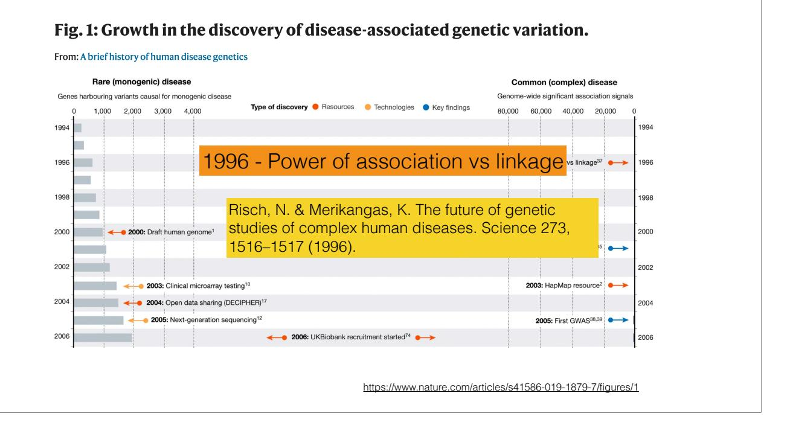

by mid 90's, discoveries using linkage were dwindling, prompting the influential paper by Neil Risch and Merikangas to propose a revolutionary idea of genotyping about 100K loci in the genome (considered in the realm of science fiction at the time). They showed that if we could develop the technology to do that, then we could run a much more powerful study design, what would later be known as genome-wide association studies. This argument added to the urgency to completing the Human Genome Project.

The first draft of the human genome was announced by the president Bill Clinton, who compared the human genome project to the moon landing. Technological advances brought about by the human genome project made genome-wide association studies possible.

#### **Gene Mapping Methods**

- Linkage analysis
- popular before high throughput technology became available
- based on co-transmission of genetic markers and disease genes
- a few hundred markers can cover the whole genome
- low resolution
- pedigree/family based

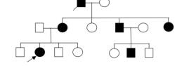

- Association mapping
- need a large number of markers (> 1 million)
- genetic markers in **LD (Linkage Disequilibrium)** with disease genes
- higher resolution
- families not needed (easier to recruit large cohorts)

**8**

#### Recap.

Linkage and association are main approaches for mapping genes to diseases and other human traits. Before the completion of the Human Genome Project and the cost of genotyping more than a few hundred markers was prohibitive, linkage analysis was the most popular approach to identify disease loci. It is based on the co-transmission of genetic markers and disease genes. Advantages were that a few hundred markers were enough to cover the whole genome. But the downside was the low resolution and the fact that recruiting large families is more difficult than a large number of unrelated individuals.

Association methods are based on the LD between genetic markers and disease genes. For common variants (say, MAF>5%) about 1 million SNPs can tag most common variants. So that even if the causal variant is not measured but is common, a closely correlated (in LD) SNP can be detected. These are called tag SNP or index SNPs.

#### **Expected to Find High Penetrance Genes**

So, we've been performing genome-wide association studies for the last two decades. Based on what we knew before the HGP, we expected to find high penetrance (large effect size) genes.

**9**

### **Found Many Low Penetrance Variants**

Instead, we found a large number variants with modest effect sizes (low penetrance). We found that the genetic architecture of cancer risk was highly polygenic. This requires better statistical methods to make sense of the discoveries.

#### **Found Many Low Penetrance Variants**

**Genetic architecture of most cancer risk is highly polygenic**

**11**

Instead, we found a large number variants with modest effect sizes. We found that the genetic architecture of cancer risk was highly polygenic. This requires better statistical methods to make sense of the discoveries.

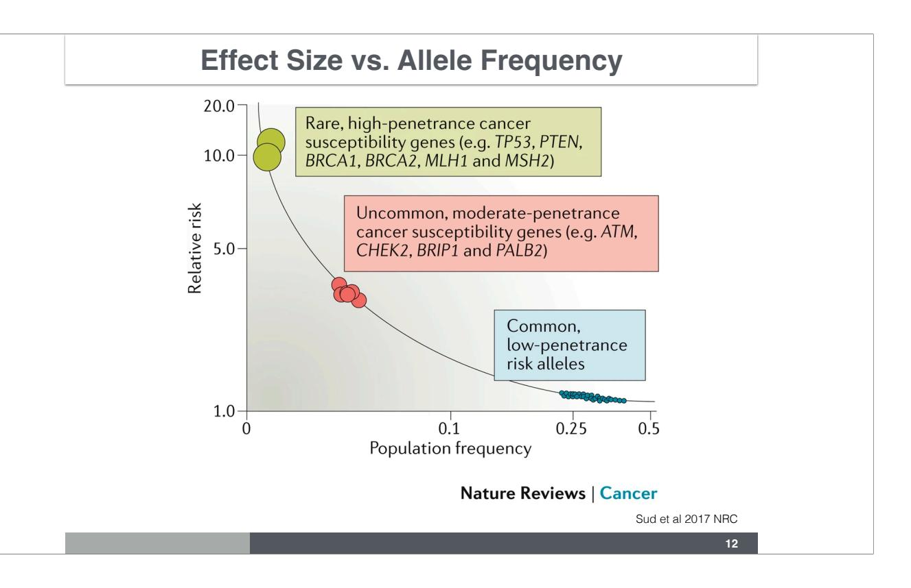

This figure shows that the discoverability of the risk alleles depend on the population frequency. GWAS have unlocked many discoveries on the lower left but to make sense of them and turn them into actionable targets we need to learn new statistical concepts.

Low penetrance = low relative risk = small effect size

# Review Hypothesis Testing

#### **Review: Hypothesis Testing**

- **H0** : null hypothesis
- e.g. no difference in case-control allele frequencies
- **HA** : alternative hypothesis
- there is a difference, i.e. correlated with causal variant
- Test statistic **Z**
- in many situations associated to a model
- Significance level
- α = allowed type I error (reject null when null is true)
- p-value = P(observed test statistic more extreme than threshold | H0 )

**We reject the null hypothesis if the observed test statistic is more extreme than what we would expect could happen by chance**

**14**

Before going into the techniques of association, let's review a few concepts.

We reject the null Ho if the observed test statistic is more extreme than a threshold, which is determined so that the probability of type I error stays below a pre-established significance level α. Usually, if p-values are smaller than the significance level, then the null hypothesis is rejected.

Type I error: probability of rejecting the null when the null is true

### **Review: Hypothesis Testing**

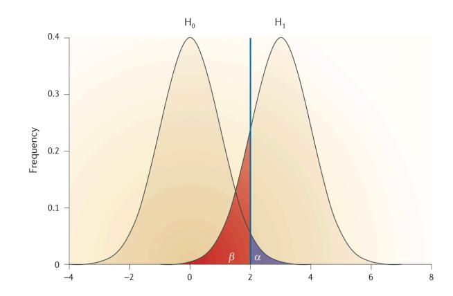

**α**: **type I error**, probability of rejecting the null when the null is true (false positive rate)

**β**: **type II error**, probability of not rejecting the null when the null is false (false negative rate)

**15**

This figure shows the test statistics under the null hypothesis H0 and the alternative hypothesis Ha. The decision rule is to reject the null hypothesis if the test statistics is larger than a given threshold. Typically, we choose a significance level α --the type I error that we are willing to accept-- and calculate the threshold above which the null hypothesis will be rejected. A typical significance level used in practice is α=0.05. But we will see that when we run multiple tests, things can go wrong very quickly, so that a much more stringent significance level is required.

The type II error is the probability of not rejecting the null when the alternative hypothesis is true. Power is the probability that we will reject the null when the alternative is true.

#### **P-value**

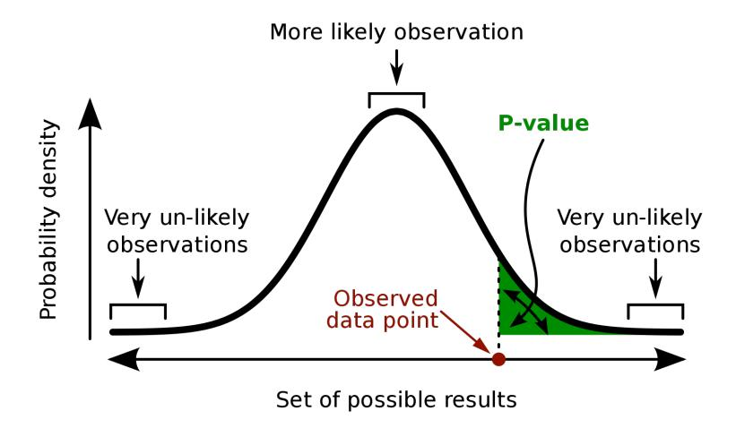

https://en.wikipedia.org/wiki/P-value

**16**

P-value is the probability that we will get a result as extreme or more extreme than the observed data point under the null hypothesis, P(X>observed | null is true).

#### **xkcd Take on P-values**

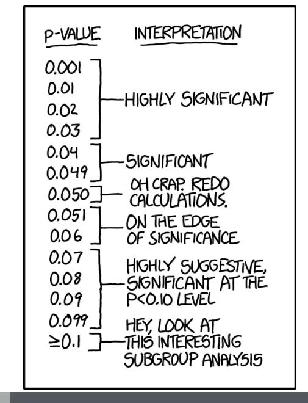

What's alpha here?

https://xkcd.com/1478/

**17**

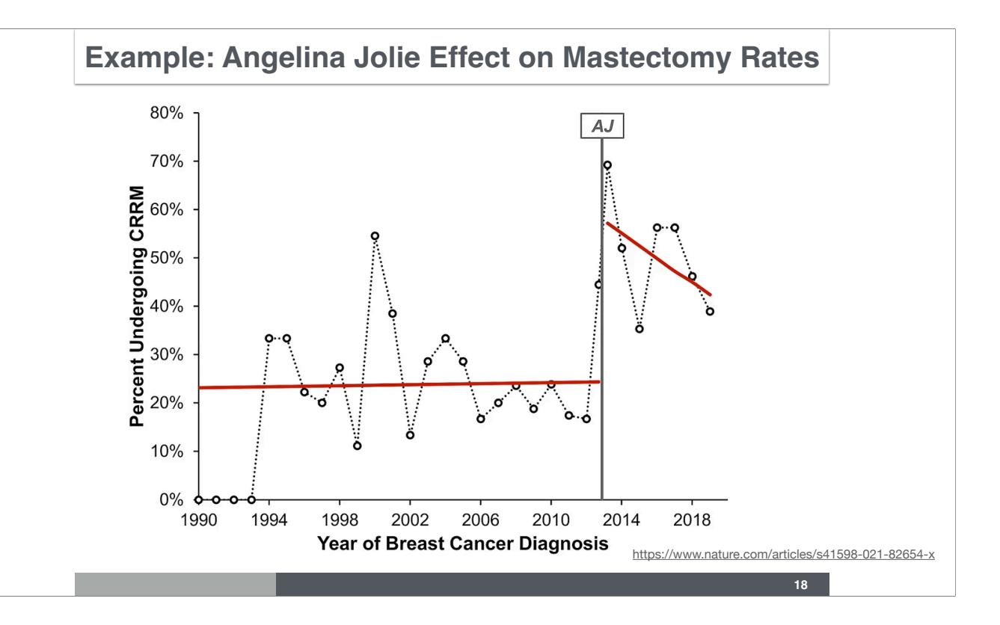

How would you estimate the null distribution of mastectomy rates.

# back to association methods

# Regression Approach Single SNP

SNP: single nucleotide polymorphism

### **Regression Approach**

$$Y = \mu + a \cdot age + \beta \cdot X + \epsilon$$

- Parameters β are estimated (using MLE, least squares, etc)
- Null hypothesis β = 0
- **- Many types of traits can be treated with the same approach**
- **- Can correct for covariates (age, sex, ancestry)**
- Prediction

genotype: *aa, aA, AA*

*X*1 : dosage = number of *A* alleles

**21**

The phenotype, Y, is modeled as a sum of a constant term, effects of covariates (e.g. age, sex, ethnicity) and the genetic effect.

#### **Regression Approach for Quantitative Traits**

#### **Quantitative trait:**

e.g. height, BMI, systolic blood pressure

$$Y = \beta_0 + \beta_1 \cdot X_1 + \epsilon$$

$$\epsilon \sim N(0, \sigma^2)$$

**Linear Regression**

genotype: *aa, aA, AA*

*X*1 : dosage = number of *A* alleles

**22**

Quantitative traits are typically modeled with normal errors and mean given by the a constant β0 and a genetic effect β1. X here indicates the number of minor alleles.

## **Regression Approach for Disease Traits**

#### **Binary trait:**

e.g. disease status, hypertension

$$Y \sim \text{Bernoulli}(\pi)$$

$$logit(\pi) = log(\frac{\pi}{1 - \pi}) = \beta_0 + \beta_1 X_1$$

$$P(Y=1)=\pi$$

$$odds = \frac{\pi}{1 - \pi}$$

genotype:  $a\ddot{a}, aA, AA$ 

 $X_1$ : dosage = number of A alleles

**Logistic Regression** 

Binary traits are typically modeled using logistic regression. Instead of the E(Y), we use the log of the odds =  $\log(\pi/(1-\pi))$  of being a case.

odds = prob / (1 - prob) beta1 = log odds ratio

for an individual with X1 = 0, the log odds of having the disease is beta0 for an individual with X1 = 1, the log odds of having the disease is beta0 + beta1

therefore, beta1 is the log of the odds ratio

Recall that the log of a ratio is the difference of the logs: log(A/B) = log(A) - log(B)

# Genome-wide Association Studies

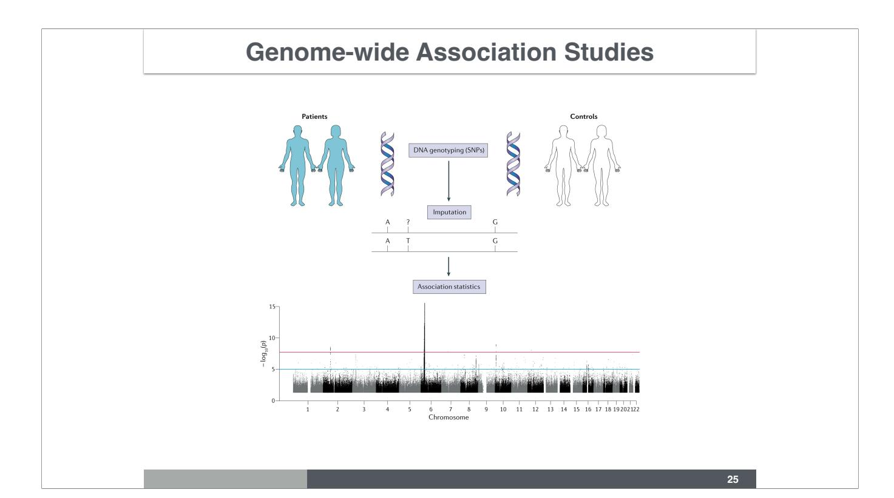

GWAS collect individuals (cases and controls for disease or a population sample of individuals for quantitative traits), measures the genotype of individuals in a set number of genomic locations (~1 million markers), and performs association test between the phenotype (case status or quantitative trait) and each of the genetic marker (typically SNPs, single nucleotide polymorphisms).

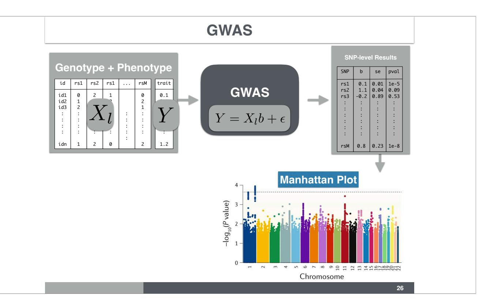

The genotype of the individuals is represented as a matrix  $X_l$ , the phenotype is represented as a vector Y. Single marker SNP association test is performed, leading to a table of SNP-level results with effect size, standard error of the effect size, and p-values.

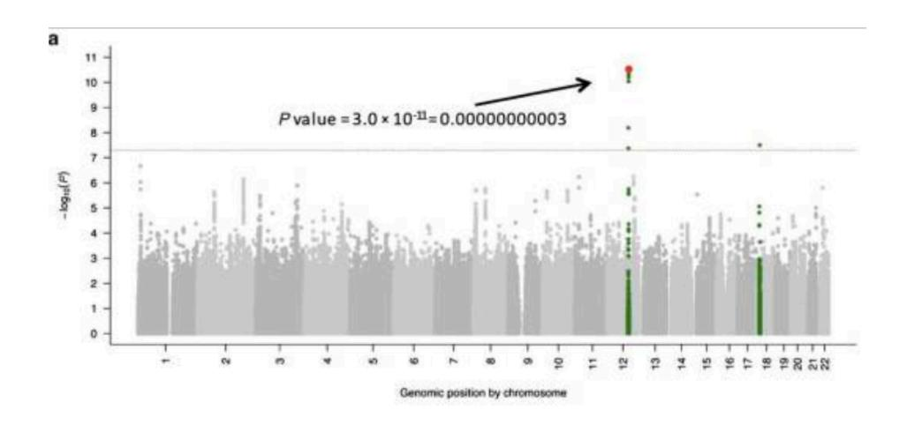

GWAS significant threshold: 5e-8

**https://www.ncbi.nlm.nih.gov/pmc/articles/PMC2865585/ 27**

Manhattan plots are used to visualize GWAS results. Points above -log(5. 10^{-8}) are called GWAS significant.

"a Manhattan plot (−log10[P] genome-wide association plot) of a genome-wide association study on systolic blood pressure in 29,136 individuals in Cohorts for Heart and Aging Research in Genomic Epidemiology (CHARGE). The genome-wide significance level is set at 5 × 10−8 and plotted as the dotted line. Any single nucleotide polymorphism (SNP) within a region of 5 Mb containing a SNP reaching the genome-wide significance threshold is colored in green. The most significant SNP in this experiment is colored in red (rs2681492 in the ATP2B1 gene). The P value is indicated for demonstration. b Quantile-quantile (QQ) plot of the data shown in the Manhattan plot. c QQ plot of simulated data showing an early separation of the observed from the expected, suggesting population stratification. (a and b adapted from Levy et al. [22••], with permission.)"

Ehret, Genome-Wide Association Studies: Contribution of Genomics to Understanding Blood Pressure and Essential Hypertension, 2011,

### **QQPlot**

• A Q-Q plot is a useful tool to present the GWAS results and check for potential issues

X-axis: the expected –log(P-values) under the null hypothesis of no association. I.e., the negative log10 of a set of uniformly distributed p-values.

Y-axis: the observed –log(P-values).

Dots above the 45-degree line (upper right) deserve a closer look.

A QQ plot can also be used to check for population stratification (more later).

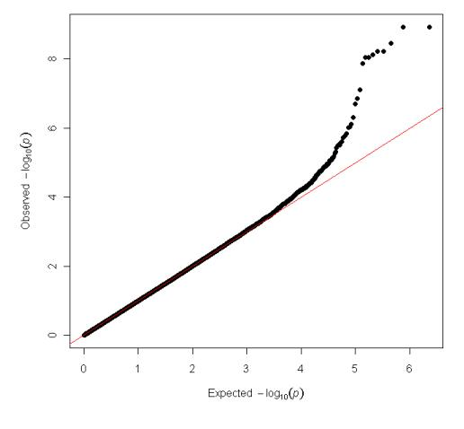

**28**

In addition to the Manhattan plot, qqplots is a useful visualization of GWAS results to detect possible issues with the analysis. This compares the observed distribution p-values with the expected distribution under the null hypothesis of no real relationship between genotype and phenotype. Recall that under the null hypothesis, p-values are distributed uniformly. So if we order the p-values under the null, they will be nearby 1/m, 2/m ,..., 1. This is the expected distribution.

In typical well-behaved GWAS, most points should line up at the identity line and a few at the right end depart from the identity line.

### **GWAS SNP-Trait Discovery Timeline**

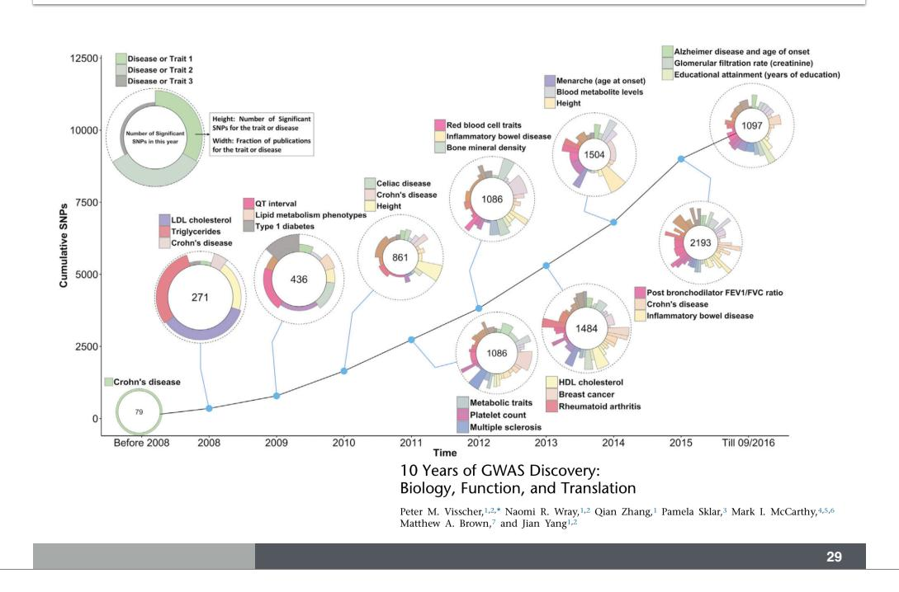

GWAS have been so successful that thousands of them have been performed since 2005, with discoveries that grow continuously. As of 2020, more than 70K SNP-trait associations are reported in the GWAS catalog.

## 100,000+ SNP/Trait Associations

## 

Download a full copy of the GWAS Catalog in spreadsheet format as well as current and older versions of the GWAS diagram in SVG format.

## 

Documentation and access to full summary statistics for Submit Summary Status to GWAS Catalog GWAS Catalog studies where available.

## 

## 

Including FAQs, our curation process, training materials, related resources, a list of abbreviations and API documentation.

Explore an interactive visualisation of all SNP-trait associations with genome-wide significance (p.s5 x documentation.

## 

associations with genome-wide significance (p≤5 x10-8).

## 

An introduction to our ancestry curation process.

### **WTCCC: First Large Scale GWAS**

**31**

the Wellcome Trust Case Control Consortium's GWAS is a landmark study of 7 common diseases, the first large scale GWAS performed.

#### **WTCCC**

- The Wellcome Trust Case Control Consortium (WTCCC)
- GWA studies of 2,000 cases and 3,000 shared controls for 7 diseases
- platform: Affymetrix 500K Set
- main paper published in 2007
- results and summaries freely available
- genotype data access granted to qualified investigators

**32**

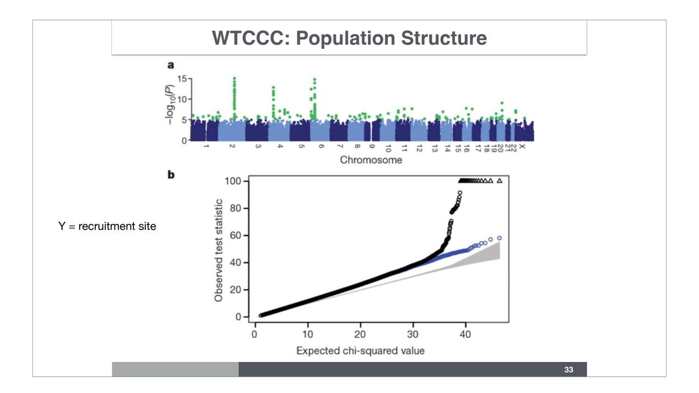

Here we see the manhattan plot and qqplot from WTCCC for the association between site (recruitment location) and genotype. Significant peaks are seen in chromosomes 1, 4, 6, and 20 indicating that there are significant differences in allele frequencies in these loci across sites.

The departure from the identity line of most points, is an indication of population structure. We will get back to this concept later. Most variants show small frequency differences between sites, which does not pass GWAS significance (5e-8) due to their small effects.

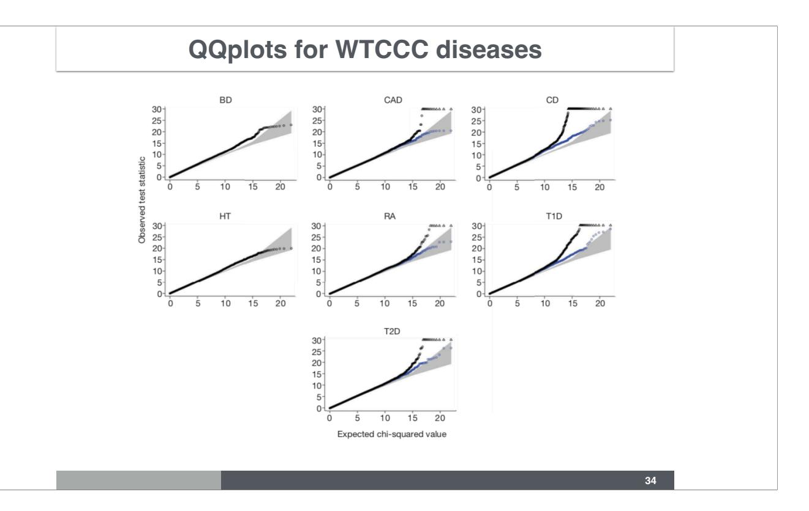

These shows the qqplots for all 7 diseases from the WTCCC. Given a bit of departure from the identity line early on seems to indicate some population structurehere. At this time, methods for correcting for population structure were still under developed. In a later lecture, we will look into methods to account for population structure.

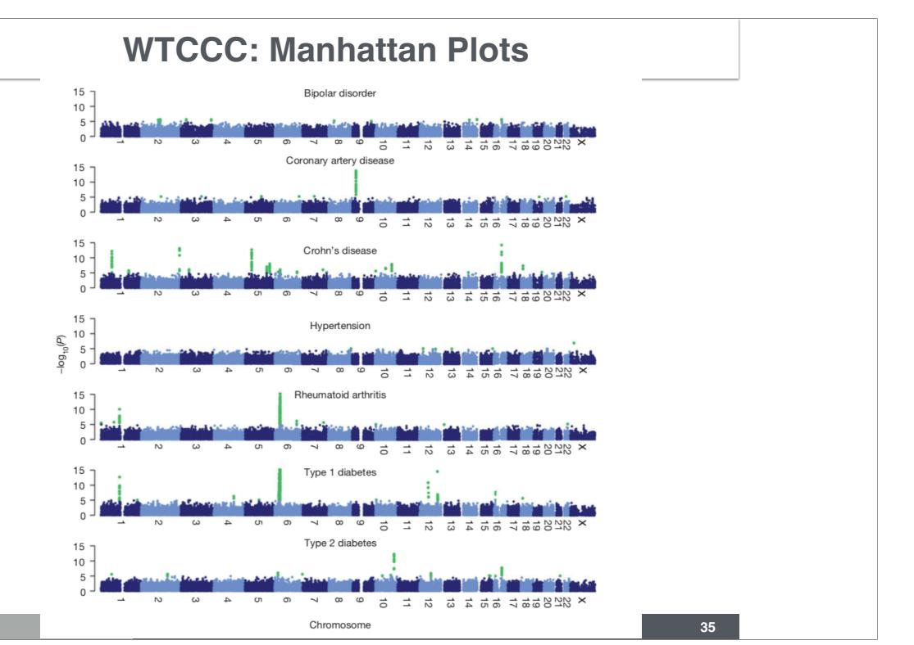

Manhatthan plots for the 7 WTCCC diseases.

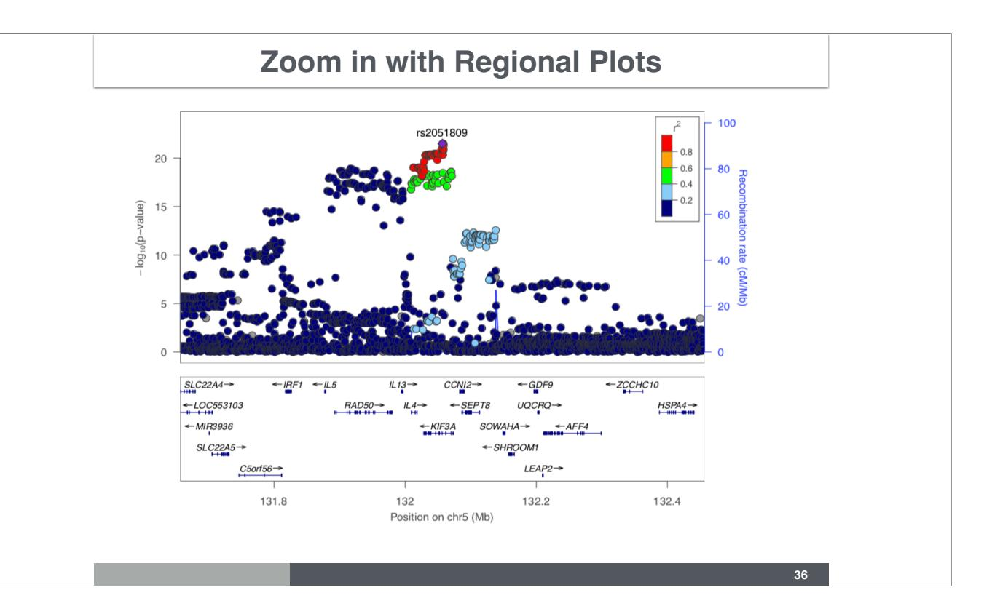

We can zoom into the manhattan plot using locus zoom. These are staples of any GWAS paper at the moment. Variants in LD tend to have similar association p-values. This is a good sign. If we find variants that are significant by themselves, this may be a sign of genotyping issue.

#### **Clarifications and Logistics**

- Homework problems are part of the learning process and may cover subjects not discussed in class
- Don't get stuck, ask questions to your classmates, your TAs, and your instructors
- Labs can be done on your computer if you have Mac OS or Linux. With Windows you may want to create posit accounts that will give you terminal access.

**37**

### **Lab/Homework**

<https://course-material.hakyimlab.org/post/bios-25328/2024-03-18-lab-01-command-line-r/>

**38**