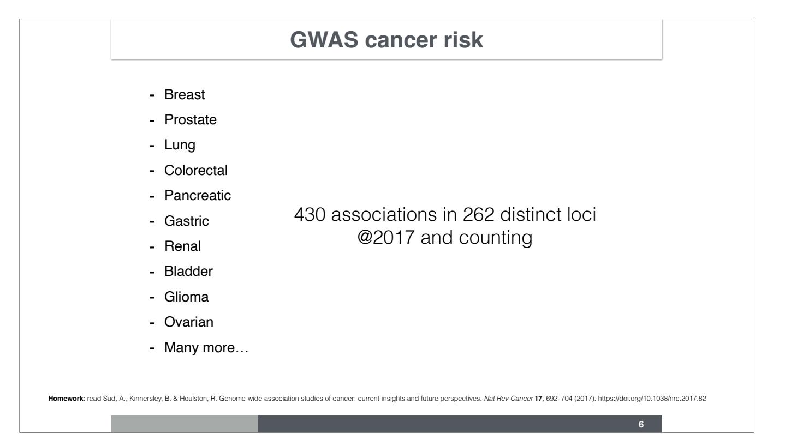

# Lecture 3 GWAS, QC & UK Biobank

Hae Kyung Im, PhD

March 31, 2025

# **Learning Objectives**

- GWAS of cancer susceptibility
- Learn about QC steps in GWAS
- UK Biobank GWAS

**2**

Today we will talk about the discoveries made by GWAS of cancer risk, examples of the insights that were gleaned from them, and challenges to turn discoveries into biological understanding. We will use the UK Biobank as a case study to learn how GWAS is performed and the importance of QC.

GWAS significant threshold: 5e-8

**https://www.ncbi.nlm.nih.gov/pmc/articles/PMC2865585/ 4**

Manhattan plots are used to visualize GWAS results. Points above -log(5. 10^{-8}) are called GWAS significant.

"a Manhattan plot (−log10[P] genome-wide association plot) of a genome-wide association study on systolic blood pressure in 29,136 individuals in Cohorts for Heart and Aging Research in Genomic Epidemiology (CHARGE). The genome-wide significance level is set at 5 × 10−8 and plotted as the dotted line. Any single nucleotide polymorphism (SNP) within a region of 5 Mb containing a SNP reaching the genome-wide significance threshold is colored in green. The most significant SNP in this experiment is colored in red (rs2681492 in the ATP2B1 gene). The P value is indicated for demonstration. b Quantile-quantile (QQ) plot of the data shown in the Manhattan plot. c QQ plot of simulated data showing an early separation of the observed from the expected, suggesting population stratification. (a and b adapted from Levy et al. [22••], with permission.)"

Ehret, Genome-Wide Association Studies: Contribution of Genomics to Understanding Blood Pressure and Essential Hypertension, 2011,

# **QQPlot**

• A Q-Q plot is a useful tool to present the GWAS results and check for potential issues

X-axis: the expected –log(P-values) under the null hypothesis of no association. I.e., the negative log10 of a set of uniformly distributed p-values.

Y-axis: the observed –log(P-values).

Dots above the 45-degree line (upper right) deserve a closer look.

A QQ plot can also be used to check for population stratification (more later).

**5**

In addition to the Manhattan plot, qqplots is a useful visualization of GWAS results to detect possible issues with the analysis. This compares the observed distribution p-values with the expected distribution under the null hypothesis of no real relationship between genotype and phenotype. Recall that under the null hypothesis, p-values are distributed uniformly. So if we order the p-values under the null, they will be nearby 1/m, 2/m ,..., 1. This is the expected distribution.

In typical well-behaved GWAS, most points should line up at the identity line and a few at the right end depart from the identity line.

Many GWAS have been performed over the last two decades. The number of discoveries keeps growing as more samples are included. As of 2017, 430 loci associated with various cancers were reported.

The number of loci that can be identified depends on the sample size and the genetic architecture of the cancer. Most known loci today correspond to breast and prostate cancers, because of the very large sample size. As of 2020, there were 170 breast cancer loci. And at 2021, 269 prostate cancer loci were accumulated.

The genetic architecture, i.e. heritability of the cancer and the effect sizes of the loci also determine the yield of the GWAS. For example, CLL, which is highly heritable and has many loci with large effect sizes, has 43 loci discovered with ~24K individuals. Whereas lung cancer has only 18 loci even though the sample size was much larger, 86K. A consequence of the larger role environmental factors play.

# **GWAS Loci Provide Insights into Cancer Biology**

- In B cell tumors
- B cell developmental and immune response genes
- IKZF1, CEBPE, IRF4, IRF8, GATA3 and ARID5B
- Testicular cancer
- Developmental transcriptional regulation
- Microtubule and chromosomal assembly
- KIT-ERK signaling pathway

Some of the discoveries provide insights into the biology of cancers. For example, in B cell tumors, significant loci were in the vicinity of B cell developmental and immune response genes such as IKZF1, CEBPE, IRF4, IRF8, GATA3 and ARID5B.

**8**

In testicular cancer, GWAS loci implicated developmental transcriptional regulation, microtubule and chromosomal assembly, KIT-ERK signaling pathway.

# **Gene Environment Interaction**

- CHRNA3-5 nicotine addiction locus associated with lung cancer
- NAT2 in bladder cancer, modifies effect of smoking
- Skin pigmentation loci are associated with skin cancer

**9**

GWAS loci have also recapitulated what we know about the environmental factors driving cancer risk. For example, nicotine addiction locus was associated with lung cancer risk, indicating that smoking causes lung cancer; NAT2 locus associated with bladder cancer also implicates smoking as contributing factor. Skin pigmentation loci association with skin cancer shows the role of sun exposure.

Figure 1: Manhattan plots of lung cancer risk overall and by histological subtype. From: Large-scale association analysis identifies new lung cancer susceptibility loci and heterogeneity in genetic susceptibility across histological subtypes (a) Lung cancer risk overall: 29,266 cases and 56,450 controls. (b) Adenocarcinoma: 11,273 cases and 55,483 controls. (c) Squamous cell carcinoma: 7,426 cases and 55,627 controls. Each locus is annotated by its cytoband location. The x axis represents chromosomal location, and the y axis represents −log10 (P value). Black, previously known loci; red, new loci identified in this analysis. The red horizontal line

denotes P = 5 × 10−8.

### **Vast Majority of Loci Still Need Mechanistic Explanation**

- Most loci are located outside of coding regions
- Target gene is unknown
- Effect sizes are small

**11**

However, most of the GWAS loci do not have an obvious biological explanation. Even the acting gene is not well known because most of the loci are located outside of coding regions. So they have regulatory role but which gene they regulate is not completely clear. The nearest gene is the suspect but in some cases, the causal gene may be several hundred kilobases away from the top association. The small effect sizes also make the explanation difficult.

# **GWAS vs. Candidate Gene Studies**

- GWAS:
- agnostic survey
- successfully discovered many cancer susceptibility loci
- Candidate gene studies
- has led to underpowered studies, and mostly discouraged today

**Avoid candidate gene studies**

https://www.nature.com/articles/s41386-019-0389-5

**12**

Side note: beware of candidate gene studies. There were way too many that did not replicate.

# GWAS in 2020's

# **UK Biobank**

**14**

UK Biobank started recruitment of participants in 2006, even before the publication of the WTCCC GWAS study publication, a testament of the forwarding looking vision of the proponents of the study. This is a picture of the huge freezer with automated handing of the biological samples. This gives us a sense of the scale of the biobank.

Biological Samples in a Storage Freezer at the UK Biobank Nancy Cox, UK Biobank shares the promise of big data, 2018, Nature

Their liberal data sharing policies made it possible for thousands of investigators to examine this data yielding more than 1000 publications to date (as of beginning 2020).

# **UK Biobank Genotype and Phenotype Data**

- Large prospective population-based cohort study.
- Over 500,000 participants enrolled.
- Participants aged 40-69, between 2006 and 2010
- Deeply phenotyped
- questionnaires
- physical & biological measurements
- electronic health records (EHR)
- images, accelerometer measurements (subset)
- Genotype data (488K)

**15**

The depth of the phenotypes is astonishing. Electronic health records have been linked with the participants. The single payer health care system in the UK is a huge component that made possible to get this amount of information in a relatively uniform fashion.

# **UK Biobank: Ancestries**

- White 94.23% (88.26% British)
- Asian 1.92%
- Black 1.57%
- Chinese 0.31%
- Mixed 0.58%
- Other 1.38%

Bycroft, C., Freeman, C., Petkova, D., Band, G., Elliott, L. T., Sharp, K., et al. (2018). The UK Biobank resource with deep phenotyping and genomic data. Nature, 1–25.

**16**

The biobank is mostly composed on White British individuals, with a small portion of Asian (1.92%), Black (1.57%), Chinese (0.31%), and others.

Self reported cancers in the UK Biobank https://biobank.ndph.ox.ac.uk/showcase/field.cgi?id=20001 53K cancer diagnosis were reported by the participants at the time of recruitment 2006-2010

Thanks to the national cancer registry in the UK, the cancer diagnosis information continues to accrue. In 2019 there were 84,722 participants with a cancer diagnosis (ICD10) which went up to 119,346 by 3/25/2024.

# **UK Biobank: Genotyping Chips**

- UK BiLEVE (UK Biobank Lung Exam Variant Evaluation)
- N ~ 50K
- UK BiLEVE Axiom Array by Affymetrix (807K markers)
- UK Biobank (remaining)
- N ~ 438K
- UK Biobank Axiom Array by Applied Biosystems

**19**

Two genotyping chips were used. Initially the UK BiLEVE Axiom Array with 807K markers that was used for about 50K participants. The remaining 90% of the participants were genotyped with the newer UK Biobank Axiom Array, specifically designed for this study.

The UK Biobank Axiom Array contained 805K markers chosen with several criteria. One was to obtain a high coverage of the common variation to be used as a scaffold for genotype imputation. Rare coding variants were included, with the thinking that rare variation must be relevant for health and disease. eQTLs, variants that are known to regulate expression of genes, an important mechanism underlying the genotype-phenotype associations. Higher coverage of the complex HLA region and other immune implicated variants. Markers implicated in human diseases. Copy number variants (deletions, insertions, beyond SNPs).

# GWAS QC

# **Why Is QC Important?**

**22**

QC is the least glamorous part of research and analysis. So why should we care about QC? Well, to avoid huge pitfalls and draw spurious conclusions. General rule: if something sounds too good to be true? Well, it is highly likely it is not true. So before making big claims and causing media splash make sure your QC is super solid. Think of every possible confounders that could lead to the "interesting" results.

In this paper, the authors had found many SNPs associated with being centenarian, i.e. they thought they had found the "longevity genes"

## **Why Is QC Important?**

**23**

But then they found out that there was a problem with some of the chips that affected more of the centenarians than the controls. Faulty chips were confounded with being a case leading to false positive results. Their original claim that they had 77% accuracy to predict longevity could not be supported with the QC'd data.

# **We Want to Avoid This Kind of Publicity 24** https://www.nytimes.com/2011/07/23/science/23retract.html

You really don't want to appear in the NY Times as the scientist who had to retract a paper because of a faulty QC. After the publication, they realized that a 10% of the centenarians had been genotyped in faulty chips.

How would they have detected the confounding between the chip and the longevity status?

Here is a summary of the workflow for QC in GWAS.

# **Marker-based QC**

| type | Fraction of all genotype calls affected | Average number of SNPs failed per batch (sd) | Test                                         |
|------|--------------------------------------------|----------------------------------------------|----------------------------------------------|
|      | 0.00140                                    | 1109 (699)                                   | Affymetrix cluster QC                        |
|      | 0.000249                                   | 197 (86)                                     | 1. Batch effect                              |
|      | 0.000358                                   | 284 (266)                                    | 2. Plate effect                              |
|      | 0.000723                                   | 572 (77)                                     | 3. Departure from Hardy-Weinberg equilibrium |
|      | 0.0000569                                  | 45 (5)                                       | 4. Sex effect                                |
|      | 0.00683                                    | 5417                                         | 5. Array effect*                             |
|      | 0.000796                                   | 622 and 632                                  | 6. Discordance across controls**             |
|      | 0.00971                                    | 7704 (721)                                   | Total                                        |
|      | 0.000796                                   | 622 and 632                                  | 6. Discordance across controls**             |

UKB QC pipeline was designed specifically to accommodate the large-scale dataset of ethnically diverse participants, genotyped in many batches (106), using two slightly different novel arrays, and which will be used by many researchers to tackle a wide variety of research questions.

Clare Bycroft, et al. Nature 2018

**26**

TL;DR: very low % of markers were removed due to QC problems.

Markers were filtered out according to several criteria.

Manufacture's criterion: failure to clustering used for calling the genotypes. On average, 1109 SNPs per bach failed Affymetrix cluster QC.

Batch effects: there were 106 batches of about 5000 individuals.

Plate effects: participants DNA were placed on 96 well plates.

Departure from HW equilibrium

Sex effects

Array effects. In the next slides, we will see examples of these QC measures.

In total, less than 1% of markers were excluded due to low quality.

**27**

Here is the distribution of the minor allele frequencies in the UKB.

About 130K markers had allele frequencies below 1%. Half of rare variants were found in at least 1000 individuals. 20K were present in less than 10 participants. (Given rarity, there probably wasn't two copies of these rare alleles in one individual)

Most common variants, more than 95%, (in blue to the right) passed QC in all batches. Quality was overall pretty good even for low frequency: over 80% of the very rare variants passed QC in all batches (left most bar above 0).

Missing rates were low, with most of the mass under 0.01. Pink bar correspond to markers that were exclusively present in the old array, i.e. 90% of the people did not have a value for those. Blue corresponds to markers only available in the new array, so. about 10% of participants did not have those genotypes measured.

Allele frequencies of all variants were compared to "population" frequencies available from the ExAC consortium. The markers lie nearby the identity line, providing reassurance that the genotyping was reliable.

- Some high frequency in ExAC not found in UKB,
- very few the other way around, high frequency in UKB and not observed in ExAC.

# **ExAC Aggregation Consortium (ExAC) -> gnomAD**

<https://gnomad.broadinstitute.org/>

**31**

The ExAC database, now renamed gnomAD, is a huge publicly available resource with summaries of a very large number of whole exome and whole genome sequenced data. This resource is critical to evaluate the pathogenicity of rare variants. For example, if a variant appears in relatively high numbers in this database, we can safely assume that reasonably healthy life is possible with the mutation. When first appeared, many variants that had been catalogued as highly pathogenic ended up being reclassified as variants of uncertain significance VUS.

A snapshot of the gnomAD webpage search for the FTO gene.

Here are examples of the intensity plots used for genotype calling. By plotting the strength vs the contrast of the intensities, we can visualize distinct clusters which are used for genotype calling.

Average log intensities (normalized) of Y chromosome and X chromosome markers can help infer the sex of participants. Green cluster has "deficient" Y chromosome markers whereas the pink cluster shows X chromosome marker deficiency. XXY is centered at 0 due to the choice of normalization.

"L2R are computed (by Affymetrix) for each sample at each marker,and isthe sum of the A and B allele intensities for the marker,normalized by the median intensity of that marker in individualsassumed to represent the normal copy number state at that site." supplement UK Biobank flagship paper https://static-content.springer.com/esm/art%3A10.1038%2Fs41586-018-0579-z/MediaObjects/ 41586\_2018\_579\_MOESM1\_ESM.pdf

# **Sex Specific Intensities in Smaller Sample**

Turner, S., Armstrong, L. L., in, Y. B. C. P., 2011. Quality control procedures for genome‐wide association studies. Current Protocols in Human Genetics. http://doi.org/ 10.1002/0471142905.hg0119s68

**35**

Much fewer cases of aneuploidy (missing or extra chromosomes) is seen

Missing rates are different for the first 50K individuals and the remaining driven by the difference in array. The first 50K were genotyped with the UkBiLEVE Axion array whereas the remaining 438K idnividuals were genotyped with the UK Bionbak Axiom array.

Two arrays (UKBiLEVE and UKBiobank Axiom Arrays). This marker has an outlier for UKBiLEVE batch that is not present in the newer array.

# **QC: Batch Effect (109 batches)**

# **QC: Sex Effect**

**39**

Data points cluster by sex rather than genotype. Unreliable.

# **Hardy Weinberg Disequilibrium Hardy Weinberg equilibrium Random mating => variant from father & mother are independent Given MAF p Genotypes should be aa: p^2 aA: 2 p (1-p) AA: (1-p)^2**

**40**

Example of a marker that does not pass HWE test

Right figure shows plates with different colors. Pink plate data clusters (right figure) on its own cluster messing up the calling.

GWAS results of height phenotype in UKB are compared to an independent GWAS of height from the GIANT consortium. UKB p values are more significant than GIANT's p-values due to larger sample size in UKB as well as less heterogeneity.

# **References**

- Sud, A., Kinnersley, B. & Houlston, R. Genome-wide association studies of cancer: current insights and future perspectives. Nat Rev Cancer 17, 692–704 (2017). https://doi.org/10.1038/nrc.2017.82
- UK Biobank Imputed Genotype Data Release
- Bycroft, C., Freeman, C., Petkova, D., Band, G., Elliott, L. T., Sharp, K., et al. (2018). The UK Biobank resource with deep phenotyping and genomic data. Nature, 562(7726), 1–25. http:// doi.org/10.1038/s41586-018-0579-z
- S. Turner et al, 2011, "Quality control procedures for genome‐wide association studies", Current Protocols in Human Genetics
- Anderson et al 2010, Data quality control in genetic case-control association studies https://www.ncbi.nlm.nih.gov/pmc/articles/ PMC3025522/pdf/ukmss-33586.pdf

**43**