## Lecture 3: GWAS, QC & UK Biobank {.center}

**Hae Kyung Im, PhD**

March 31, 2025

{width=60%}

## Learning Objectives

- GWAS of cancer susceptibility
- Learn about QC steps in GWAS
- UK Biobank GWAS

## GWAS

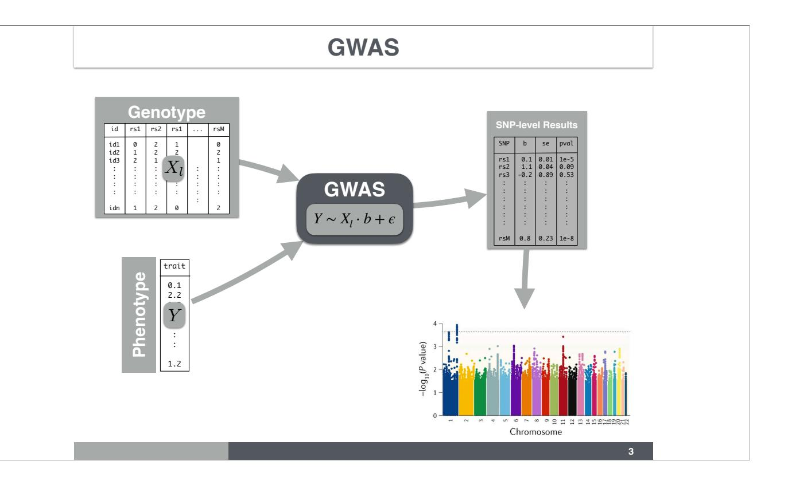

::: {.notes}
Today we will talk about the discoveries made by GWAS of cancer risk, examples of the insights that were gleaned from them, and challenges to turn discoveries into biological understanding. We will use the UK Biobank as a case study to learn how GWAS is performed and the importance of QC.
:::

## Manhattan Plot

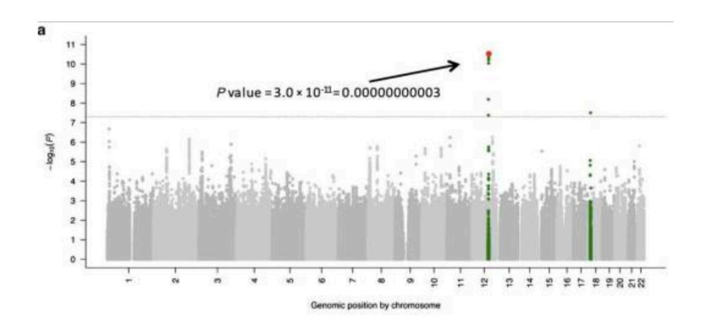

**GWAS significant threshold: 5×10⁻⁸**

<https://www.ncbi.nlm.nih.gov/pmc/articles/PMC2865585/>

::: {.notes}
Manhattan plots are used to visualize GWAS results. Points above −log₁₀(5×10⁻⁸) are called GWAS significant.

"A Manhattan plot (−log10[P] genome-wide association plot) of a genome-wide association study on systolic blood pressure in 29,136 individuals in CHARGE. The genome-wide significance level is set at 5 × 10−8 and plotted as the dotted line. Any SNP within a region of 5 Mb containing a SNP reaching the genome-wide significance threshold is colored in green. The most significant SNP is colored in red."

Ehret, *Genome-Wide Association Studies: Contribution of Genomics to Understanding Blood Pressure and Essential Hypertension*, 2011.
:::

## QQPlot

:::: {.columns}
::: {.column width="55%"}
- A Q-Q plot is a useful tool to present GWAS results and check for potential issues
- **X-axis:** expected −log(P) under the null (no association)
- **Y-axis:** observed −log(P)
- Dots above the 45° line deserve a closer look
- Can also be used to check for population stratification
:::
::: {.column width="45%"}
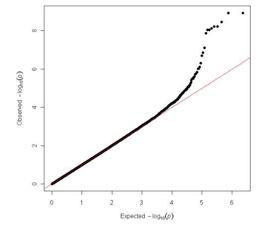
:::
::::

::: {.notes}
In addition to the Manhattan plot, QQ plots are a useful visualization of GWAS results to detect possible issues. This compares the observed distribution of p-values with the expected distribution under the null hypothesis.

Under the null, p-values are distributed uniformly. In typical well-behaved GWAS, most points should line up at the identity line and a few at the right end depart from the identity line — those are the true associations.
:::

## GWAS Cancer Risk

:::: {.columns}
::: {.column width="45%"}
- Breast
- Prostate
- Lung
- Colorectal
- Pancreatic
- Gastric
- Renal
- Bladder
- Glioma
- Ovarian
- Many more...
:::
::: {.column width="55%"}
**430 associations in 262 distinct loci @2017 and counting**

*Homework: read Sud, A., Kinnersley, B. & Houlston, R. Genome-wide association studies of cancer: current insights and future perspectives. Nat Rev Cancer 17, 692–704 (2017).*
:::
::::

::: {.notes}
Many GWAS have been performed over the last two decades. The number of discoveries keeps growing as more samples are included. As of 2017, 430 loci associated with various cancers were reported.
:::

## Sample Size & Genetic Architecture Drive Discoveries

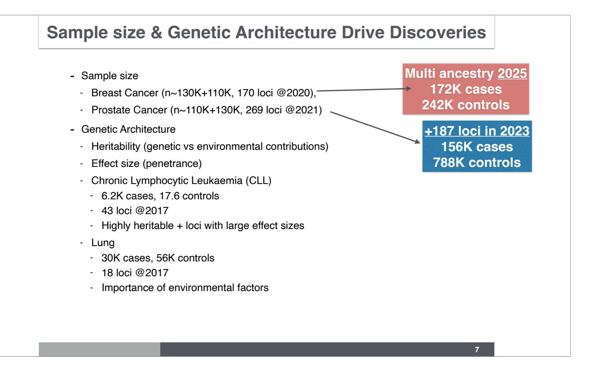{width=85%}

::: {.notes}
The number of loci that can be identified depends on the sample size and the genetic architecture of the cancer. Most known loci today correspond to breast and prostate cancers, because of the very large sample size. As of 2020, there were 170 breast cancer loci; at 2021, 269 prostate cancer loci.

The genetic architecture — heritability and effect sizes — also determines the GWAS yield. For example, CLL, which is highly heritable with large-effect loci, has 43 loci with ~24K individuals. Whereas lung cancer has only 18 loci even with 86K samples, reflecting the larger role of environmental factors.
:::

## GWAS Loci Provide Insights into Cancer Biology

- In B cell tumors:
  - B cell developmental and immune response genes
  - IKZF1, CEBPE, IRF4, IRF8, GATA3 and ARID5B
- Testicular cancer:
  - Developmental transcriptional regulation
  - Microtubule and chromosomal assembly
  - KIT-ERK signaling pathway

::: {.notes}
Some of the discoveries provide insights into the biology of cancers. In B cell tumors, significant loci were in the vicinity of B cell developmental and immune response genes such as IKZF1, CEBPE, IRF4, IRF8, GATA3 and ARID5B.

In testicular cancer, GWAS loci implicated developmental transcriptional regulation, microtubule and chromosomal assembly, and the KIT-ERK signaling pathway.
:::

## Gene-Environment Interaction

- CHRNA3-5 nicotine addiction locus associated with lung cancer
- NAT2 in bladder cancer, modifies effect of smoking
- Skin pigmentation loci are associated with skin cancer

::: {.notes}
GWAS loci have recapitulated what we know about environmental factors driving cancer risk. The nicotine addiction locus was associated with lung cancer risk, implicating smoking; NAT2 associated with bladder cancer also implicates smoking; skin pigmentation loci association with skin cancer shows the role of sun exposure.
:::

## Lung Cancer GWAS

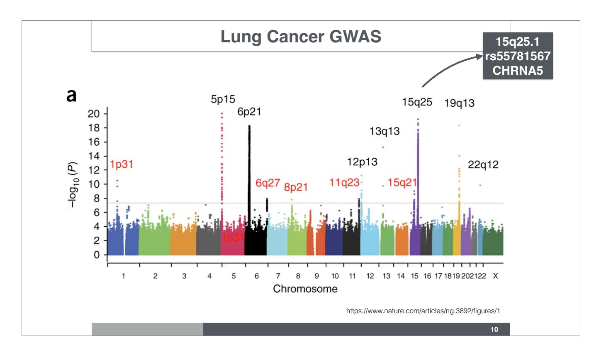{width=85%}

::: {.notes}
Manhattan plots of lung cancer risk overall and by histological subtype. From: *Large-scale association analysis identifies new lung cancer susceptibility loci and heterogeneity in genetic susceptibility across histological subtypes.*

(a) Lung cancer risk overall: 29,266 cases and 56,450 controls.
(b) Adenocarcinoma: 11,273 cases and 55,483 controls.
(c) Squamous cell carcinoma: 7,426 cases and 55,627 controls.

Black = previously known loci; red = new loci. The red horizontal line denotes P = 5 × 10⁻⁸.
:::

## Vast Majority of Loci Still Need Mechanistic Explanation

- Most loci are located **outside of coding regions**
- Target gene is unknown
- Effect sizes are small

::: {.notes}
Most GWAS loci do not have an obvious biological explanation. Even the acting gene is not well known because most loci are in non-coding regions — they have a regulatory role but which gene they regulate is not completely clear. The nearest gene is the suspect but the causal gene may be several hundred kilobases away. The small effect sizes also make the explanation difficult.
:::

## GWAS vs. Candidate Gene Studies

:::: {.columns}
::: {.column width="50%"}
**GWAS:**

- Agnostic survey
- Successfully discovered many cancer susceptibility loci
:::
::: {.column width="50%"}
**Candidate gene studies:**

- Led to underpowered studies
- Mostly discouraged today
:::
::::

> **Avoid candidate gene studies**

<https://www.nature.com/articles/s41386-019-0389-5>

::: {.notes}
Beware of candidate gene studies. There were way too many that did not replicate.
:::

# GWAS in 2020's

## UK Biobank

::: {.notes}
UK Biobank started recruitment of participants in 2006, even before the WTCCC GWAS study publication — a testament of the forward-looking vision of the proponents. This is a picture of the huge freezer with automated handling of the biological samples, giving a sense of the scale of the biobank.

Their liberal data sharing policies made it possible for thousands of investigators to examine this data, yielding more than 1000 publications to date (as of beginning 2020).

*Biological Samples in a Storage Freezer at the UK Biobank — Nancy Cox, UK Biobank shares the promise of big data, 2018, Nature.*
:::

## UK Biobank: Genotype and Phenotype Data

:::: {.columns}
::: {.column width="50%"}
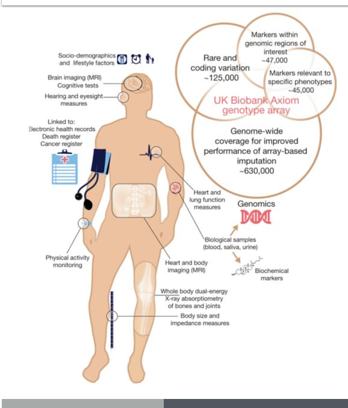
:::
::: {.column width="50%"}
- Large prospective population-based cohort study
- **Over 500,000 participants** enrolled
- Participants aged 40–69, between 2006 and 2010
- Deeply phenotyped:
  - Questionnaires
  - Physical & biological measurements
  - Electronic health records (EHR)
  - Images, accelerometer measurements (subset)
- Genotype data (488K)
:::
::::

::: {.notes}
The depth of the phenotypes is astonishing. Electronic health records have been linked with the participants. The single-payer health care system in the UK made it possible to get this amount of information in a relatively uniform fashion.
:::

## UK Biobank: Ancestries

- White 94.23% (88.26% British)
- Asian 1.92%
- Black 1.57%
- Chinese 0.31%
- Mixed 0.58%
- Other 1.38%

*Bycroft et al. (2018). The UK Biobank resource with deep phenotyping and genomic data. Nature.*

::: {.notes}
The biobank is mostly composed of White British individuals, with a small portion of Asian (1.92%), Black (1.57%), Chinese (0.31%), and others.
:::

## UK Biobank: Self-Reported Cancers

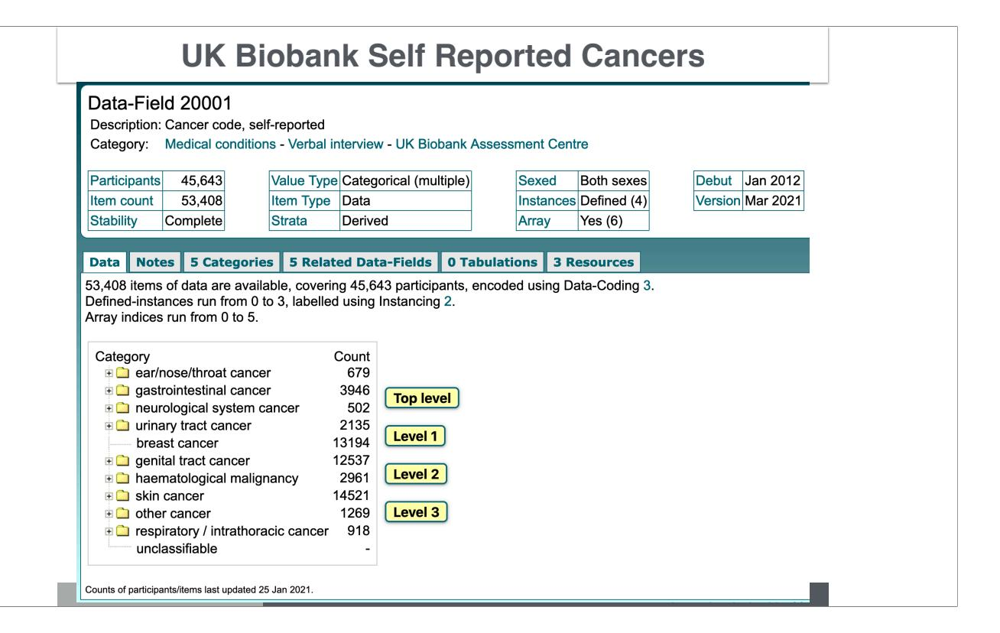{width=85%}

::: {.notes}
Self-reported cancers in the UK Biobank. 53K cancer diagnoses were reported by the participants at the time of recruitment (2006–2010).

<https://biobank.ndph.ox.ac.uk/showcase/field.cgi?id=20001>
:::

## UK Biobank: Cancer Registry

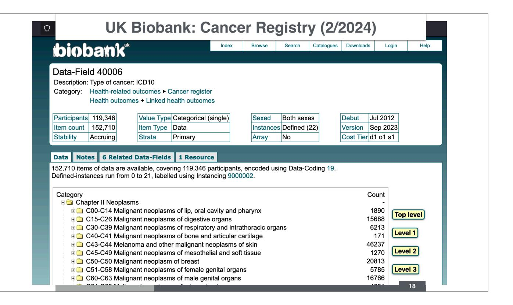{width=85%}

::: {.notes}
Thanks to the national cancer registry in the UK, the cancer diagnosis information continues to accrue. In 2019 there were 84,722 participants with a cancer diagnosis (ICD10), which went up to 119,346 by 3/25/2024.
:::

## UK Biobank: Genotyping Chips

:::: {.columns}
::: {.column width="60%"}
- **UK BiLEVE** (UK Biobank Lung Exam Variant Evaluation)
  - N ~ 50K
  - UK BiLEVE Axiom Array by Affymetrix (807K markers)
- **UK Biobank** (remaining)
  - N ~ 438K
  - UK Biobank Axiom Array by Applied Biosystems
:::
::: {.column width="40%"}
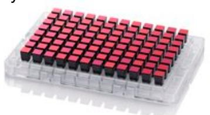
:::
::::

::: {.notes}
Two genotyping chips were used. Initially the UK BiLEVE Axiom Array with 807K markers was used for about 50K participants. The remaining 90% of the participants were genotyped with the newer UK Biobank Axiom Array, specifically designed for this study.
:::

## UK Biobank Axiom Array Content

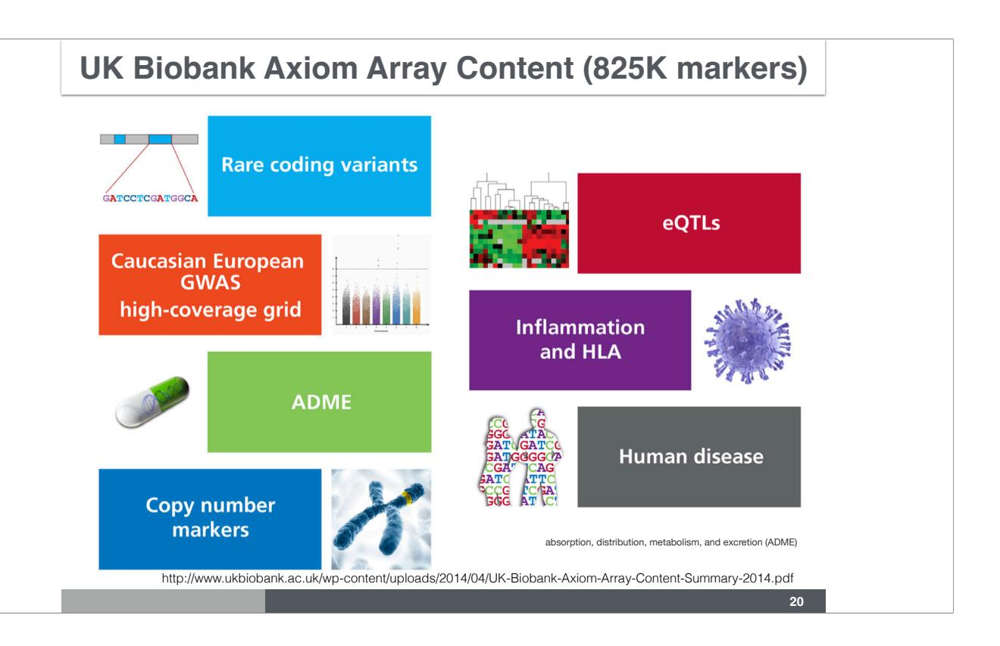{width=85%}

::: {.notes}
The UK Biobank Axiom Array contained 805K markers chosen with several criteria:

- High coverage of common variation to be used as a scaffold for genotype imputation (~630K)
- Rare coding variants (~125K) — rare variation must be relevant for health and disease
- eQTLs — variants known to regulate gene expression
- Markers within genomic regions of interest (~47K)
- Markers relevant to specific phenotypes (~45K)
- Higher coverage of the complex HLA region and immune-implicated variants
- Copy number markers
:::

# GWAS QC

## Why Is QC Important?

::: {.notes}
QC is the least glamorous part of research and analysis. So why should we care about QC? To avoid huge pitfalls and draw spurious conclusions.

General rule: if something sounds too good to be true, it is highly likely it is not true. Before making big claims, make sure your QC is super solid. Think of every possible confounder that could lead to the "interesting" results.

In one notorious paper, the authors had found many SNPs associated with being a centenarian — they thought they had found the "longevity genes."
:::

## Why Is QC Important?

. . .

**They found out that some genotyping chips were faulty — and those chips disproportionately affected centenarians vs. controls.**

- Faulty chips were confounded with case status → false positives
- Original claim of 77% accuracy to predict longevity could not be supported with QC'd data

. . .

> **How could this have been detected before publication? What QC check would catch it?**

::: {.notes}
After the publication, they realized that 10% of the centenarians had been genotyped on faulty chips. If they had checked for a batch/chip effect before analysis — comparing the distribution of any variable between batches — they would have caught the confounding between chip and longevity status.
:::

## We Want to Avoid This Kind of Publicity {background-color="#8B0000"}

**Retracted paper: claimed 77% accuracy to predict longevity from SNPs**

- Root cause: faulty chips disproportionately used on cases
- Caught *after* publication

<https://www.nytimes.com/2011/07/23/science/23retract.html>

::: {.notes}
You really don't want to appear in the NY Times as the scientist who had to retract a paper because of faulty QC.
:::

## GWAS QC Workflow

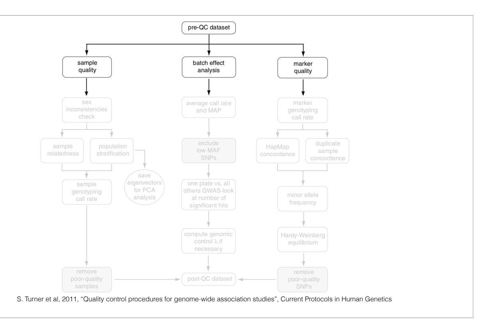

::: {.notes}
Here is a summary of the standard workflow for QC in GWAS. It covers three parallel tracks: sample quality (sex inconsistency checks, sample relatedness, population stratification, genotyping call rate), batch effect analysis (average call rate and MAF, low-MAF SNP exclusion, plate vs. all comparison), and marker quality (call rate, HapMap concordance, minor allele frequency, Hardy-Weinberg equilibrium).
:::

## Marker-Based QC

| Test | Fraction affected | Avg SNPs failed/batch |
|------|------------------|-----------------------|
| Affymetrix cluster QC | 0.00140 | 1109 (699) |
| 1. Batch effect | 0.000249 | 197 (86) |
| 2. Plate effect | 0.000358 | 284 (266) |
| 3. Departure from HWE | 0.000723 | 572 (77) |
| 4. Sex effect | 0.0000569 | 45 (5) |
| 5. Array effect | 0.00683 | 5417 |
| 6. Discordance across controls | 0.000796 | 622 and 632 |
| **Total** | **0.00971** | **7704 (721)** |

*Clare Bycroft et al., Nature 2018*

::: {.notes}
The UKB QC pipeline was designed to accommodate a large-scale, ethnically diverse dataset genotyped in 106 batches using two slightly different arrays.

TL;DR: less than 1% of markers were removed due to QC problems.

Markers were filtered by: Affymetrix cluster QC (failure in genotype calling), batch effects (~106 batches of ~5000 individuals), plate effects (DNA in 96-well plates), Hardy-Weinberg equilibrium departure, sex effects, and array effects.
:::

## Minor Allele Frequencies of 805K Markers

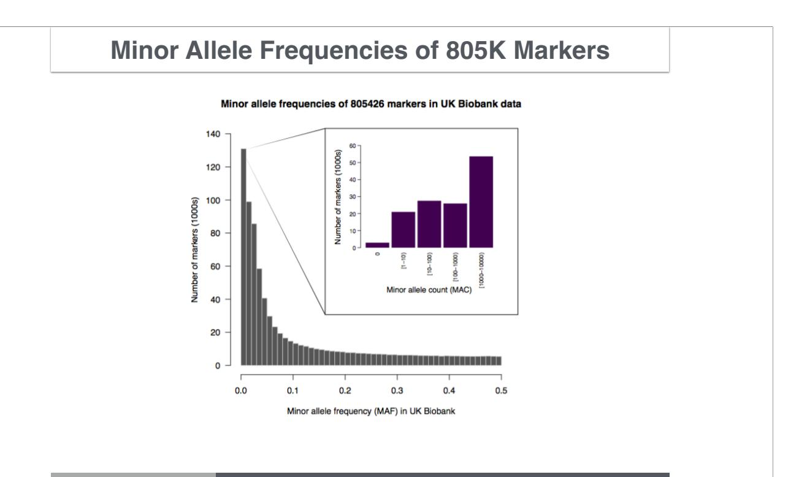{width=85%}

::: {.notes}
Here is the distribution of minor allele frequencies in the UKB.

About 130K markers had allele frequencies below 1%. Half of rare variants were found in at least 1000 individuals. 20K were present in fewer than 10 participants (given rarity, there probably weren't two copies of these rare alleles in one individual).
:::

## QC: Success/Failure Rates by MAF

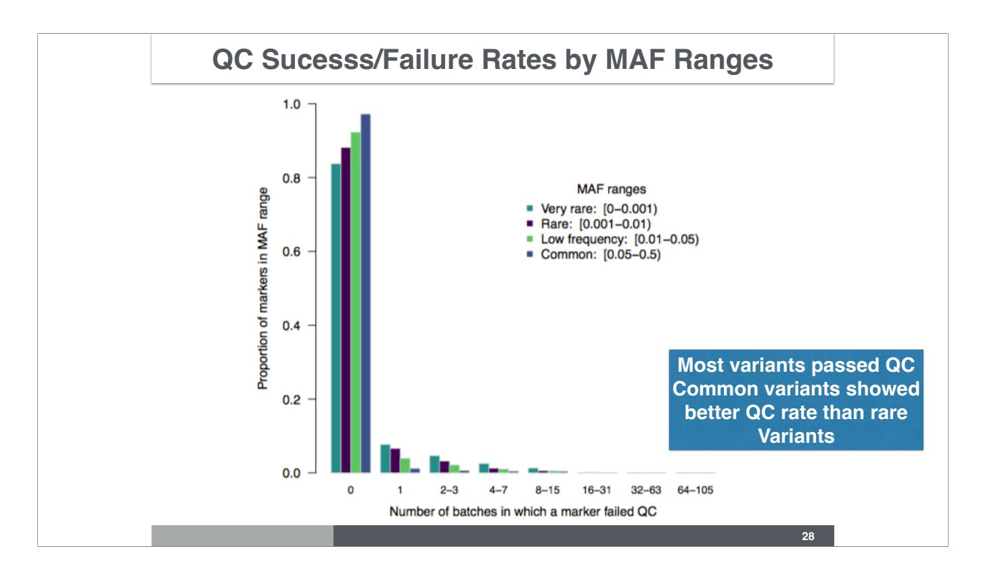{width=85%}

::: {.notes}
Most common variants — more than 95% (blue, rightmost bar) — passed QC in all batches. Quality was overall pretty good even for low frequency variants: over 80% of the very rare variants passed QC in all batches (leftmost bar above 0).
:::

## Missing Rates for Markers

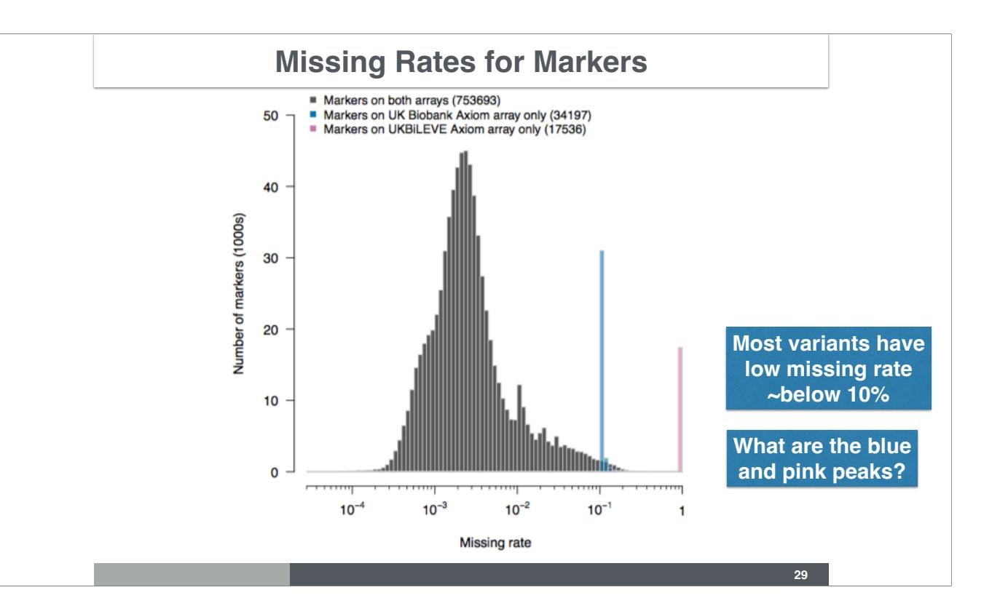{width=85%}

::: {.notes}
Missing rates were low, with most of the mass under 0.01.

Pink bar corresponds to markers exclusively present in the old array (UKBiLEVE), meaning ~90% of people did not have a value for those. Blue corresponds to markers only available in the new array, so ~10% of participants lacked those genotypes. This explains the two peaks at ~0.1 and ~0.9.
:::

## Comparison of Allele Frequency with ExAC

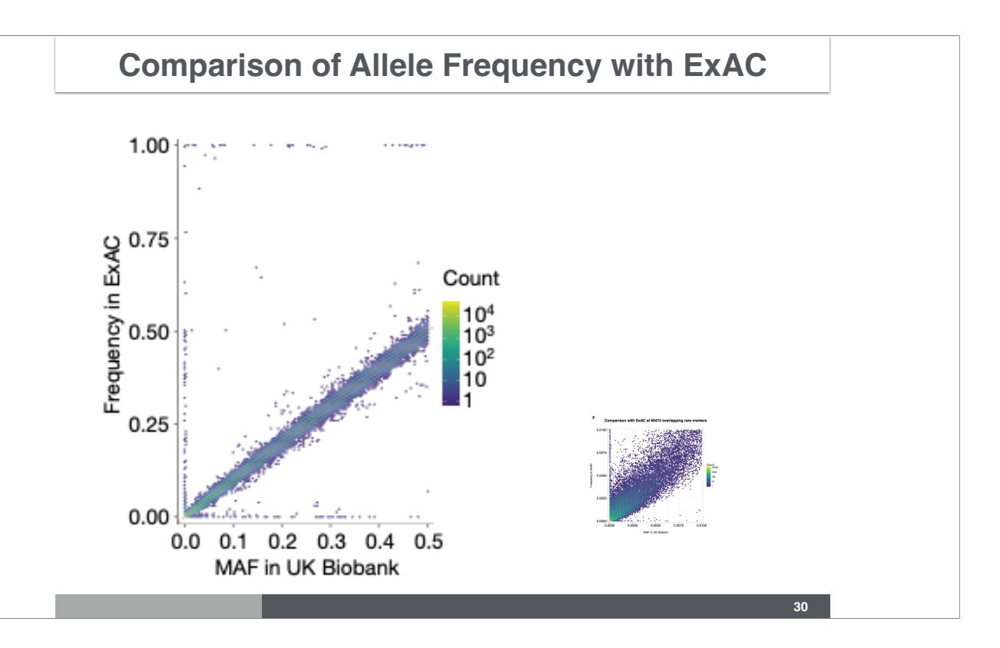{width=85%}

::: {.notes}
Allele frequencies of all UKB variants were compared to population frequencies available from the ExAC consortium. The markers lie near the identity line, providing reassurance that the genotyping was reliable.

- Some variants are high frequency in ExAC but not found in UKB
- Very few the other way around (high frequency in UKB but not observed in ExAC)
:::

## ExAC Aggregation Consortium → gnomAD

{width=60%}

<https://gnomad.broadinstitute.org/>

::: {.notes}
The ExAC database, now renamed gnomAD, is a huge publicly available resource summarizing a very large number of whole-exome and whole-genome sequenced samples. This resource is critical to evaluate the pathogenicity of rare variants.

If a variant appears in relatively high numbers in gnomAD, we can safely assume that reasonably healthy life is possible with the mutation. When first released, many variants previously catalogued as highly pathogenic ended up being reclassified as variants of uncertain significance (VUS).
:::

## gnomAD Browser

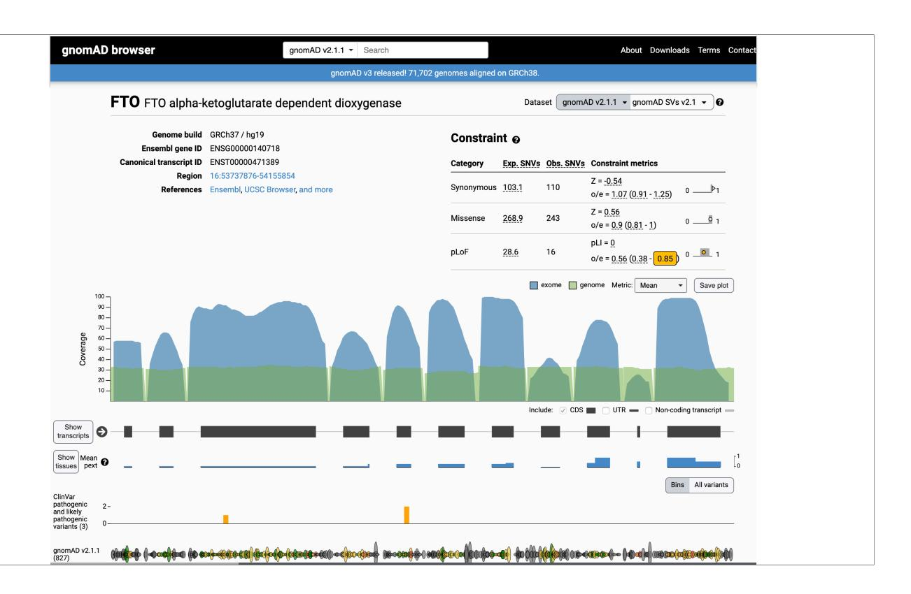{width=85%}

::: {.notes}
A snapshot of the gnomAD webpage search for the FTO gene. The browser shows constraint metrics (Z scores for synonymous, missense, and pLoF variants) and coverage tracks across the gene body.
:::

## Intensity Plots for Genotype Calling

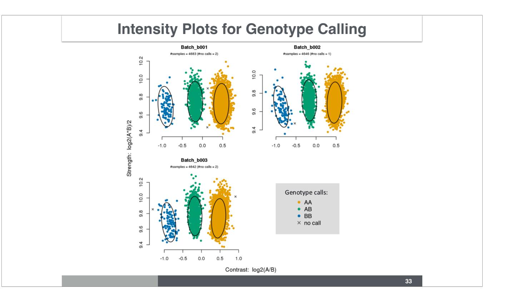{width=85%}

::: {.notes}
Here are examples of the intensity plots used for genotype calling. By plotting the signal strength vs. the contrast of the intensities (log ratio of A and B alleles), we can visualize distinct clusters corresponding to the three genotypes (AA, AB, BB) and no-calls (×). These clusters are used for genotype calling.
:::

## Sex Mismatches and Chromosome Aneuploidy

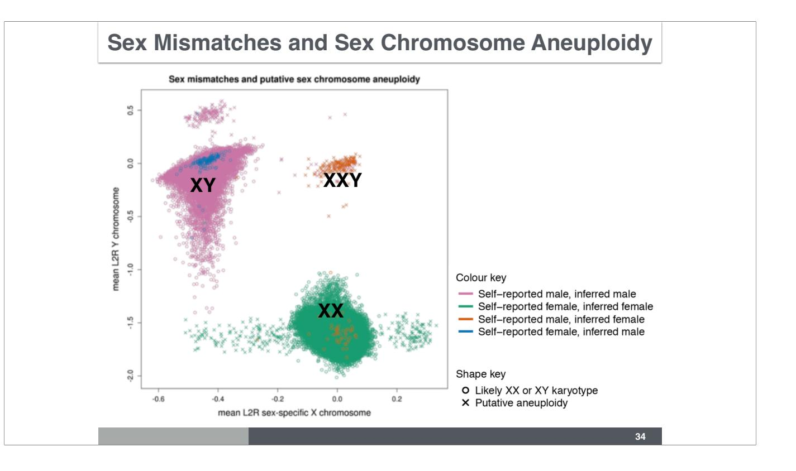{width=85%}

::: {.notes}
Average log intensities (normalized) of Y chromosome and X chromosome markers can help infer the sex of participants. The green cluster has "deficient" Y chromosome markers whereas the pink cluster shows X chromosome marker deficiency. XXY is centered at 0 due to the choice of normalization.

"L2R are computed (by Affymetrix) for each sample at each marker, and is the sum of the A and B allele intensities for the marker, normalized by the median intensity of that marker in individuals assumed to represent the normal copy number state at that site."
:::

## Sex-Specific Intensities in Smaller Sample

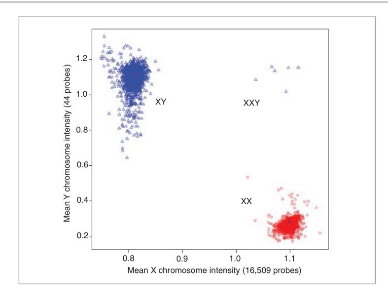

*Turner, S., Armstrong, L. L., et al. (2011). Quality control procedures for genome-wide association studies. Current Protocols in Human Genetics.*

::: {.notes}
Much fewer cases of aneuploidy (missing or extra chromosomes) are seen in smaller samples. The XY males cluster (blue triangles) separate clearly from XX females (pink circles), with XXY karyotype individuals in the intermediate region.
:::

## Missing Rates for Samples

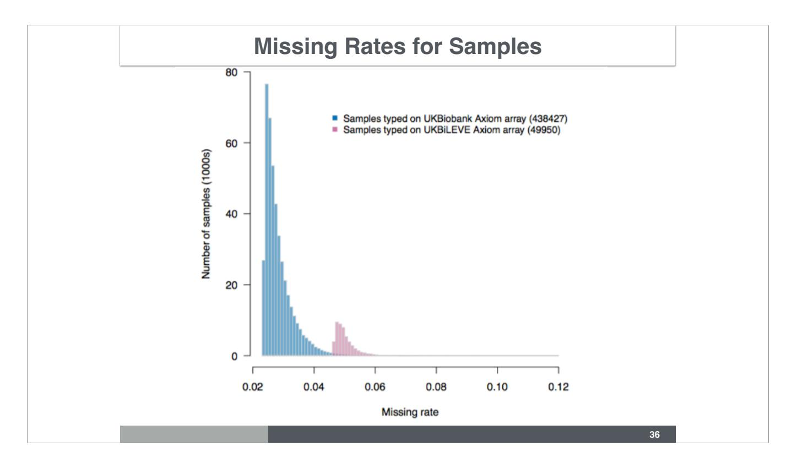{width=85%}

::: {.notes}
Missing rates are different for the first 50K individuals and the remaining 438K, driven by the difference in array. The first 50K were genotyped with the UKBiLEVE Axiom Array (higher missing rates, pink), whereas the remaining 438K individuals were genotyped with the UK Biobank Axiom Array (lower missing rates, blue).
:::

## QC: Array Effect

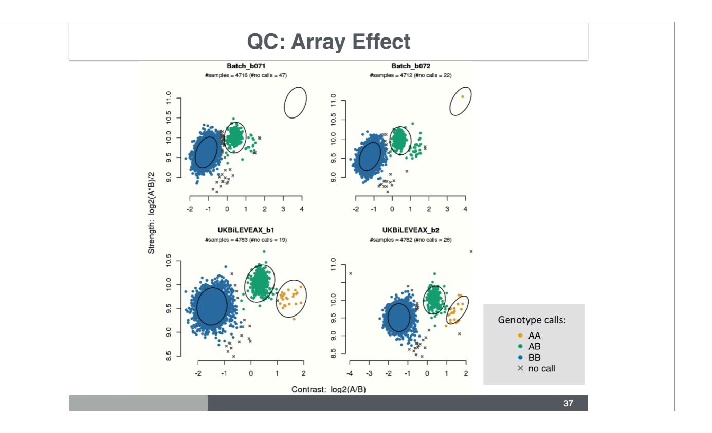{width=85%}

::: {.notes}
Comparison of genotype cluster plots across two arrays (UKBiLEVE and UKBiobank Axiom Arrays). This marker has an outlier for a UKBiLEVE batch that is not present in the newer array — the orange cluster in the UKBiLEVE batch is shifted relative to the UKBiobank batches. Such markers fail the array effect QC step.
:::

## QC: Batch Effect (109 batches)

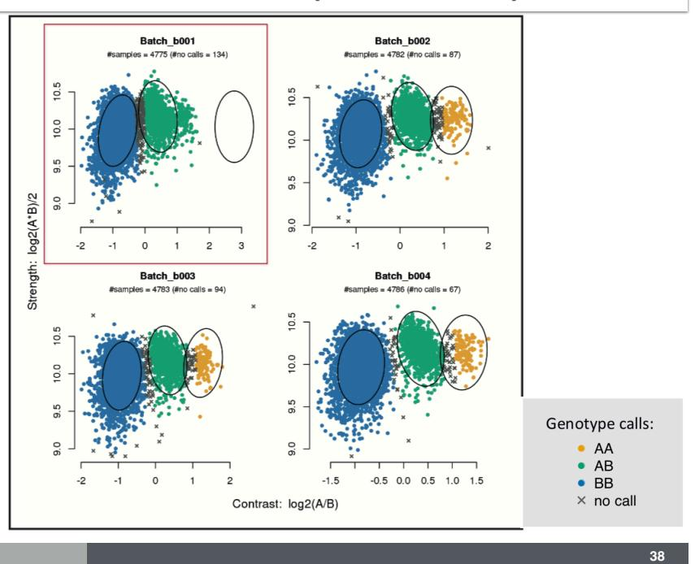

::: {.notes}
Batch b001 (red box) shows a clear outlier cluster — a genotype cluster that is not present in batches b002, b003, b004. This marker fails the batch effect QC step because the genotype calls are inconsistent across batches, likely due to chip or reagent variability.
:::

## QC: Sex Effect

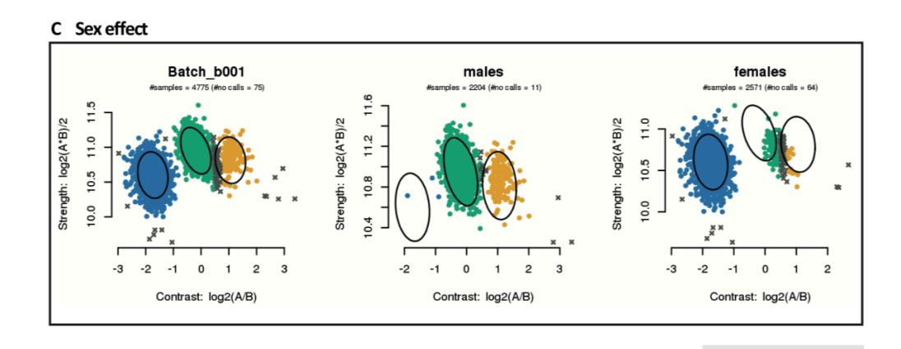

::: {.notes}
Data points cluster by sex (males vs. females) rather than by genotype (AA, AB, BB). This indicates that the marker is on a sex chromosome and genotype calling does not account for sex — the clusters are unreliable. Such markers are excluded.
:::

## Hardy-Weinberg Equilibrium

**Under random mating, variant alleles from father & mother are independent.**

Given MAF $p$, expected genotype frequencies:

$$aa: p^2 \qquad aA: 2p(1-p) \qquad AA: (1-p)^2$$

Significant departure from HWE → possible genotyping error

::: {.notes}
Example of a marker that does not pass the HWE test: the observed heterozygote frequency (AB) is much higher or lower than expected under random mating. This can indicate a genotyping problem (e.g., heterozygote excess due to poor cluster separation).
:::

## QC: Plate Effect

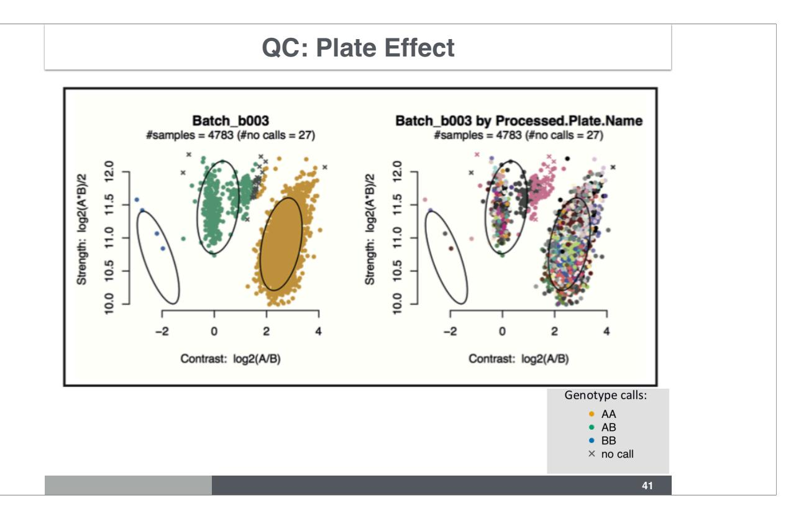{width=85%}

::: {.notes}
Right figure shows plates with different colors. The pink plate data clusters on its own, separate from other plates, messing up the genotype calling. Participants' DNA on the same plate can show systematic differences if there were reagent batch effects or handling differences during sample preparation.
:::

## UK Biobank vs. GIANT: Height GWAS

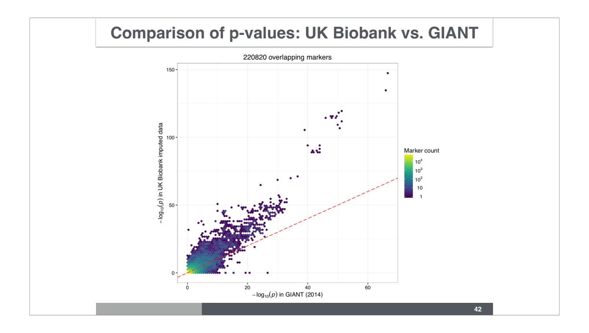{width=85%}

::: {.notes}
GWAS results for height in UKB are compared to an independent GWAS of height from the GIANT consortium. UKB p-values are more significant than GIANT's p-values due to the larger sample size in UKB as well as less heterogeneity (UKB is primarily White British, while GIANT is a meta-analysis of many diverse cohorts).
:::

## References

- Sud, A., Kinnersley, B. & Houlston, R. Genome-wide association studies of cancer: current insights and future perspectives. *Nat Rev Cancer* 17, 692–704 (2017). <https://doi.org/10.1038/nrc.2017.82>
- UK Biobank Imputed Genotype Data Release
- Bycroft, C., Freeman, C., Petkova, D., et al. (2018). The UK Biobank resource with deep phenotyping and genomic data. *Nature*, 562(7726). <http://doi.org/10.1038/s41586-018-0579-z>
- S. Turner et al. (2011). Quality control procedures for genome-wide association studies. *Current Protocols in Human Genetics.*
- Anderson et al. (2010). Data quality control in genetic case-control association studies. <https://www.ncbi.nlm.nih.gov/pmc/articles/PMC3025522/>
