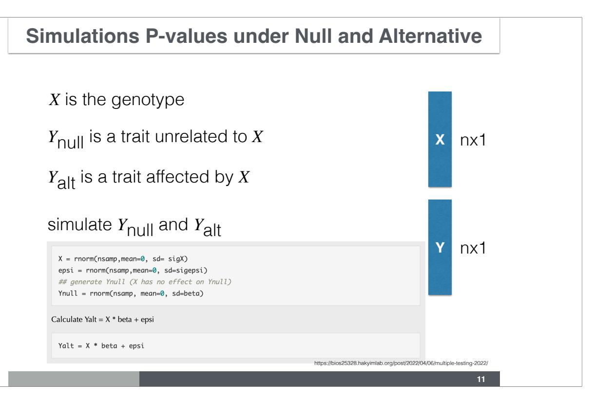

# Lecture 4 Multiple Testing Correction

Hae Kyung Im, PhD


April 2, 2025

Today we will define what multiple testing burden is and how we to address the problem

### **The Perils of Multiple Testing**


Let's look at this cartoon case study, which happens more often than expected.

### **The Perils of Multiple Testing**


What happened?

Is the conclusion sensible?

https://xkcd.com/882/

**3**

What happened? Is the conclusion sensible?

### **What is the probability of not rejecting null when we should?**

- what is the probability of not rejecting the null at 0.05 significance level when
  - testing once?
  - 1 0.05 = 0.95
  - testing twice?
  - (1 0.05)^2 = 0.95^2 = 0.9025
  - 100 times?
  - (1 0.05)^100 = 0.95^100 = 0.0059

homework: plot the probability of not rejecting the null when we test m number of times as a function of m

### **Bonferroni Correction**

**Bonferroni significance level = 0.05 / # of tests**

**5**

When in doubt, take 0.05 divide by the number of tests and use this more stringent cutoff for the significance level. Do you anticipate any problems with this approach?

### **Bonferroni Correction**

## **Bonferroni significance level = 0.05 / # of tests**

**Q**: what could be the downside of using this stringent threshold of significance?

**6**

When in doubt, take 0.05 divide by the number of tests and use this more stringent cutoff for the significance level. Do you anticipate any problems with this approach?

### **Genome-Wide Significance Level**

$$5 \times 10^{-8}$$

**Q**: if this were a Bonferroni threshold, how many tests are we correcting for?

**Q**: Is the number of tests = number of SNPs tests in a GWAS?


Others?

**Q:** Can you rule out some of these distributions based on the definition of p-value ?

# Simulations of p values

To develop an intuition of how p-values behave under the null and alternatives, we will run some simulations.

### **Simulations P-values under Null and Alternative**

*X* is the genotype

*Y*null is a trait unrelated to *X*

$$Y_{\mathsf{null}} = X \cdot 0 + \epsilon'$$

*Y*alt is a trait affected by *X*

$$Y_{\text{alt}} = X \cdot \beta + \epsilon$$

### some preliminary definitions

https://bios25328.hakyimlab.org/post/2022/04/06/multiple-testing-2022/

**10**

## let's start with some parameter definitions nsamp = 100 beta = 2 h2 = 0.1 sig2X = h2 sig2epsi = (1 - sig2X) \* beta^2 sigX = sqrt(sig2X)

sigepsi = sqrt(sig2epsi)



### **Plot Y vs. X Under the Alternative**


https://bios25328.hakyimlab.org/post/2022/04/06/multiple-testing-2022/

### **Plot Y vs. X Under the Null**


https://bios25328.hakyimlab.org/post/2022/04/06/multiple-testing-2022/

### **Regress Y on X under the Null**

```
14
                             https://bios25328.hakyimlab.org/post/2022/04/06/multiple-testing-2022/
this will fit Ynull = a + X ⋅ β + ϵ
```

TODO: go over the output of summary(lm())

### **Regress Y on X under the Alternative**

```
15
                             https://bios25328.hakyimlab.org/post/2022/04/06/multiple-testing-2022/
this will fit Yalt = a + X ⋅ β + ϵ
```

# Now we know how to generate a p-value under the null and a p-value under the alternative

**How do we generate the distribution of p-values under the null and under the alternative?**

# Now we know how to generate a p-value under the null and a p-value under the alternative

**How do we generate the distribution of p-values under the null and under the alternative?**

Repeat the procedure 10,000 times, save the values, plot the histogram

### Calculate the empirical distribution of p-values


### **Calc p values by regressing Y on X 10,000 times**

### **Simulated Null Distribution of P-values**


### **Simulated Null Distribution of P-values**


### **Simulated Null Distribution of P-values**

| 22 |  |
|----|--|

### **Bonferroni Correction**

### **Simulate a Mix of Null and Alternative Cases**

# 6 Mix of Ynull and Yalt Let's see what happens when we add a bunch of true associations in the matrix of null associations prop\_alt=0.20 ## define proportion of alternative Ys in the mixture selectvec = rbinom(nsim,1,prop\_alt) names(selectvec) = colnames(Ymat\_alt) selectvec[1:10] ## c1 c2 c3 c4 c5 c6 c7 c8 c9 c10 ## 0 1 0 0 0 1 0 0 0 1 Ymat\_mix = sweep(Ymat\_alt,2,selectvec,FUN='\*') + sweep(Ymat\_null,2,1-selectvec,FUN='\*') Run linear regression for all 10,000 phenotypes in the mix of true and false associations, Ymat\_mix pvec\_mix = rep(NA,nsim) bvec\_mix = rep(NA,nsim)

for(ss in 1:nsim)

pvec\_mix[ss] = fit\$pval
bvec\_mix[ss] = fit\$betahat

fit = fastlm(Xmat[,ss], Ymat\_mix[,ss])

24

Ymat\_mix

nsamp\*nsim

### **Histogram of P-values under Mix of Null and Alternative**


### **Calculating False Discovery Rate**

### Under the null, we were expecting 500 significant columns by chance but got 2236

Q: how can we estimate the proportion of true positives?

We got 1736 extra columns, so it's reasonable to expect that the extra significant results come from the alternative distribution (Yalt). So

# $\frac{observed\ number\ of\ significant-expected\ number\ of\ significant}{observed\ number\ of\ significant}$

should be a good estimate of the true discovery rate. False discovery rate is defined as 1 - the true discovery rate

```
thres = 0.05
FDR = sum((pvec_mix<thres & selectvec==0)) / sum(pvec_mix<thres)
## proportion of null columns that are significant among all significant
FDR</pre>
```

## [1] 0.1838104

### **Homework Problems**

| <ul> <li>what's the proportion of false discoveries if we use a significance level of 0.01</li> <li>what's the proportion of false discoveries if we use Bonferroni correction as the significance level?</li> </ul> |
|----------------------------------------------------------------------------------------------------------------------------------------------------------------------------------------------------------------------|
| • What's the proportion of missed signals, proportion of true associations that have p-values greater than the Bonferroni threshold?                                                                                 |
|                                                                                                                                                                                                                      |

### **Common Approaches to Correct for Multiple Testing**

|           | <b>Called Significant</b> | Called not significant | Total |
|-----------|---------------------------|------------------------|-------|
| Null true | F                         | $m_0-F$                | $m_0$ |
| Alt true  | T                         | $m_1-T$                | $m_1$ |
| Total     | S                         | m-S                    | m     |

### **Bonferroni correction**

FWER Family-Wise Error Rate *P*(*F* ≥ 1) < *α*

achieved by requiring *p* < *α* # tests

### **Common Approaches to Correct for Multiple Testing**

|           | Called Significant | Called not significant | Total |
|-----------|--------------------|------------------------|-------|
| Null true | F                  | $m_0-F$                | $m_0$ |
| Alt true  | T                  | $m_1-T$                | $m_1$ |
| Total     | S                  | m-S                    | m     |

### **FDR (False Discovery Rate)**

$$FDR = E\left(\frac{F}{S}\right)$$

**qvalue**: minimum FDR attainable when a feature is called significant

### **Calculate Table for Our Mixed Simulation**

| Null true | 411  | Called not significant 7545 |
|-----------|------|-----------------------------|
| Alt true  | 1825 | 219                         |

### **Use qvalue package to calculate qvalue**

### **Qvalues Are Small When Alternative is True**


### **Pi0 and Pi1=1-Pi0 Statistics**

**34** pi0 when all under null pi0 when 80% under null

### **References**

- Storey, John D., and Robert Tibshirani. 2003. "Statistical Significance for Genomewide Studies." Proceedings of the National Academy of Sciences 100 (16): 9440–45.