## Last Time: GWAS & QC

**GWAS in the UK Biobank** — and why quality control matters before any analysis.

Key QC checks to always perform:

- **Batch effects** — systematic differences when samples are genotyped on different platforms, chips, or at different centers
- **Missingness**
  - SNPs with too many missing calls across individuals
  - Individuals with too many missing SNPs
- **Sex mismatch** — does inferred genetic sex match reported sex?
- **Minor allele frequencies** — compare observed MAFs to expected values from a reference panel (e.g., gnomAD)

::: {.callout-note}
We went through the UKB QC examples quickly last time — refer back to the L3 slides for the full details.
:::

# The Perils of Multiple Testing

## The Perils of Multiple Testing

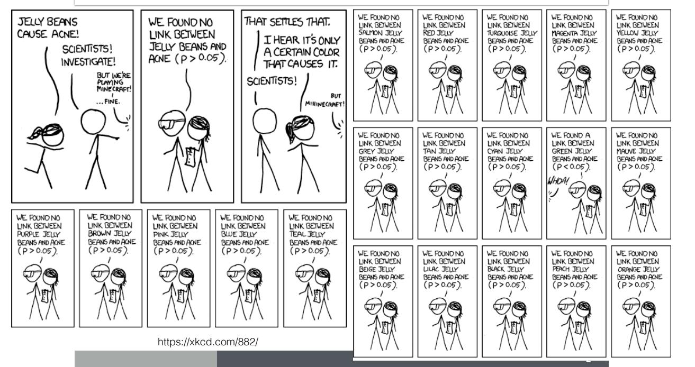

::: {.notes}
Let's look at this cartoon case study, which happens more often than expected. When you test many hypotheses, some will appear significant purely by chance.
:::

## The Perils of Multiple Testing

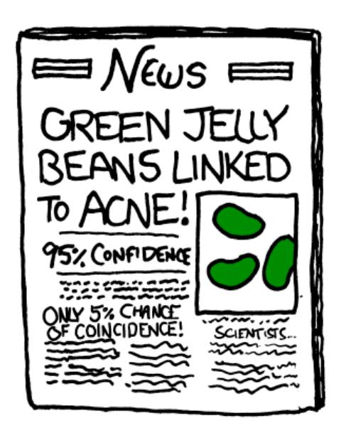

**What happened? Is the conclusion sensible?**

<https://xkcd.com/882/>

::: {.notes}
The xkcd comic illustrates the problem perfectly. When you test 20 colors of jelly beans for a link to acne at a 0.05 significance level, you expect 1 false positive just by chance. "Green jelly beans linked to acne" — not because of any real effect, but because of multiple testing.
:::

## Probability of False Positives Accumulates Fast

**What is the probability of not rejecting the null (staying safe from false positives) when testing at α = 0.05?**

| Number of tests | P(no false positive) |
|-----------------|----------------------|
| 1 | (1 − 0.05)^1 = 0.95 |
| 2 | (1 − 0.05)^2 = 0.90 |
| 100 | (1 − 0.05)^100 = 0.0059 |

> **Homework:** Plot P(no false positive) as a function of the number of tests m.

:::{.takehome }
How do we solve this problem?
:::

::: {.notes}
With just 100 independent tests at α = 0.05, the probability that you will make at least one false positive is 1 − 0.0059 = 99.4%. Multiple testing rapidly destroys the meaning of a nominal significance level.
:::

# Bonferroni Correction

## Bonferroni Correction

$$\alpha_{\text{Bonferroni}} = \frac{0.05}{\text{number of tests}}$$

When in doubt: divide 0.05 by the number of tests and use this more stringent cutoff.

. . .

**Q: What could be the downside of using this very stringent threshold?**

. . .

::: {.notes}
Bonferroni is simple and conservative. The downside: if many of the null hypotheses are actually false (i.e., many true signals exist), Bonferroni will miss them — it sacrifices power to control false positives very tightly.
:::

## Genome-Wide Significance Level

$$5 \times 10^{-8}$$

**Q:** If this were a Bonferroni threshold, how many tests are we correcting for?

**Q:** Is the number of tests = the number of SNPs tested in a GWAS?

::: {.notes}
5 × 10⁻⁸ corresponds to Bonferroni correction for ~1 million independent tests (0.05 / 1,000,000 = 5 × 10⁻⁸). However, the actual number of SNPs tested is typically much larger (e.g., 5–10 million). The key insight is that SNPs are correlated due to linkage disequilibrium, so the *effective* number of independent tests is around 1 million, not the raw SNP count.
:::

## What Does the P-value Distribution Look Like under the Null?

:::: {.columns}
::: {.column width="50%"}
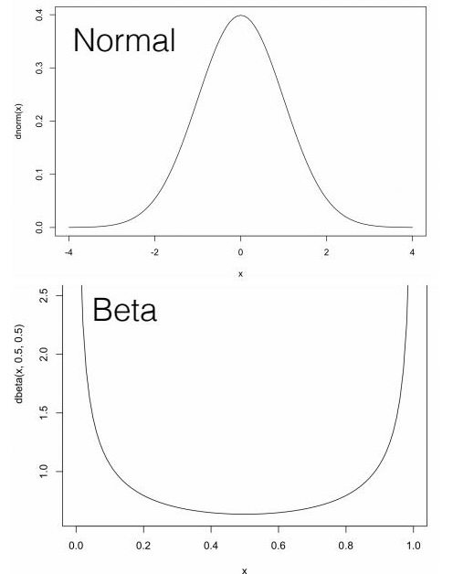{width=90% height=300px}
:::
::: {.column width="50%"}
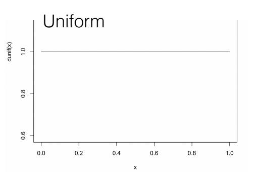{width=90% height=300px}
:::
::::

**Q:** Can you rule out some of these distributions based on the definition of a p-value?

::: {.notes}
Under the null hypothesis, p-values are uniformly distributed between 0 and 1. So a histogram that is flat is consistent with the null. A distribution that is enriched near 0 suggests true signals are present. A distribution enriched near 1 would be unusual and could indicate issues such as opposite-direction effects being tested, or model misspecification.
:::

# Simulations of P-values

## Simulations: Setup

To develop intuition for how p-values behave under the null and alternatives, we run simulations.

$$Y_{\text{null}} = X \cdot 0 + \epsilon' \quad \text{(no true effect)}$$

$$Y_{\text{alt}} = X \cdot \beta + \epsilon \quad \text{(true genetic effect)}$$

. . .

```r
nsamp  = 100               # sample size
beta   = 2                 # effect size
h2     = 0.1               # heritability (proportion of variance explained by X)
sig2X  = h2
sig2epsi = (1 - sig2X) * beta^2
sigX   = sqrt(sig2X)
sigepsi = sqrt(sig2epsi)
```

<https://bios25328.hakyimlab.org/post/2022/04/06/multiple-testing-2022/>

::: {.notes}
We define two scenarios: Ynull where X has zero effect on Y, and Yalt where X affects Y with effect size β. We set heritability h² = 0.1 so that 10% of the variance in Y is explained by X.

X is the genotype (simulated from a normal distribution with sd = sigX).
Ynull is generated with no effect: Ynull = rnorm(nsamp, mean=0, sd=sigepsi)
Yalt is generated with a true effect: Yalt = X * beta + rnorm(nsamp, mean=0, sd=sigepsi)
:::

## Plot Y vs. X Under the Alternative

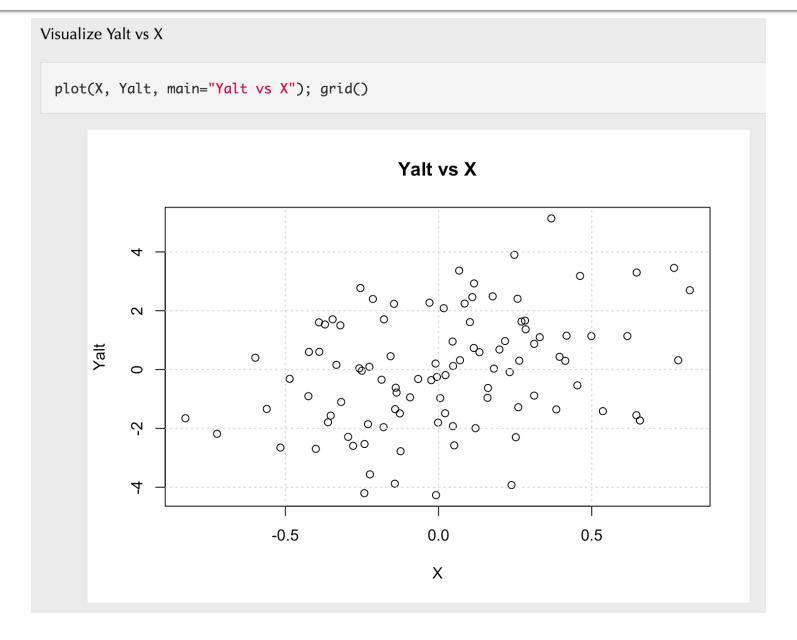

<https://bios25328.hakyimlab.org/post/2022/04/06/multiple-testing-2022/>

::: {.notes}
Under the alternative hypothesis, we can see a clear positive trend — as X (genotype dosage) increases, Y increases on average. The slope is the estimated effect size β.
:::

## Plot Y vs. X Under the Null

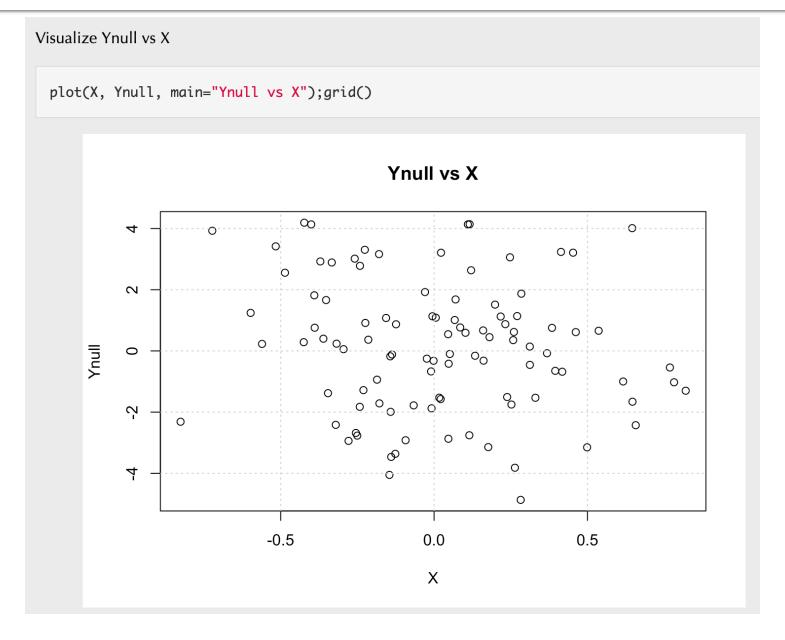

<https://bios25328.hakyimlab.org/post/2022/04/06/multiple-testing-2022/>

::: {.notes}
Under the null hypothesis, there is no trend — the regression line is essentially flat, and any apparent slope is noise. Running a regression here should yield a p-value that is not particularly small.
:::

## Getting a P-value from Linear Regression

Run `lm()` and extract the p-value from the `summary()` output:

```r
fit <- lm(Y ~ X)
pval <- summary(fit)$coefficients["X", "Pr(>|t|)"]
```

. . .

`summary(fit)$coefficients` is a matrix with one row per term:

| | Estimate | Std. Error | t value | Pr(>&#124;t&#124;) |
|---|---|---|---|---|
| (Intercept) | … | … | … | … |
| X | … | … | … | **← p-value** |

::: {.notes}
Once we have simulated X and Y, we fit a simple linear regression of Y on X. The p-value for the slope coefficient tests whether X has a significant effect on Y. We extract it from the coefficients matrix returned by summary(lm()). This is the core operation we will repeat thousands of times to build the empirical p-value distribution.
:::

## Empirical Distribution of P-values

Repeat the regression 10,000 times, save the p-values, plot the histogram.

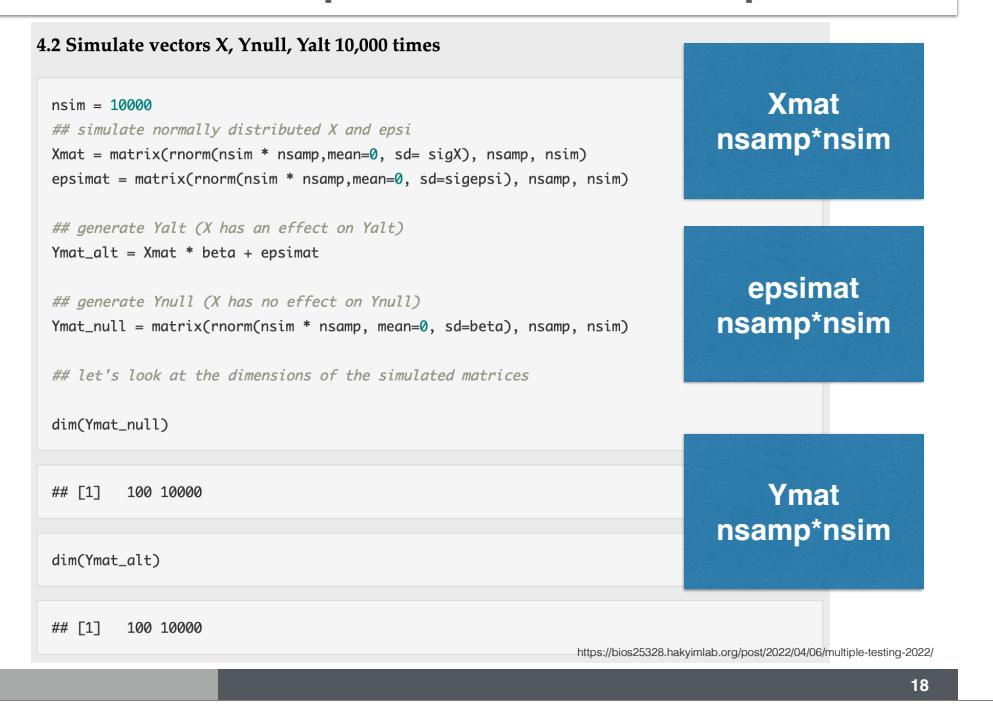

<https://bios25328.hakyimlab.org/post/2022/04/06/multiple-testing-2022/>

::: {.notes}
By repeating the procedure thousands of times, we can empirically estimate the distribution of p-values under the null and alternative. This makes abstract statistical theory concrete.
:::

## Simulated Null Distribution of P-values

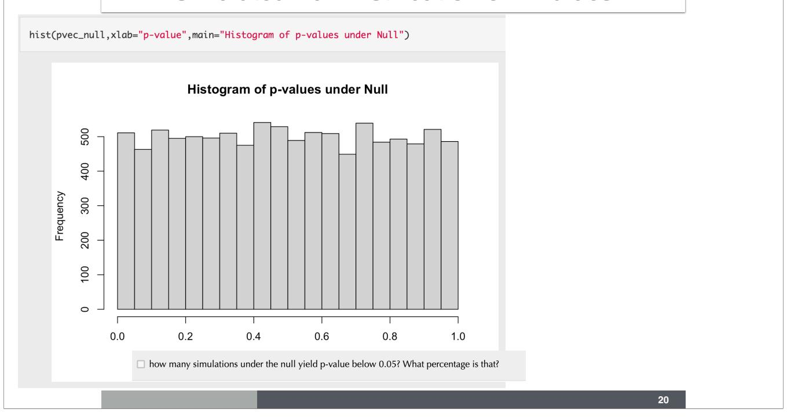

::: {.notes}
The distribution of p-values under the null is approximately uniform — exactly as the theoretical definition of a p-value predicts. Each bin of the histogram contains roughly the same number of p-values.
:::

## Simulated Null Distribution of P-values (zoom)

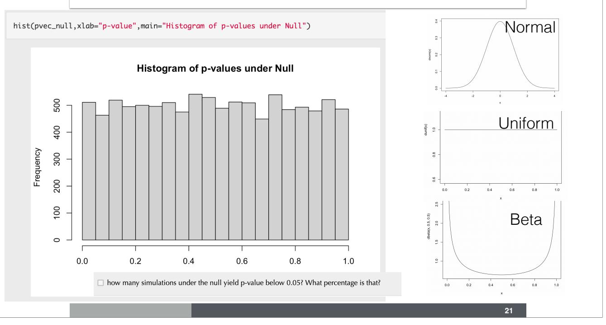

::: {.notes}
Zooming in on the null p-value distribution confirms the uniform shape. The horizontal line shows the expected frequency per bin (1/number of bins). Deviations from this flat line are random variation due to the finite number of simulations.
:::

# Mixing Null and Alternative

## Histogram of P-values: Mix of Null and Alternative

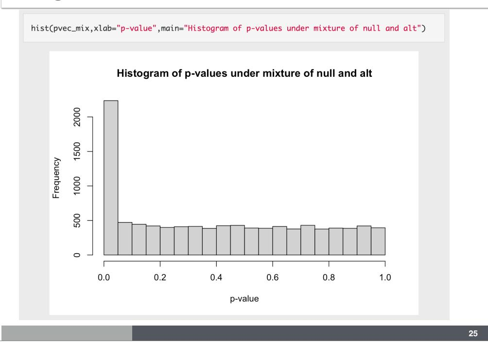

::: {.notes}
When we mix 80% null and 20% alternative phenotypes, the histogram is no longer flat. There is a large spike near 0 — these are the true discoveries. The rest of the distribution (away from 0) stays roughly uniform, as expected under the null.
:::

## What Does the Mix Tell Us?

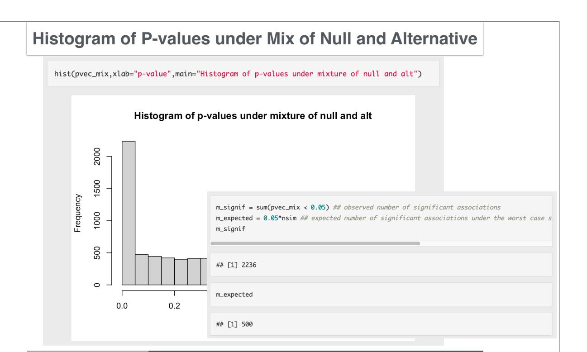

::: {.notes}
Under the null alone, with 10,000 tests at α = 0.05, we expect 500 significant results by chance. When we observe 2,236 significant results, the extra ~1,736 likely come from the alternative distribution. This motivates a data-driven estimate of the false discovery rate.
:::

# Approaches to Correct for Multiple Testing

## Two Frameworks

|           | Called Significant | Called not significant | Total  |
|-----------|--------------------|------------------------|--------|
| Null true | F                  | $m_0 - F$              | $m_0$  |
| Alt true  | T                  | $m_1 - T$              | $m_1$  |
| Total     | S                  | $m - S$                | $m$    |

:::: {.columns}
::: {.column width="50%"}
**Bonferroni correction**

Controls **Family-Wise Error Rate (FWER)**:

$$P(F \geq 1) < \alpha$$

Achieved by requiring $p < \alpha / \text{# tests}$
:::
::: {.column width="50%"}
**False Discovery Rate (FDR)**

$$\text{FDR} = E\left(\frac{F}{S}\right)$$

**q-value**: minimum FDR attainable when a feature is called significant
:::
::::

::: {.notes}
Bonferroni controls the probability of making *any* false positive — very strict. FDR controls the *proportion* of false positives among all significant results. FDR is more lenient and better powered when many true signals exist, which is common in GWAS.
:::

## Calculating FDR

**Under the null, we expected 500 significant results by chance but got 2,236.**

$$\widehat{\text{TDR}} = \frac{\text{observed significant} - \text{expected under null}}{\text{observed significant}} = \frac{2236 - 500}{2236} \approx 0.78$$

$$\widehat{\text{FDR}} = 1 - \widehat{\text{TDR}} \approx 0.18$$

::: {.notes}
The False Discovery Rate is the proportion of significant results that are actually null. Here, about 18% of the 2,236 significant tests are expected to be false positives. In practice, we use the Storey & Tibshirani (2003) q-value framework to estimate this more precisely.
:::

## Simulation Results Table

| | Called Significant | Called not significant |
|---|---|---|
| Null true | 411 | 7545 |
| Alt true | 1825 | 219 |

**Q:** What are the false positive rate and power in this simulation?

::: {.notes}
411 false positives out of 7,956 null hypotheses gives a false positive rate of ~5%. 1,825 true positives out of 2,044 alternative hypotheses gives power of ~89%.

The observed FDR = 411 / (411 + 1825) = 411 / 2236 ≈ 18%, consistent with our estimate.
:::

## Homework Problems

- What is the proportion of false discoveries if we use a significance level of 0.01?
- What is the proportion of false discoveries if we use Bonferroni correction as the significance level?
- What is the proportion of missed signals (proportion of true associations with p-values greater than the Bonferroni threshold)?

::: {.notes}
These homework problems build intuition about the trade-off between false positives (false discovery rate) and false negatives (missed signals, i.e., 1 − power) as the significance threshold becomes more or less stringent.
:::

## Q-values Are Small When the Alternative is True

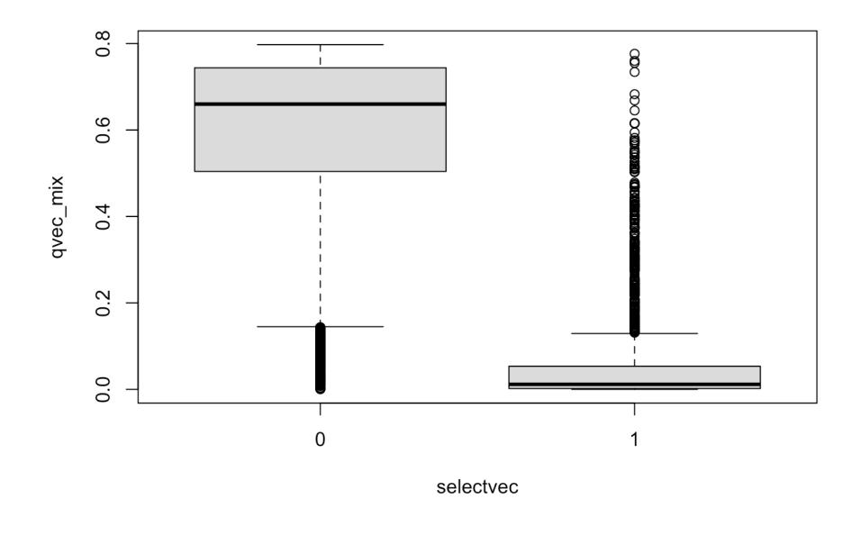

::: {.notes}
The q-value is the minimum FDR you accept when calling a feature significant. Associations with small q-values (near 0) are likely true positives. Associations with large q-values (near 1) are likely null. The q-value package (Storey & Tibshirani 2003) estimates the proportion of null hypotheses π₀ from the data and uses it to calibrate FDR estimates.
:::

## π₀ and π₁ = 1 − π₀

- **π₀**: estimated proportion of features under the null
- **π₁ = 1 − π₀**: estimated proportion of features under the alternative

When all tests are null: $\pi_0 \approx 1$

When 80% are null: $\pi_0 \approx 0.8$

::: {.notes}
π₀ is estimated from the right tail of the p-value distribution, where we expect only null p-values. A high π₀ means most hypotheses are null; a lower π₀ means many true signals are present. This estimate feeds directly into the FDR calculation.
:::

## Summary

| Method | Controls | Stringency | Best for |
|--------|----------|------------|----------|
| Bonferroni | FWER: P(any false positive) | Very strict | Few tests, high cost of any error |
| FDR / q-value | E(false positives / significant) | Moderate | Many tests, many true signals |

**GWAS significance threshold: 5 × 10⁻⁸ (Bonferroni for ~1M independent tests)**

::: {.notes}
The choice between Bonferroni and FDR depends on context. In GWAS, the 5 × 10⁻⁸ threshold is a community convention based on Bonferroni. In downstream analyses (e.g., eQTL studies, pathway enrichment), FDR-based thresholds are more common because many true signals are expected.
:::

## References

- Storey, J. D., and Tibshirani, R. (2003). Statistical significance for genomewide studies. *PNAS* 100(16): 9440–45.
- Benjamini, Y., and Hochberg, Y. (1995). Controlling the false discovery rate: a practical and powerful approach to multiple testing. *JRSS-B* 57(1): 289–300.
- Risch, N., and Merikangas, K. (1996). The future of genetic studies of complex human diseases. *Science* 273(5281): 1516–17.
