## Last week's recap

We covered the multiple testing problem

- Running multiple tests can lead to too many false positives 
- Two methods for addressing the problem
  - Bonferroni, conservative, maybe too conservative
  - False Discovery Rate (FDR), preferable when expecting many true signals, such as in GWAS analyses


## Learning Objectives

1. Understand how the **genotype matrix** encodes population history
2. Recognize how **population structure** can bias GWAS results
3. Learn how **PCA / SVD** decomposes the genotype matrix to reveal ancestry
4. Apply **principal components as covariates** to correct for stratification
5. Review **matrix algebra** foundations underlying regression and PCA


## Genotype Matrix: A Treasure Trove

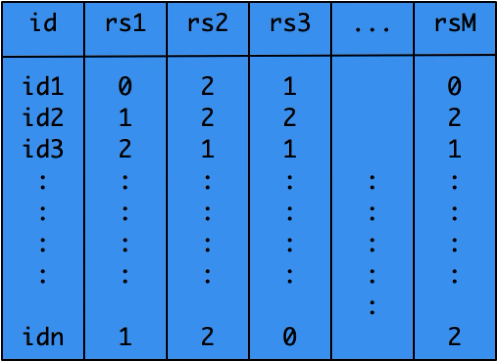{fig-alt="Genotype matrix: rows are individuals (id1…idn), columns are SNPs (rs1…rsM), entries are 0/1/2 copies of the minor allele."}

Entries: 0 / 1 / 2 = copies of minor allele (n individuals × M SNPs)

::: {.notes}
The genotype matrix harbors an amazing wealth of information that can be uncovered with various statistical techniques.
:::

## Principal Components Reveal Demographic History

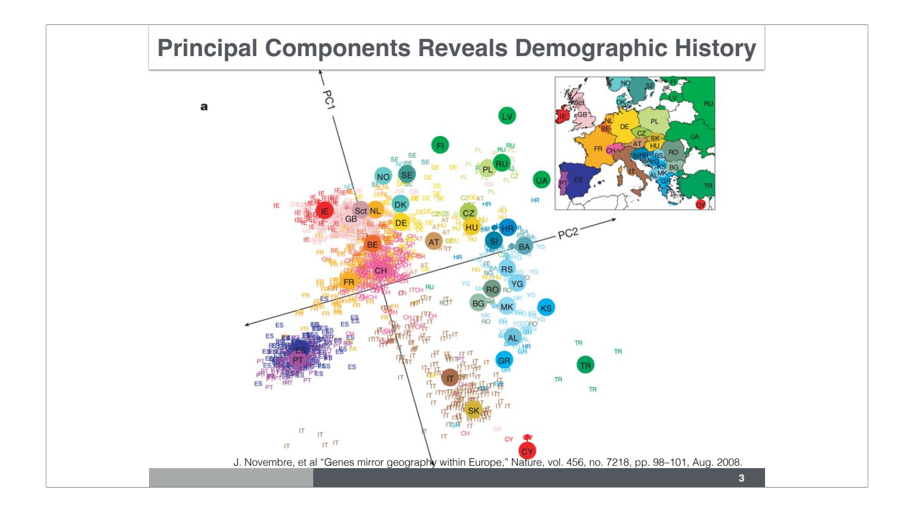{fig-alt="Novembre et al. 2008 PC plot of ~1500 Europeans. PC1 vs PC2 reproduces the map of Europe, with individuals colored by country of origin."}

*Novembre et al., Nature 456, 98–101 (2008)*

::: {.notes}
This is probably one of the most referenced figures in genetics talks. The first two principal components of the genotype matrix of ~1,500 European individuals are shown. When each individual is colored by the country of origin, the map of Europe emerges — a remarkable consequence of genetic similarity tied to geographic proximity.
:::

## PCA via SVD

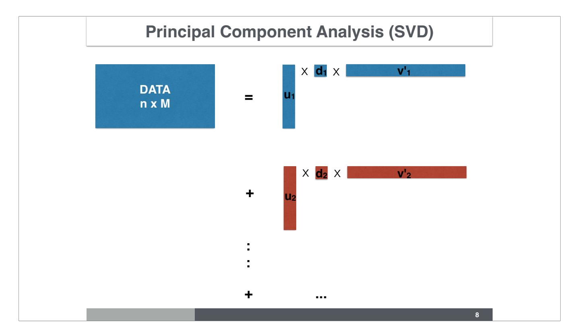{fig-alt="SVD decomposition: DATA (n×M) = u1 × d1 × v'1 + u2 × d2 × v'2 + …"}

$$\mathbf{X} = \mathbf{U}\mathbf{D}\mathbf{V}^\top = \sum_k d_k \, \mathbf{u}_k \mathbf{v}_k^\top$$

::: {.notes}
The SVD factorization decomposes the genotype matrix into orthogonal rank-1 components ordered by variance explained. The columns of U (left singular vectors) are the principal components — coordinates of each individual in the low-dimensional ancestry space. The singular values d_k indicate how much variance each component explains.
:::

# Population Structure Bias

## Could Population Structure Bias GWAS Results?

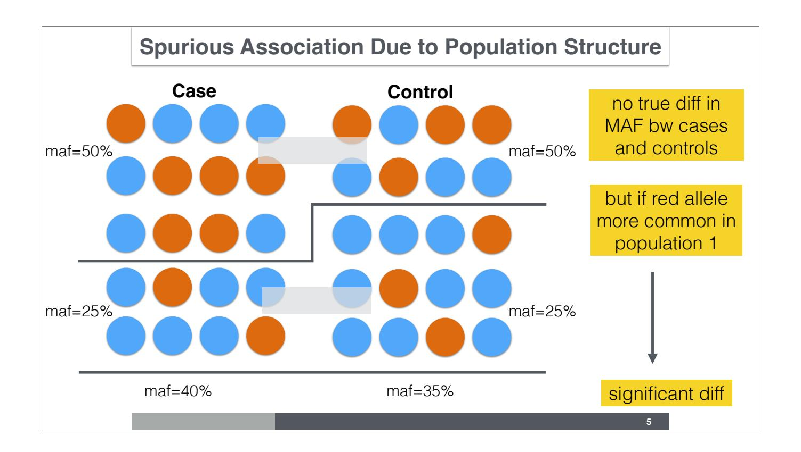{fig-alt="Spurious association diagram: population 1 over-represented in cases, population 2 in controls. Red allele more common in population 1 → appears associated even with no true effect."}

::: {.notes}
When cases and controls are drawn from populations with different allele frequencies, a variant that merely tracks ancestry will appear associated with the phenotype. In this example, MAF = 40% in cases vs 35% in controls — a spurious but statistically significant difference driven entirely by population composition, not biology.
:::

## How to Correct for Population Structure?

1. **Genomic control** (Devlin & Roeder 1999)
   Divide all χ² by inflation factor λ — simple, but blunt

2. **Infer latent sub-populations** (Pritchard et al. 2000)
   STRUCTURE / ADMIXTURE → run GWAS within each group and meta-analyze

3. **PCs as covariates** (Patterson 2006; Price et al. 2010) ← *most common today*
   Add top PCs to regression model

4. **Mixed effects modeling** (EMMAX, Kang et al. 2010)
   Kinship / GRM as random effect — gold standard, computationally intensive

::: {.notes}
If we know the subpopulations, we can run the GWAS within each and meta-analyze. Even if unknown a priori, PCA can identify discrete clusters. The most common approach is using PCs as covariates. Mixed effects modeling handles subtle structure and relatedness but is computationally expensive.
:::

# Example: HapMap & 1000 Genomes

## HapMap Project

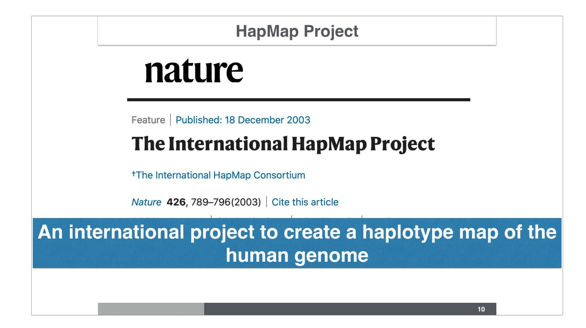{fig-alt="Nature 2003 paper: The International HapMap Project — an international project to create a haplotype map of the human genome."}

::: {.notes}
The International HapMap project recruited individuals who consented to have their genotypes publicly available, with the goal of mapping haplotypes of the human genome.
:::

## 1000 Genomes Project

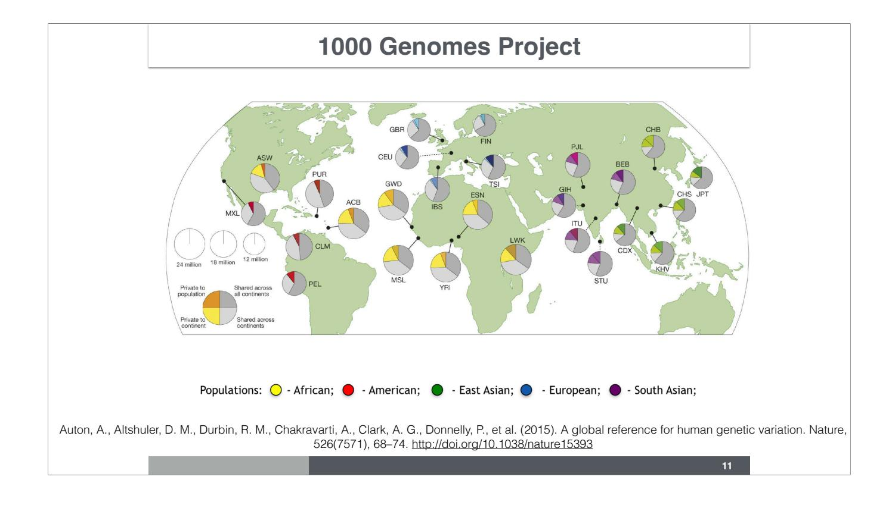{fig-alt="World map with pie charts for each sampled population colored by super-population: African (yellow), American (red), East Asian (green), European (blue), South Asian (purple)."}

*Auton et al., Nature 526, 68–74 (2015)*

::: {.notes}
The HapMap project evolved into the 1000 Genomes Project, which aimed to sequence individuals from around the globe. As of 2020, these resources are still heavily used to understand human genetic diversity.
:::

## HapMap Phase 3 Populations

:::: {.columns}
::: {.column width="50%"}
| Code | Population |
|------|------------|
| ASW  | African ancestry, SW USA |
| CEU  | N/W Europeans (CEPH) |
| CHB  | Han Chinese, Beijing |
| CHD  | Chinese, Denver |
| GIH  | Gujarati Indians, Houston |
| JPT  | Japanese, Tokyo |
:::
::: {.column width="50%"}
| Code | Population |
|------|------------|
| LWK  | Luhya, Kenya |
| MXL  | Mexican, Los Angeles |
| MKK  | Maasai, Kenya |
| TSI  | Toscani, Italy |
| YRI  | Yoruba, Nigeria |
:::
::::

## HapMap Phase 3 — Sample Sizes

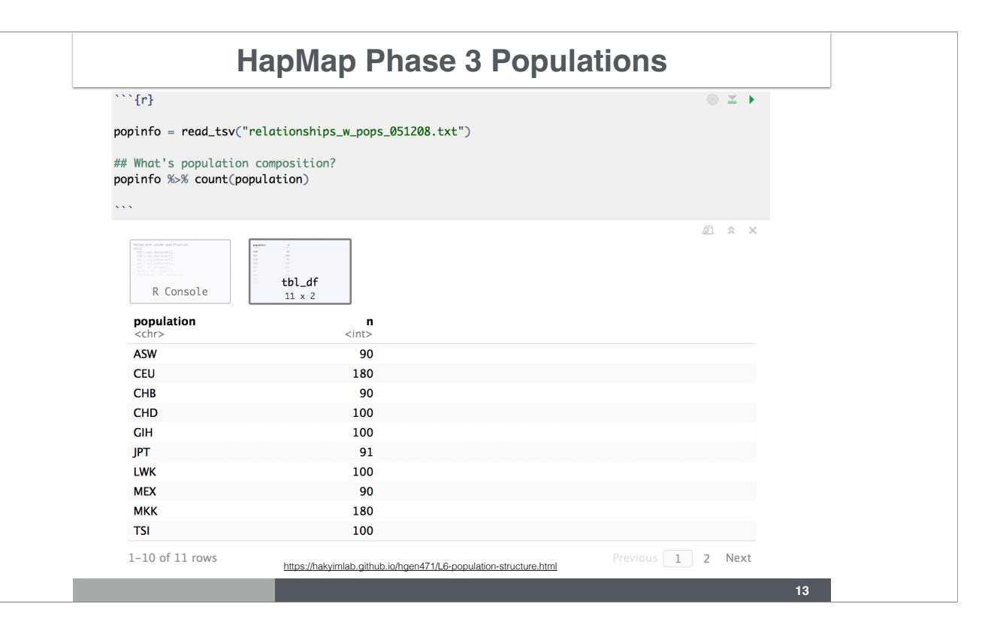{fig-alt="R code: popinfo %>% count(population). Table shows ASW=90, CEU=180, CHB=90, CHD=100, GIH=100, JPT=91, LWK=100, MEX=90, MKK=180, TSI=100."}

::: {.notes}
We can check the number of individuals in each HapMap 3 population using R. Code from the course notebook: https://hakyimlab.github.io/hgen471/L6-population-structure.html
:::

## Population Structure in HapMap (PC1 vs PC2)

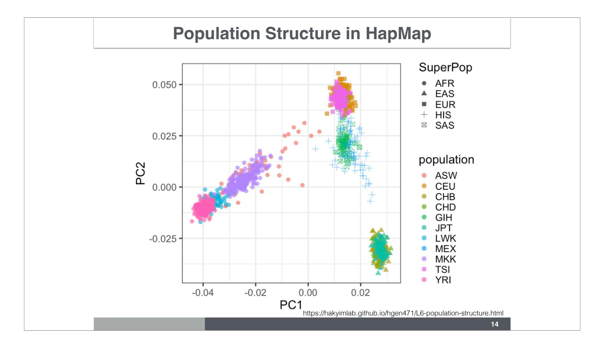{fig-alt="PC1 vs PC2 scatter plot of all HapMap populations, colored by super-population and population label. PC1 separates AFR from the rest; PC2 separates EUR from EAS."}

::: {.notes}
PC1 separates the African populations (circles) from the European (squares), Asian (triangles), Hispanic (+), and South Asian (crossed square). PC2 further separates European from East Asian clusters. Each cluster corresponds to a geographic/ancestral group.
:::

## PCA in UK Biobank

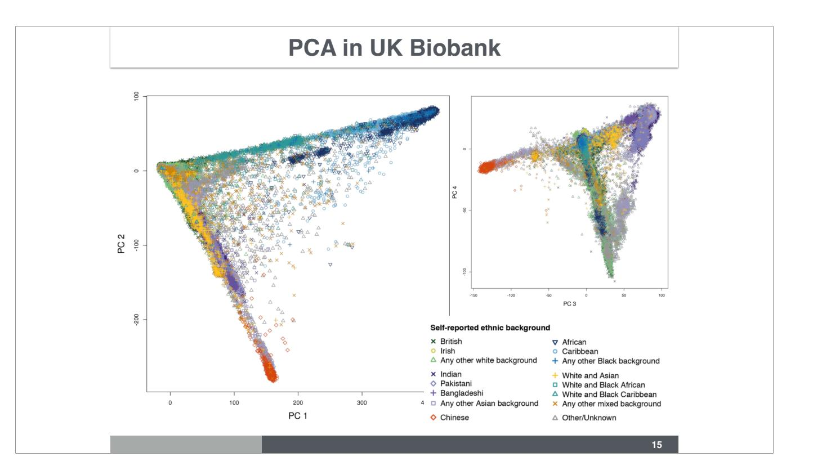{fig-alt="UK Biobank PC1 vs PC2 (left) and PC3 vs PC4 (right), colored by self-reported ethnic background. Triangular structure reflects African, South Asian, and European ancestry extremes."}

Special methods (flashPCA, BOLT-LMM) required for 500,000+ individuals.

::: {.notes}
Special methods had to be developed to be able to compute principal components given the sheer size of the UK Biobank data with 500,000 individuals.
:::

# GWAS in Multi-ancestry Samples

## Growth Phenotype Differs by Population

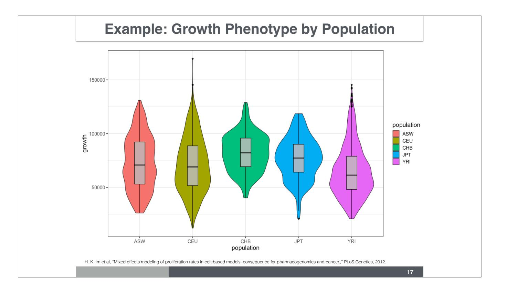{fig-alt="Violin plot of lymphoblastoid cell line proliferation rate (growth) for ASW, CEU, CHB, JPT, YRI populations. YRI notably lower; means differ across all groups."}

*Im et al., PLoS Genetics (2012)*

::: {.notes}
Proliferation rates of lymphoblastoid cell lines differ significantly across HapMap populations. Because SNPs also differ in frequency across populations, any SNP correlated with population label will appear associated with growth — a false positive driven by confounding.
:::

## Regression: Growth ~ Population

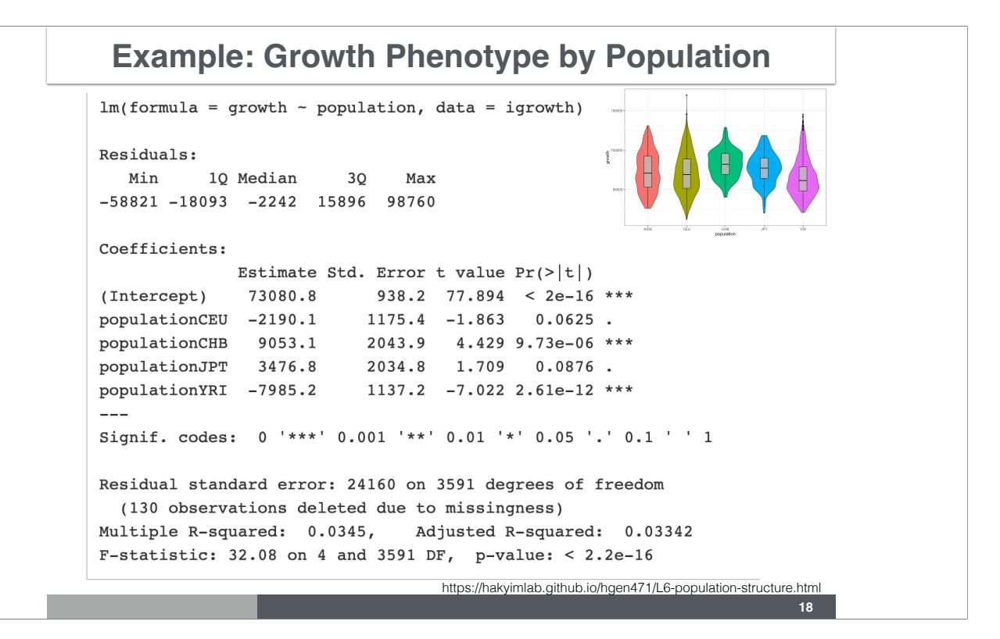{fig-alt="R lm() output. ASW reference. CHB: +9053 (p=9.7e-6 ***), YRI: -7985 (p=2.6e-12 ***). F=32.08, R²=0.034, overall p<2.2e-16."}

::: {.notes}
Linear regression of growth phenotype on population yields highly significant differences in mean growth between populations. ASW is the reference (R orders factors alphabetically). This confirms population is a strong confounder that must be accounted for in GWAS.
:::

## P-value Histogram: Inflation

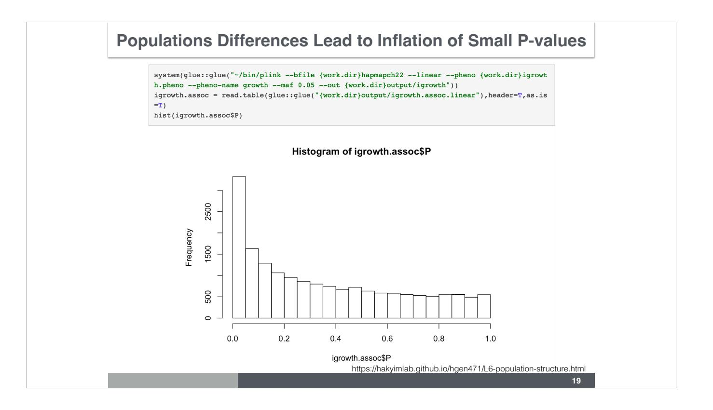{fig-alt="Histogram of p-values for ~20K SNPs on chr 22 vs growth phenotype. J-shaped — large excess of small p-values indicating inflation."}

```r
igrowth.assoc <- read.table("output/igrowth.assoc.linear", header=T, as.is=T)
hist(igrowth.assoc$P)
```

J-shaped histogram → inflation (flat = no signal, J-shape = confounding or polygenic)

::: {.notes}
A flat p-value histogram would indicate no inflation. The J-shape means most variants have smaller-than-expected p-values due to population differences, not biology. We have 20,649 variants on chr 22.
:::

## Manhattan Plot: Chr 22

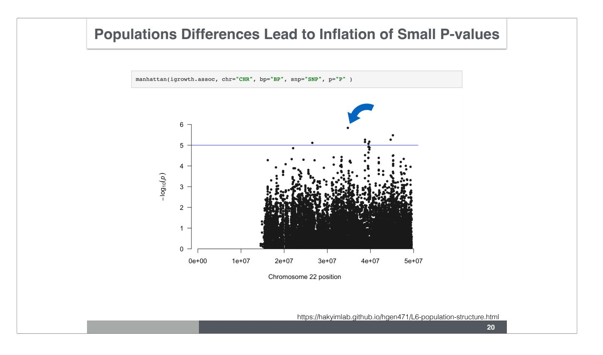{fig-alt="Manhattan plot of -log10(p) vs chr 22 position. Bonferroni threshold line at ~5.6. A few points near/above threshold but diffuse signal across the chromosome."}

```r
# Bonferroni threshold for 20,649 tests
-log10(0.05 / 20649)  # [1] 5.616
```

::: {.notes}
Manhattan plot shows no clear genome-wide significant hit, but there are many variants narrowly below the Bonferroni threshold — a red flag for population stratification inflating test statistics across the entire chromosome.
:::

## QQ Plot: Widespread Inflation

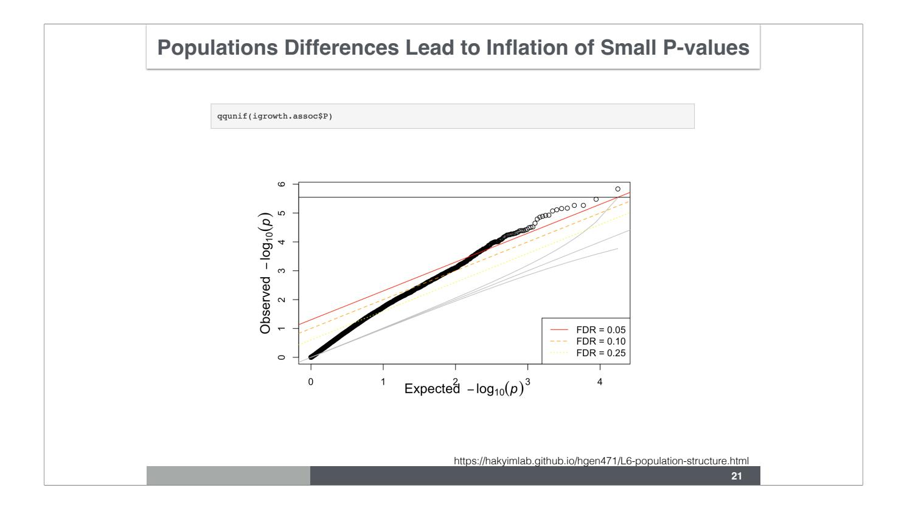{fig-alt="QQ plot of observed vs expected -log10(p). Points depart from the identity line from very early on — inflation affects the vast majority of variants, not just a few true signals."}

```r
qqunif(igrowth.assoc$P)
```

Departure from identity line at **all** quantiles → population structure, not true signal

::: {.notes}
In a well-behaved GWAS, variants follow the identity line (representing true nulls) and depart only for a small set of true associations at the top right. Here the departure begins immediately, indicating that most variants are inflated. This is characteristic of population structure confounding rather than a highly polygenic trait.
:::

## Growth GWAS Adjusted with PCs

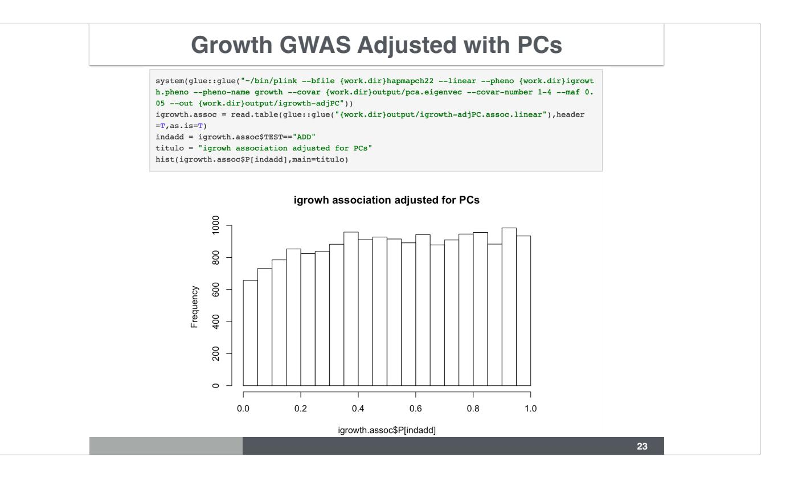{fig-alt="Histogram of p-values after adding first 4 PCs as covariates. Distribution is now approximately uniform — inflation corrected."}

```r
system(glue("plink --bfile hapmapch22 --linear --pheno igrowth.pheno
  --pheno-name growth --covar pca.eigenvec --covar-number 1-4
  --maf 0.05 --out output/igrowth-adjPC"))
```

::: {.notes}
After adjusting for 4 PCs, the p-value distribution is nearly uniform — inflation is corrected. How many PCs to use depends on the application and sample size. UK Biobank analyses typically use 10–20. Always do sensitivity analysis. Do NOT choose the number of PCs that maximizes significance for a cherry-picked variant — that is p-hacking.
:::

# Matrix Algebra Review

## Matrix Operations

**Scalar multiplication:**

$$2 \cdot \begin{bmatrix} 1 & 8 & -3 \\ 4 & -2 & 5 \end{bmatrix} = \begin{bmatrix} 2 & 16 & -6 \\ 8 & -4 & 10 \end{bmatrix}$$

**Transposition:**

$$\begin{bmatrix} 1 & 2 & 3 \\ 0 & -6 & 7 \end{bmatrix}^{\!\top} = \begin{bmatrix} 1 & 0 \\ 2 & -6 \\ 3 & 7 \end{bmatrix}$$

## Matrix Multiplication

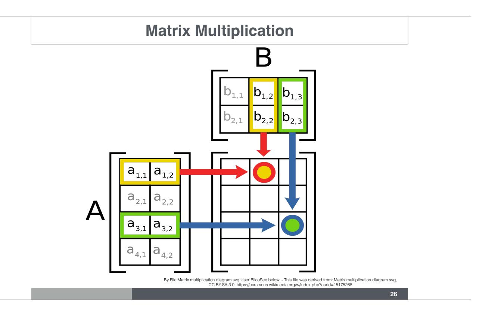{fig-alt="Diagram of A (4×2) × B (2×3): highlighted row of A dots with highlighted column of B to produce one element of the result."}

$$(A \cdot B)_{ij} = \sum_{k} A_{ik}\, B_{kj}$$

**Order matters:** $AB \neq BA$ in general

## Linear System in Matrix Form

$$a_{1,1}x_1 + \cdots + a_{1,n}x_n = b_1$$
$$\vdots$$
$$a_{m,1}x_1 + \cdots + a_{m,n}x_n = b_m$$

Written compactly: $\mathbf{A}\mathbf{x} = \mathbf{b}$

## Derive Linear Regression Solution

$$Y = X\beta + \varepsilon$$

Multiply both sides on the left by $X^\top$:

$$X^\top Y = X^\top X\,\beta + X^\top\varepsilon$$

Setting $X^\top\varepsilon = 0$ and solving:

$$\boxed{\hat{\beta} = (X^\top X)^{-1} X^\top Y}$$

::: {.notes}
Let's assume we have demeaned and divided by standard deviation both Y and X. Check dimensions: if X is n×p and Y is n×1, then β is p×1. The OLS solution minimizes the sum of squared residuals.
:::

## PC Plot of Vanderbilt Patients Across Decades

Nancy Cox, 2017 ASHG Presidential Address (20:04 – 24:12):

- [Video excerpt (UChicago Box)](https://uchicago.box.com/s/yhgel87wyi5tqkr9f2fagufagnh5czvj)
- [Full talk (YouTube)](https://www.youtube.com/watch?v=TzZzz7SBZrw)

PC plot of BioVU patients colored by decade of birth → dramatic shifts in ancestry composition over time

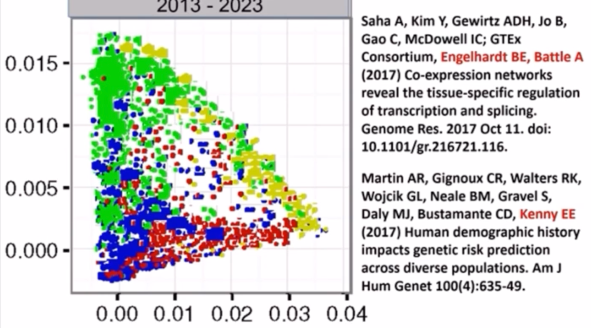{fig-alt="PC plot of BioVU patients 2013–2023, colored by ancestry. Four clusters (blue, red, green, yellow) show diverse ancestry composition."}

## SVD Resources

**Daniella Witten's SVD Tweetorial** (24 tweets)
[twitter.com/WomenInStat/status/1285611207530098688](https://twitter.com/WomenInStat/status/1285611207530098688)

$$\mathbf{X} = \mathbf{U}\mathbf{D}\mathbf{V}^\top$$

- **U** columns = PC scores (individual coordinates)
- **V** columns = loadings (SNP weights)
- **D** diagonal = singular values (∝ variance explained)


# Hardy-Weinberg Equilibrium

## Hardy-Weinberg Equilibrium

Under **random mating** (paternal and maternal alleles independent):

If $p$ = minor allele frequency:

$$P(AA) = p^2 \qquad P(AC) = 2p(1-p) \qquad P(CC) = (1-p)^2$$

**Test:** Chi-square comparing observed vs expected counts:

$$\sum \frac{(O - E)^2}{E} \sim \chi^2_{\text{df}=(r-1)(c-1)}$$

Departures → genotyping error, population structure, or selection

## Types of Heritability

$$Y = G + E \qquad Y = A_G + NA_G + E$$

| Heritability | Definition |
|---|---|
| Broad-sense $H^2$ | $\mathrm{Var}(G)/\mathrm{Var}(Y)$ |
| Narrow-sense $h^2$ | $\mathrm{Var}(A_G)/\mathrm{Var}(Y)$ |
| Chip/SNP $h^2_\text{SNP}$ | Additive component captured by genotyped variants |

**Additive model:**
$$Y = \sum_{k=1}^{M} X_k \beta_k + E$$

# Summary

## Summary

| Concept | Key point |
|---------|-----------|
| Genotype matrix | Encodes ancestry; PCA reveals population structure |
| Novembre 2008 | PC1/PC2 of Europeans reproduces geography |
| Population stratification | Confounds GWAS → spurious associations |
| Genomic control | Inflation correction via λ — blunt |
| **PCs as covariates** | **Most widely used; sensitivity-test # of PCs** |
| Mixed models | Best for subtle structure & relatedness |
| SVD | $X = UDV^\top$; U columns = PC scores |
| HWE | Chi-square test; departures flag errors/selection |
| $h^2$ | Narrow-sense = additive genetic variance fraction |

## Resources

- Course notebook: [hakyimlab.github.io/hgen471/L6-population-structure.html](https://hakyimlab.github.io/hgen471/L6-population-structure.html)
- Novembre et al. 2008: [doi.org/10.1038/nature07331](https://doi.org/10.1038/nature07331)
- Price et al. 2006 (EIGENSTRAT): [doi.org/10.1038/ng1847](https://doi.org/10.1038/ng1847)
- SVD tweetorial: [twitter.com/WomenInStat/status/1285611207530098688](https://twitter.com/WomenInStat/status/1285611207530098688)
