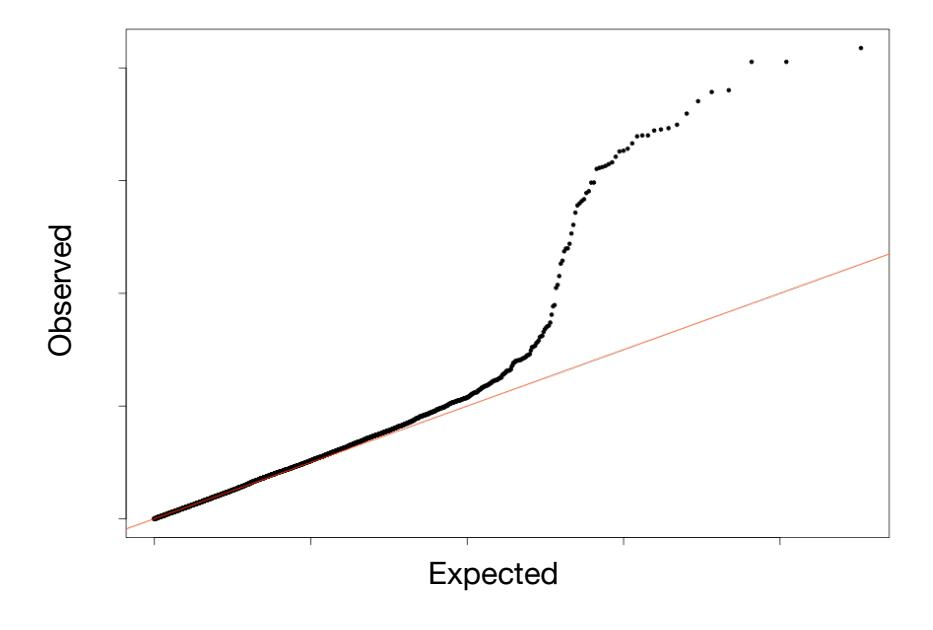
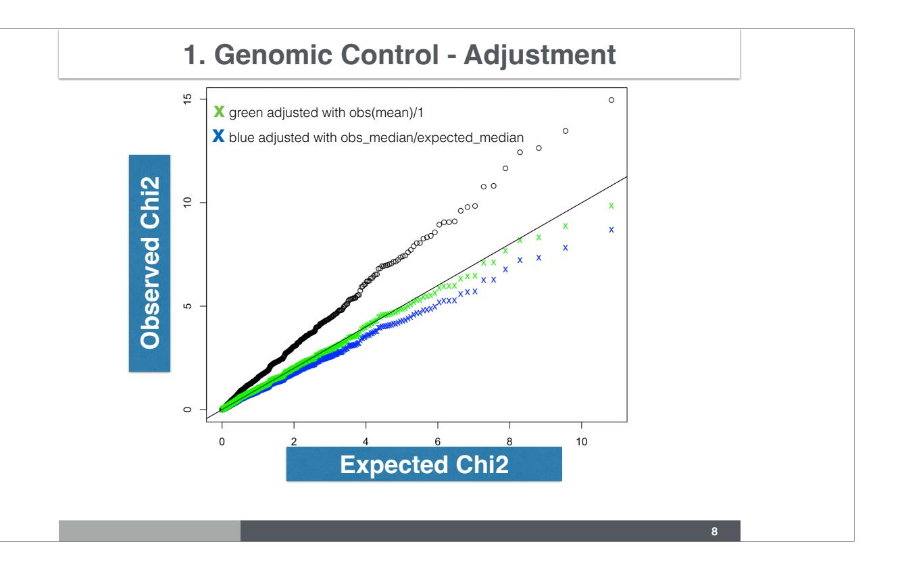
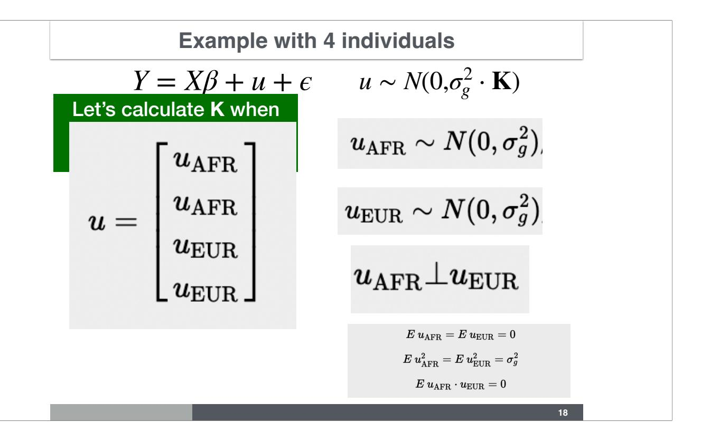
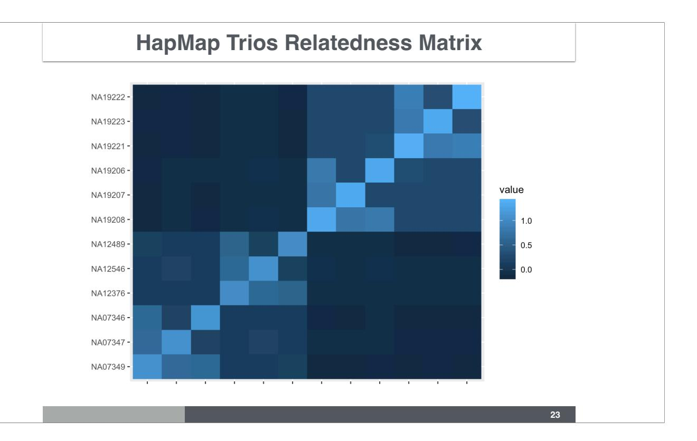
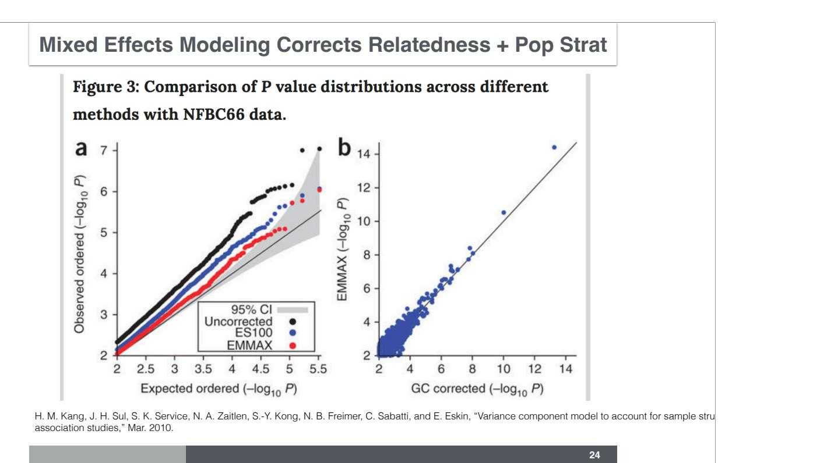
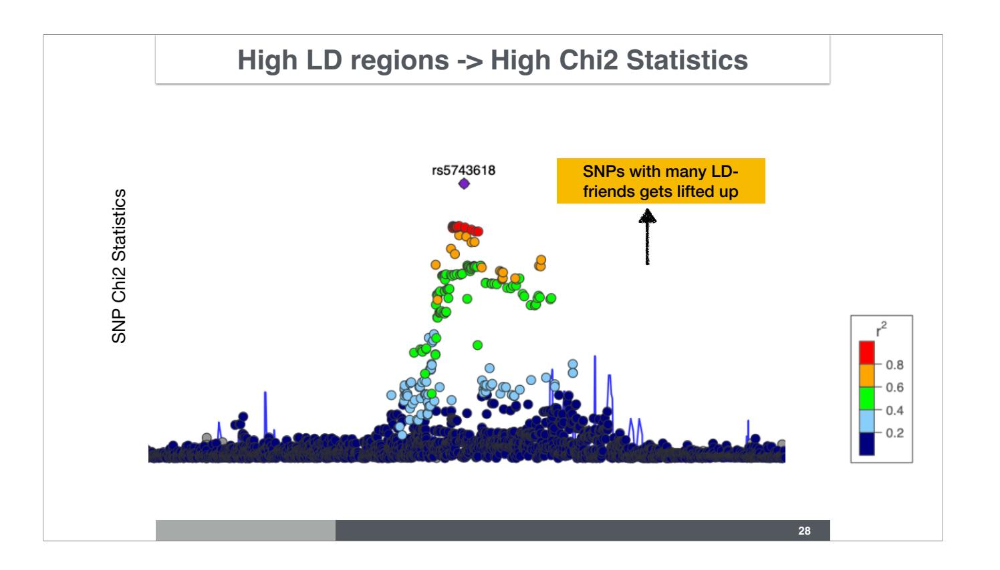
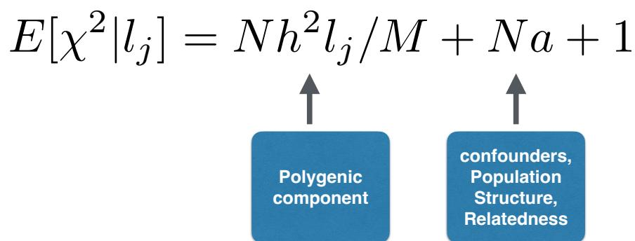
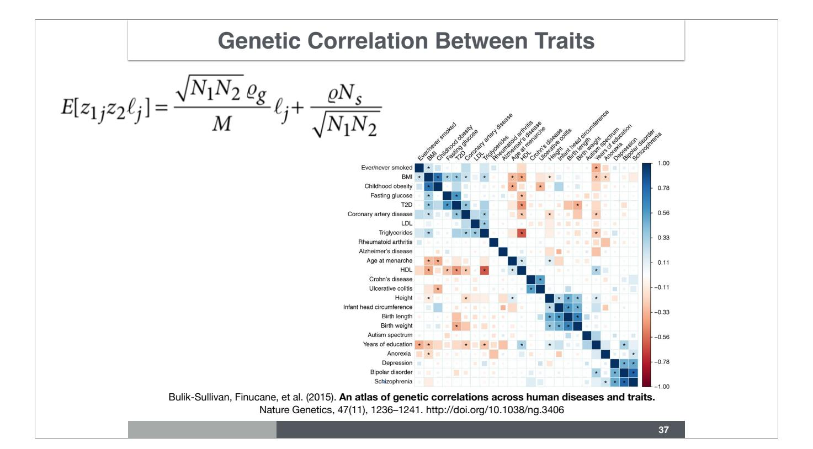
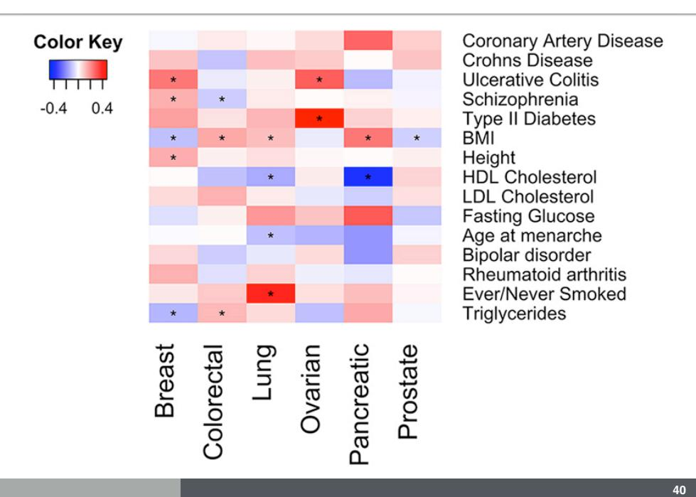

## Correcting for Population Structure with Mixed Effects Models & LD Score Regression

Hae Kyung Im, PhD


April 14, 2025

# How to Correct for Population Structure

Last classs we learned that genetic principal components can be used to correct for population structure and avoid spurious associations.

#### How to Correct for Population Structure in Association Studies

- 1. Correcting with genomic control (Devlin and Roeder 1999) now superseded by LD score regression
- 2. Inferring the latent sub-populations (Pritchard et al 2000) Fit association in each population separately and combine
- 3. Adjusting for principal components (Patterson 2006, Novembre 2008, Price et al 2010)
- 4. Mixed effects modeling (EMMAX, Kang et al 2010)

- 1. Genomic control method by Devlin and Roeder is a simple approach broadly used. As sample sizes increase, we will see that we need to revisit this approach.
- 2. If we know the subpopulations, we can run the GWAS within each and meta-analyze the results. Even if we don't know the subpopulations a priori, if they are distinct enough we may be able to identify them and run GWAS within each latent sub-population (principal component analysis will help for this).
- 3. The most common approach used now is using principal components are covariates.
- 4. Mixed effects modeling is another approach.

### 1. Genomic Control (Devlin and Roeder, 1999)

- **assumption**: the effects of population stratification and cryptic relatedness are constant across the genome
- the test statistics distributed λ \* Chi2
- estimate λ using the
- mean of test statistics, or
- median/qchisq(0.5)=0.456
- procedure works fairly well for λ close to 1 (1 1.1)
- λ < 1.05 considered acceptable inflation

**4**

As seen in the growth phenotype example, population stratification can lead to inflation of false positives. More small p-values than we would expect (uniformly distributed).

#### What is a "statistic"

- In statistics terminology, a statistic is a function of the data

## 1 Calculate Zscore, p-value, Chi2 statistics using GWAS summary statistics

$$Y = \beta \cdot X + \epsilon$$

GWAS summary statistics will contain an estimate of the regression coefficient  $\hat{\beta}$  and its standard error  $\operatorname{se}(\hat{\beta})$  for each SNP in the GWAS.

We distinguish the true  $\beta$  from the estimated value  $\hat{\beta}$  using a hat.

#### 2 Z-score

$$Z=\frac{\hat{\beta}}{{\rm se}(\hat{\beta})}$$

$$Z\approx N(0,1) \quad\text{ as } n\to\infty$$

#### 3 Z to Chi2 statistic

$$Z^2 \sim \chi^2_{\text{df}=1}$$

Under the null, the squared of the Z-score follows a  $\chi^2$  distribution with 1 degree of freedom.

#### 4 Z to P-value

$$P = \mathrm{pnorm}(-|Z|) * 2$$

#### 5 P to Z

From the p-value, we can calculate the magnitude of the Z-score but the sign is lost. So the Z-score has more information than the p-value.

$$|Z| = |\mathrm{qnorm}(P/2)|$$

#### 6 P to Chi2

$$\chi^2 = \mathrm{qnorm}(P/2)^2$$

https://bios25328.hakyimlab.org/post/2022/04/13/calculate-z-score-p-value-chi2-stat-from-gwas/






Let's simulate a really dumb case control study that has all cases from one population and all controls from another population. Here all SNPs that have different frequencies between populations will be significantly associated with case-control status. Chi2 of these associations are shown in this figure. If we apply regression, Chi2 stat = (effect size / standard error)^2. Green dots correspond to corrected chi2 with genomic control. Genomic control here is λ = mean(obs chi2 stat) / mean(expected chi2 stat). One can also adjust with medians, to keep it robust to outliers (true signals with large chi2 stat could skew the mean and over-correct the statistic)

#### **Function to Calculate Genomic Control**

```
## Reads data 
S <- read.table(input, header = FALSE) 
if (stat_type == "Z") 
 z = S[, 1] 
if (stat_type == "CHISQ") 
 z = sqrt(S[, 1]) 
if (stat_type == "PVAL") 
 z = qnorm(S[, 1] / 2) 
## calculates lambda 
lambda = round(median(z^2) / 0.4549, 3) 
lambda
                                   Where 0.4549 is the median of a 
                                   chi2 r.v. with 1 df 
                                   qchisq(0.5, 1) 
                                   [1] 0.4549364
```

**9**

here is a function that will calculate the genomic control (λ) given Z scores, Chi2, or pvalues in a data frame called input.

### **2. Infer Latent Population Structure**

- Infer latent population structure
- e.g. STRUCTURE Pritchard et al
- Perform association in each sub-population and aggregate using meta-analysis


**10**

We can also infer the latent subpopulations with methods such as STRUCTURE or others, and perform association within each subpopulation and then meta-analyze to get the full population association statistics.

#### **3. Adjust with Principal Components**

- This is a very populat approach because of simplicity
- *Y* ∼ *Xkβ<sup>k</sup>* + PC<sup>1</sup> + ⋯ + PC*<sup>p</sup>* + *ϵ*

**11**

we discussed this approach last class.

## Adjusting for Population Structure using Mixed Effects Model

In our previous lecture on population structure, we saw that genomic control and genetic principal components are useful tools to correct for population structure. Today we will see two additional approaches. One is based on mixed effects modeling and the other is using LD score regression.

#### **Kang et al Proposed Adjusting for Random Effect** *u*

$$Y = X\beta + u + \epsilon$$

$$Y = X + u + \epsilon$$

$$u \sim N(0, \sigma_g^2 \cdot \mathbf{K})$$

Useful to adjust for confounding due to population structure, family structure and cryptic relatedness

> Kang et al **Variance component model to account for sample structure in genome-wide association studies** Nature Genetics, Mar. 2010.

> > **13**

Mixed effects models are just regression models, for simplicity think linear regression, where in addition to the traditional "fixed" effects of the covariates, there are "random" effects. In this case, β is a fixed effect, whereas *u* is a random effect. Random effects are specified by their distribution, in this case *u* is normally distributed with mean 0 and variance σg·Κ.

When K is the genetic relatedness matrix (genetic correlation between individuals), then this model is able to account for population structure, family structure, and cryptic relatedness.

## **Example with 4 individuals**

$$Y = X\beta + u + \epsilon$$
  $u \sim N(0, \sigma_g^2 \cdot \mathbf{K})$ 

Spell out the vectors for 4 individuals

$$\begin{bmatrix} y_1 \\ y_2 \\ y_3 \\ y_4 \end{bmatrix} = \begin{bmatrix} x_1 \\ x_2 \\ x_3 \\ x_4 \end{bmatrix} \cdot \beta + \begin{bmatrix} u_1 \\ u_2 \\ u_3 \\ u_4 \end{bmatrix} + \begin{bmatrix} \epsilon_1 \\ \epsilon_2 \\ \epsilon_3 \\ \epsilon_4 \end{bmatrix}$$

$$Y \sim N(X\beta, \sigma_g^2 \cdot \mathbf{K} + \sigma_e^2 \cdot \mathbf{I})$$

14

Let's look at a simple example with 4 individuals, two from EUR ancestry and two from AFR ancestry. No family structure or cryptic relatedness. Here u represents the effect of population status on the phenotype Y. The matrix K represents the population pattern in the data and  $\sigma_g$  is the scale of the effect, a measure of the effect of the population membership on the phenotype.

## **Example with 4 individuals**

$$Y = X\beta + u + \epsilon$$
  $u \sim N(0, \sigma_g^2 \cdot \mathbf{K})$ 

## Spell out the vector *u* and its variance matrix

$$\begin{bmatrix} u_1 \\ u_2 \\ u_3 \\ u_4 \end{bmatrix} \sim N \left( \begin{bmatrix} 0 \\ 0 \\ 0 \\ 0 \end{bmatrix}, \sigma_g^2 \cdot \begin{bmatrix} k_{11} & k_{12} & k_{13} & k_{14} \\ k_{21} & k_{22} & k_{23} & k_{24} \\ k_{31} & k_{32} & k_{33} & k_{34} \\ k_{41} & k_{42} & k_{43} & k_{44} \end{bmatrix} \right)$$

*u* is a multivariate normal rv

**15**

Random effect u, is multivariate normal Its mean, and the variance matrix

## **Example with 4 individuals**

$$Y = X\beta + u + \epsilon$$
  $u \sim N(0, \sigma_g^2 \cdot \mathbf{K})$ 

Spell out the vector ε and its variance matrix

$$\begin{bmatrix} \epsilon_1 \\ \epsilon_2 \\ \epsilon_3 \\ \epsilon_4 \end{bmatrix} \sim N \begin{pmatrix} \begin{bmatrix} 0 \\ 0 \\ 0 \\ 0 \end{bmatrix}, \sigma_e^2 \cdot \begin{bmatrix} 1 & 0 & 0 & 0 \\ 0 & 1 & 0 & 0 \\ 0 & 0 & 1 & 0 \\ 0 & 0 & 0 & 1 \end{bmatrix} \end{pmatrix}$$

*ε* is a multivariate normal rv

**16**

Epsilon is also multivariate normal

## **Checkpoint: What is the Distribution of Y?**

$$Y = X\beta + u + \epsilon$$
  $u \sim N(0, \sigma_g^2 \cdot \mathbf{K})$   $\epsilon \sim N(0, \sigma_e^2 \cdot \mathbb{I}_{n \times n})$ 

**17**

Checkpoint



Let's look at a simple example with 4 individuals, two from EUR ancestry and two from AFR ancestry. No family structure or cryptic relatedness. Here *u* represents the effect of population status on the phenotype *Y*. The matrix **K** represents the population pattern in the data and σg is the scale of the effect, a measure of the effect of the population membership on the phenotype.

u = \begin{bmatrix}

u\_\text{AFR} \\

u\_\text{AFR} \\

u\_\text{EUR} \\

u\_\text{EUR}

\end{bmatrix}

Assuming individuals 1 and 2 are of African descent and 3 and 4 are of European descent. *u*1 = *u*2 = *u*AFR and *u*3 = *u*4 = *u*EUR. We also assume that the the population effects are independent across populations, i.e. that *u*EUR is orthogonal to *u*AFR. Since we are assuming that the mean is 0, the variance of the u's are given by E u^2. With these assumptions, we can calculate the covariance matrix of u, which is by definition = σg·Κ. Recall also that you would calculate the covariance matrix of a vector as E u·u'.

$$Y = X\beta + u + \epsilon$$
  $u \sim N(0, \sigma_g^2 \cdot \mathbf{K})$ 

$$\sigma_g^2 \cdot K = \text{Var}(u)$$
 recall that  $Var(u) = E(u - Eu)(u - Eu)' = Euu'$ 

$$\operatorname{Var}\begin{bmatrix} u_1 \\ u_2 \\ u_3 \\ u_4 \end{bmatrix} = Euu' = E \left( \begin{bmatrix} u_1 \\ u_2 \\ u_3 \\ u_4 \end{bmatrix} \right)$$

$$E\,u_{\rm AFR}=E\,u_{\rm EUR}=0$$

$$E\,u_{\rm AFR}^2 = E\,u_{\rm EUR}^2 = \sigma_g^2$$

$$E\,u_{\rm AFR}\cdot u_{\rm EUR}=0$$

$$Y = X\beta + u + \epsilon$$
  $u \sim N(0, \sigma_g^2 \cdot \mathbf{K})$ 

$$\sigma_g^2 \cdot K = \text{Var}(u)$$
 recall that  $Var(u) = E(u - Eu)(u - Eu)' = Euu'$ 

$$\sigma_g^2 \cdot \mathbf{K} = E \begin{bmatrix} u_1 u_1 & u_1 u_2 & u_1 u_3 & u_1 u_4 \\ u_2 u_1 & u_2 u_2 & u_2 u_3 & u_2 u_4 \\ u_3 u_1 & u_3 u_2 & u_3 u_3 & u_3 u_4 \\ u_4 u_1 & u_4 u_2 & u_4 u_3 & u_4 u_4 \end{bmatrix}$$

expected value (E) of a matrix is the E of each element of the matrix

$$Y = X\beta + u + \epsilon \qquad u \sim N(0, \sigma_g^2 \cdot \mathbf{K})$$

$$\sigma_g^2 \cdot K = \text{Var}(u)$$
 recall that  $Var(u) = E(u - Eu)(u - Eu)' = Euu'$ 

$$\sigma_g^2 \cdot \mathbf{K} = \begin{bmatrix} E \ u_1 u_1 & E \ u_2 u_1 & E \ u_2 u_2 & E \ u_2 u_3 & E \ u_2 u_4 \\ E \ u_3 u_1 & E \ u_3 u_2 & E \ u_3 u_3 & E \ u_3 u_4 \\ E \ u_4 u_1 & E \ u_4 u_2 & E \ u_4 u_3 & E \ u_4 u_4 \end{bmatrix}$$

$$E\,u_{\rm AFR}=E\,u_{\rm EUR}=0$$

$$E\,u_{\rm AFR}^2 = E\,u_{\rm EUR}^2 = \sigma_g^2$$

$$E\,u_{\rm AFR}\cdot u_{\rm EUR}=0$$

$$Y = X\beta + u + \epsilon \qquad u \sim N(0, \sigma_g^2 \cdot \mathbf{K})$$

$$\sigma_g^2 \cdot K = \text{Var}(u)$$
 recall that  $Var(u) = E(u - Eu)(u - Eu)' = Euu'$ 

$$\sigma_g^2 \cdot \mathbf{K} = \sigma_g^2 \cdot \begin{bmatrix} 1 & 1 & 0 & 0 \\ 1 & 1 & 0 & 0 \\ 0 & 0 & 1 & 1 \\ 0 & 0 & 1 & 1 \end{bmatrix}$$

$$E\,u_{\rm AFR}=E\,u_{\rm EUR}=0$$
  $E\,u_{\rm AFR}^2=E\,u_{\rm EUR}^2=\sigma_g^2$   $E\,u_{\rm AFR}\cdot u_{\rm EUR}=0$ 

This is how the variance matrix of the random effect that captures population level variation looks like.



Here is the genetic relatedness matrix of 2 European and 2 African trios (mother, father, and child) from HapMap (YRI, EUR) calculated using plink's make-grm-gz command.

The population structure is apparent in the 6 by 6 distinct blocks, and the family structure (trios) manifests as smaller blocks of 3 by 3.

Random mating seems to be a reasonable assumption. Explain why.

Can you recognize which individual is the child within each trio?

|                                                         | ## 1345 NA07349 NA07347 NA07346 1 | 0 | CEU |  |  |  |  |
|---------------------------------------------------------|-----------------------------------|---|-----|--|--|--|--|
|                                                         | ## 1353 NA12376 NA12546 NA12489 2 | 0 | CEU |  |  |  |  |
|                                                         | ## Y051 NA19208 NA19207 NA19206 1 | 0 | YRI |  |  |  |  |
|                                                         | ## Y058 NA19221 NA19223 NA19222 2 | 0 | YRI |  |  |  |  |
| https://bios25328.hakyimlab.org/post/2021/02/18/l8-grm/ |                                   |   |     |  |  |  |  |



In this figure, Kang et all show compare the uncorrected p-values, which look clearly inflated, with the p-values after correcting for 100 principal components (calculated with eigensoft) and the EMMAXcorrected (mixed effects approach) p-values which look much less inflated. Panel b shows the comparison of EMMAX to the simple genomic control approach (divide the chi2 statistic by the inflation factor λ) showing similar correction of inflation (because the points are located around the identify line).

Notice that the authors use of genomic control as a measure of goodness of fit.

#### **Combination Strategy vs. Mixed Effects**

- Remove close relatives
- Correct broad sample structure with principal components
- Correct residual inflation with genomic control (divide **χ**2 stat. by λ)

#### **Combination Mixed Effects Model**

• Use genetic relatedness matrix to account for sample structure


The PCs are eigenvectors of this GRM

**25**

Mixed effects models are great tools to model data with complex underlying structure but can be computationally expensive and has been shown that sometimes it can over correct causing deflation of association statistics. Still today, the more naive approach of simply removing close relatives is quite common (you can find tons of paper in the UKB where over 100K individuals were excluded to avoid dealing with relatedness).

## LD Score Regression


Inflation of summary statistics (-log10 p here) can be due to two effects:

- confounders such as population structure, relatedness, etc
- true polygenicity (most variants have a causal effect or are in LD with causal variants)

Genomic control method does not distinguish between true polygenicity and inflation due to population stratification.



This represents a locus zoom-like plot with Chi2 statistics instead of p-values. The basic principle of LD score regression relies on the fact that if we assume a polygenic model, then variants that are in high LD regions, will have higher association statistic (chi2 here). More informally, SNPs with many LD-friends will be lifted up in the chi2 chart because they are more likely to tag causal variants that SNPs without LD-friend.

## **LD Score: Measure of LD with Neighboring Variants**

Id score: 
$$l_j = \sum_k r_{j,k}^2$$

amount of genetic variation tagged by variant *j*

**29**

ld-score is a measure the number of "LD-friends", and it's calculated as the sum of LD. Each genetic variant will have one such score.

#### **Polygenic Additive Model**

$$Y = \sum_{k}^{M} X_k \cdot \beta_k + \epsilon$$

$$\beta \sim N(0, \sigma_{\beta}^2)$$

**30**

This additive model which includes all common SNPs is the main model used for the study of common disease genetics.


Bulik-Sullivan et al show that we can distinguish inflation due to confounding (a) and polygenicity (b) by regressing the chi2 statistic against ld-score. The intercept should be 1 if there were no inflation. Any number above 1 can be interpreted as inflation due to population or relatedness confounding. The slope of the regression allows us to calculate the heritability.

N is the sample size, M is the number of variants, h2 is the heritability explained by the M variants in aggregate, and a represents a measure of confounding. Notice that the effects of both confounding and polygenicity increases with the sample size.

Note: regression weights are used to account for heteroskedasticity, i.e. the fact that errors are larger for higher LD score.

#### **LD Score Regression Distinguishes Confounding from Polygenicity**

- Variants in LD with a causal variant show inflation in test statistics proportional to their LD with the causal variant.
- The more genetic variation an index variant tags, the higher the probability that this index variant will tag a causal variant
- Inflation from cryptic relatedness or population stratification purely from genetic drift will not correlate with LD
- **Assumptions**: polygenic model, effect sizes for variants drawn independently from distributions with variance proportional to 1/ (p(1 – p))

$$E[\chi^2|l_j] = Nh^2l_j/M + Na + 1$$

LD Score regression distinguishes confounding from polygenicity https://rdcu.be/b07sl

#### **LD Score Regression**



*N* = sample size

*M* = number of SNPs

*h*<sup>2</sup>*/M* = variance explained per SNP

*a* = confounding biases, cryptic relatedness and population stratification

*<sup>l</sup><sup>j</sup>* <sup>=</sup> <sup>X</sup> *k r*2 *jk*amount of genetic variation

tagged by SNP *j*

## **LD Score Regression - Schizophrenia**


**Genomic Control vs. LD Score** 

| Ulcerative colitis                                               | 1.174          | 1.128          | 1.079 (0.010                   |
|------------------------------------------------------------------|----------------|----------------|--------------------------------|
| Crohn's disease                                                  | 1.185          | 1.122          | 1.059 (0.008                   |
| Schizophrenia                                                    | 1.613          | 1.484          | 1.070 (0.010                   |
| Attention deficit/                                               | 1.033          | 1.033          | 1.008 (0.006                   |
| hyperactivity disorder<br>Bipolar disorder<br>PGC cross-disorder | 1.154<br>1.205 | 1.135<br>1.187 | 1.030 (0.008)<br>1.018 (0.008) |
| analysis<br>Major depression<br>Rheumatoid arthritis             | 1.063<br>1.063 | 1.063<br>1.033 | 1.009 (0.006)<br>0.980 (0.007) |
| Coronary artery disease                                          | 1.125          | 1.096          | 1.033 (0.008)                  |
| Type 2 diabetes                                                  | 1.116          | 1.097          | 1.025 (0.008)                  |

**35**

Notice that the intercept, a new measure of confounder driven inflation, is systematically smaller than the one calculated by the genomic control λGC.

### **LD Score Values on Chromosome 22**


Calculated by Yanyu Liang using GTEx V8 reference variant set

**36**

To get a sense of the range of values LD score can take, here is a plot of the LD score values calculated on chromosome 22.



With the same assumptions as used for the derivation of the LD score, one can calculate the genetic correlation between traits using the same techniques for the ld-score regression. This genetic correlation can provide additional insight into some of the epidemiological/observed correlation between these traits. These avoid some of the confounders in observational studies providing additional insights and orthogonal sources of evidence for the associations.

#### **LD Score Regression Estimates h2 and genetic correlation**

$$E[\chi^2|l_j] = Nh^2l_j/M + Na + 1$$

**heritability confounders (pop. structure)**

$$E[z_{1j}z_2\ell_j] = \frac{\sqrt{N_1N_2}}{M} \frac{\varrho_g}{\ell_j} \ell_j + \frac{\varrho N_s}{\sqrt{N_1N_2}}$$

**genetic correlation**

**38**

Remember LD score regression allows us to decompose inflation into polygenic and confounder contributions. By running a regression of the chi2 statistics on ld scores, we can estimate heritability, effect of confounders (including population stratification and relatedness). By regressing the product of the zscores of two traits, one can also estimate the genetic correlation. Later, you will also see that by partitioning the ld scores into different functional categories, one can also partition the heritability of traits by functional category.

#### **Genetic Correlation Among Cancers**

|            | Breast | Colorectal   | Lung         | Ovarian      | Pancreatic   | Prostate     |
|------------|--------|--------------|--------------|--------------|--------------|--------------|
| Breast     | 1      | 0.22 (0.091) | 0.27 (0.11)  | 0.26 (0.20)  | 0.17 (0.19)  | 0.06 (0.09)  |
| Colorectal | 0.014  | 1            | 0.31 (0.097) | -0.08 (0.13) | 0.55 (0.19)  | 0.09 (0.07)  |
| Lung       | 0.009  | 0.001        | 1            | -0.17 (0.17) | 0.32 (0.19)  | 0.095 (0.08) |
| Ovarian    | 0.18   | 0.57         | 0.32         | 1            | -0.40 (0.29) | 0.02 (0.14)  |
| Pancreatic | 0.37   | 0.003        | 0.08         | 0.17         | 1            | -0.06 (0.14) |
| Prostate   | 0.52   | 0.2          | 0.25         | 0.89         | 0.68         | 1            |

https://www.ncbi.nlm.nih.gov/pmc/articles/PMC5582139/

#### **Genetic Correlation Cancer and Other Diseases**



#### **Assortative Mating Confounds Genetic Correlation/Pleiotropy**

Brainstorm Consortium, Analysis of shared heritability in common disorders of the brain. Science. 2018 Jun 22;360(6395):eaap8757. doi: 10.1126/science.aap8757. PMID: 29930110; PMCID: PMC6097237.

Border R, Athanasiadis G, Buil A, Schork AJ, Cai N, Young AI, Werge T, Flint J, Kendler KS, Sankararaman S, Dahl AW, Zaitlen NA. Cross-trait assortative mating is widespread and inflates genetic correlation estimates. Science. 2022 Nov 18;378(6621):754-761. doi: 10.1126/ science.abo2059. Epub 2022 Nov 17. PMID: 36395242; PMCID: PMC9901291.

### **Genetic Correlation Among Psychiatric Diseases**


Brainstorm Consortium, Analysis of shared heritability in common disorders of the brain. Science. 2018 Jun 22;360(6395):eaap8757. doi: 10.1126/science.aap8757. PMID: 29930110; PMCID: PMC6097237.