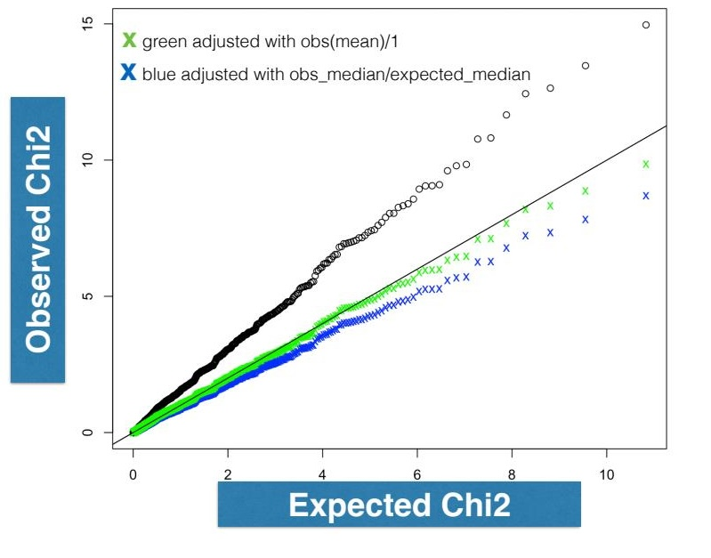
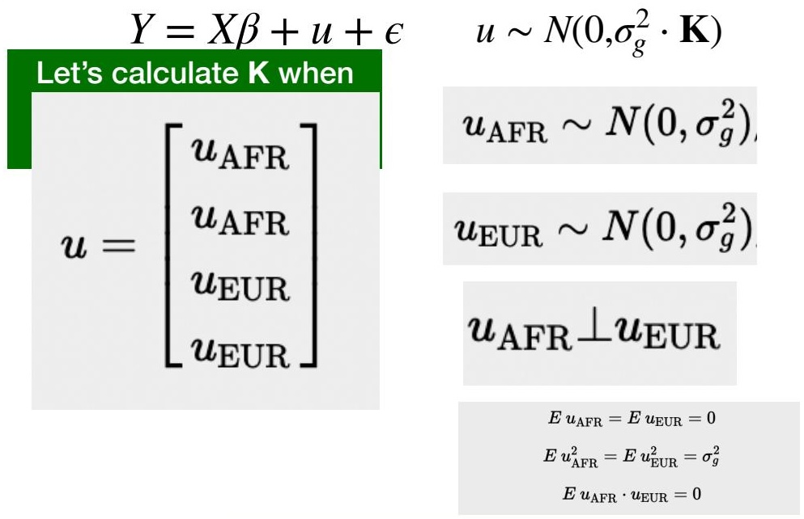
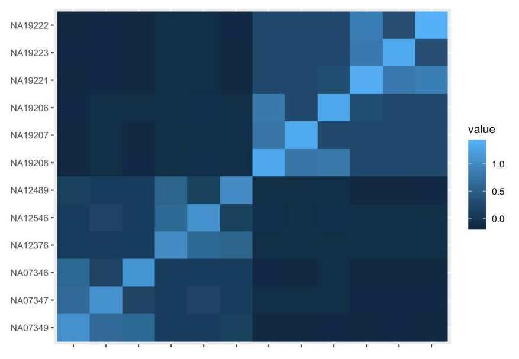
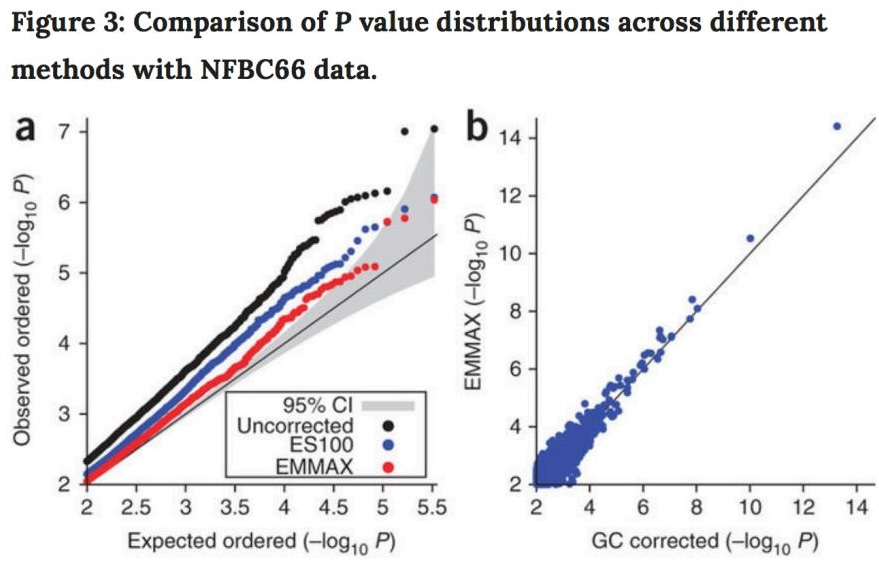
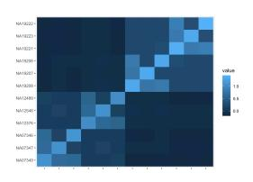
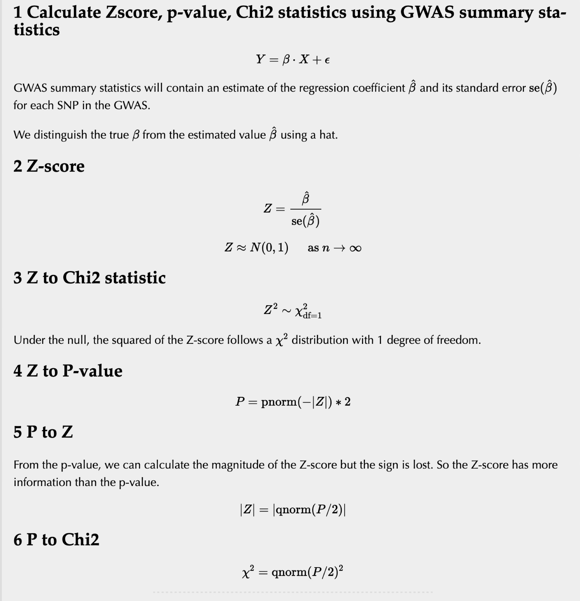
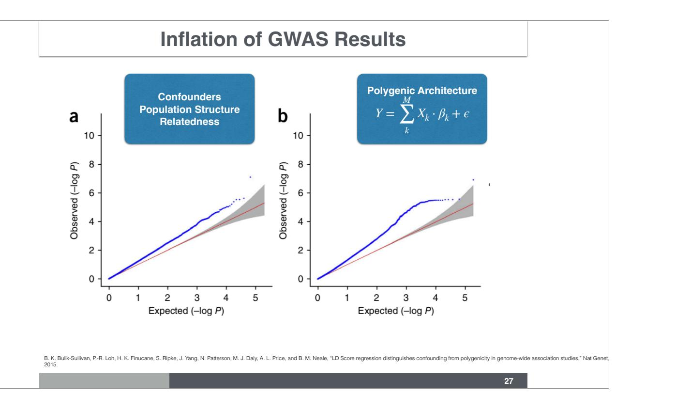
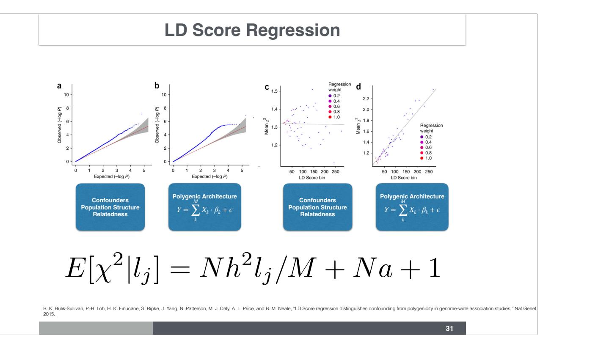
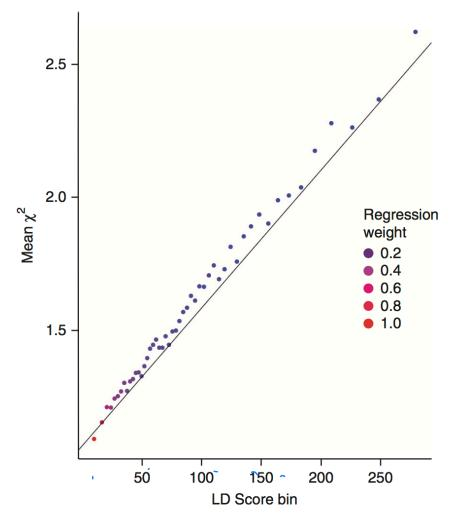
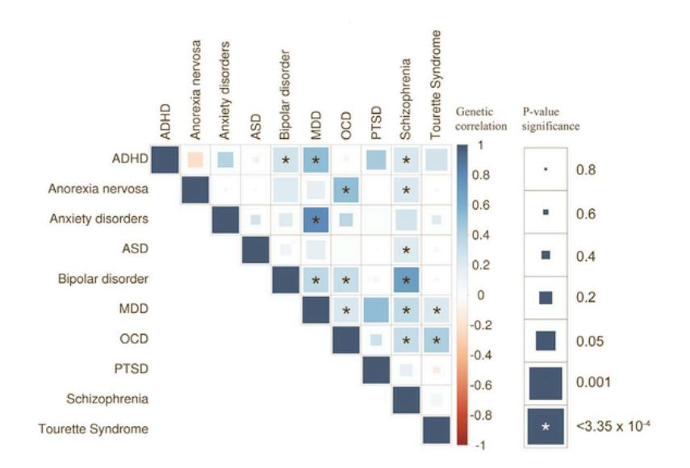

## Last week's recap

We showed that population structure **inflates GWAS test statistics** — and PCs fix it

- The HapMap growth phenotype differed by population → J-shaped p-value histogram
- Adding the top 4 PCs as covariates → uniform p-value distribution, inflation gone
- PCs are the most common correction in practice

But two questions remain:

1. **PCs don't handle everything** — cryptic relatedness and family structure require a more principled model
2. **Inflated λ doesn't always mean bias** — in large studies λ > 1 can reflect true polygenicity, not confounding

## Learning Objectives

1. Understand **genomic control** (λ inflation factor) 
2. Build intuition for the **mixed effects model** (GRM as random effect) — answers question 1
3. Understand the **kinship/GRM** as a random effect covariance structure

. . . 

Time permitting

4. Learn how **LD score regression** separates true polygenicity from confounding — answers question 2
5. Interpret **genetic correlation** estimates from LD score regression

## 1. Genomic Control (Devlin & Roeder, 1999)

- **Assumption**: effects of population stratification and cryptic relatedness are **constant across the genome**
- Test statistics are distributed $\lambda \times \chi^2$
- Estimate $\lambda$ using:
  - Mean of test statistics, or
  - Median: $\lambda = \text{median}(\chi^2) / 0.4549$
- $\lambda < 1.05$ considered acceptable inflation

::: {.notes}
Population stratification leads to inflation of false positives — more small p-values than we would expect under a uniform distribution. The genomic control method corrects for this by dividing all chi-squared statistics by the inflation factor λ. Using the median is more robust to true signals with large chi-squared statistics that could skew the mean.
:::

## Example of a Nice GWAS QQ-Plot

## Genomic Control Adjustment

::: {.notes}
A dumb case-control study with all cases from one population and all controls from another. Chi-squared of these associations before and after genomic control correction. One can also adjust with medians to keep it robust to outliers.
:::

# Mixed Effects Models

## Recall the Regression Approach to GWAS

$$Y = X\beta + \epsilon$$

- $\beta$ = **fixed** effect (SNP effect of interest)
- $X$ = genotype matrix (SNP dosages)

Works well when individuals are unrelated and ancestry is homogeneous

::: {.notes}
Standard GWAS uses ordinary linear regression: phenotype Y is regressed on genotype X. This assumes residuals are independent — which breaks down when samples are related or have different ancestries.
:::

## Extending the Regression Model with a Random Effect

<!-- #### Kang et al. — Variance Component Model (EMMAX) -->

$$Y = X\beta + u + \epsilon$$

$$u \sim N(0,\, \sigma_g^2 \cdot \mathbf{K})$$

- $\beta$ = **fixed** effect (SNP effect of interest)
- $u$ = **random** effect (captures population/family structure)
- $\mathbf{K}$ = genetic relatedness matrix (GRM)

Useful to adjust for confounding due to **population structure**, **family structure**, and **cryptic relatedness**

::: {.source-credit}
Kang et al. *Variance component model to account for sample structure in genome-wide association studies.* Nature Genetics, 2010.
:::

::: {.notes}
Mixed effects models are regression models with both fixed and random effects. β is a fixed effect; u is a random effect specified by its distribution. When K is the genetic relatedness matrix, this model accounts for population structure, family structure, and cryptic relatedness.
:::

## Example with 4 Individuals — Vectors

$$Y = X\beta + u + \epsilon \qquad u \sim N(0, \sigma_g^2 \cdot \mathbf{K})$$

Spell out the vectors for 4 individuals:

$$\begin{bmatrix} y_1 \\ y_2 \\ y_3 \\ y_4 \end{bmatrix} = \begin{bmatrix} x_1 \\ x_2 \\ x_3 \\ x_4 \end{bmatrix} \cdot \beta + \begin{bmatrix} u_1 \\ u_2 \\ u_3 \\ u_4 \end{bmatrix} + \begin{bmatrix} \epsilon_1 \\ \epsilon_2 \\ \epsilon_3 \\ \epsilon_4 \end{bmatrix}$$

$$Y \sim N(X\beta,\; \sigma_g^2 \cdot \mathbf{K} + \sigma_e^2 \cdot \mathbf{I})$$

::: {.notes}
A simple example with 4 individuals: two from EUR ancestry and two from AFR ancestry, no family structure or cryptic relatedness. Here u represents the effect of population membership on phenotype Y. K represents the population pattern; σ_g is the scale of that effect.
:::

## Example with 4 Individuals — Random Effect *u*

$$Y = X\beta + u + \epsilon \qquad u \sim N(0, \sigma_g^2 \cdot \mathbf{K})$$

Spell out the vector $u$ and its variance matrix:

$$\begin{bmatrix} u_1 \\ u_2 \\ u_3 \\ u_4 \end{bmatrix} \sim N \left( \begin{bmatrix} 0 \\ 0 \\ 0 \\ 0 \end{bmatrix},\; \sigma_g^2 \cdot \begin{bmatrix} k_{11} & k_{12} & k_{13} & k_{14} \\ k_{21} & k_{22} & k_{23} & k_{24} \\ k_{31} & k_{32} & k_{33} & k_{34} \\ k_{41} & k_{42} & k_{43} & k_{44} \end{bmatrix} \right)$$

$u$ is a multivariate normal random variable

::: {.notes}
The random effect u is multivariate normal with mean 0 and variance σ²_g · K. The matrix K encodes the genetic similarity between individuals.
:::

## Example with 4 Individuals — Residual *ε*

$$Y = X\beta + u + \epsilon \qquad u \sim N(0, \sigma_g^2 \cdot \mathbf{K})$$

Spell out the vector $\epsilon$ and its variance matrix:

$$\begin{bmatrix} \epsilon_1 \\ \epsilon_2 \\ \epsilon_3 \\ \epsilon_4 \end{bmatrix} \sim N \left( \begin{bmatrix} 0 \\ 0 \\ 0 \\ 0 \end{bmatrix},\; \sigma_e^2 \cdot \begin{bmatrix} 1 & 0 & 0 & 0 \\ 0 & 1 & 0 & 0 \\ 0 & 0 & 1 & 0 \\ 0 & 0 & 0 & 1 \end{bmatrix} \right)$$

$\epsilon$ is a multivariate normal random variable

::: {.notes}
Epsilon is also multivariate normal with variance σ²_e · I. The identity matrix means residuals are independent across individuals — the random effect u captures the correlated structure.
:::

## Checkpoint: What is the Distribution of Y?

$$Y = X\beta + u + \epsilon$$

$$u \sim N(0, \sigma_g^2 \cdot \mathbf{K}) \qquad \epsilon \sim N(0, \sigma_e^2 \cdot \mathbf{I}_{n \times n})$$

. . .

::: {.r-stack}
::: {.fragment style="background: #eaf4fb; border: 2px solid #2980b9; border-radius: 8px; padding: 0.4em 1.5em; text-align: center;"}
$$Y \sim N(\,\cdot\,,\; \cdot\,)$$
:::

::: {.fragment style="background: #eaf4fb; border: 2px solid #2980b9; border-radius: 8px; padding: 0.4em 1.5em; text-align: center;"}
$$Y \sim N(X\beta,\; \sigma_g^2 \cdot \mathbf{K} + \sigma_e^2 \cdot \mathbf{I})$$
:::
:::

::: {.notes}
Since u and ε are both normal and independent, their sum is also normal. The mean is Xβ (the fixed part) and the variance is σ²_g · K + σ²_e · I (genetic structure + residual noise).
:::

## Setup: K for 4 Individuals, 2 Populations

## Deriving K — Setting Up the Variance

$$Y = X\beta + u + \epsilon \qquad u \sim N(0, \sigma_g^2 \cdot \mathbf{K})$$

$$\sigma_g^2 \cdot K = \text{Var}(u) \qquad \small\text{recall: } \text{Var}(u) = E(u - Eu)(u-Eu)' = Euu',\; E(u) = 0$$

$$\text{Var}\begin{bmatrix}u_1\\u_2\\u_3\\u_4\end{bmatrix} = Euu' = E\!\left(\begin{array}{ll}\begin{bmatrix}u_1\\u_2\\u_3\\u_4\end{bmatrix} & \begin{array}{l}[u_1\;u_2\;u_3\;u_4]\\\phantom{u}\\\phantom{u}\\\phantom{u}\\\phantom{u}\end{array}\end{array}\right)$$

> $Eu_{\rm AFR} = Eu_{\rm EUR} = 0 \qquad Eu_{\rm AFR}^2 = Eu_{\rm EUR}^2 = \sigma_g^2 \qquad Eu_{\rm AFR} \cdot u_{\rm EUR} = 0$

::: {.notes}
Var(u) equals E[uu'] because E(u)=0. The outer product of the u vector with itself gives a 4×4 matrix whose (i,j) entry is u_i u_j.
:::

## Deriving K — Expanding the Outer Product

$$Y = X\beta + u + \epsilon \qquad u \sim N(0, \sigma_g^2 \cdot \mathbf{K})$$

$$\sigma_g^2 \cdot K = \text{Var}(u) \qquad \small\text{recall: } \text{Var}(u) = E(u - Eu)(u-Eu)' = Euu',\; E(u) = 0$$

$$\sigma_g^2 \cdot \mathbf{K} = E\begin{bmatrix} u_1 u_1 & u_1 u_2 & u_1 u_3 & u_1 u_4 \\ u_2 u_1 & u_2 u_2 & u_2 u_3 & u_2 u_4 \\ u_3 u_1 & u_3 u_2 & u_3 u_3 & u_3 u_4 \\ u_4 u_1 & u_4 u_2 & u_4 u_3 & u_4 u_4 \end{bmatrix}$$

*expected value ($E$) of a matrix is the $E$ of each element of the matrix*

::: {.notes}
The expectation of a matrix is taken elementwise. Each entry (i,j) becomes E[u_i u_j].
:::

## Deriving K — Taking Expectations

$$Y = X\beta + u + \epsilon \qquad u \sim N(0, \sigma_g^2 \cdot \mathbf{K})$$

$$\sigma_g^2 \cdot K = \text{Var}(u) \qquad \small\text{recall: } \text{Var}(u) = E(u - Eu)(u-Eu)' = Euu',\; E(u) = 0$$

$$\sigma_g^2 \cdot \mathbf{K} = \begin{bmatrix} Eu_1 u_1 & Eu_1 u_2 & Eu_1 u_3 & Eu_1 u_4 \\ Eu_2 u_1 & Eu_2 u_2 & Eu_2 u_3 & Eu_2 u_4 \\ Eu_3 u_1 & Eu_3 u_2 & Eu_3 u_3 & Eu_3 u_4 \\ Eu_4 u_1 & Eu_4 u_2 & Eu_4 u_3 & Eu_4 u_4 \end{bmatrix}$$

> $Eu_{\rm AFR} = Eu_{\rm EUR} = 0 \qquad Eu_{\rm AFR}^2 = Eu_{\rm EUR}^2 = \sigma_g^2 \qquad Eu_{\rm AFR} \cdot u_{\rm EUR} = 0$

> $u_1 = u_2 = u_{\rm AFR}~~~$ and $~~~u_3 = u_4 = u_{\rm EUR}$

::: {.notes}
Now apply the assumptions: within-population variance = σ²_g; between-population covariance = 0.
:::

## Deriving K — Final Result

$$Y = X\beta + u + \epsilon \qquad u \sim N(0, \sigma_g^2 \cdot \mathbf{K})$$

$$\sigma_g^2 \cdot K = \text{Var}(u) \qquad \small\text{recall: } \text{Var}(u) = E(u - Eu)(u-Eu)' = Euu',\; E(u) = 0$$

$$\sigma_g^2 \cdot \mathbf{K} = \sigma_g^2 \cdot \begin{bmatrix} 1 & 1 & 0 & 0 \\ 1 & 1 & 0 & 0 \\ 0 & 0 & 1 & 1 \\ 0 & 0 & 1 & 1 \end{bmatrix}$$

> $Eu_{\rm AFR} = Eu_{\rm EUR} = 0 \qquad Eu_{\rm AFR}^2 = Eu_{\rm EUR}^2 = \sigma_g^2 \qquad Eu_{\rm AFR} \cdot u_{\rm EUR} = 0$

> $u_1 = u_2 = u_{\rm AFR}~~~$ and $~~~u_3 = u_4 = u_{\rm EUR}$

::: {.notes}
Within-population pairs (AFR-AFR, EUR-EUR) have K=1; between-population pairs have K=0. The σ²_g cancels, leaving the block structure of K.
:::

## Genetic Relatedness Matrix (GRM) — HapMap Trio Example

::: {.source-credit}
[bios25328.hakyimlab.org/post/2021/02/18/l8-grm/](https://bios25328.hakyimlab.org/post/2021/02/18/l8-grm/)
:::

::: {.notes}
GRM of 2 European and 2 African trios (mother, father, child) from HapMap (YRI, CEU) calculated using plink's --make-grm-gz. The 6×6 population blocks are visible, and the 3×3 family blocks (trios) are nested within them. Random mating within populations is a reasonable assumption. Can you identify which individual is the child within each trio?
:::

## Mixed Effects Correction vs. PC vs. Genomic Control

::: {.source-credit}
Kang et al. *Variance component model to account for sample structure in genome-wide association studies.* Nature Genetics, 2010.
:::
::: {.notes}
Kang et al. compare uncorrected p-values (inflated), p-values corrected for 100 PCs (eigensoft), and EMMAX-corrected p-values. Panel b compares EMMAX to simple genomic control, showing similar correction. Notice that the authors use genomic control as a measure of goodness of fit.
:::

## Combination Strategy vs. Pure Mixed Effects

:::: {.columns}
::: {.column width="50%"}
**Combination strategy (common practice)**

- Remove close relatives
- Correct broad sample structure with PCs
- Correct residual inflation with genomic control (divide χ² by λ)
:::
::: {.column width="50%"}
**Mixed effects model**

- Use genetic relatedness matrix to account for all sample structure
- PCs are eigenvectors of the GRM

:::
::::

. . . 

:::{.takehome}

Mixed effects models are computationally expensive
:::

::: {.notes}
Mixed effects models are powerful but computationally expensive and can sometimes over-correct (deflation). Still today, the simpler approach of removing close relatives is common — in UK Biobank studies, over 100K individuals have been excluded to avoid relatedness.
:::

# LD Score Regression

## What is a Statistic?

To understand genomic control, we need to know what is a statistic.

In statistics terminology, a statistic is a function of the data

## Examples of Statistics

::: {.source-credit}
[bios25328.hakyimlab.org/post/2022/04/13/calculate-z-score-p-value-chi2-stat-from-gwas/](https://bios25328.hakyimlab.org/post/2022/04/13/calculate-z-score-p-value-chi2-stat-from-gwas/)
:::

## Inflation of Test Statistics: Two Causes

Inflation of summary statistics can be due to:

1. **Confounders** — population structure, cryptic relatedness
2. **True polygenicity** — most variants have a causal effect or are in LD with causal variants

**Genomic control cannot distinguish between these two.** Dividing by λ punishes real signal.

::: {.notes}
This is the central question of the LDSC section. A flat correction like genomic control is dangerous for polygenic traits — it removes true signal. LD score regression was developed precisely to separate these two contributions.
:::

## LD and Chi² Statistics

::: {.notes}
A locus-zoom-like plot with chi-squared statistics instead of p-values. Variants in high-LD regions have higher association statistics — they tag more causal variants. Variants with many "LD friends" are lifted up because they are more likely to tag causal variants.
:::

## LD Score: Measure of LD with Neighboring Variants

$$l_j = \sum_k r_{j,k}^2$$

- $l_j$ = LD score of variant $j$
- Measures amount of genetic variation **tagged** by variant $j$
- SNPs in high-LD regions have high LD scores

::: {.notes}
The LD score is the number of "LD friends" — calculated as the sum of r² with all neighboring variants. Each genetic variant has one LD score.
:::

## Polygenic Additive Model

$$Y = \sum_{k}^{M} X_k \cdot \beta_k + \epsilon \qquad \beta \sim N(0, \sigma_{\beta}^2)$$

- All $M$ common SNPs contribute to the phenotype
- Effect sizes are drawn independently from a normal distribution
- This is the main model for common disease genetics

::: {.notes}
Under this polygenic model, variants in high-LD regions are more likely to tag causal variants, so they will have higher chi-squared statistics on average. This is the key insight underlying LD score regression.
:::

## LD Score Regression Distinguishes Confounding from Polygenicity

$$E[\chi^2 \mid l_j] = \frac{Nh^2}{M} l_j + Na + 1$$

- **Slope** ($Nh^2/M$): driven by true polygenicity → estimates **heritability**
- **Intercept** ($Na + 1$): driven by confounding → estimates **population stratification / relatedness bias**

::: {.notes}
Bulik-Sullivan et al. show we can distinguish inflation due to confounding (flat line, intercept > 1) from polygenicity (positive slope proportional to LD score). Variants in high-LD regions have higher chi-squared due to tagging more causal variants. Inflation from cryptic relatedness or population stratification from genetic drift does NOT correlate with LD score.
:::

## LD Score Regression — Parameters

| Parameter | Meaning |
|-----------|---------|
| $N$ | sample size |
| $M$ | number of SNPs |
| $h^2/M$ | variance explained per SNP |
| $a$ | confounding: cryptic relatedness + population stratification |
| $l_j = \sum_k r^2_{jk}$ | amount of genetic variation tagged by SNP $j$ |

## LD Score Regression — Schizophrenia

::: {.notes}
Schizophrenia has a very high LD score regression intercept, indicating substantial true polygenicity in addition to any confounding. The positive slope shows that SNPs with more LD friends have systematically higher chi-squared statistics.
:::

## Genomic Control vs. LD Score Regression

| Trait | $\lambda_{GC}$ (raw) | $\lambda_{GC}$ (corrected) | LDSC intercept |
|-------|------------|-----------------|----------------|
| Ulcerative colitis | 1.174 | 1.128 | 1.079 (0.010) |
| Crohn's disease | 1.185 | 1.122 | 1.059 (0.008) |
| Schizophrenia | 1.613 | 1.484 | 1.070 (0.010) |
| ADHD | 1.033 | 1.033 | 1.008 (0.006) |
| Bipolar disorder | 1.154 | 1.135 | 1.030 (0.008) |
| PGC cross-disorder | 1.205 | 1.187 | 1.018 (0.008) |
| Major depression | 1.063 | 1.063 | 1.009 (0.006) |
| Rheumatoid arthritis | 1.063 | 1.033 | 0.980 (0.007) |
| Coronary artery disease | 1.125 | 1.096 | 1.033 (0.008) |
| Type 2 diabetes | 1.116 | 1.097 | 1.025 (0.008) |

::: {.notes}
Notice that the LDSC intercept is systematically smaller than the genomic control λ. For schizophrenia, λ=1.613 looks alarming, but the LDSC intercept is only 1.070 — most of the inflation is true polygenicity, not confounding. Genomic control would have over-corrected.
:::

## LD Score Values on Chromosome 22

Calculated by Yanyu Liang using GTEx V8 reference variant set

::: {.notes}
LD scores vary considerably across the chromosome, reflecting the local LD structure. Regions with high LD have high LD scores; sparse regions have low LD scores.
:::

## Genetic Correlation Between Traits

With the same assumptions, LD score regression can estimate **genetic correlation** between traits:

$$E[z_{1j} z_{2j} \mid l_j] = \frac{\sqrt{N_1 N_2}}{M} \varrho_g \cdot l_j + \frac{\varrho N_s}{\sqrt{N_1 N_2}}$$

::: {.notes}
By regressing the product of Z-scores of two traits against LD scores, we can estimate their genetic correlation. This avoids confounders in observational studies and provides orthogonal evidence for associations.
:::

## LD Score Regression Estimates h² and Genetic Correlation

$$E[\chi^2 \mid l_j] = \frac{Nh^2}{M} l_j + Na + 1 \quad \leftarrow \text{ heritability + confounders}$$

$$E[z_{1j} z_{2j} \mid l_j] = \frac{\sqrt{N_1 N_2}}{M} \varrho_g \cdot l_j + \frac{\varrho N_s}{\sqrt{N_1 N_2}} \quad \leftarrow \text{ genetic correlation}$$

By partitioning LD scores into functional categories, we can also **partition heritability by functional annotation**.

::: {.notes}
The same LD score regression framework extends to estimate: heritability, confounding bias, genetic correlation between traits, and partitioned heritability by functional category. This is a very powerful unified framework from a single GWAS run.
:::

## Genetic Correlation Among Cancers

| | Breast | Colorectal | Lung | Ovarian | Pancreatic | Prostate |
|---|---|---|---|---|---|---|
| Breast | 1 | 0.22 (0.09) | 0.27 (0.11) | 0.26 (0.20) | 0.17 (0.19) | 0.06 (0.09) |
| Colorectal | — | 1 | 0.31 (0.10) | -0.08 (0.13) | 0.55 (0.19) | 0.09 (0.07) |
| Lung | — | — | 1 | -0.17 (0.17) | 0.32 (0.19) | 0.095 (0.08) |
| Ovarian | — | — | — | 1 | -0.40 (0.29) | 0.02 (0.14) |
| Pancreatic | — | — | — | — | 1 | -0.06 (0.14) |
| Prostate | — | — | — | — | — | 1 |

::: {.source-credit}
[ncbi.nlm.nih.gov/pmc/articles/PMC5582139/](https://www.ncbi.nlm.nih.gov/pmc/articles/PMC5582139/)
:::

## Genetic Correlation: Cancer and Other Diseases

## Caveat: Assortative Mating Confounds Genetic Correlation

**Cross-trait assortative mating** inflates genetic correlation estimates

::: {.source-credit}
Border et al. *Cross-trait assortative mating is widespread and inflates genetic correlation estimates.* Science, 2022.
:::

::: {.notes}
If people mate non-randomly based on traits that are genetically correlated, this creates spurious genetic correlations. The Brainstorm Consortium and Border et al. show this is a real concern for psychiatric disorders.
:::

## Genetic Correlation Among Psychiatric Diseases

::: {.source-credit}
Brainstorm Consortium. *Analysis of shared heritability in common disorders of the brain.* Science, 2018.
:::

::: {.notes}
The Brainstorm Consortium estimated genetic correlations among 25 brain disorders. Many psychiatric disorders show high genetic correlations with each other, suggesting shared biological mechanisms.
:::
