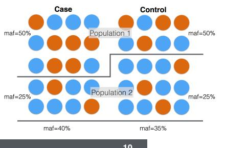

# L6 Figure Explanations: Mixed Effects Models & LD Score Regression

---

## Figure: `_page_6_Figure_1.jpeg` — GWAS QQ-Plot with Inflation

A quantile-quantile (QQ) plot of GWAS p-values. The x-axis shows expected -log10(p) values under the null hypothesis of no association; the y-axis shows the observed -log10(p) values. The red diagonal line is the identity line (what we'd see if there were no associations and no inflation).

The observed points closely follow the diagonal for small p-values (common, unassociated SNPs), but sharply deviate upward in the middle range, indicating a systematic excess of small p-values beyond what is expected by chance. This is a hallmark of **inflation** due to population stratification, cryptic relatedness, or other confounders — test statistics are systematically larger than they should be under the null. A "nice" QQ-plot would hug the diagonal until only a few top hits depart at the far upper right.

---

## Figure: `_page_7_Figure_0.jpeg` — Genomic Control Adjustment

This QQ-plot shows Chi2 statistics (instead of p-values) for a simulated extreme case-control GWAS where all cases come from one population and all controls from another. The x-axis is the expected Chi2 under the null; the y-axis is observed Chi2.

- **Black circles**: uncorrected Chi2 statistics, massively inflated
- **Green X's**: corrected by dividing by λ = mean(observed Chi2) / mean(expected Chi2)
- **Blue X's**: corrected using the median-based λ = median(observed Chi2) / 0.4549, which is more robust to outliers (true signals with very large Chi2 would inflate the mean-based λ and over-correct)

Both genomic control approaches bring the statistics back toward the diagonal, but neither fully corrects the extreme stratification. The figure motivates why genomic control works well when λ is close to 1 but becomes problematic for highly stratified studies.

---

## Figure: `_page_9_Figure_4.jpeg` — Population Stratification Creates Spurious Associations

A cartoon illustrating how population structure causes spurious associations. Cases (left) and controls (right) are drawn from two populations. In Population 1 (top), both cases and controls have MAF of 50%. In Population 2 (bottom), both have MAF of 25%. However, the overall MAF among cases is 40% and among controls is 35% — a difference that arises purely from the populations being unequally sampled between case and control groups, not from any true genetic effect on disease. Any SNP with different allele frequencies between Population 1 and Population 2 will appear associated with case-control status.

---

## Figure: `_page_17_Figure_0.jpeg` — Mixed Effects Model: Calculating K for 4 Individuals

This slide works through the mixed effects model Y = Xβ + u + ε for 4 individuals — two from African ancestry (AFR) and two from European ancestry (EUR). The random effect vector u has entries u_AFR, u_AFR, u_EUR, u_EUR. The key assumptions shown are:

- u_AFR and u_EUR are each normally distributed with mean 0 and variance σ²_g
- u_AFR ⊥ u_EUR (the population effects are independent)
- Therefore: E[u_AFR] = E[u_EUR] = 0; E[u²_AFR] = E[u²_EUR] = σ²_g; E[u_AFR · u_EUR] = 0

These assumptions lead directly to the block structure of the kinship matrix K used in the mixed effects model, where individuals from the same population share high relatedness and individuals from different populations have near-zero relatedness.

---

## Figure: `_page_22_Figure_0.jpeg` — HapMap Trios Genetic Relatedness Matrix

A heatmap of the genetic relatedness matrix (GRM) for 12 HapMap individuals: two YRI (Yoruba) trios (NA19222, NA19223, NA19221, NA19206, NA19207, NA19208) and two CEU (European) trios (NA12489, NA12546, NA12376, NA07346, NA07347, NA07349). The color scale goes from dark blue (~0) to light blue (~1.0).

Two levels of structure are visible:
1. **Population structure**: The 6×6 off-diagonal blocks between YRI and CEU individuals are very dark (near zero relatedness across populations), while the 6×6 diagonal blocks within each population are lighter (higher within-population relatedness).
2. **Family structure**: Within each population, the 3×3 sub-blocks for each trio show elevated relatedness within families. Within a trio, parents have lower relatedness to each other than to their child. The child (who inherits from both parents) shows the highest diagonal value relative to the parents' cross-relatedness.

---

## Figure: `_page_23_Figure_0.jpeg` — EMMAX Corrects Both Relatedness and Population Stratification

From Kang et al. (2010), using the NFBC66 (Northern Finland Birth Cohort) dataset:

**Panel a**: QQ-plot of -log10(p) comparing three approaches. The uncorrected p-values (black) are clearly inflated, departing above the diagonal early. Correcting with 100 principal components (ES100, red) reduces inflation substantially. EMMAX (blue, mixed effects model) reduces inflation the most, lying closest to the expected diagonal.

**Panel b**: Scatter plot of EMMAX p-values vs. genomic-control-corrected p-values (-log10 scale). Points lie close to the identity line, showing that EMMAX and genomic control produce similar levels of correction. This validates EMMAX against the simpler genomic control approach and confirms that the mixed effects model is not over- or under-correcting relative to the standard benchmark.

---

## Figure: `_page_24_Figure_7.jpeg` — GRM Used in Mixed Effects Model (Thumbnail)

A smaller version of the HapMap trios relatedness matrix heatmap (same data as page 22), shown here to illustrate the key conceptual point that **principal components are eigenvectors of the GRM**. The mixed effects approach uses the full GRM directly rather than just the top eigenvectors (PCs), so it captures both broad population structure and finer-scale relatedness simultaneously.

---

## Figure: `_page_26_Figure_0.jpeg` — Two Sources of GWAS Inflation Look the Same in QQ-Plots

From Bulik-Sullivan et al. (2015). Two QQ-plots of observed vs. expected -log10(p):

**Panel a**: Inflation due to **confounders** (population structure, cryptic relatedness). The blue curve departs from the null diagonal across the whole distribution.

**Panel b**: Inflation due to **polygenic architecture** (Y = ΣXₖβₖ + ε, many variants with small true effects). The blue curve similarly departs from the diagonal.

The key insight is that **genomic control (λ) cannot distinguish between these two causes** — both inflate the chi2 statistics uniformly. LD score regression was developed to disentangle them: polygenic inflation correlates with LD score, while confounder-driven inflation does not.

---

## Figure: `_page_27_Figure_0.jpeg` — High LD Regions Produce High Chi2 Statistics

A genome-wide plot of SNP Chi2 statistics (y-axis) with SNPs colored by their LD (r²) with the lead SNP rs5743618 (purple diamond at top). The annotation "SNPs with many LD-friends gets lifted up" with an arrow points to the cluster of high-Chi2 SNPs around the lead variant.

This figure illustrates the core intuition behind LD score regression: in a polygenic trait, a SNP that is in strong LD with a causal variant will have an inflated Chi2 statistic. More broadly, SNPs in high-LD regions (high LD score) are more likely to tag at least one causal variant than SNPs in low-LD regions, so on average their Chi2 statistics will be higher. This is the biological basis for regressing Chi2 on LD score.

---

## Figure: `_page_30_Figure_0.jpeg` — LD Score Regression Distinguishes Confounding from Polygenicity

From Bulik-Sullivan et al. (2015), this figure demonstrates the key principle of LD score regression with 4 panels:

**Panels a & b**: QQ-plots for the confounder scenario (a) and polygenic scenario (b) — both show inflation above the diagonal, illustrating that QQ-plots alone cannot distinguish these causes.

**Panel c**: Mean Chi2 statistic binned by LD score for the **confounder scenario**. The mean Chi2 is approximately flat across LD score bins — confounding inflates all SNPs equally regardless of LD, so the slope is near zero. The intercept is elevated above 1.

**Panel d**: Mean Chi2 statistic binned by LD score for the **polygenic scenario**. There is a clear positive linear relationship — SNPs in higher LD score bins have higher mean Chi2. The intercept is near 1 (no confounding), and the slope reflects heritability.

The unifying equation is: **E[χ²|lⱼ] = Nh²lⱼ/M + Na + 1**, where the slope term (Nh²/M) captures polygenicity and the intercept term (Na + 1) captures confounding.

---

## Figure: `_page_32_Figure_1.jpeg` — LDSC Equation: Decomposing Inflation

A visual annotation of the LD score regression equation:

**E[χ²|lⱼ] = Nh²lⱼ/M + Na + 1**

Two arrows label the two inflating terms:
- **Nh²lⱼ/M** → "Polygenic component": inflation proportional to LD score lⱼ, arising from true genetic effects
- **Na** → "confounders, Population Structure, Relatedness": inflation independent of LD score, arising from cryptic relatedness or population stratification

This decomposition is the key insight: by regressing mean Chi2 on LD score, the **slope** estimates heritability and the **intercept** estimates confounding. A well-controlled GWAS should have an intercept near 1.

---

## Figure: `_page_33_Figure_1.jpeg` — LD Score Regression Plot for Schizophrenia

An empirical LD score regression plot using schizophrenia GWAS summary statistics. Each point is a bin of SNPs grouped by LD score (x-axis), with the mean Chi2 statistic on the y-axis. Points are colored by regression weight (dark purple = low weight ~0.2; red = high weight ~1.0). The regression line has a clear positive slope.

The strong linear trend confirms that the elevated Chi2 statistics in schizophrenia are driven substantially by true polygenic signal (many variants with small effects), rather than purely by population stratification. The intercept (where the line crosses the y-axis at LD score = 0) provides an estimate of the confounding component; here it is modestly above 1, indicating some residual confounding but mostly polygenic signal.

---

## Figure: `_page_35_Figure_1.jpeg` — LD Score Distribution on Chromosome 22

Two panels showing LD scores calculated from GTEx V8 reference variants on chromosome 22 (by Yanyu Liang):

**Left**: LD score plotted against chromosomal position (x-axis: ~10Mb to ~50Mb). Most SNPs have LD scores below 200, but several genomic regions show spikes up to ~600, corresponding to high-LD blocks or regions with many nearby variants in linkage disequilibrium.

**Right**: Histogram of LD scores across all chr22 SNPs. The distribution is strongly right-skewed: the majority of SNPs have LD scores in the 0–100 range, with a long tail extending to ~600. This reflects the heterogeneous LD structure of the genome — most regions have moderate LD while a few high-LD hotspots show very large LD scores.

---

## Figure: `_page_36_Figure_0.jpeg` — Genetic Correlations Across Human Diseases and Traits

From Bulik-Sullivan et al. (2015), *Nature Genetics*. A triangular heatmap of pairwise genetic correlations (rg) estimated by cross-trait LD score regression across ~25 complex traits and diseases. Color scale: blue = positive genetic correlation, red = negative; dot size indicates statistical significance.

Notable patterns:
- Metabolic traits (BMI, fasting glucose, T2D, LDL, triglycerides) cluster together with positive correlations
- Psychiatric/neurological traits (schizophrenia, bipolar disorder, depression, anorexia) show positive genetic correlations with each other
- Some trait pairs show negative genetic correlations (e.g., HDL cholesterol negatively correlated with metabolic disease risk)
- "Years of education" shows a negative genetic correlation with BMI and metabolic traits, and a positive correlation with some psychiatric conditions

Genetic correlations estimated this way are free from many environmental confounders present in observational phenotypic correlations, providing cleaner evidence for shared biological pathways.

---

## Figure: `_page_39_Figure_1.jpeg` — Genetic Correlation Between Cancers and Other Traits

A heatmap showing genetic correlations between 6 cancer types (breast, colorectal, lung, ovarian, pancreatic, prostate — x-axis) and 15 complex traits/diseases (y-axis), including cardiovascular risk factors, metabolic traits, and immune disorders. The color scale ranges from -0.4 (blue) to +0.4 (red); asterisks (*) mark statistically significant correlations.

Key observations:
- BMI and height show significant positive correlations with several cancers
- Schizophrenia shows a notable positive genetic correlation with pancreatic cancer (red, starred)
- HDL cholesterol shows a strong negative correlation (blue) with one of the cancers
- Most cancer–trait pairs show modest or non-significant genetic correlations, suggesting cancer risk alleles are largely distinct from alleles underlying other common diseases

---

## Figure: `_page_41_Figure_1.jpeg` — Genetic Correlations Among Psychiatric Disorders

From the Brainstorm Consortium (Science, 2018). A lower-triangular heatmap of pairwise genetic correlations among 10 brain disorders: ADHD, Anorexia nervosa, Anxiety disorders, ASD, Bipolar disorder, MDD (major depressive disorder), OCD, PTSD, Schizophrenia, and Tourette Syndrome. Color scale: blue = positive correlation (up to 1), red = negative (down to -1); box size encodes p-value significance.

Key findings:
- Most disorder pairs show **positive** genetic correlations (predominantly blue), consistent with shared genetic risk architecture across psychiatric conditions
- Bipolar disorder and schizophrenia show a strong positive genetic correlation (large blue square, starred)
- MDD is positively correlated with ADHD, anxiety, and PTSD
- Some pairs (e.g., anorexia with certain disorders) show weaker or negative correlations
- The broad pattern supports a continuum of genetic risk across many psychiatric conditions rather than fully distinct etiologies

Note: As discussed in lecture, cross-trait assortative mating can inflate genetic correlation estimates (Border et al. 2022), so these values should be interpreted with caution.
