### Predicting Disease Risk Polygenic Risk Scores

Methods, Applications, and Ethical Considerations

Hae Kyung Im - April 16, 2025

#### **Learning Objectives**

- Explain the polygenic additive model and its role in PRS calculation
- Describe the statistical challenges in estimating PRS and methods to address them
- Evaluate the clinical utility and limitations of PRS, including ancestry-related biases
- Discuss the ethical considerations surrounding the use of PRS in embryo screening
- Compare and contrast different approaches for calculating and improving PRS

#### **Overview**

- The polygenic additive model and challenges in parameter estimation
- Definition of PRS
- Statistical methods for calculating PRS
- Clinical applications of PRS
- Factors affecting PRS accuracy and generalizability
- Ethical considerations in PRS research and application

#### **Polygenic Additive Model**

$$Y = \sum_{k}^{M} X_k \cdot \beta_k + \epsilon$$

The most common model used to study the genetics of complex diseases today is this polygenic additive model. X\_k represents the genotype in position k, β\_k is the effect size of SNP k. ε is the error term, typically representing the environmental component, but in practice, it accommodates everything that doesn't fit in the summation.

#### **Polygenic Additive Model**

$$Y = \sum_{k}^{M} X_k \cdot \beta_k + \epsilon$$

$$Y = \text{covariates} + \sum_{k}^{M} X_k \cdot \beta_k + \epsilon$$

**5**

One can add covariates such as sex, age, etc to make the model more general.

#### **Estimating Parameters of Polygenic Additive Model**

Can we fit all SNPs at the same time?

$$Y = \mu + a \operatorname{age} + \beta_1 X_1 + \beta_2 X_2 + \dots + \beta_{1,000,000} X_{1,000,000}$$

Why can't we estimate betas by least squares?

**6**

We may wonder why we don't fit all the SNPs at the same time.

#### **Estimating Parameters of Polygenic Additive Model**

Can we fit all SNPs at the same time?

$$Y = \mu + a \operatorname{age} + \beta_1 X_1 + \beta_2 X_2 + \dots + \beta_{1,000,000} X_{1,000,000}$$

Why can't we estimate betas by least squares?

**Too many parameters and too few observations**

#### **Rule of Thumb**

10 data points per parameter

In a pinch, at least 5 data points per parameter

#### **Solution: Random Effects Reduces # Parameters**

Can we fit all SNPs at the same time?

$$Y = \mu + a \operatorname{age} + \beta_1 X_1 + \beta_2 X_2 + \dots + \beta_{1,000,000} X_{1,000,000}$$

Why can't we estimate betas by least squares?

Too many parameters and too few observations

#### **Solution**

Assume  $\beta \sim N(0,\sigma_{\beta}^2)$  and estimate just the  $\sigma_{\beta}^2$ 

9

It is reasonable to think that we could fit all the SNPs at the same time. The problem we encounter when we try to do that is that there are too many parameters and not enough data points. We typically have millions of SNPs and only thousands of individuals. Even with sample sizes growing the estimates would be overfitting the data and not work very well in new individuals. So instead of fitting millions of βs as fixed effects, we can consider them to be random and estimate their distribution, i.e. consider

 $\beta$  to be normally distributed with mean 0 and variance  $\sigma^2$  and only estimate the variance parameter  $\sigma^2$ . So from millions of parameters we are down to 1.

#### **Mixed Effects Modeling**

$$Y = \text{fixed effects} + \text{random effects} + \text{noise}$$
  
=  $\text{fixed effects} + \sum \beta_k X_k + \epsilon$ 

are random 0 *ks*

$$\beta_k \sim N(0, \sigma_\beta^2)$$

\*\* this is one form of Regularization, more on this later

#### **Connection to EMMAX Used To Account for Population Structure?** *Y* = fixed e↵ects + random e↵ects + noise

$$Y = \text{fixed effects} + \sum \beta_k X_k + \epsilon$$

Recall EMMAX, mixed effects approach to adjust for population structure and relatedness

- Y = xtest · βtest + *u* + ε
- *u ~ N*(0,σ2 ·**K**)

$$Y = X_{\text{test}} \cdot \beta_{\text{test}} + \sum_{k} X_{k} \beta_{k} + \epsilon$$

**11**

Here we can see the connection between the EMMAX' random effect *u* and the sum of the effects of all the snps. To demonstrate that Emmax random effect is the same as the sum of the effects of all the snps, all we need to do is to shown that they have the same covariance matrix, also equal to the genetic relatedness matrix.

Calculate E u u', you will find that that's = σ^2 K, where K is the genetic relatedness matrix. QED.

## Review: norm of vectors

Let's review what a norm of a vector is.

#### **L2 Norm of Vector**

$$X = \begin{bmatrix} x_1 \\ x_2 \\ \vdots \\ x_M \end{bmatrix} \quad \|X\|_2 = \sqrt{\sum_k x_k^2}$$

**13**

This is the L2 norm of a vector. It's the our familiar Euclidian distance of a vector.

#### **In a GWAS we minimize the L2 norm of the error term**

In a GWAS we find one SNP at a time

$$\mathbf{Y} = \mu + a \cdot \mathbf{age} + \beta_1 \cdot \mathbf{X} + \epsilon$$

Find *µ, a, β* that minimizes squared error. These are fixed parameters.

$$||\mathbf{Y} - \mu - a \cdot \mathbf{age} - \beta_1 \cdot \mathbf{X}||_2^2$$

**14**

The least squares approach we use in a traditional linear regression, what we are doing is to fin estimates of μ, a, and β1 that minimize the L2 norm of the error term.

#### **In a GWAS we minimize the L2 norm of the error term**

$$||\mathbf{Y} - \mu - a \cdot \mathbf{age} - \beta_1 \cdot \mathbf{X}||_2^2$$

$$= (y_1 - \mu - a \cdot \mathbf{age}_1 - \beta_1 \cdot x_1)^2 +$$

$$(y_2 - \mu - a \cdot \mathbf{age}_2 - \beta_1 \cdot x_2)^2 +$$

$$\cdots +$$

$$(y_n - \mu - a \cdot \mathbf{age}_n - \beta_1 \cdot x_n)^2$$

**15**

Here we spell out what we mean by L2 norm.

#### **Which one do you think is the L1 norm?**

$$||\mathbf{Y} - \mu - a \cdot \mathbf{age} - \beta_1 \cdot \mathbf{X}||_1$$

$$= (y_1 - \mu - a \cdot \mathbf{age}_1 - \beta_1 \cdot x_1)^1 +$$

$$(y_2 - \mu - a \cdot \mathbf{age}_2 - \beta_1 \cdot x_2)^1 +$$

$$\dots +$$

$$(y_n - \mu - a \cdot \mathbf{age}_n - \beta_1 \cdot x_n)^1$$
Option 1

**OR**

$$= |y_1 - \mu - a \cdot age_1 - \beta_1 \cdot x_1|^1 + |y_2 - \mu - a \cdot age_2 - \beta_1 \cdot x_2|^1 +$$

$$\cdots + |y_n - \mu - a \cdot age_n - \beta_1 \cdot x_n|^1$$
Option 2

**16**

Which definition would make more sense to be the L1 norm? Why?

## Prediction of Complex Traits

Prediction of complex traits can help us better tailor treatment of patients.

### Simple Polygenic Risk Score

LETTERS

# Common polygenic variation contributes to risk of schizophrenia and bipolar disorder

The International Schizophrenia Consortium\*

$$Y = \sum_{k=1}^{M} \hat{\beta}_k^{\text{GWAS}} X_k$$

Just use GWAS effect sizes

18

Polygenic risk scores are simple to calculate, just take the estimates from the GWAS (output from plink for example) and multiply by the person's genotype and sum. This seemingly naive approach yields much better prediction than one could expect.

#### **Tricks to Deal with Too Many Parameters**

- 1. Model βs as random effects
- 2. Use GWAS effects (fit one SNP at a time, ignoring the rest)
- 3. Penalized likelihood is another way to deal with too many parameters
- also referred to as regularization

$$\|Y - \sum_{k} X_{k} \beta_{k}\|_{2} + \lambda_{1} \|\beta\|_{1} + \lambda_{2} \|\beta_{2}\|_{2}$$

**19**

Here are a list of tricks one can use when we have too many parameters to estimate.

- 1. is to assume that βs are random effects so that instead of estimating each β\_k, you just estimate the variance of β.
- 2. The simple GWAS approach, run one SNP at a time, hoping that ε can "absorb" all the rest and the estimates are useful
- 3. Regularization: one form of regularization is to restrict that values that the parameters can take, i.e. by penalizing the L1 or L2 norms of the vector of parameters (β1, β2, … β\_Μ)

### **Best Linear Unbiased Prediction (BLUP)/Ridge**

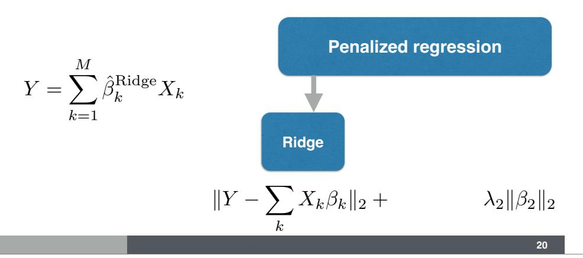

Ridge regression approach minimizes the likelihood with a penalty on the L2 norm of the effect size vector, i.e. it tries to minimize the mean square error while still keeping the length of the effect size vector small.

#### **LASSO/Elastic Net Prediction**

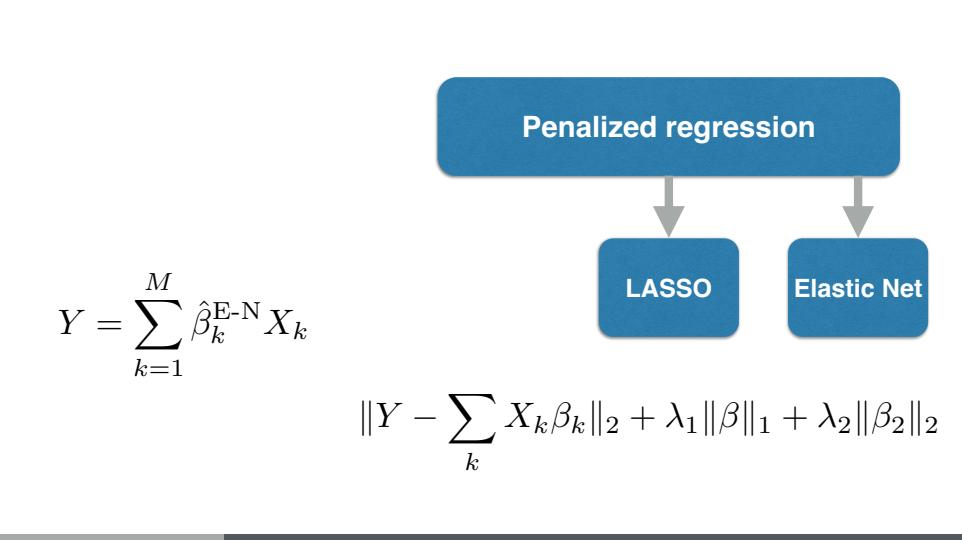

**21**

LASSO penalizes sum of the absolute values of the effect sizes, i,e,the L1 norm of the effect size vector. These tend to yield sparse models, a few SNPs rather than polygenic models.

Elastic net mixes both L1 and L2 norms yielding less sparse models, although not quite polygenic ones.

### **Whole Genome Prediction Approaches**

OPEN & ACCESS Freely available online

### Polygenic Modeling with Bayesian Sparse Linear Mixed Models

Xiang Zhou1\*, Peter Carbonetto1, Matthew Stephens1,2\*

$$Y = \sum_{k=1}^{M} \beta_k^L X_k + \sum_{k=1}^{M} \beta_k^S X_k + \epsilon$$

$$\beta_k^L \sim N(0, \sigma_L^2)$$

$$\beta_k^S \sim N(0, \sigma_S^2)$$

22

Other approches for prediction include BSLMM, multiBLUP, OmicKriging.

BSLMM models the genetic effects as coming from a mixture of normals instead of just one normal distribution. One with small variance captures the polygenic component whereas the large variance component captures the sparse effects (a few SNPs with large effects). By selecting the right can sparsity can be enforced.

#### **Advantages of Simple Polygenic Scores**

Main advantage easy to get or calculate, scalable

GWAS results publicly available

vs. multivariate approaches (ridge, elastic net, BSLMM) need individual data

although some fine-mapping methods allow inferring multivariate regression results from summary statistics

#### **Polygenic Scores Can Be Improved Using LD Information**

- Pruning and thresholding (PRSice)
- Lasso-sum (Mak et al)
- LD-Pred (Vilhjálmsson)
- RSS (Zhu)
- S-BayesR (Lloyd-Jones)
- PRS-CS

RSS and S-BayesR are likelihood-based methods, different priors on *β*′*s*

Zhu, X., & Stephens, M. (2017). Bayesian large-scale multiple regression with summary statistics from genome-wide association studies. AOAS Vilhjálmsson et al. (2015). Modeling Linkage Disequilibrium Increases Accuracy of Polygenic Risk Scores. AJHG Mak,et al (2017). Polygenic scores via penalized regression on summary statistics. Genetic Epidemiology, 41(6), 469–480. Luke R. Lloyd-Jones (2019). Improved polygenic prediction by Bayesian multiple regression on summary statistics. BioRxiv. Ge, T., Chen, CY., Ni, Y. et al. Polygenic prediction via Bayesian regression and continuous shrinkage priors. Nat Commun 10, 1776 (2019). https://doi.org/10.1038/s41467-019-09718-5

- PRSice implements the simple polygenic risk score calculation. It still needs some calibration (p-value threshold to be used, how to prune highly correlated SNPs)
- The other methods try to infer the multivariate approaches using summary statistics and reference LD information (correlation between SNPs)

#### **Importance of Having Good LD Reference Data**

All the methods listed in the previous page rely on having good LD reference data.

With increasing sample sizes, methods that use summary statistics and infer results similar to having individual level data are critical.

- Summary statistics from GWAS are being widely shared.
- LD reference from the same study is not, this is something that needs to change

#### **What about Deep Learning?**

"In all, over the range of traits evaluated in this study, CNN performance was competitive to linear models, but we did not find any case where DL outperformed the linear model by a sizable margin."

**26**

Deep learning with CNNs are not outperforming simple PRS, at least not consistently

# What about Deep Learning?

**27**

Deep learning with CNNs are not outperforming simple PRS, at least not consistently

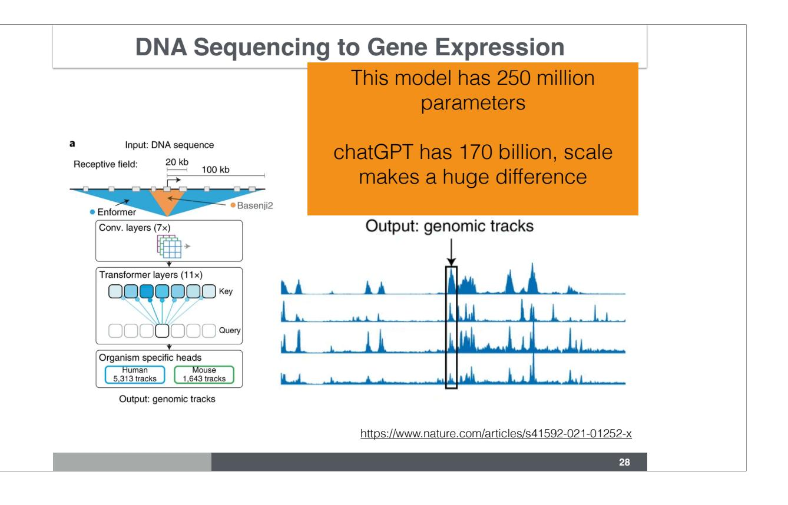

Transformers + CNN method from Calico + Deepmind seems promising for the first step of predicting mRNA transcription

## Clinical Utility of Genetic Predictions

An important question is whether PRS prediction have clinical utility.

#### **Genomic Prediction of Height in UK Biobank**

Lello et al (2018). Accurate Genomic Prediction of Human Height. Genetics

**30**

with biobank scale data, we are able to predict height quite well using common variants

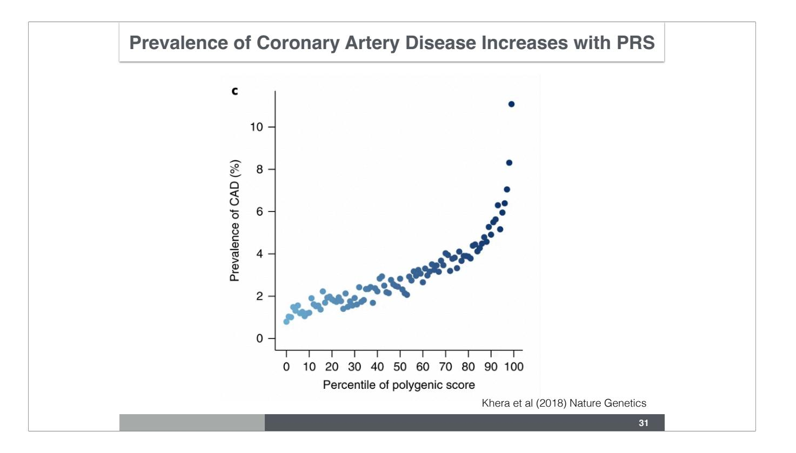

This figure shows the prevalence of coronary artery disease (CAD) among sets of individuals at different percentiles of the CAD PRS. The higher the percentile the higher the prevalence of CAD, suggesting that we could use PRS to stratify people into low, mid, to high risk of CAD.

#### **Prevalence of Type 2 Diabetes Increases with PRS**

Mahajan et al (2019) Nature Genetics

**32**

and T2D

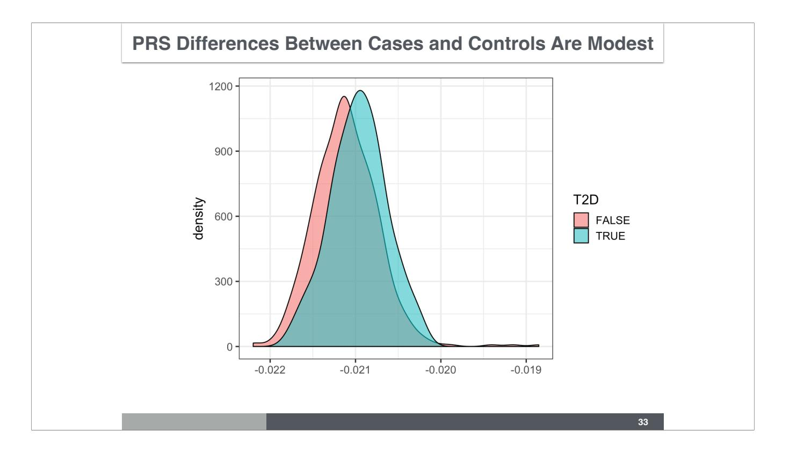

However, the prediction accuracy is modest. This figure shows the distribution of PRS for type 2 diabetes for cases and controls of the disease. There is a clear separation but the prediction is probabilistic.

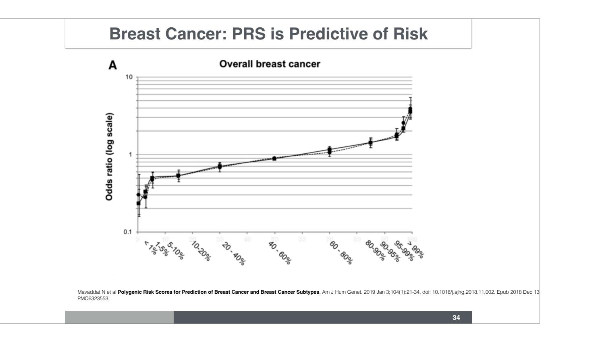

Individuals in the higher percentile of breast cancer PRS have higher risk of cancer.

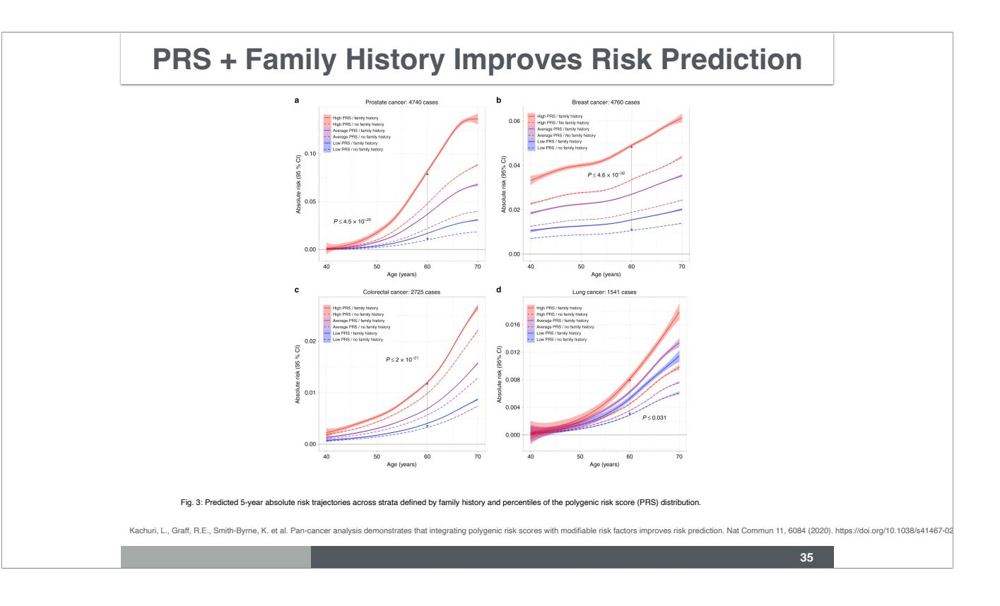

Fig. 3: Predicted 5-year absolute risk trajectories across strata defined by family history and percentiles of the polygenic risk score (PRS) distribution. Family history was based on self-reported illnesses in first-degree relatives for a prostate, b breast, c colorectal, and d lung cancers. Low PRS corresponds to ≤20th percentile, average PRS is defined as >20th to <80th percentile, and high PRS includes individuals in the ≥80th percentile of the normalized genetic risk score distribution. P values for differences in mean absolute risk in each stratum at age 60 are based on t-tests (two sided).

### Do PRS work for everyone?

#### **Portability of Prediction Across Ancestries**

Martin et al 2019 NG https://www.nature.com/articles/s41588-019-0379-x

**37**

The worry is that current GWAS data is mostly collected in non European descent individuals, performance of PRS may deteriorate with genetic distance from the EUR ancestry.

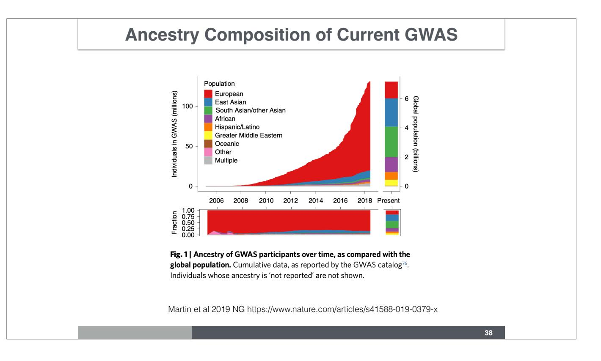

Indeed, the majority of the GWAS have been performed in individuals of European descent. More than 80% of GWAS was performed on European descent individuals, who represent less than 15% of the world population.

Martin et al 2019 NG https://www.nature.com/articles/s41588-019-0379-x

**39**

Difference in LD are likely to make the transfer of PRS difficult.

Many of the significant variants are likely to be proxy to the causal ones. With different LD proxies will vary across population contributing the wrong value to the PRS.

With allele frequency differences, some causal variants in a population may not be discovered in another one because of low frequency (we have higher power to discover effects of high freq variants)

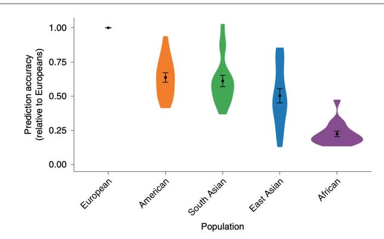

Martin et al 2019 NG https://www.nature.com/articles/s41588-019-0379-x

**40**

As feared, prediction performance decreases as the genetic distance to the training population increases as shown in this figure. The performance is normalized to the one in the European population, so for EUR, the relative performance is 1 (by definition). Among AFR individuals, the performance is reduced to 25% of the one among EUR.

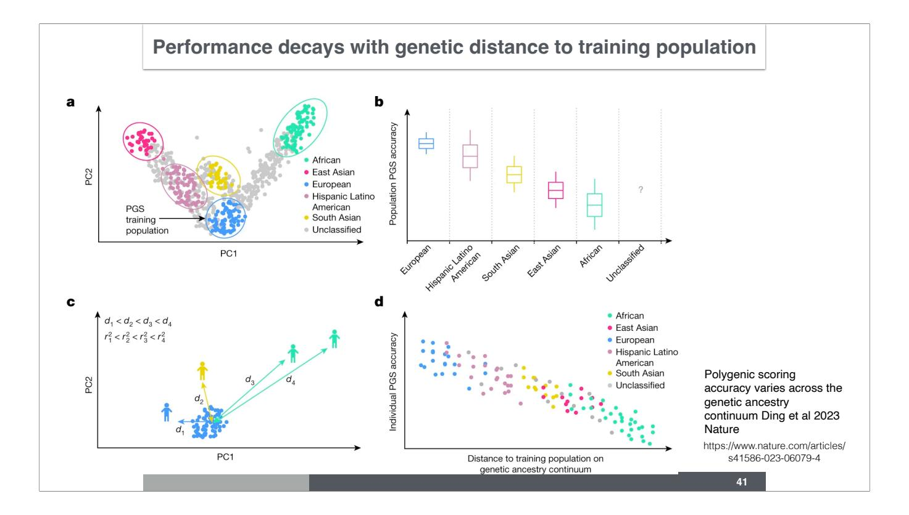

Fig. 1: Illustration of population-level versus individual-level PGS accuracy. a, Discrete labelling of GIA with PCA-based clustering. Each dot represents an individual. The circles represent arbitrary boundaries imposed on the genetic ancestry continuum to divide individuals into different GIA clusters. The colour represents the GIA cluster label. The grey dots are individuals who are left unclassified. b, Schematic illustrating the variation of population-level PGS accuracy across clusters. The box plot represents the PGS accuracy (for example, R2) measured at the population level. The question mark emphasizes that the PGS accuracy for unclassified individuals is unknown owing to the lack of a reference group. Grey dashed lines emphasize the categorical nature of GIA clustering. c, Continuous labelling of everyone's unique position on the genetic ancestry continuum with a PCA-based GD. The GD is defined as the Euclidean distance of an individual's genotype from the centre of the training data when projected on the PC space of training genotype data. Everyone has their own unique GD, , and individual PGS accuracy, . d, Individual-level PGS accuracy decays along the genetic ancestry continuum. Each dot represents an individual and its colour represents the assigned GIA label. Individuals labelled with the same ancestry spread out on the genetic ancestry continuum, and there are no clear boundaries between GIA clusters. This figure is illustrative and does not involve any real or simulated data.

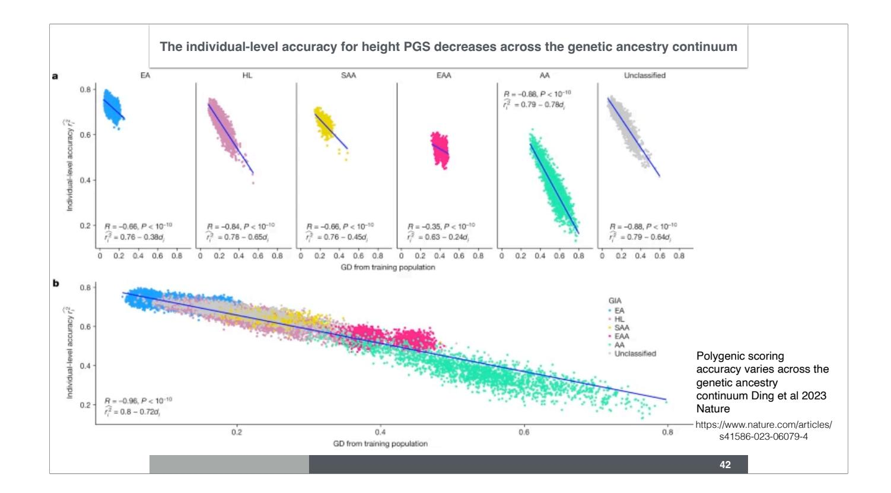

Fig. 3: The individual-level accuracy for height PGS decreases across the genetic ancestry continuum in ATLAS. a, Individual PGS accuracy decreases within both homogeneous and admixed genetic GIA clusters. Each dot represents a testing individual from ATLAS. For each dot, the x-axis represents its distance from the training population on the genetic continuum; the y-axis represents its PGS accuracy. The colour represents the GIA cluster. b, Individual PGS accuracy decreases across the entire ATLAS. c, Population-level PGS accuracy decreases with the average GD in each GD bin. All ATLAS individuals are divided into 20 equal-interval GD bins. The x axis is the average GD within the bin, and the y axis is the squared correlation between PGS and phenotype for individuals in the bin; the dot and error bar show the mean and 95% confidence interval from 1,000 bootstrap samples. R and P refer to the correlation between GD and PGS accuracy and its significance, respectively, from two-sided Pearson correlation tests without adjustment for multiple hypothesis testing. Any P value below 10−10 is shown as . EA, European American; HL, Hispanic Latino American; SAA, South Asian American; EAA, East Asian American; AA, African American.

### Investments in more diverse samples are being made

## Bioethical Issues with Embryo Screening

Theory

# Screening Human Embryos for Polygenic Traits Has Limited Utility

Ehud Karavani 1, 18, Or Zuk 2, 18, Danny Zeevi 3, Nir Barzilai 4, 5, Nikos C. Stefanis 6, 7, 8, Alex Hatzimanolis 6, 8, Nikolaos Smyrnis 6, 7, Dimitrios Avramopoulos 9, 10, Leonid Kruglyak 3, 11, 12, Gil Atzmon 4, 5, 13, Max Lam 14, 15, 16, Todd Lencz 14, 15, 17  $\stackrel{>}{\sim}$   $\stackrel{\boxtimes}{\sim}$ , Shai Carmi 1, 19  $\stackrel{\cong}{\sim}$   $\stackrel{\boxtimes}{\sim}$ 

# Screening Human Embryos for Polygenic Traits Has Limited Utility

+ Add to Mendeley

https://doi.org/10.1016/j.cell.2019.10.033

Under an Elsevier user license

Get rights and content

open archive

#### Utility of polygenic embryo screening for disease depends on the selection strategy

Polygenic risk scores (PRSs) have been offered since 2019 to screen in vitro fertilization embryos for genetic liability to adult diseases, despite a lack of comprehensive modeling of expected outcomes. Here we predict, based on the liability threshold model, the expected reduction in complex disease risk following polygenic embryo screening for a single disease. A strong determinant of the potential utility of such screening is the selection strategy, a factor that has not been previously studied. When only embryos with a very high PRS are excluded, the achieved risk reduction is minimal. In contrast, selecting the embryo with the lowest PRS can lead to substantial relative risk reductions, given a sufficient number of viable embryos. We systematically examine the impact of several factors on the utility of screening, including: variance explained by the PRS, number of embryos, disease prevalence, parental PRSs, and parental disease status. We consider both relative and absolute risk reductions, as well as populationaveraged and per-couple risk reductions, and also examine the risk of pleiotropic effects. Finally, we confirm our theoretical predictions by simulating 'virtual' couples and offspring based on real genomes from schizophrenia and Crohn's disease case-control studies. We discuss the assumptions and limitations of our model, as well as the potential emerging ethical concerns.

#### **Embryo Selection Active Area of Research**

**47**

Whole-genome risk prediction of common diseases in human preimplantation embryos

Preimplantation genetic testing (PGT) of in-vitro-fertilized embryos has been proposed as a method to reduce transmission of common disease; however, more comprehensive embryo genetic assessment, combining the effects of common variants and rare variants, remains unavailable. Here, we used a combination of molecular and statistical techniques to reliably infer inherited genome sequence in 110 embryos and model susceptibility across 12 common conditions. We observed a genotype accuracy of 99.0–99.4% at sites relevant to polygenic risk scoring in cases from day-5 embryo biopsies and 97.2– 99.1% in cases from day-3 embryo biopsies. Combining rare variants with polygenic risk score (PRS) magnifies predicted differences across sibling embryos. For example, in a couple with a pathogenic BRCA1 variant, we predicted a 15-fold difference in odds ratio (OR) across siblings when combining versus a 4.5-fold or 3-fold difference with BRCA1 or PRS alone. Our findings may inform the discussion of utility and implementation of genome-based PGT in clinical practice.

#### **Orchid Offers Preconception Testing**

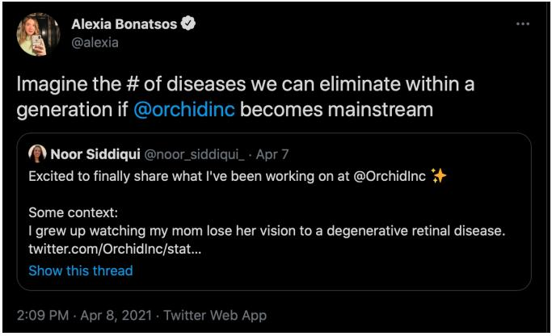

https://twitter.com/alexia/status/1380236427485667335

Are they helping eliminate disease or implementing eugenics?

You can check out Lior Pachter's opinionated take on this subject https://liorpachter.wordpress.com/2021/04/12/the-amoral-nonsense-of-orchids-embryo-selection/

**48**

Preimplantation screening with PRS is illegal in Europe but in the US, several companies are offering the services.

The European Society of Huma Genetics statement on preimplantation screening based on PRS is here https://www.nature.com/articles/s41431-021-01000-x

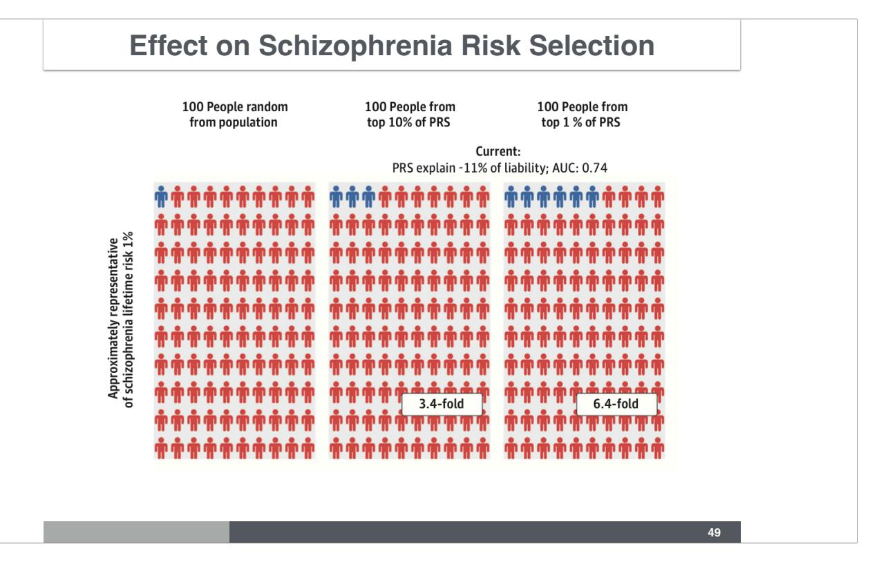

PRS prediction is probabilistic. To get a sense of what it means for Schizophrenia PRS this figure shows the proportion of embryos that may end up developing the disease if unselected, if selected among to top 10% of PRS (middle), and if selected among the top 1% of PRS on the right.

#### **Key Takeaways**

- PRS (Polygenic risk scores) are useful for estimating genetic susceptibility to cancers and other complex diseases
- There are several ways to calcuate PRS calculation, various statistical approaches are available to address the challenge of estimating a large number of parameters
- PRS have potential clinical utility in risk stratification and personalized medicine, but their predictive accuracy varies
- The accuracy and generalizability of PRS are influenced by factors such as ancestry (genetic proximity to training data, mostly European today), LD patterns, and allele frequencies
- Ethical considerations, particularly in embryo screening, require careful discussion and regulation