## Learning Objectives

In this lecture we will learn about **Polygenic Risk Scores (PRS)** — how they are constructed, evaluated, and applied in research and clinical settings.

- Explain the polygenic additive model and its role in PRS calculation
- Describe the statistical challenges in estimating PRS and methods to address them
- Evaluate the clinical utility and limitations of PRS, including ancestry-related biases
- Discuss the ethical considerations surrounding the use of PRS in embryo screening
- Compare and contrast different approaches for calculating and improving PRS

::: {.notes}
This lecture picks up where L6 left off — same polygenic model, different question. Before: is this SNP associated? Now: can we predict Y for a new individual?
:::

# The Polygenic Additive Model

## Polygenic Additive Model

::: {.formula}
$$Y = \sum_{k}^{M} X_k \cdot \beta_k + \epsilon$$
:::

. . .

Can also include covariates (sex, age, etc.):

::: {.formula}
$$Y = \text{covariates} + \sum_{k}^{M} X_k \cdot \beta_k + \epsilon$$
:::

::: {.notes}
Same equation from L6. X_k is genotype at position k, β_k is its effect size. ε absorbs everything not in the sum — environment, measurement error, model misfit. Covariates can be added.
:::

## Estimating Parameters of the Polygenic Additive Model

Can we fit all SNPs at the same time?

::: {.formula}
$$Y = \mu + a \cdot \text{age} + \beta_1 X_1 + \beta_2 X_2 + \dots + \beta_{1{,}000{,}000} X_{1{,}000{,}000}$$
:::

Why can't we estimate betas by least squares (ordinary linear regression)?

**Too many parameters and too few observations**

::: {.notes}
With 1M SNPs and 10K people, fitting OLS is not possible — more parameters than observations, will be badly overfitting. Three slides give three different solutions.
:::

## Rule of Thumb

> **10 data points per parameter**

In a pinch, at least **5 data points per parameter**

::: {.notes}
Ten data points per parameter, minimum five. With a million SNPs, that's ten million people. Biobanks are getting there, but not for most studies. So we need smarter approaches.
:::

## Solution: Reduce Parameters via Random Effects

Assume $\beta_k \sim N(0, \sigma_\beta^2)$ and estimate just the variance $\sigma_\beta^2$

::: {.formula}
$$\text{From millions of } \beta_k \text{ parameters} \longrightarrow \text{1 variance parameter}$$
:::

\* This is one form of **regularization** — more on this later

::: {.notes}
Instead of estimating each β separately, assume they're drawn from the same normal distribution and estimate just one thing: the variance. Down from a million parameters to one.
:::

## Mixed Effects Modeling

$$Y = \text{fixed effects} + \text{random effects} + \text{noise}$$

$$= \text{fixed effects} + \sum_k \beta_k X_k + \epsilon$$

. . .

$\beta_k$'s are random

::: {.formula}
$$\beta_k \sim N(0, \sigma_\beta^2)$$
:::

. . .

\*\* this is one form of Regularization, more on this later

::: {.notes}
Same model, now written as a mixed effects model. Fixed effects handle covariates; random effects capture the genetic background. This is the same framework from L6, just repurposed for prediction.
:::

## Connection to EMMAX

Recall the mixed effects approach used to correct for population structure:

::: {.formula}
$$Y = X_{\text{test}} \cdot \beta_{\text{test}} + u + \epsilon, \quad u \sim N(0, \sigma^2 \cdot \mathbf{K})$$
:::

The random effect $u$ is equivalent to the **sum of all SNP effects**:

::: {.formula}
$$Y = X_{\text{test}} \cdot \beta_{\text{test}} + \sum_k X_k \beta_k + \epsilon$$
:::

::: {.notes}
EMMAX's random effect u has the same mathematical form as a polygenic score — both reduce to Σ X_k β_k with β_k ~ N(0, σ²_β), giving covariance σ²K. EMMAX uses it as a nuisance term to absorb genetic background; here we repurpose the same structure for prediction. One important difference: in the random effects model the βs are treated as true unknowns drawn from a distribution; in PRS they are estimates from GWAS data, carrying noise and uncertainty.
:::

# Review: Norms of Vectors

## L2 Norm of a Vector

::: {.formula}
$$X = \begin{bmatrix} x_1 \\ x_2 \\ \vdots \\ x_M \end{bmatrix} \qquad \|X\|_2 = \sqrt{\sum_k x_k^2}$$
:::

Our familiar Euclidean distance of a vector.

::: {.notes}
L1 and L2 norms define the two main types of regularization penalties used in PRS methods.
:::

## In a GWAS We Minimize the L2 Norm of the Error

In a GWAS we find one SNP at a time:

::: {.formula}
$$\mathbf{Y} = \mu + a \cdot \mathbf{age} + \beta_1 \cdot \mathbf{X} + \epsilon$$
:::

Find $\mu, a, \beta_1$ that minimizes:

$$\|\mathbf{Y} - \mu - a \cdot \mathbf{age} - \beta_1 \cdot \mathbf{X}\|_2^2$$

$$= (y_1 - \mu - a \cdot \text{age}_1 - \beta_1 x_1)^2 + (y_2 - \mu - a \cdot \text{age}_2 - \beta_1 x_2)^2 + \cdots$$

::: {.notes}
Standard OLS minimizes the squared L2 norm of the residuals. That's the loss. Regularization adds a second term penalizing the β vector itself.
:::

## Which One Is the L1 Norm?

**Option 1:**

$$= (y_1 - \mu - a \cdot \text{age}_1 - \beta_1 x_1)^1 + (y_2 - \mu - a \cdot \text{age}_2 - \beta_1 x_2)^1 + \cdots$$

**Option 2:**

$$= |y_1 - \mu - a \cdot \text{age}_1 - \beta_1 x_1| + |y_2 - \mu - a \cdot \text{age}_2 - \beta_1 x_2| + \cdots$$

::: {.notes}
Option 2 is correct — absolute values ensure non-negativity. The L1 norm is not differentiable at zero, which is exactly why LASSO produces exact zeros and sparse solutions.
:::

# Prediction of Complex Traits

Prediction of complex traits can help us better tailor treatment of patients.

## Simple Polygenic Risk Score

::: {.formula}
$$Y = \sum_{k=1}^{M} \hat{\beta}_k^{\text{GWAS}} X_k$$
:::

Just use GWAS effect sizes — the seemingly naive approach yields better prediction than expected.

::: {.source-credit}
[ISC (2009). Common polygenic variation contributes to risk of schizophrenia and bipolar disorder. *Nature*](https://doi.org/10.1038/nature08185)
:::

::: {.notes}
The ISC 2009 schizophrenia paper was the first to show that summing thousands of sub-threshold SNPs — each individually non-significant — improved prediction. A surprise at the time. No individual-level data needed, just GWAS summary stats.
:::

## Tricks to Deal with Too Many Parameters

1. **Model βs as random effects** — estimate variance $\sigma_\beta^2$ instead of each $\beta_k$
2. **Use GWAS effects** — fit one SNP at a time, let ε absorb the rest
3. **Penalized likelihood / regularization** — penalize the L1 or L2 norm of the parameter vector:

::: {.formula}
$$\left\|Y - \sum_k X_k \beta_k\right\|_2 + \lambda_1 \|\beta\|_1 + \lambda_2 \|\beta\|_2$$
:::

::: {.notes}
Three approaches in increasing complexity: (1) random effects — EMMAX/BLUP; (2) marginal GWAS effects — simple PRS; (3) penalized regression — ridge, LASSO, elastic net. Each trades off in a different way.
:::

## BLUP / Ridge Regression

**Best Linear Unbiased Prediction (BLUP) / Ridge**

::: {.formula}
$$Y = \sum_{k=1}^{M} \hat{\beta}_k^{\text{Ridge}} X_k$$
:::

Penalized regression $\longrightarrow$ **Ridge**

::: {.formula}
$$\left\| Y - \sum_k X_k \beta_k \right\|_2 + \lambda_2 \|\beta_2\|_2$$
:::

::: {.notes}
Ridge adds a λ₂||β||₂ penalty. This shrinks all effect sizes toward zero proportionally, preventing any single SNP from dominating. The solution is mathematically equivalent to BLUP from animal breeding.
:::

## LASSO and Elastic Net

**LASSO/Elastic Net Prediction**

::: {.formula}
$$Y = \sum_{k=1}^{M} \hat{\beta}_k^{\text{E-N}} X_k$$
:::

Penalized regression $\longrightarrow$ **LASSO** and **Elastic Net**

::: {.formula}
$$\left\| Y - \sum_k X_k \beta_k \right\|_2 + \lambda_1 \|\beta\|_1 + \lambda_2 \|\beta_2\|_2$$
:::

::: {.notes}
LASSO's L1 penalty produces exact zeros — many βs are dropped entirely. Good for sparse architectures. Elastic net mixes L1 and L2, giving less sparse solutions. Neither fits the fully polygenic architecture well.
:::

## Whole-Genome Prediction: BSLMM

$$Y = \sum_{k=1}^{M} \beta_k^L X_k + \sum_{k=1}^{M} \beta_k^S X_k + \epsilon$$

$$\beta_k^L \sim N(0, \sigma_L^2) \quad \text{(polygenic: many small effects)}$$
$$\beta_k^S \sim N(0, \sigma_S^2) \quad \text{(sparse: few large effects)}$$

::: {.source-credit}
[Zhou, Carbonetto & Stephens (2013). Polygenic modeling with Bayesian sparse linear mixed models. *PLOS Genetics*](https://doi.org/10.1371/journal.pgen.1003264)
:::

::: {.notes}
BSLMM fits both components at once: a dense polygenic term for the background and a sparse large-effect term. The data determine how much weight each gets. Other whole-genome methods: multiBLUP, OmicKriging.
:::

## Advantages of Simple Polygenic Scores

**Main advantage: easy to obtain and scalable**

- GWAS summary statistics are publicly available
- No individual-level data required

vs. multivariate approaches (ridge, elastic net, BSLMM):

- Require individual-level data
- Although some fine-mapping methods allow inferring multivariate results from summary statistics

::: {.notes}
GWAS summary statistics are publicly available from thousands of studies. Individual-level data — needed for ridge, LASSO, BSLMM — is rarely shared. That's the practical edge of simple PRS.
:::

## Improving PRS with LD Information

Methods that incorporate LD structure into PRS:

| Method | Reference |
|--------|-----------|
| PRSice (pruning + thresholding) | Choi & O'Reilly |
| Lasso-sum | Mak et al. 2017 |
| LDPred | Vilhjálmsson et al. 2015 |
| RSS | Zhu & Stephens 2017 |
| S-BayesR | Lloyd-Jones et al. 2019 |
| PRS-CS | Ge et al. 2019 |

RSS and S-BayesR are likelihood-based methods with different priors on βs.

::: {.notes}
Simple GWAS-based PRS counts correlated SNPs multiple times. These methods use LD reference panels to account for this correlation. PRSice prunes and thresholds; LDPred, PRS-CS, and S-BayesR reweight using the LD structure.
:::

## Importance of Good LD Reference Data

- All methods on the previous slide rely on good LD reference data
- With increasing sample sizes, summary-statistic methods are critical
- **GWAS summary statistics** are widely shared
- **LD reference from the same study is not** — this needs to change

::: {.notes}
These methods are only as good as their LD reference. Ideally the reference comes from the same study population. Summary stats are widely shared; the accompanying LD matrices are not. That gap matters.
:::

## What About Deep Learning?

> "In all, over the range of traits evaluated in this study, CNN performance was competitive to linear models, but **we did not find any case where DL outperformed the linear model by a sizable margin.**"

::: {.notes}
For complex polygenic traits, CNNs have not consistently beaten simple linear PRS. DL has found its niche in sequence-to-function prediction, not in polygenic scoring.
:::

## DNA Sequencing to Gene Expression

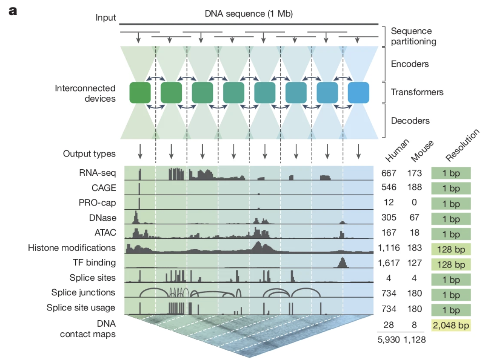

::: {.source-credit}
[Avsec, Ž., Latysheva, N., Cheng, J. et al. Advancing regulatory variant effect prediction with AlphaGenome. *Nature* 649, 1206–1218 (2026).](https://doi.org/10.1038/s41586-025-10014-0)
:::

::: {.notes}
AlphaGenome (Enformer lineage) predicts gene expression from raw DNA sequence using transformers + CNNs. 250M parameters — tiny by LLM standards, but already more than enough for this task. Promising for regulatory variant interpretation, less so for complex trait PRS, for now.
:::

# Clinical Utility of Genetic Predictions

An important question is whether PRS predictions have clinical utility.

## Genomic Prediction of Height in UK Biobank

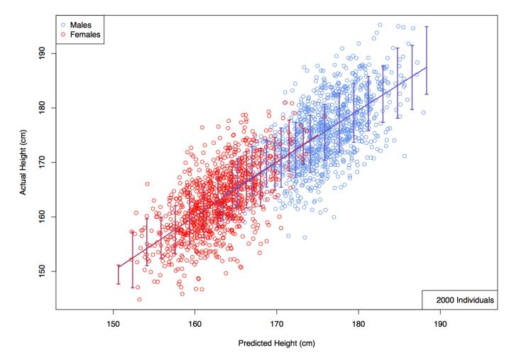

::: {.source-credit}
[Lello et al. (2018). Accurate Genomic Prediction of Human Height. *Genetics*](https://doi.org/10.1534/genetics.118.301267)
:::

::: {.notes}
Height is heritable, objective, and easy to validate — a good test case. Biobank-scale data allows accurate height prediction from common variants. The predictions here used a method similar to BSLMM.
:::

## Prevalence of Coronary Artery Disease Increases with PRS

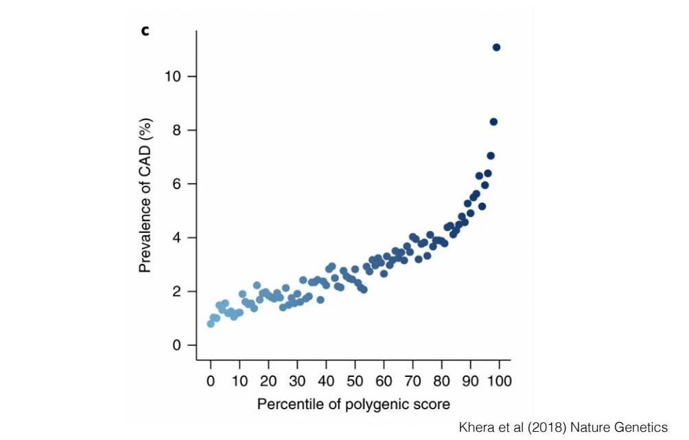

::: {.notes}
CAD risk rises monotonically across PRS deciles. The high-risk tail is clinically meaningful — comparable in magnitude to familial hypercholesterolemia, which already triggers early intervention.
:::

## Prevalence of Type 2 Diabetes Increases with PRS

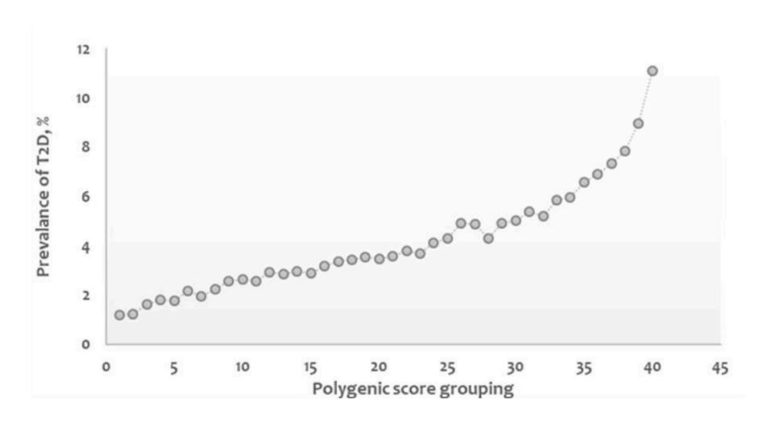

::: {.source-credit}
[Mahajan et al. (2019). *Nature Genetics*](https://doi.org/10.1038/s41588-018-0241-9)
:::

::: {.notes}
Same monotonic pattern as CAD. The question is whether the spread is enough to be clinically actionable — most high-PRS individuals will not develop T2D.
:::

## PRS Differences Between Cases and Controls Are Modest

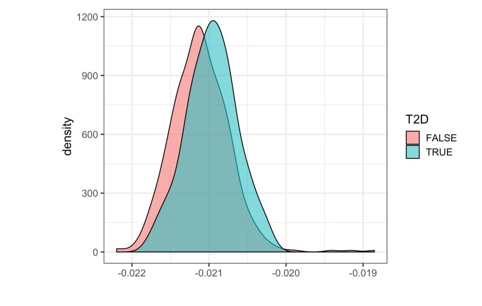

::: {.notes}
Yes, cases have higher PRS on average — but the distributions overlap massively. Prediction is probabilistic, not deterministic. Most individuals in the high-PRS tail will not develop T2D.
:::

## Breast Cancer: PRS Is Predictive of Risk

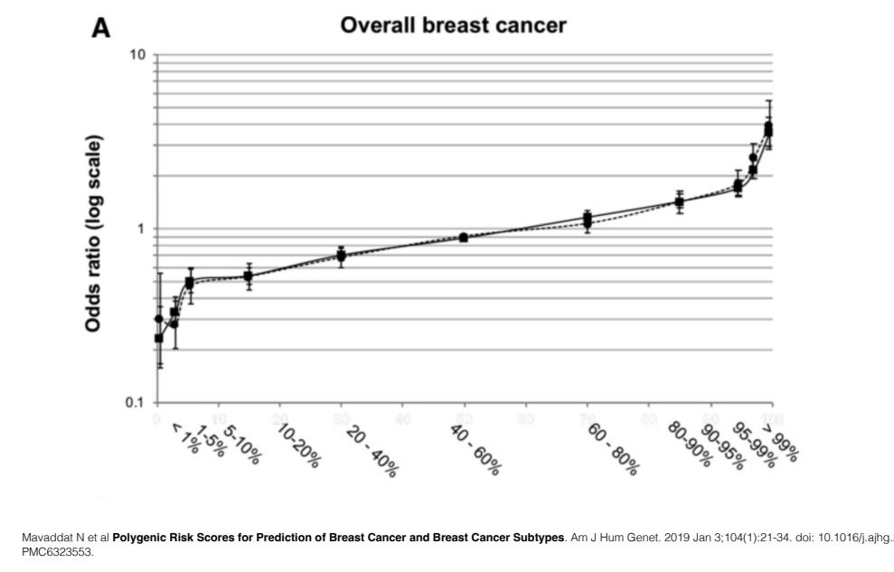

::: {.notes}
Odds ratio for breast cancer rises across PRS percentiles. Note the log scale — the top percentile has roughly 3× the risk of the bottom. That's clinically useful for deciding who gets enhanced surveillance.
:::

## PRS + Family History Improves Risk Prediction

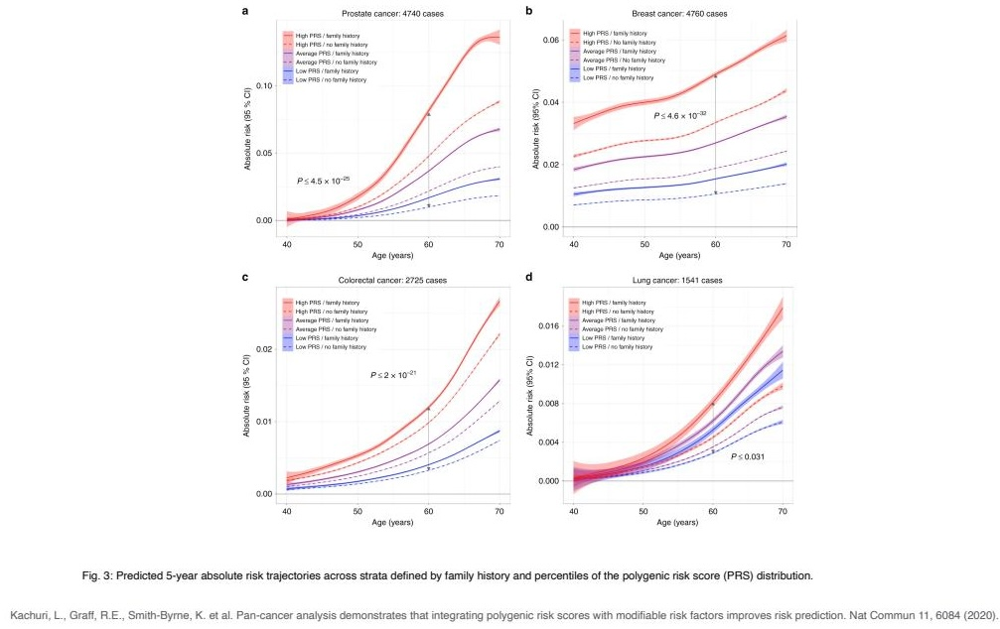

::: {.notes}
Family history captures rare variants and shared environment that PRS misses. Combining the two improves stratification across all four cancer types. But neither works equitably across ancestries — PRS performance degrades substantially for non-European populations.
:::

# Do PRS Work for Everyone?

## Portability of Prediction Across Ancestries

Current GWAS data is mostly collected in **European-descent individuals**

PRS performance deteriorates with genetic distance from EUR training data, due to:

- **Differences in LD patterns** — significant variants are often proxies for causal ones; proxies vary across populations
- **Allele frequency differences** — low-frequency causal variants in non-EUR populations may not be discovered
- **Different causal variants** — not all causal variants are shared across ancestries

::: {.source-credit}
[Martin et al. (2019). Clinical use of current polygenic risk scores may exacerbate health disparities. *Nature Genetics*](https://www.nature.com/articles/s41588-019-0379-x)
:::

::: {.notes}
PRS trained on Europeans underperforms in everyone else. Three reasons: LD proxies differ, allele frequencies differ, and not all causal variants are shared. This is the same population structure from L5 — now with clinical consequences.
:::

## Ancestry Composition of Current GWAS

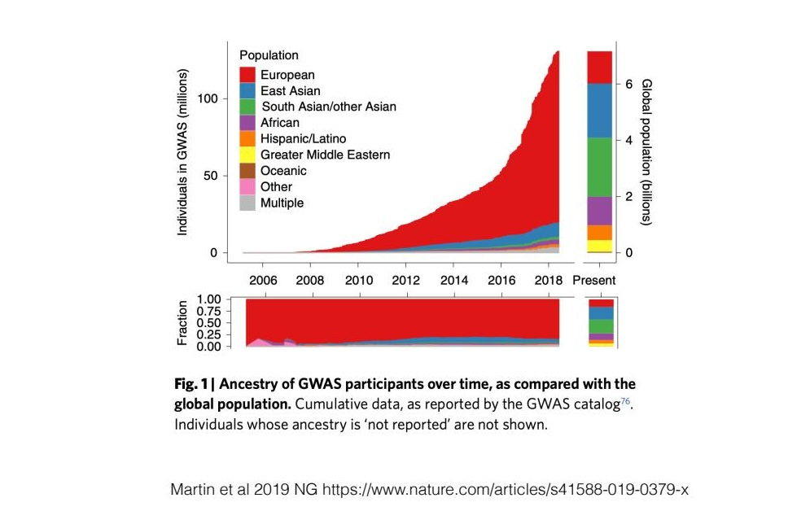

::: {.notes}
Over 80% of GWAS participants are European — less than 15% of the world population. The training data bias directly produces the performance bias.
:::

## Allele Frequency and LD Differ Across Ancestries

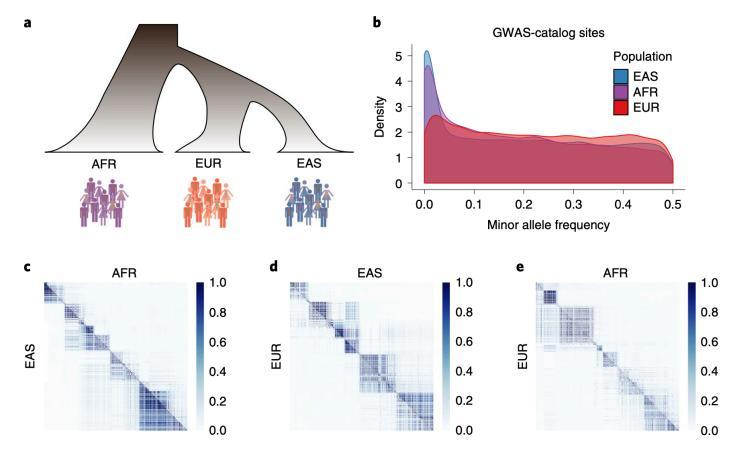

::: {.source-credit}
[Martin et al. (2019). *Nature Genetics*](https://www.nature.com/articles/s41588-019-0379-x)
:::

::: {.notes}
AFR populations have higher diversity and shorter haplotype blocks than EUR. EUR-derived LD proxies often don't tag the same causal variants in AFR samples. The proxy problem compounds the allele frequency problem.
:::

## PRS Does Not Transfer Well Across Populations

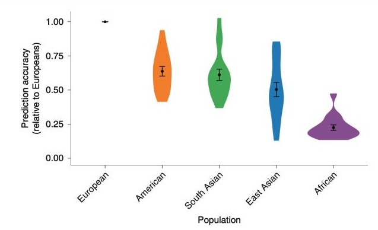

::: {.source-credit}
[Martin et al. (2019). *Nature Genetics*](https://www.nature.com/articles/s41588-019-0379-x)
:::

::: {.notes}
Performance normalized to EUR. In AFR individuals it drops to ~25%. This isn't a minor technical issue — deploying current PRS in a diverse clinical population would widen health disparities.
:::

## Performance Decays with Genetic Distance to Training Population

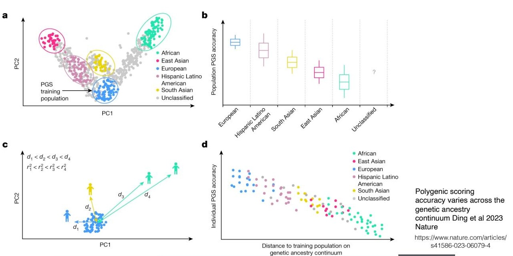

::: {.notes}
Performance degrades continuously with genetic distance, both across discrete ancestry groups and within admixed individuals. It's not a step function — it scales with distance from the training population.
:::

## Individual-Level PGS Accuracy Across the Genetic Ancestry Continuum

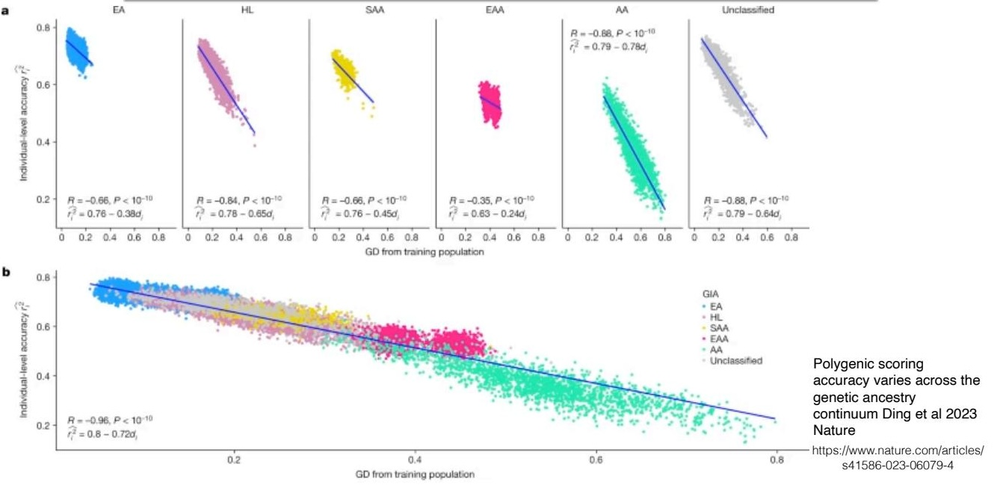

::: {.notes}
The correlation between genetic distance to the training population and individual PGS accuracy is -0.88 to -0.35 across groups. The problem persists even within ancestry categories.
:::

## Investments in More Diverse Samples Are Being Made

- Large initiatives underway: All of Us, PAGE, H3Africa, GenomeAsia
- Multi-ancestry GWAS and meta-analyses are increasing
- Methods for multi-ancestry PRS actively being developed
- Goal: PRS that work equitably across all ancestries

::: {.notes}
All of Us, H3Africa, GenomeAsia, PAGE — large diverse cohorts recruiting now. Multi-ancestry GWAS and transfer-learning PRS methods are active research areas. The field is aware of the problem and moving on it.
:::

# Bioethical Issues with Embryo Screening

## Screening Human Embryos for Polygenic Traits Has Limited Utility

**Key findings:**

- PRS offered since 2019 to screen IVF embryos for adult disease risk
- Excluding embryos with **very high** PRS → minimal risk reduction
- Selecting embryo with **lowest** PRS → substantial relative risk reduction, given enough viable embryos
- Utility depends on: variance explained by PRS, number of embryos, disease prevalence, parental PRSs

::: {.source-credit}
[Karavani et al. (2019). Screening human embryos for polygenic traits has limited utility. *Cell* 179(6): 1424–1435](https://doi.org/10.1016/j.cell.2019.10.033)
:::

::: {.notes}
PRS entered the clinic before the modeling was done. Karavani et al. ran the numbers: excluding embryos with very high PRS has minimal impact; selecting the single lowest-PRS embryo matters more — but only when there are enough viable embryos to choose from.
:::

## Embryo Selection: Active Area of Research

::: {.notes}
Adding rare high-penetrance variants (e.g., BRCA1) to PRS amplifies predicted differences between siblings. A BRCA1 carrier couple could see a 15-fold predicted odds ratio difference across embryos, versus 4.5-fold for BRCA1 alone and 3-fold for PRS alone.
:::

## Orchid Offers Preconception Testing

Are they helping **eliminate disease** — or implementing **eugenics**?

- Preimplantation PRS screening is **illegal in Europe**; sold commercially in the US
- [Lior Pachter's critique: "The amoral nonsense of Orchid's embryo selection"](https://liorpachter.wordpress.com/2021/04/12/the-amoral-nonsense-of-orchids-embryo-selection/)

::: {.notes}
Commercial preimplantation PRS screening is banned in Europe under European Society of Human Genetics guidelines. Legal in the US. Lior Pachter's critique is worth reading — he argues the statistical framing is misleading.
:::

## Effect on Schizophrenia Risk Selection

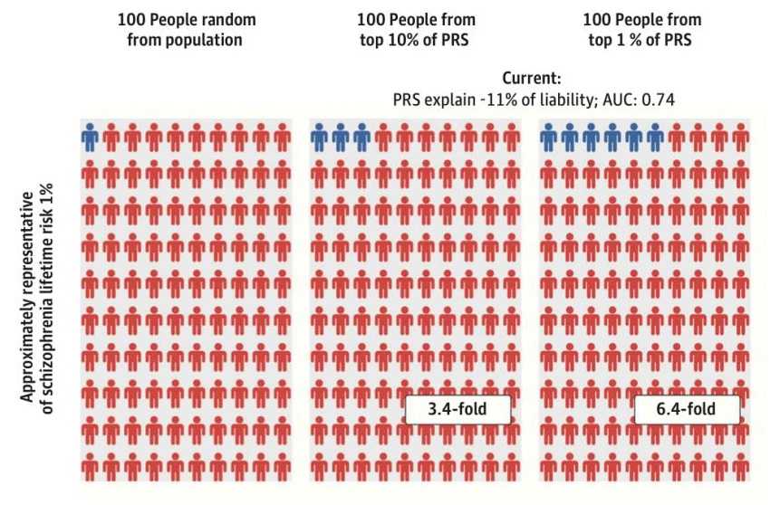

::: {.notes}
The numbers: top 10% of PRS → 1.4× enrichment. Top 1% → 5.4× enrichment. PRS explains ~11% of liability (AUC 0.74). Most people in the top 1% still won't develop schizophrenia. The probabilistic nature cuts both ways.
:::

## Key Takeaways

- **PRS** estimate genetic susceptibility to cancers and other complex diseases by summing GWAS effect sizes across the genome
- Several statistical approaches address the too-many-parameters problem: random effects, one-SNP-at-a-time GWAS, and penalized regression (ridge, LASSO, elastic net)
- PRS have potential clinical utility in risk stratification, but predictive accuracy is **modest** — distributions of cases and controls overlap substantially
- PRS accuracy degrades with genetic distance from the training population (mostly European) — **ancestry bias** is a major limitation
- Embryo screening using PRS raises serious **ethical concerns** and is restricted or illegal in many jurisdictions
