# Introduction to QTL Analysis

Hae Kyung Im, PhD

\*\*UPDATE\*\* April 15, 2026

In this lecture, we will go over methods that try to find genes that cause the disease and changes in complex traits in general. For generally, methods that try to explain the mechanism by which GWAS variants modify phenotype.

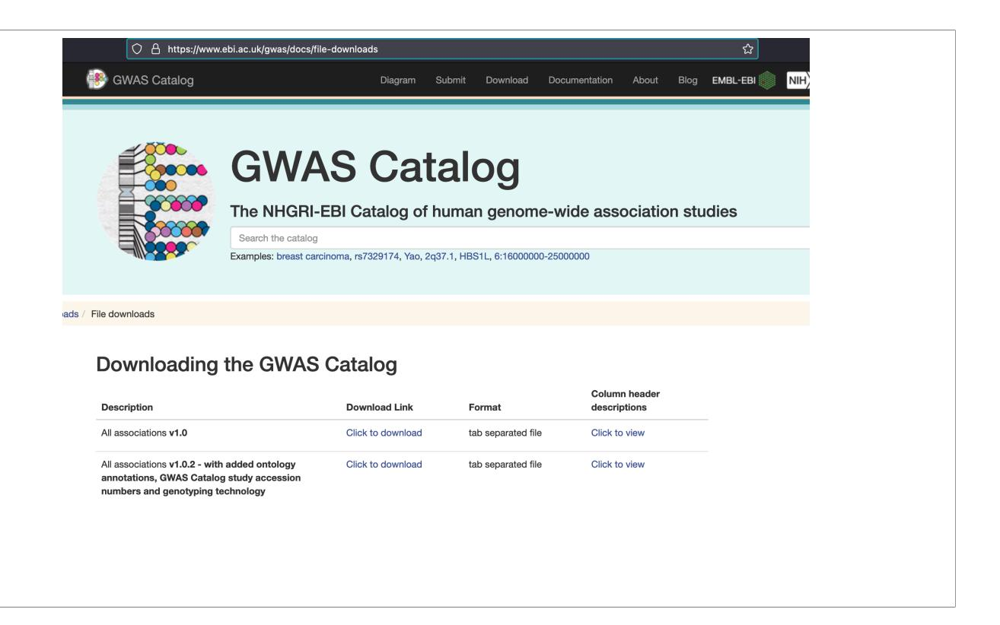

The GWAS catalog keeps track of the current discoveries using GWAS.

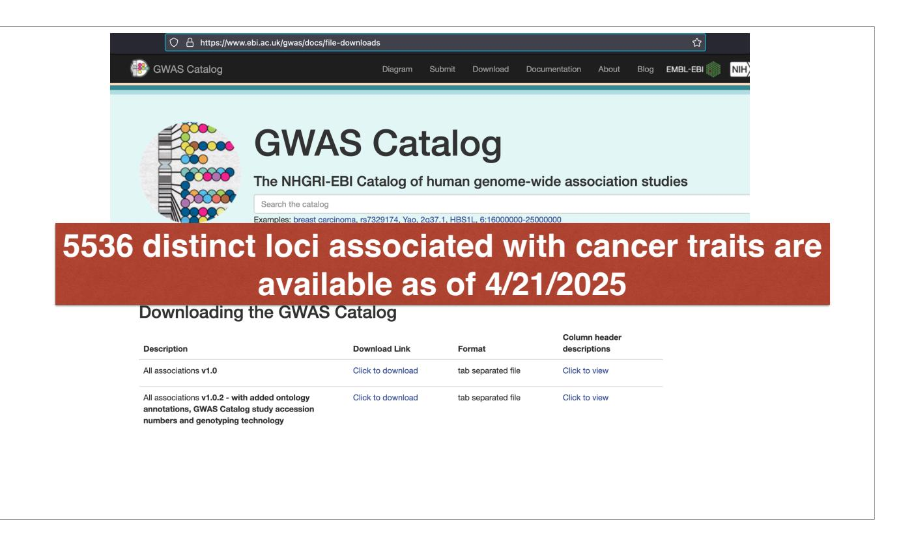

## Counting cancer GWAS loci

4/21/2025 changed the counting to counting cytogenetic bands rather than genes gwascatalog %>% select(`DISEASE/TRAIT`, REGION) %>% filter(grepl("cancer",`DISEASE/TRAIT`)) %>% unique() %>% dim()

As of 4/20/2022 there are almost 5000 distinct entries in the GWAS catalog that contains "cancer" in the trait's name gwascatalog %>% select(`DISEASE/TRAIT`, MAPPED\_GENE) %>% filter(grepl("cancer",`DISEASE/TRAIT`)) %>% unique() %>% dim()

# Most GWAS catalog variants are non-coding

# **Altered Protein Levels Influence Disease Risk 5** Albert & Kruglyak 2015 NGReviews

The 2015 review of genetic regulation of complex traits summarizes the emerging consensus that genetic variation affects disease risk through the regulation of gene expression traits. As shown here the person on top has a blue star allele in that location of the genome which allows a TF to bind, causing an unusually large number of copies of the gene X to be expressed, leading to a large amount of proteins in the system resulting finally in an increased risk to develop disease Y. Another individual with the yellow allele does not allow the TF to bind as easily causing a more manageable level of expression of the gene and protein levels downstream, leading to a lower risk of the disease Y.

# **Total mRNA and Splicing Affect Complex Traits** 2016

**6**

Most GWAS catalog variants are located in non-coding regions of the genome and thus the mechanism doesn't seem to involve changing the function of proteins. The general consensus is that genetic variants affect complex traits through the regulation of total mRNA levels (gene expression) and pre-mRNA splicing.

#### **Title Text**

https://www.science.org/doi/10.1126/science.aaz1776

#### Goals

- characterize genetic effects on the transcriptome across human tissues
- link these regulatory mechanisms to trait and disease associations
  - 17,382 tissue samples
  - 54 tissues
  - 838 donors
  - mRNA-seq
  - WGS 30x

The GTEx Consortium, 2020, Science 369:1318-1330

In 2010, the GTEx project was established seeking to fill the mechanistic gap between genotypes and phenotypes. It collected RNA samples from a broad set of human tissues from about 1000 organ donors. This was a huge effort that entailed identifying the donors, explaining and obtaining consent from family members, tissue collection, preservation, sequencing, data processing, and analysis.

49 tissues with 73-706 samples for QTL mapping

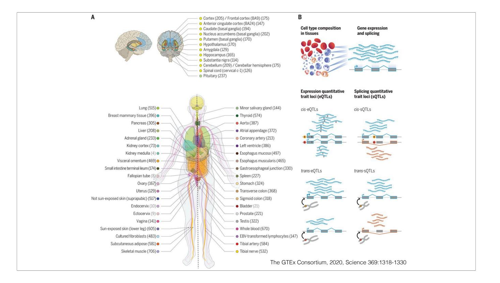

This is figure 1 of the final flagship paper from GTEx.

#### CAPTION:

Sample and data types in the GTEx v8 study. (A) Illustration of the 54 tissue types examined (including 11 distinct brain regions and two cell lines), with sample numbers from genotyped donors in parentheses and color coding indicated in the adjacent circles. Tissues with 70 or more samples were included in QTL analyses. (B) Illustration of the core data types used throughout the study. Gene expression and splicing were quantified from bulk RNA-seq of heterogeneous tissue samples, and local and distal genetic effects (cis-QTLs and trans-QTLs, respectively) were quantified across individuals for each tissue.

#### **Expression Quantitative Trait Loci**

<https://gtexportal.org/home/locusBrowserPage/ACTN3>

**10**

eQTL is a variant that is associated with mRNA levels of a gene. This figure shows the box plot of the expression of ACTN3 in tibial artery, which can be obtained from the gtexport.org web application.

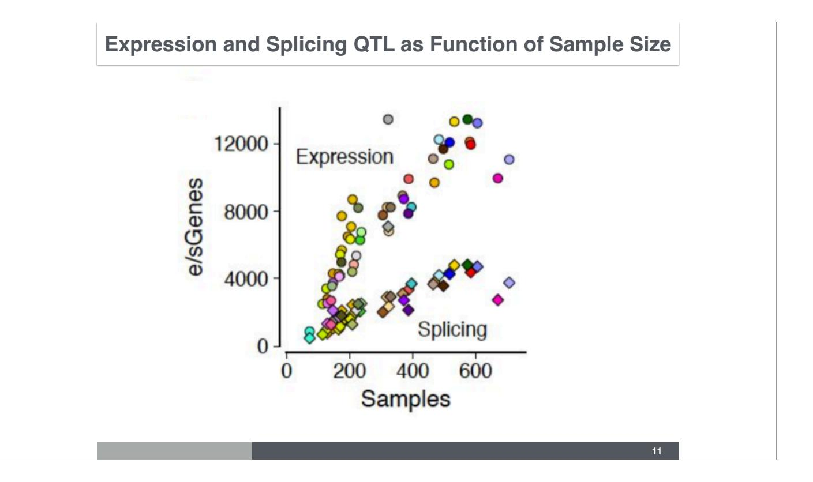

eGenes are defined as genes whose expression are associated with a genetic variant. eQTLs are genetic variants that alter expression level of a gene. We see an increase in the number of e-genes as sample sizes go up (each point represent a tissue) suggesting that as sample sizes continue to grow, most expressed genes will have an eQTL, i.e. will be an eGene. We find a similar trend with splicing QTLs although much larger sample sizes will be needed for that.

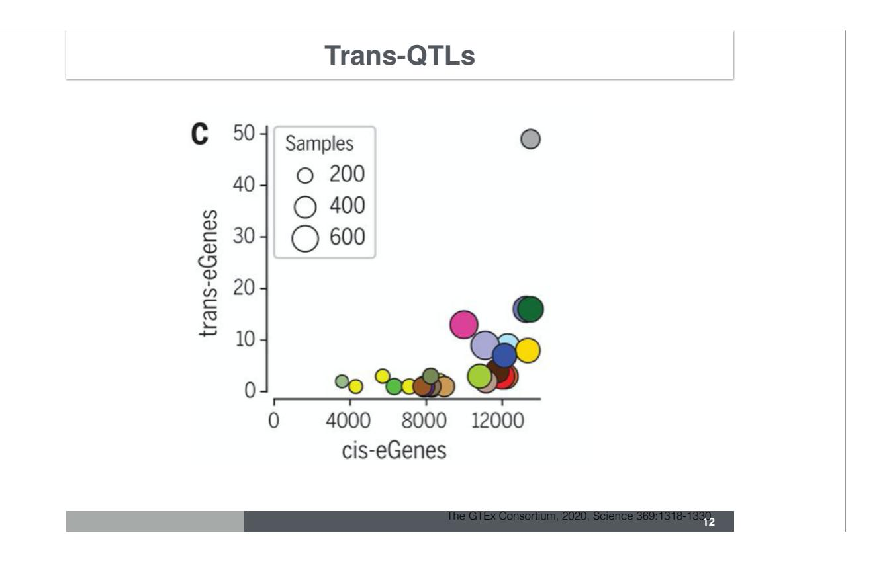

QTL discovery. (A) The number of genes with a cis-eQTL (eGenes) or cis-sQTL (sGenes) per tissue, as a function of sample size. See Fig. 1A for the legend of tissue colors. (B) Allelic heterogeneity of cis-eQTLs depicted as proportion of eGenes with one or more independent cis-eQTLs (blue stacked bars; left y axis) and as a mean number of cis-eQTLs per gene (red dots; right y axis). The tissues are ordered by sample size. (C) The number of genes with a trans-eQTL as a function of the number of cis-eGenes. (D) Sex-biased cis-eQTL for AURKA in skeletal muscle, where rs2273535-T is associated with increased AURKA expression in males (P = 9.02 × 10−27) but not in females (P = 0.75). (E) Population-biased cis-eQTL for SLC44A5 in esophagus mucosa [aFC = −2.85 and −4.82 and in African Americans (AA) and European Americans (EA), respectively; permutation P value = 1.2 × 10−3]. TPM, transcripts per million.

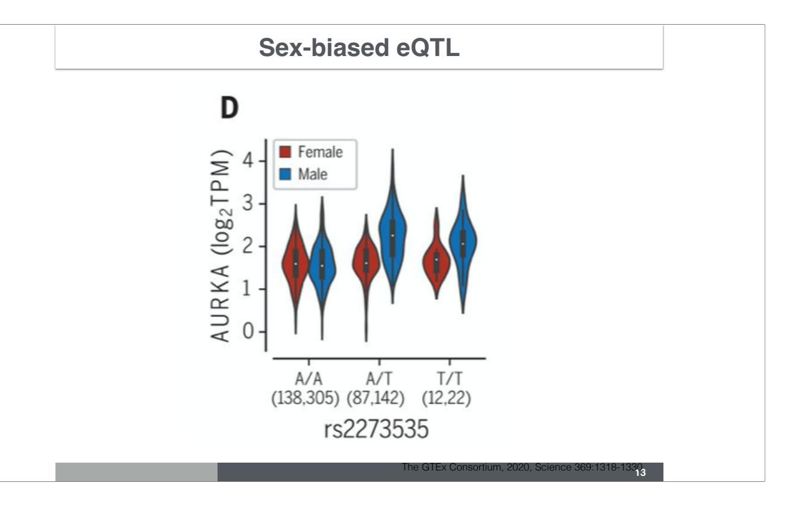

QTL discovery. (A) The number of genes with a cis-eQTL (eGenes) or cis-sQTL (sGenes) per tissue, as a function of sample size. See Fig. 1A for the legend of tissue colors. (B) Allelic heterogeneity of cis-eQTLs depicted as proportion of eGenes with one or more independent cis-eQTLs (blue stacked bars; left y axis) and as a mean number of cis-eQTLs per gene (red dots; right y axis). The tissues are ordered by sample size. (C) The number of genes with a trans-eQTL as a function of the number of cis-eGenes. (D) Sex-biased cis-eQTL for AURKA in skeletal muscle, where rs2273535-T is associated with increased AURKA expression in males (P = 9.02 × 10−27) but not in females (P = 0.75). (E) Population-biased cis-eQTL for SLC44A5 in esophagus mucosa [aFC = −2.85 and −4.82 and in African Americans (AA) and European Americans (EA), respectively; permutation P value = 1.2 × 10−3]. TPM, transcripts per million.

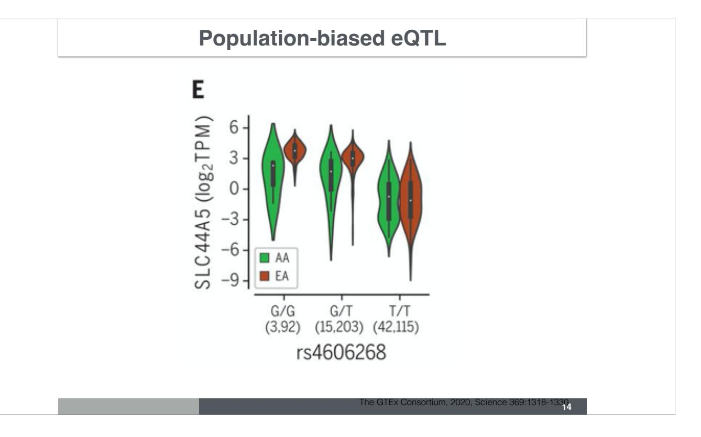

QTL discovery. (A) The number of genes with a cis-eQTL (eGenes) or cis-sQTL (sGenes) per tissue, as a function of sample size. See Fig. 1A for the legend of tissue colors. (B) Allelic heterogeneity of cis-eQTLs depicted as proportion of eGenes with one or more independent cis-eQTLs (blue stacked bars; left y axis) and as a mean number of cis-eQTLs per gene (red dots; right y axis). The tissues are ordered by sample size. (C) The number of genes with a trans-eQTL as a function of the number of cis-eGenes. (D) Sex-biased cis-eQTL for AURKA in skeletal muscle, where rs2273535-T is associated with increased AURKA expression in males (P = 9.02 × 10−27) but not in females (P = 0.75). (E) Population-biased cis-eQTL for SLC44A5 in esophagus mucosa [aFC = −2.85 and −4.82 and in African Americans (AA) and European Americans (EA), respectively; permutation P value = 1.2 × 10−3]. TPM, transcripts per million.

# Fine-mapping

Fine-mapping refers to methods that try to find the causal variant in a region with multiple associated SNPs.

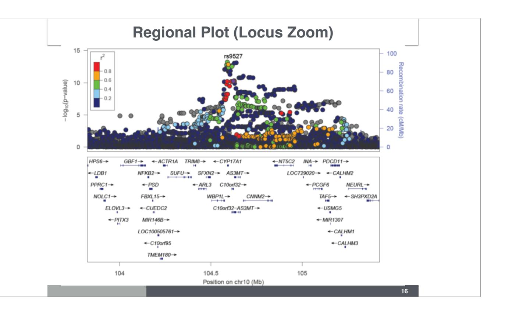

This is a typical regional plot of a GWAS, many SNPs are associated with the trait.

#### **Fine Mapping**

- Fine mapping: searching for the causal variant underlying an observed association
- An association observed in GWAS often involves a large number of associated variants in LD. The causal variant is not obvious.
- To "fine map" we need association results for ALL variants that could possibly be the causal variant, either by imputation or "fillin" genotyping
- For a given locus, we can build "credible sets" of SNPs that are 95% (or 99% or 99.9%) likely to contain the causal variant (based on Bayes Factors or Likelihoods) assuming a single causal variant (Maller et al, Nat Genet 2012)
- or Posterior Probability of Causality (pip=posterior inclusion prob.)

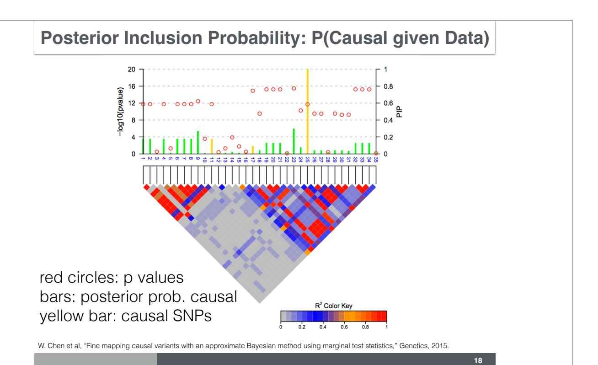

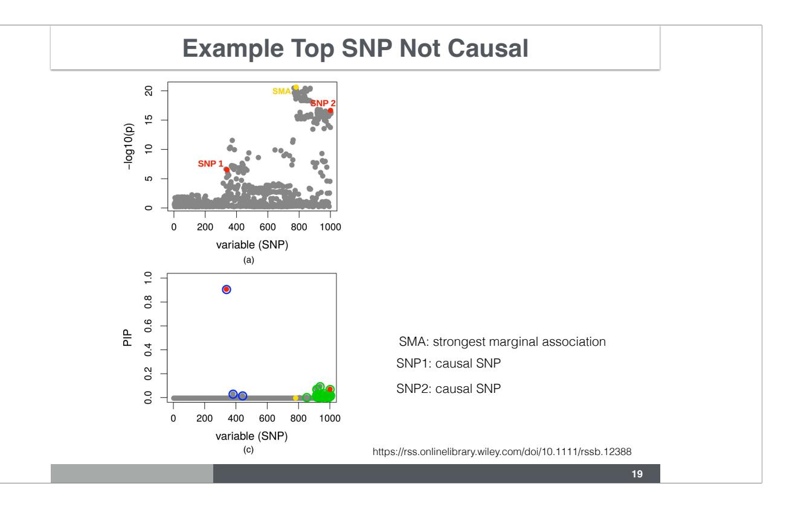

Fine mapping example to illustrate that the IBSS (Iterative Bayesian Stepwise Selection) algorithm can deal with a challenging case: the results are from a simulated data set with p=1000 variables (SNPs); some of these variables are very strongly correlated (Fig. A1 in the on-line appendix); two out of the 1000 variables are effect variables (image, labelled 'SNP 1' and 'SNP 2' in (a)); we chose this example from our simulations because the strongest marginal association is a non-effect variable (image, labelled 'SMA' in (a)); after one iteration ((b)), IBSS incorrectly identifies a credible set containing the strongest marginal association and no effect variable (image); however, after 10 iterations (and also at convergence) the IBSS algorithm has corrected itself ((c)), finding two 95% credible sets (image, image), each containing a true effect variable; additionally, neither credible set contains the strongest marginal association variable; one credible set (image) contains only three SNPs (purity 0.85), whereas the other credible set (image) contains 37 very highly correlated variables (purity 0.97); in the latter credible set, the individual PIPs are small, but the inclusion of the 37 variables in this credible set indicates, correctly, high confidence in at least one effect variable among them

#### **Fine Mapping Methods**

- CAVIAR (Hormozdiari et al, Bioinformatics 2015)
- Finemap (Benner et al, Bioinformatics 2016)
- fastPAINTOR (Kichaev et al, Bioinformatics 2016)
- DAP-G (Wen et al, AJHG 2016)
- SUSIER (Wang et al, J. R. Stat. Soc. B, 2020)

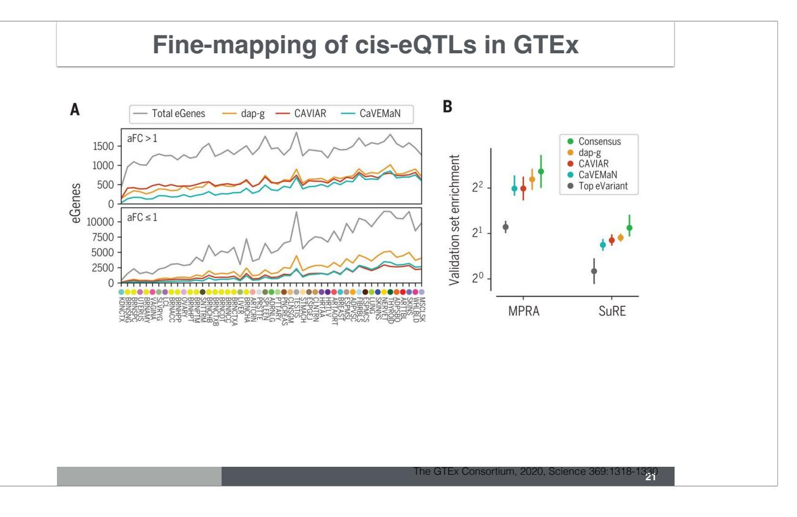

Fine-mapping of cis-eQTLs. (A) Number of eGenes per tissue with variants fine-mapped with >0.5 posterior probability of causality, using three methods. The overall number of eGenes with at least one fine-mapped eVariant increases with sample size for all methods. However, this increase is in part driven by better statistical power to detect small effect size cis-eQTLs (aFC ≤ 1 in log2 scale; see also fig. S14) with larger sample sizes, and the proportion of well fine-mapped eGenes with small effect sizes increases more modestly with sample size (bottom versus top panels), indicating that such cis-eQTLs are generally more difficult to fine-map. (B) Enrichment of variants among experimentally validated regulatory variants, shown for the cis-eVariant with the best P value (top eVariant), and those with posterior probability of causality >0.8 according to each of the three methods individually or all of them (consensus). Error bars: 95% confidence interval (CI). (C) The cis-eQTL signal for CBX8 is fine-mapped to a credible set of three variants (red and purple diamonds), of which rs9896202 (purple diamond) overlaps a large number of transcription factor binding sites in ENCODE chromatin immunoprecipitation sequencing (ChIP-seq) data and disrupts the binding motif of EGR1. (D) The potential role of EGR1 binding driving this cis-eQTL is further supported by correlation between EGR1 expression and the CBX8 cis-eQTL effect size across tissues.

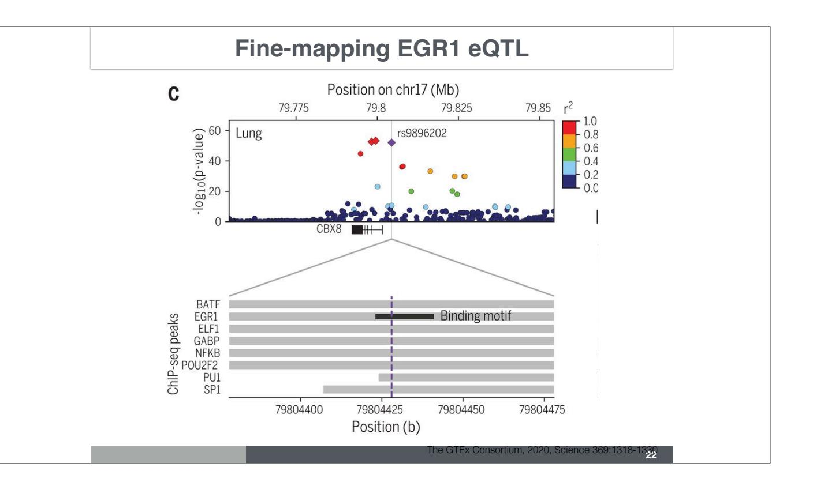

Fine-mapping of cis-eQTLs. (A) Number of eGenes per tissue with variants fine-mapped with >0.5 posterior probability of causality, using three methods. The overall number of eGenes with at least one fine-mapped eVariant increases with sample size for all methods. However, this increase is in part driven by better statistical power to detect small effect size cis-eQTLs (aFC ≤ 1 in log2 scale; see also fig. S14) with larger sample sizes, and the proportion of well fine-mapped eGenes with small effect sizes increases more modestly with sample size (bottom versus top panels), indicating that such cis-eQTLs are generally more difficult to fine-map. (B) Enrichment of variants among experimentally validated regulatory variants, shown for the cis-eVariant with the best P value (top eVariant), and those with posterior probability of causality >0.8 according to each of the three methods individually or all of them (consensus). Error bars: 95% confidence interval (CI). (C) The cis-eQTL signal for CBX8 is fine-mapped to a credible set of three variants (red and purple diamonds), of which rs9896202 (purple diamond) overlaps a large number of transcription factor binding sites in ENCODE chromatin immunoprecipitation sequencing (ChIP-seq) data and disrupts the binding motif of EGR1. (D) The potential role of EGR1 binding driving this cis-eQTL is further supported by correlation between EGR1 expression and the CBX8 cis-eQTL effect size across tissues.

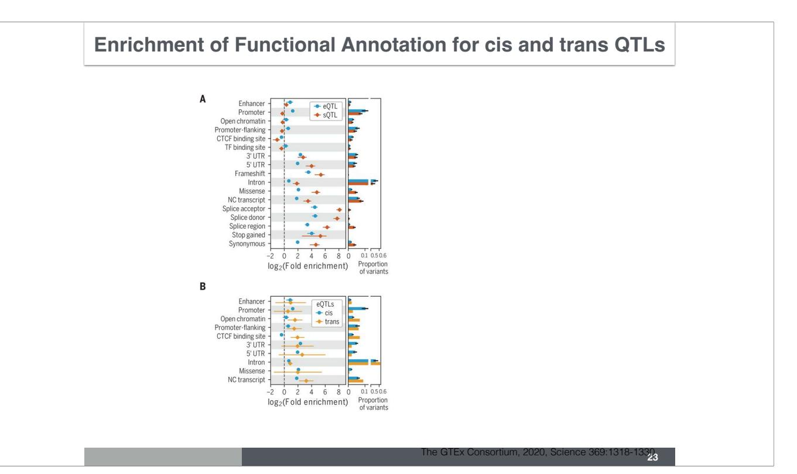

Functional mechanisms of genetic regulatory effects. QTL enrichment in functional annotations for (A) cis-eQTLs and cis-sQTLs and for (B) trans-eQTLs. cis-QTL enrichment is shown as mean ± SD across tissues; trans-eQTL enrichment as 95% CI. UTR, untranslated region. (C) Enrichment of lead trans-eVariants or trans-sVariants that have been tested for cis-QTL effects also being significant cis-eVariants or cis-sVariants in the same tissue, respectively. Asterisk denotes significant enrichment, P < 10−21. (D) Proportion of trans-eQTLs that are significant cis-eQTLs or mediated by cis-eQTLs. (E) Trans associations of cis-mediating genes identified through colocalization (PP4 > 0.8 and nominal association with discovery trans-eVariant P < 10−5). (Top) Associations for four thyroid cis-eQTLs (indicated by gene names); (bottom) cis-mediating genes with five or more colocalizing trans-eQTLs.

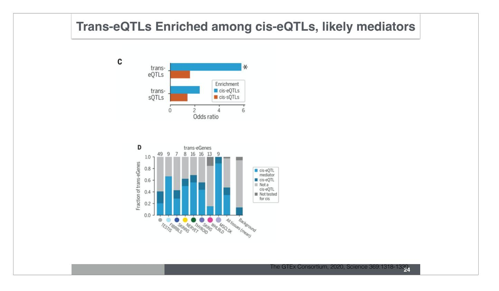

Functional mechanisms of genetic regulatory effects. QTL enrichment in functional annotations for (A) cis-eQTLs and cis-sQTLs and for (B) trans-eQTLs. cis-QTL enrichment is shown as mean ± SD across tissues; trans-eQTL enrichment as 95% CI. UTR, untranslated region. (C) Enrichment of lead trans-eVariants or trans-sVariants that have been tested for cis-QTL effects also being significant cis-eVariants or cis-sVariants in the same tissue, respectively. Asterisk denotes significant enrichment, P < 10−21. (D) Proportion of trans-eQTLs that are significant cis-eQTLs or mediated by cis-eQTLs. (E) Trans associations of cis-mediating genes identified through colocalization (PP4 > 0.8 and nominal association with discovery trans-eVariant P < 10−5). (Top) Associations for four thyroid cis-eQTLs (indicated by gene names); (bottom) cis-mediating genes with five or more colocalizing trans-eQTLs.

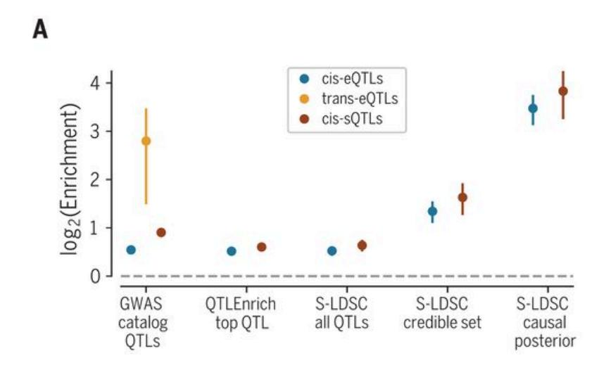

Trans-eQTLs also enriched among trait-associated variants

**25** The GTEx Consortium, 2020, Science 369:1318-1330

Regulatory mechanisms of GWAS loci. (A) GWAS enrichment of cis-eQTLs, cis-sQTLs, and trans-eQTLs measured with different approaches: enrichment calculated from GWAS summary statistics of the most significant cis-QTL per eGene or sGene with QTLEnrich and LD score regression with all significant cis-QTLs (S-LDSC all QTLs), simple QTL overlap enrichment with all GWAS catalog variants, and LD score regression with fine-mapped cis-QTLs in the 95% credible set (S-LDSC credible set) and using posterior probability of causality as a continuous annotation (S-LDSC causal posterior). Enrichment is shown as mean and 95% CI. (B) Number of GWAS loci linked to eGenes or sGenes through colocalization (ENLOC) and association (PrediXcan), aggregated across tissues. (C) Concordance of mediated effects among independent cis-eQTLs for the same gene, shown for different levels of regional colocalization probability (RCP) (32), which is used as a proxy for the gene's causality. As the null, we show the concordance for LD matched genes without colocalization. (D) Proportion of colocalized cis-eQTLs with a matching phenotype for genes with different levels of rare variant trait association in the UK Biobank (UKB). (E) Horizontal GWAS trait pleiotropy score distribution for cis-eQTLs that regulate multiple versus a single gene (left) and for cis-eQTLs that are tissue-shared versus specific.

## ENCODE

#### **ENCODE (Encyclopedia of DNA Elements)**

- Pilot phase started in 2003
- Goal is to catalog all the functional elements in the human genome including
- elements that act at the protein and RNA levels,
- regulatory elements that control cells and circumstances in which a gene is active
- Characterize functional elements of the Genome and Epigenome

#### **ENCODE (Encyclopedia of DNA Elements)**

This provides information on regions, not specific variants

## Partitioning Heritability

#### **Partitioning Heritability into Classes**

$$Y = \sum_{k \in \text{class 1}} \beta_k X_k + \sum_{k \in \text{class 2}} \beta_k X_k + \epsilon$$

$$Var Y = \sigma_{class1}^2 GRM_{class1} + \sigma_{class2}^2 GRM_{class2} + \sigma_{\epsilon}^2$$

GRM of each class is computed using only SNPs in the class

Variance of each component is computed using REML: Restricted Maximum Likelihood

#### **Partitioning Heritability by Chromosome**

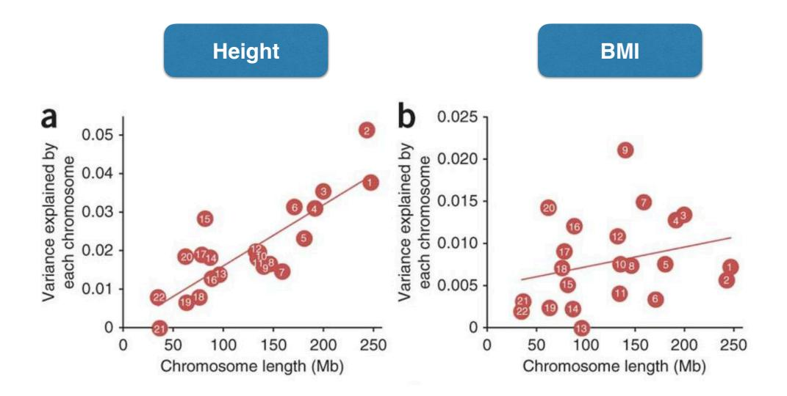

J. Yang,et al, "Genome partitioning of genetic variation for complex traits using common SNPs", May 2011.

#### **Partitioning Heritability by Chromosome**

Von Willebrand factor (vWF) is a blood glycoprotein involved in hemostasis QT interval is a measure of the time between the start of the Q wave and the end of the T wave in the heart's electrical cycle.

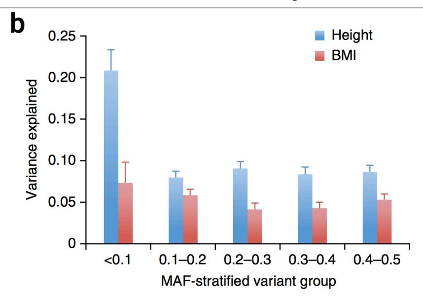

J. Yang, A. Bakshi, Z. Zhu, G. Hemani, A. A. E. Vinkhuyzen, S. H. Lee, M. R. Robinson, J. R. B. Perry, I. M. Nolte, J. V. Van Vliet-Ostaptchouk, H. Snieder, T. Esko, L. Milani, R. Mägi, A. Metspalu, A. Hamsten, P. K. E. Magnusson, N. L. Pedersen, E. Ingelsson, N. Soranzo, M. C. Keller, N. R. Wray, M. E. Goddard, and P. M. Visscher, "Genetic variance estimation with imputed variants finds negligible missing heritability for human height and body mass index," Nat Genet, vol. 47, no. 10, pp. 1114–1120, Aug. 2015.

#### **Partitioning with LD Score Regression**

$$E[\chi^2|l_j] = Nh^2l_j/M + Na + 1$$

$$E\left[\chi_{j}^{2}\right] = N\sum_{C} \tau_{C} \ell(j,C) + Na + 1$$

GWAS results (effect size / standard error )^2 is Chi2 under Null of no association

#### **How Do You Calculate Chi2 Statistic From Summary Results?**

| CHR | SNP        | BP       | A1 | TEST | NMISS | BETA   | STAT    | Р       |
|-----|------------|----------|----|------|-------|--------|---------|---------|
| 22  | rs11089128 | 14560203 | G  | ADD  | 501   | -3593  | -2.09   | 0.03709 |
| 22  | rs7288972  | 14564328 | C  | ADD  | 498   | -3333  | -2.392  | 0.01715 |
| 22  | rs11167319 | 14850625 | G  | ADD  | 501   | -229.6 | -0.1536 | 0.878   |
| 22  | rs8138488  | 14870204 | C  | ADD  | 498   | -896.2 | -1.035  | 0.3014  |
| 22  | rs2186521  | 14878387 | Α  | ADD  | 497   | -783.7 | -0.5366 | 0.5918  |
| 22  | rs2027649  | 14880040 | G  | ADD  | 494   | -359.1 | -0.3442 | 0.7308  |
| 22  | rs4911642  | 14884399 | C  | ADD  | 499   | 723.2  | 0.7611  | 0.4469  |
| 22  | rs3016104  | 15063831 | G  | ADD  | 501   | -2398  | -1.483  | 0.1388  |
| 22  | rs140378   | 15257135 | G  | ADD  | 495   | 2271   | 1.994   | 0.04671 |
| 22  | rs7287144  | 15266873 | G  | ADD  | 493   | -1593  | -1.336  | 0.1821  |
| 22  | rs5748616  | 15268900 | G  | ADD  | 496   | -1547  | -1.508  | 0.1321  |
| 22  | rs2027653  | 15298335 | C  | ADD  | 496   | -1983  | -2.023  | 0.04359 |
| 22  | rs9680776  | 15380277 | Т  | ADD  | 497   | -499.8 | -0.5788 | 0.563   |
| 22  | rs5747620  | 15412698 | C  | ADD  | 494   | -369.6 | -0.4314 | 0.6664  |
| 22  | rs9605903  | 15434720 | C  | ADD  | 501   | -1300  | -1.147  | 0.2518  |
| 22  | rs3729688  | 15435569 | G  | ADD  | 496   | -1437  | -1.664  | 0.09684 |
| 22  | rs5746647  | 15437138 | G  | ADD  | 501   | 2111   | 1.869   | 0.06215 |
| 22  | rs16980739 | 15438616 | Т  | ADD  | 497   | -1825  | -1.345  | 0.1792  |
| 22  | rs9605923  | 15445079 | Α  | ADD  | 499   | -1420  | -1.266  | 0.2059  |

#### **Stratified LD score regression**

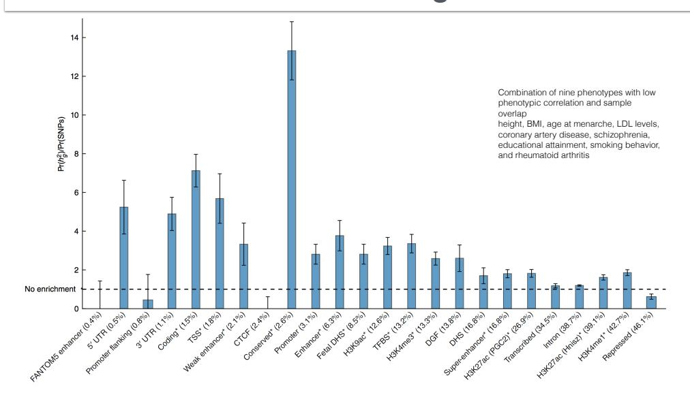

Finucane et al, "Partitioning heritability by functional annotation using genome-wide association summary statistics," Nat Genet, Sep. 2015.

#### **Gene Expression Traits: Functional Annotations Enrichment**

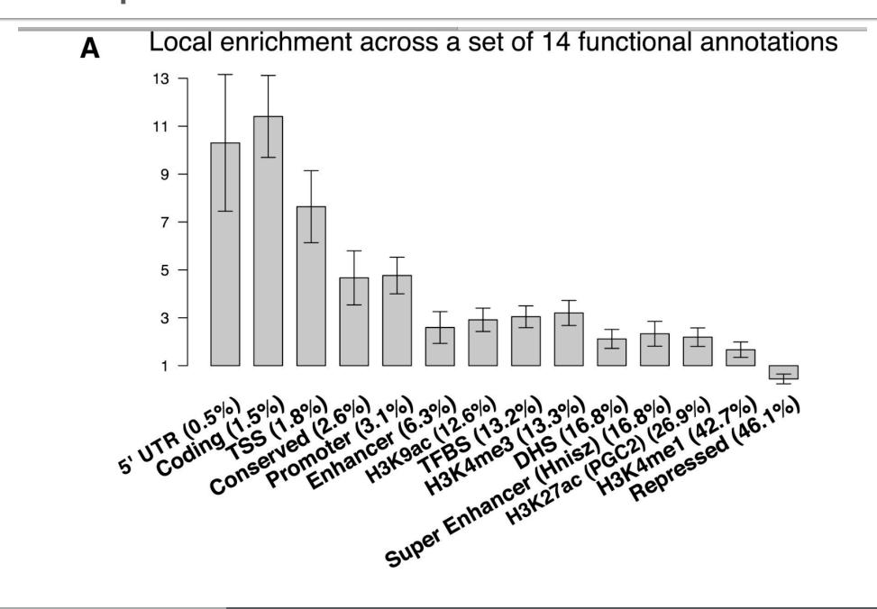

#### **Enrichment of Tissue Types**

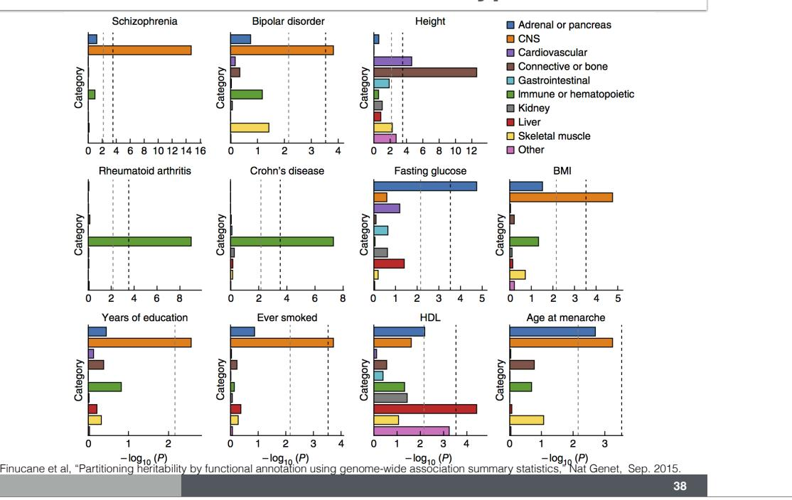

#### **The Perils of Polygenicity**

Modified from https://twitter.com/DPosthu/status/1328662943739867137