## Learning Objectives

In this lecture we first cover LD score regression (material from L6 that deserves more time), then quantify where heritability lives in the genome, and finally use eQTLs as functional annotations that help elucidate the mechanisms underlying GWAS loci.

- Explain how LD score regression distinguishes true polygenicity from confounding
- Estimate heritability and genetic correlation from GWAS summary statistics using LDSC
- Use stratified LD score regression to partition heritability by functional annotation
- Define eQTLs and sQTLs and explain the GTEx study design
- Use eQTLs as functional annotations to elucidate mechanisms underlying GWAS loci
- Understand how fine-mapping narrows associations to likely causal variants

::: {.notes}
This lecture opens with LD score regression — material introduced in L6 but not covered in enough depth there. We then extend it to stratified LDSC, which quantifies how much heritability is enriched in functional genomic regions. The second half introduces eQTLs as functional annotations: variants that associate with gene expression levels, which helps explain how non-coding GWAS loci influence complex traits. The through-line: heritability is enriched in regulatory elements → eQTLs map genetic effects on gene regulation → they serve as functional evidence linking GWAS loci to mechanisms.
:::

# LD Score Regression

::: {.callout-note appearance="minimal"}
These slides were introduced in L6 (Mixed Effects Models) but were not covered in sufficient depth. We revisit them here before extending to stratified LDSC.
:::

## Inflation of Test Statistics: Two Causes

:::: {.columns}
::: {.column width="65%"}
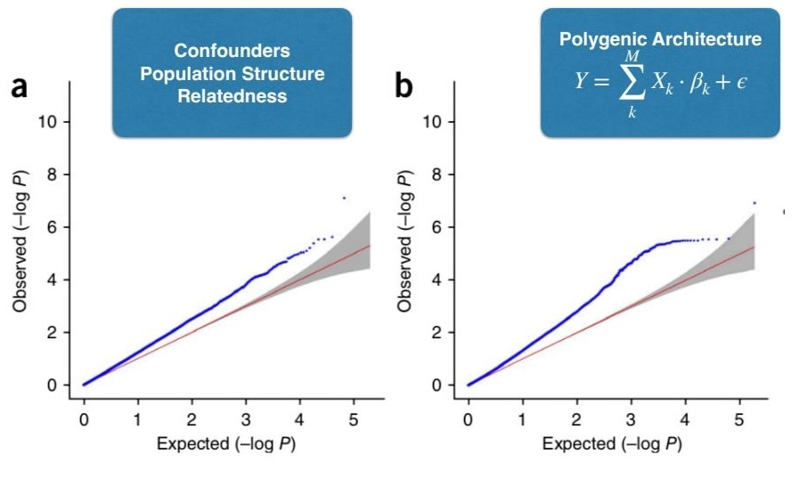
:::
::: {.column width="35%" style="font-size: 0.75em;"}
Inflation of summary statistics can be due to:

1. **Confounders** — population structure, relatedness, etc.
2. **True polygenicity** — most variants have a causal effect or are in LD with causal variants

::: {.source-credit}
Bulik-Sullivan et al. Nature Genetics, 2015.
:::
:::
::::

::: {.takehome}
Genomic control cannot distinguish between true polygenicity and confounding
:::

::: {.notes}
Genomic control divides all statistics by λ, which over-corrects if the inflation is due to true polygenicity. LD score regression provides a way to separate these two contributions.
:::

## LD and Chi² Statistics

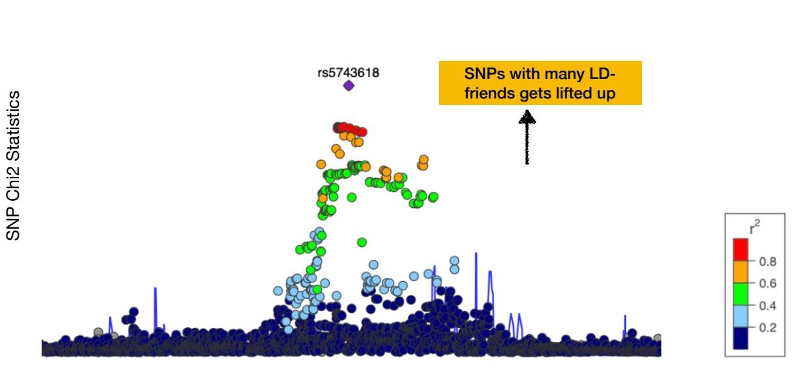

::: {.notes}
A locus-zoom-like plot with chi-squared statistics instead of p-values. Variants in high-LD regions have higher association statistics — they tag more causal variants. Variants with many "LD friends" are lifted up because they are more likely to tag causal variants.
:::

## LD Score: Measure of LD with Neighboring Variants

$$l_j = \sum_k r_{j,k}^2$$

- $l_j$ = LD score of variant $j$
- Measures amount of genetic variation **tagged** by variant $j$
- SNPs in high-LD regions have high LD scores

::: {.notes}
The LD score is the number of "LD friends" — calculated as the sum of r² with all neighboring variants. Each genetic variant has one LD score.
:::

## Polygenic Additive Model

$$Y = \sum_{k}^{M} X_k \cdot \beta_k + \epsilon \qquad \beta \sim N(0, \sigma_{\beta}^2)$$

- All $M$ common SNPs contribute to the phenotype
- Effect sizes are drawn independently from a normal distribution
- This is the main model for common disease genetics

::: {.notes}
Under this polygenic model, variants in high-LD regions are more likely to tag causal variants, so they will have higher chi-squared statistics on average. This is the key insight underlying LD score regression.
:::

## LD Score Regression Distinguishes Confounding from Polygenicity

$$E[\chi^2 \mid l_j] = \frac{Nh^2}{M} l_j + Na + 1$$

- **Slope** ($Nh^2/M$): driven by true polygenicity → estimates **heritability**
- **Intercept** ($Na + 1$): driven by confounding → estimates **population stratification / relatedness bias**

::: {.notes}
Bulik-Sullivan et al. show we can distinguish inflation due to confounding (flat line, intercept > 1) from polygenicity (positive slope proportional to LD score). Variants in high-LD regions have higher chi-squared due to tagging more causal variants. Inflation from cryptic relatedness or population stratification from genetic drift does NOT correlate with LD score.
:::

## LD Score Regression — Parameters

| Parameter | Meaning |
|-----------|---------|
| $N$ | sample size |
| $M$ | number of SNPs |
| $h^2/M$ | variance explained per SNP |
| $a$ | confounding: cryptic relatedness + population stratification |
| $l_j = \sum_k r^2_{jk}$ | amount of genetic variation tagged by SNP $j$ |

## LDSC: Slope vs. Intercept

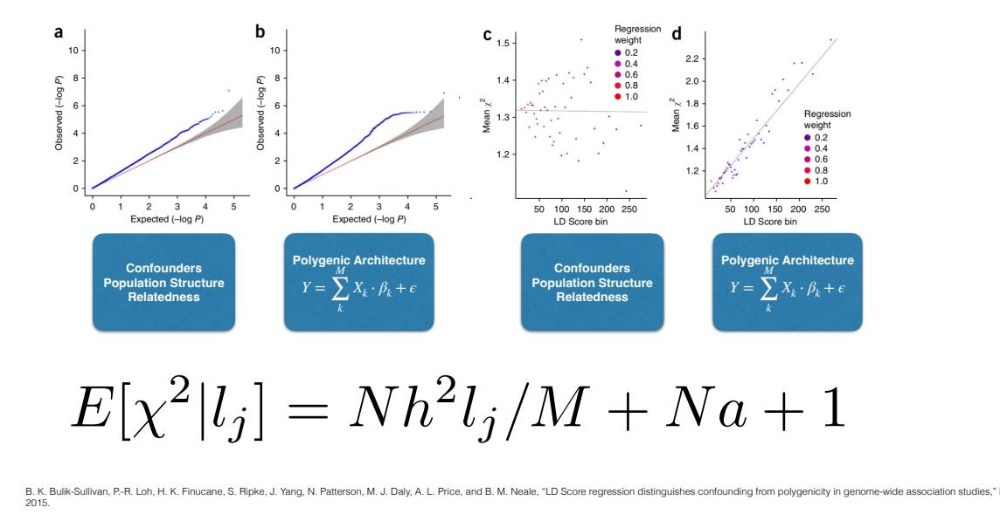

::: {.notes}
Confounding (population stratification, cryptic relatedness) produces a flat line with intercept > 1 — inflation does not correlate with LD score. True polygenicity produces a positive slope — SNPs with more LD friends have higher chi-squared because they tag more causal variants.
:::

## LD Score Regression — Schizophrenia

::: {.notes}
Schizophrenia has a very high LD score regression intercept, indicating substantial true polygenicity in addition to any confounding. The positive slope shows that SNPs with more LD friends have systematically higher chi-squared statistics.
:::

## Genomic Control vs. LD Score Regression

| Trait | $\lambda_{GC}$ (raw) | $\lambda_{GC}$ (corrected) | LDSC intercept |
|-------|------------|-----------------|----------------|
| Ulcerative colitis | 1.174 | 1.128 | 1.079 (0.010) |
| Crohn's disease | 1.185 | 1.122 | 1.059 (0.008) |
| Schizophrenia | 1.613 | 1.484 | 1.070 (0.010) |
| ADHD | 1.033 | 1.033 | 1.008 (0.006) |
| Bipolar disorder | 1.154 | 1.135 | 1.030 (0.008) |
| PGC cross-disorder | 1.205 | 1.187 | 1.018 (0.008) |
| Major depression | 1.063 | 1.063 | 1.009 (0.006) |
| Rheumatoid arthritis | 1.063 | 1.033 | 0.980 (0.007) |
| Coronary artery disease | 1.125 | 1.096 | 1.033 (0.008) |
| Type 2 diabetes | 1.116 | 1.097 | 1.025 (0.008) |

::: {.notes}
Notice that the LDSC intercept is systematically smaller than the genomic control λ. For schizophrenia, λ=1.613 looks alarming, but the LDSC intercept is only 1.070 — most of the inflation is true polygenicity, not confounding. Genomic control would have over-corrected.
:::

## LD Score Values on Chromosome 22

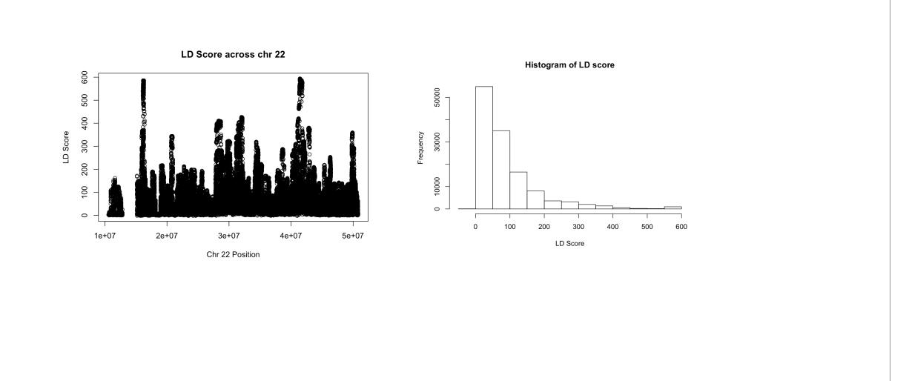

Calculated by Yanyu Liang using GTEx V8 reference variant set

::: {.notes}
LD scores vary considerably across the chromosome, reflecting the local LD structure. Regions with high LD have high LD scores; sparse regions have low LD scores.
:::

## Genetic Correlation Between Traits

:::: {.columns}
::: {.column width="60%"}
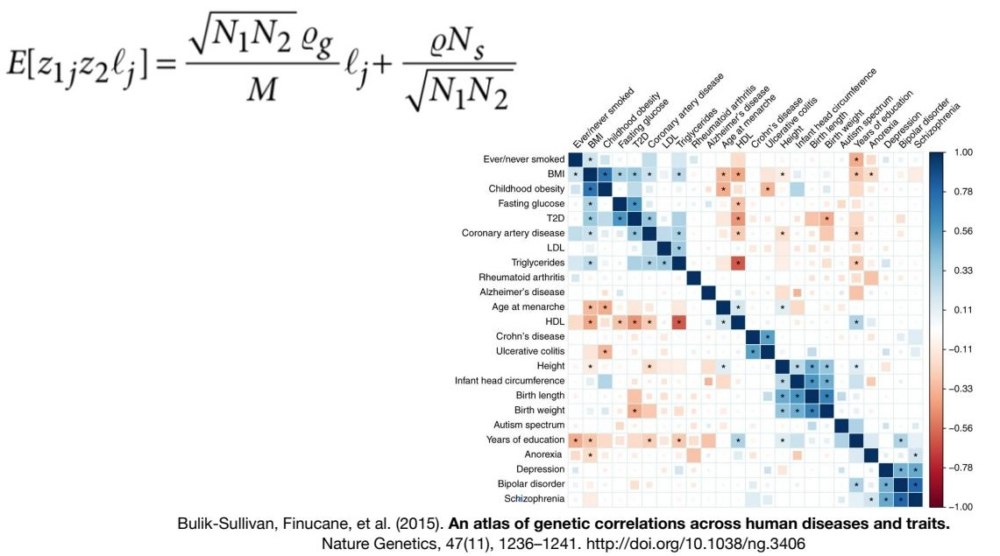
:::
::: {.column width="40%" style="font-size: 0.8em;"}
With the same assumptions, LD score regression can estimate **genetic correlation** between traits
:::
::::

$$E[z_{1j} z_{2j} \mid l_j] = \frac{\sqrt{N_1 N_2}}{M} \varrho_g \cdot l_j + \frac{\varrho N_s}{\sqrt{N_1 N_2}}$$

::: {.notes}
By regressing the product of Z-scores of two traits against LD scores, we can estimate their genetic correlation. This avoids confounders in observational studies and provides orthogonal evidence for associations.
:::

## LD Score Regression Estimates h² and Genetic Correlation

$$E[\chi^2 \mid l_j] = \frac{Nh^2}{M} l_j + Na + 1 \quad \leftarrow \text{ heritability + confounders}$$

$$E[z_{1j} z_{2j} \mid l_j] = \frac{\sqrt{N_1 N_2}}{M} \varrho_g \cdot l_j + \frac{\varrho N_s}{\sqrt{N_1 N_2}} \quad \leftarrow \text{ genetic correlation}$$

By partitioning LD scores into functional categories, we can also **partition heritability by functional annotation**.

::: {.notes}
The same LD score regression framework extends to estimate: heritability, confounding bias, genetic correlation between traits, and partitioned heritability by functional category. This is a very powerful unified framework from a single GWAS run.
:::

## Genetic Correlation Among Cancers

| | Breast | Colorectal | Lung | Ovarian | Pancreatic | Prostate |
|---|---|---|---|---|---|---|
| Breast | 1 | 0.22 (0.09) | 0.27 (0.11) | 0.26 (0.20) | 0.17 (0.19) | 0.06 (0.09) |
| Colorectal | — | 1 | 0.31 (0.10) | -0.08 (0.13) | 0.55 (0.19) | 0.09 (0.07) |
| Lung | — | — | 1 | -0.17 (0.17) | 0.32 (0.19) | 0.095 (0.08) |
| Ovarian | — | — | — | 1 | -0.40 (0.29) | 0.02 (0.14) |
| Pancreatic | — | — | — | — | 1 | -0.06 (0.14) |
| Prostate | — | — | — | — | — | 1 |

::: {.source-credit}
[ncbi.nlm.nih.gov/pmc/articles/PMC5582139/](https://www.ncbi.nlm.nih.gov/pmc/articles/PMC5582139/)
:::

## Genetic Correlation: Cancer and Other Diseases

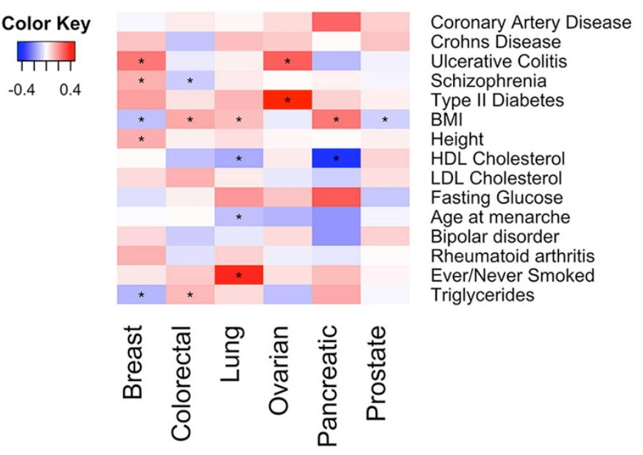

## Caveat: Assortative Mating Confounds Genetic Correlation

**Cross-trait assortative mating** inflates genetic correlation estimates

::: {.source-credit}
Border et al. *Cross-trait assortative mating is widespread and inflates genetic correlation estimates.* Science, 2022.
:::

::: {.notes}
If people mate non-randomly based on traits that are genetically correlated, this creates spurious genetic correlations. The Brainstorm Consortium and Border et al. show this is a real concern for psychiatric disorders.
:::

## Genetic Correlation Among Psychiatric Diseases

::: {.source-credit}
Brainstorm Consortium. *Analysis of shared heritability in common disorders of the brain.* Science, 2018.
:::

::: {.notes}
The Brainstorm Consortium estimated genetic correlations among 25 brain disorders. Many psychiatric disorders show high genetic correlations with each other, suggesting shared biological mechanisms.
:::

<!-- ===== L8 original content starts here ===== -->

# Partitioning Heritability

## Partitioning Heritability into Classes

::: {.formula}
$$Y = \sum_{k \in \text{class 1}} \beta_k X_k + \sum_{k \in \text{class 2}} \beta_k X_k + \epsilon$$
:::

. . .

::: {.formula}
$$\text{Var}(Y) = \sigma^2_{\text{class1}} \cdot \text{GRM}_{\text{class1}} + \sigma^2_{\text{class2}} \cdot \text{GRM}_{\text{class2}} + \sigma^2_\epsilon$$
:::

- GRM for each class built using only SNPs in that class
- Variance components estimated by REML

::: {.notes}
We partition the genome into functional classes — e.g., coding regions, UTRs, enhancers — and ask how much heritability each class explains. The GRM is built separately for each class using only those SNPs, then REML estimates the variance components. The enrichment for a class is: (fraction of heritability in class) / (fraction of SNPs in class). A class with enrichment > 1 carries more heritability per SNP than the genome average.
:::

## Partitioning Heritability by Chromosome

::: {.source-credit}
Yang et al. *Genome partitioning of genetic variation for complex traits using common SNPs.* Nature Genetics, 2011.
:::

::: {.notes}
For height, heritability is roughly proportional to chromosome length — longer chromosomes carry more SNPs and explain more variance. This confirms that height is highly polygenic, with contributions spread across the whole genome. It also validates the method: if heritability were concentrated on one chromosome, we'd see a single outlier above the line.
:::

## Partitioning Heritability by Chromosome

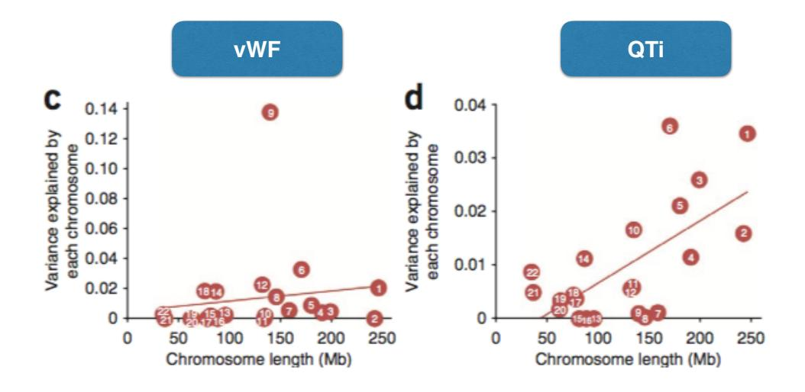

::: {.source-credit}
Yang et al. Nature Genetics, 2011.
:::

::: {.notes}
Some traits deviate from proportionality. Von Willebrand factor (vWF) shows enrichment on chromosome 12, where the VWF gene sits. QT interval shows chromosome-specific enrichment as well. These outliers highlight traits with major loci on specific chromosomes — consistent with what GWAS has found for those traits.
:::

<!---
## Missing Heritability: Negligible with Imputed Variants

::: {.source-credit}
Yang et al. *Genetic variance estimation with imputed variants finds negligible missing heritability for human height and BMI.* Nature Genetics, 2015.
:::

::: {.notes}
Earlier analyses using only genotyped SNPs explained less heritability than twin studies implied — the "missing heritability" problem. With dense imputation covering rare and low-frequency variants, nearly all the heritability for height and BMI is recovered. The gap was mostly due to incomplete tagging of causal variants, not biological mystery.
:::
--->

## Stratified LD Score Regression

::: {.formula}
$$E[\chi^2 \mid l_j] = \frac{N h^2 l_j}{M} + Na + 1$$
:::

. . .

::: {.formula}
$$E\!\left[\chi_j^2\right] = N \sum_C \tau_C \,\ell(j,C) + Na + 1$$
:::

- $\ell(j,C)$: LD score of SNP $j$ restricted to annotation category $C$
- $\tau_C$: per-SNP heritability contribution from category $C$
- **Enrichment** = (fraction of heritability) / (fraction of SNPs)

::: {.notes}
This extends the basic LDSC model (from L6) to annotation categories. If SNPs in a functional category carry more heritability per SNP than the genome average, they produce inflated chi-squared statistics relative to their annotation-specific LD scores. Regressing chi-squared on the annotation LD scores gives tau_C for each category. Runs on summary statistics alone — no individual-level data required.
:::

## How Do You Calculate χ² from GWAS Summary Statistics?

| CHR | SNP | A1 | BETA | STAT | P |
|-----|-----|----|------|------|---|
| 22 | rs11089128 | G | −3593 | −2.09 | 0.037 |
| 22 | rs7288972 | C | −3333 | −2.392 | 0.017 |
| 22 | rs11167319 | G | −229.6 | −0.154 | 0.878 |

. . .

$$\chi^2 = \text{STAT}^2$$

Most GWAS output files report a **Z-score** (or t-statistic) in the STAT column. Squaring it gives χ².

::: {.notes}
Under the null of no association, the squared Wald statistic follows a chi-squared distribution with 1 degree of freedom. Note that beta alone doesn't give you chi-squared — you also need the standard error (or the test statistic directly). LD score regression uses chi-squared, so this conversion is the first step when running S-LDSC on GWAS summary stats.
:::

## Stratified LD Score Regression — Enrichment

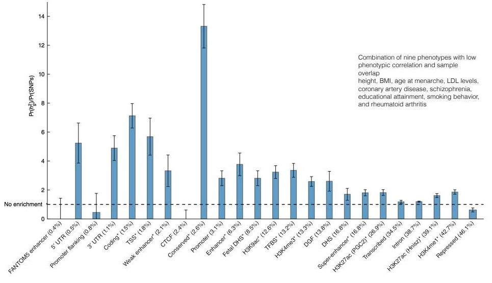

::: {.source-credit}
Finucane et al. *Partitioning heritability by functional annotation using genome-wide association summary statistics.* Nature Genetics, 2015.
:::

::: {.notes}
Heritability enrichment across 24 functional annotations for various traits. DNase I hypersensitive sites, conserved regions, and coding regions show the strongest enrichment — far more heritability per SNP than their genome fraction. This motivates looking at eQTLs: if heritability is enriched in regulatory regions, then variants that regulate gene expression are likely driving GWAS signals.
:::

## Gene Expression Traits: Functional Annotation Enrichment

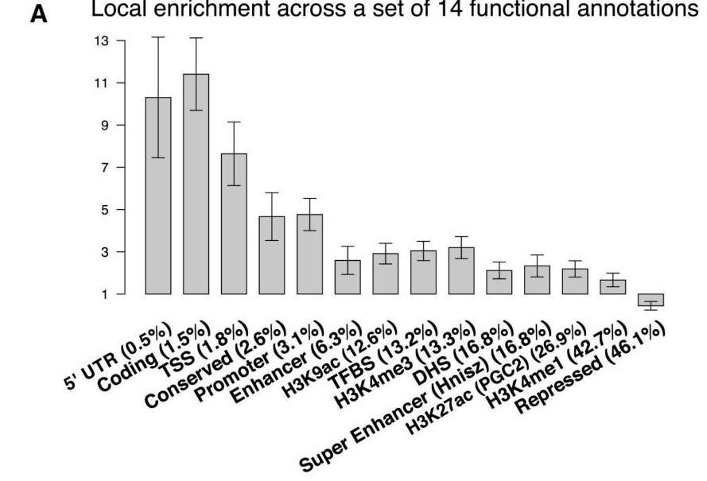

::: {.notes}
Applying the same stratified LDSC to eQTL summary statistics (gene expression as phenotype) shows enrichment in the same regulatory categories. The genetic architecture of gene expression is concentrated in functional elements — binding sites, open chromatin, conserved regions. eQTLs are not random across the genome; they cluster in regulatory regions.
:::

## Enrichment of Tissue Types

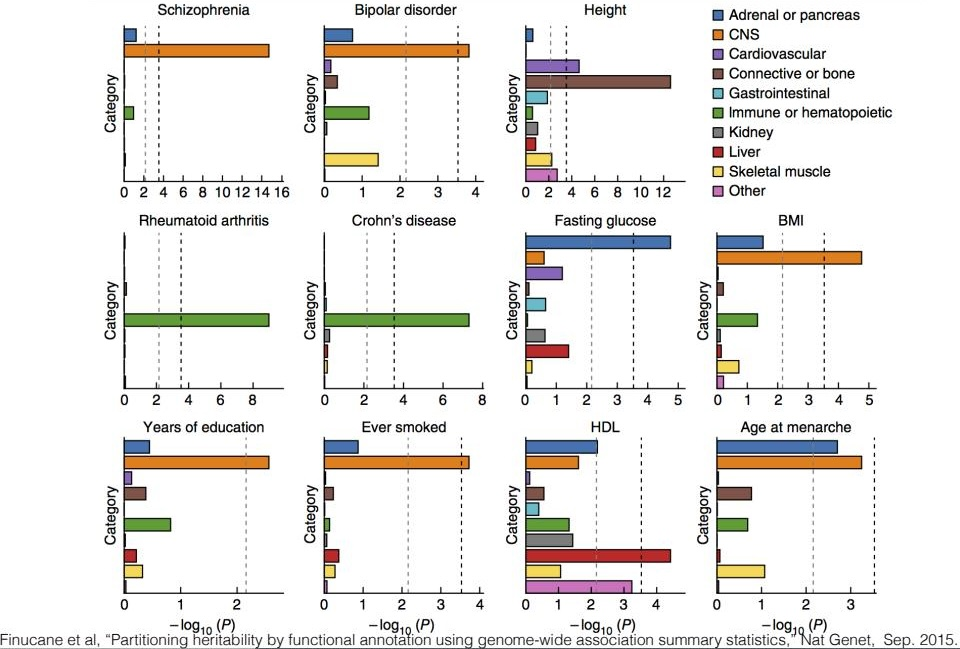

::: {.notes}
We can also partition by tissue-specific annotations — liver-specific enhancers, brain-specific open chromatin, etc. The enrichment pattern for a given GWAS trait reveals which tissues are most relevant: liver annotations are enriched for LDL cholesterol, brain annotations for psychiatric traits. This implicates tissues without requiring direct functional experiments.
:::

<!---
## The Perils of Polygenicity

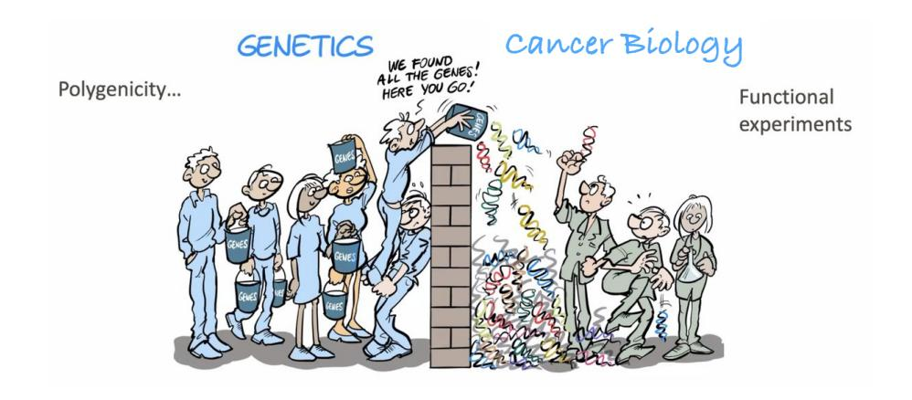

::: {.source-credit}
Modified from [D. Posthuma, Twitter, 2020](https://twitter.com/DPosthu/status/1328662943739867137)
:::

::: {.notes}
A cautionary note. Because complex traits are influenced by thousands of variants — many in LD with each other — we can end up with an overwhelming number of "associated" loci. Fine-mapping helps narrow these down to credible sets, and enrichment analysis helps prioritize tissues and annotations. But the fundamental challenge is that polygenicity makes individual variant interpretation hard. We are moving from single-variant thinking to pathway- and tissue-level inference.
:::
--->

# From GWAS to Mechanisms

## GWAS Variants Are Mostly Non-Coding

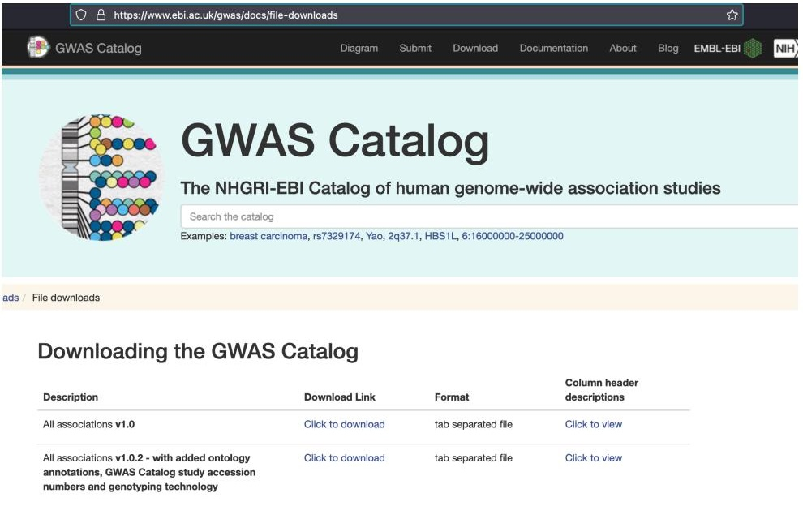

::: {.source-credit}
GWAS Catalog
:::

::: {.notes}
The GWAS catalog has accumulated thousands of associations. The vast majority of associated variants fall in non-coding regions — introns, intergenic regions, regulatory elements. They are unlikely to change protein function directly. The question is: how do these non-coding variants influence phenotype?
:::

## Non-Coding Variants Act Through Gene Regulation

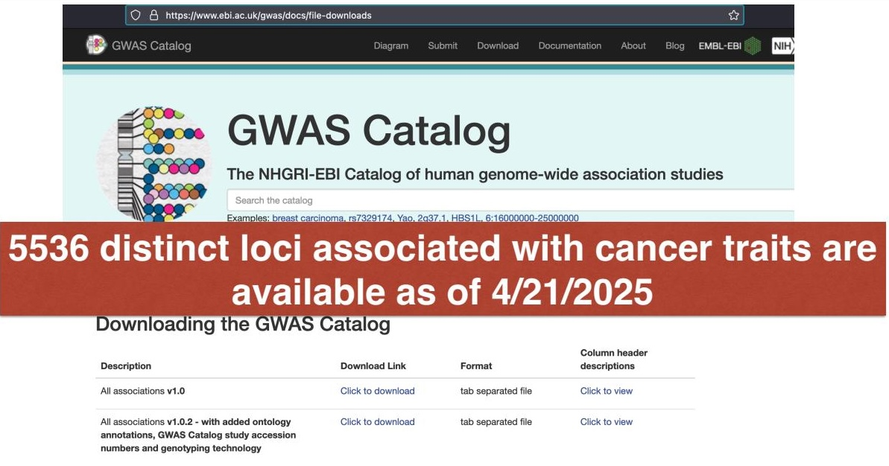

::: {.notes}
Most GWAS variants are in non-coding regions. The emerging consensus is that they affect complex traits by regulating total mRNA levels (gene expression) and pre-mRNA splicing — not by changing the protein sequence itself.
:::

## Altered Protein Levels Influence Disease Risk

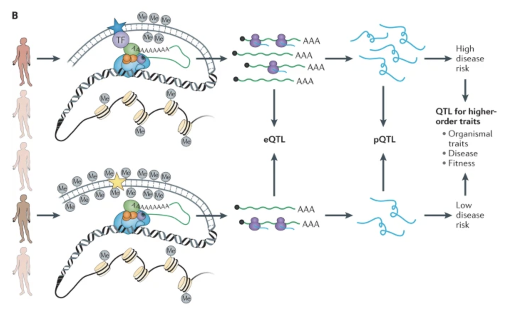

::: {.source-credit}
Albert & Kruglyak. *The role of regulatory variation in complex traits and disease.* Nature Reviews Genetics, 2015.
:::

::: {.notes}
This cartoon shows the mechanism: the blue-star allele allows a TF to bind, driving high expression of gene X → high protein → increased disease risk. The yellow allele blocks TF binding → lower expression → lower risk. The variant doesn't change the protein sequence — it changes how much protein is made. This is the paradigm that motivates studying eQTLs.
:::

## Total mRNA and Splicing Affect Complex Traits

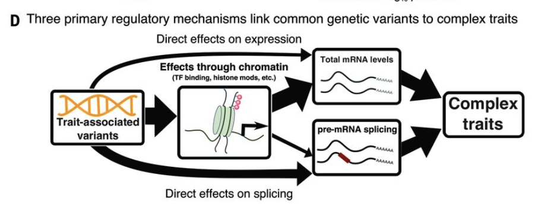

::: {.source-credit}
Li et al. *RNA splicing is a primary link between genetic variation and disease.* Science, 2016.
:::

::: {.notes}
Beyond total expression, alternative splicing is a second regulatory layer. sQTLs (splicing QTLs) are variants that alter the ratio of alternatively spliced isoforms. Both eQTLs and sQTLs are candidate mechanisms for how non-coding GWAS variants act on phenotype.
:::

## The GTEx Project

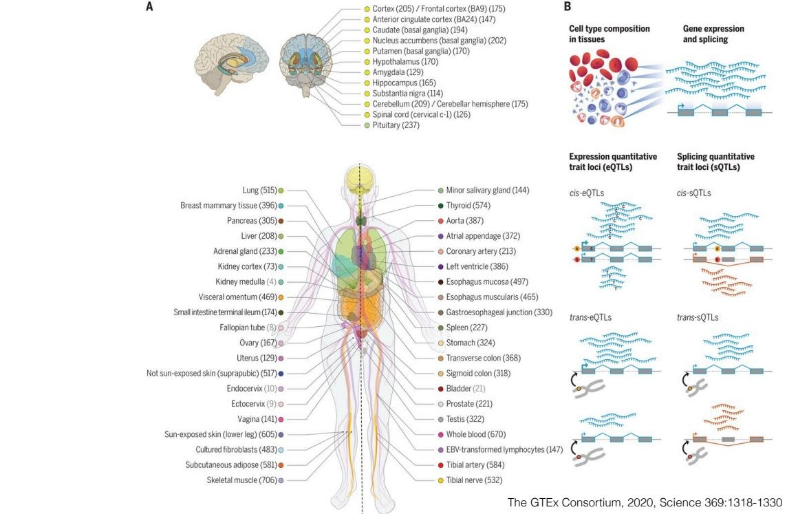

::: {.source-credit}
The GTEx Consortium. *The GTEx Consortium atlas of genetic regulatory effects across human tissues.* Science, 2020.
:::

::: {.notes}
GTEx was established in 2010 to map genetic regulatory effects across human tissues at scale. The v8 study collected 17,382 tissue samples from 838 donors across 54 tissues, all with RNA-seq and 30x WGS. 49 tissues had 73–706 samples for QTL mapping. The logistical effort — donor consent from families, tissue collection, preservation, sequencing, QC — was enormous.
:::

## GTEx v8: Scale and Design

- Established **2010** to map genetic regulatory effects across human tissues
- **17,382** tissue samples from **838** donors across **54** tissues
- All samples: RNA-seq + 30x whole genome sequencing
- **49** tissues with 73–706 samples used for QTL mapping

::: {.notes}
The scale of GTEx v8 is what makes it powerful: near-complete tissue coverage, large per-tissue sample sizes, and matched WGS enabling precise genotyping. The logistical effort — donor consent from families, tissue collection, preservation, sequencing, QC — was enormous.
:::

## Expression Quantitative Trait Loci (eQTLs)

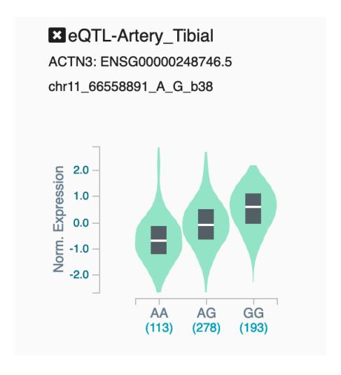

::: {.source-credit}
GTEx Portal — [gtexportal.org](https://gtexportal.org/home/locusBrowserPage/ACTN3)
:::

::: {.notes}
An eQTL is a genetic variant associated with the mRNA level of a gene. This example shows ACTN3 expression in tibial artery: individuals with different genotypes at a nearby variant have clearly different expression levels. The GTEx portal lets you look up any gene and see its eQTLs across tissues interactively — a useful resource for interpreting GWAS hits.
:::

## eGenes Scale with Sample Size

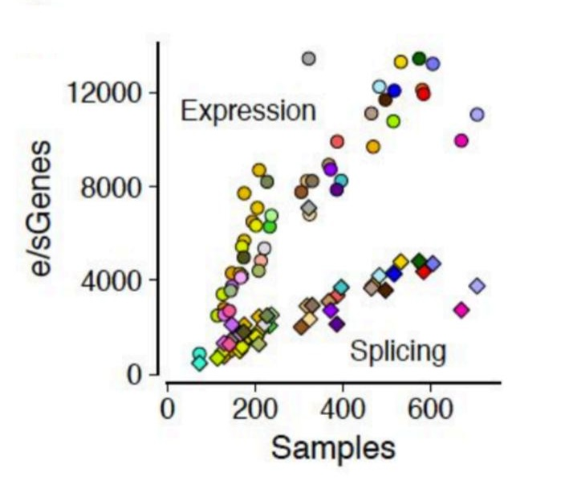

::: {.source-credit}
The GTEx Consortium. Science, 2020.
:::

::: {.notes}
eGenes are genes with at least one significant cis-eQTL. Each point is a tissue; x-axis is sample size. The trend is clear: more samples → more eGenes. The curve hasn't flattened, suggesting most expressed genes will eventually have a detectable eQTL. sGenes (splicing QTLs) follow a similar trend but need larger sample sizes — splicing is a subtler signal.
:::

## QTL Discovery Across Tissues

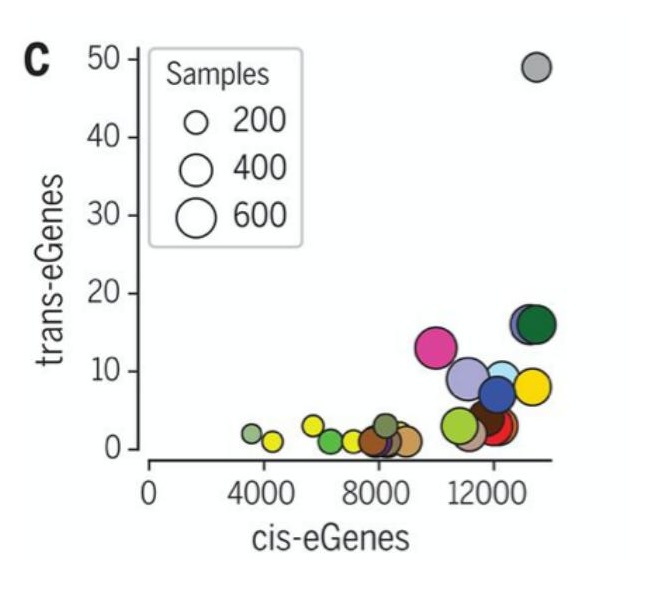

::: {.source-credit}
The GTEx Consortium. Science, 2020.
:::

::: {.notes}
GTEx v8 found cis-eQTLs for the majority of expressed genes across tissues. Panel B shows allelic heterogeneity: many eGenes have multiple independent eQTLs. Panel D shows a sex-biased eQTL for AURKA in skeletal muscle — strong effect in males, absent in females. Panel E shows a population-biased eQTL with different effect sizes in African Americans vs. European Americans. These context-dependent effects matter for GWAS interpretation.
:::

## Regulatory Mechanisms of GWAS Loci

:::: {.columns}
::: {.column width="60%"}
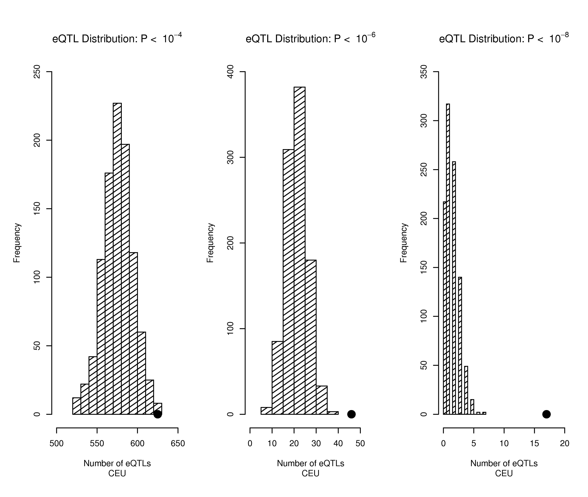
:::
::: {.column width="40%"}
Trait-Associated SNPs Are More Likely to Be eQTLs:
Annotation to Enhance Discovery from GWAS
:::
::::

::: {.source-credit}
Nicolae et al. *Trait-Associated SNPs Are More Likely to Be eQTLs: Annotation to Enhance Discovery from GWAS.* PLoS Genetics, 2010.
:::

::: {.notes}
Trait-associated SNPs from GWAS are significantly more likely to be eQTLs than random SNPs, across multiple traits and tissues. This provides strong evidence that regulatory variation — variants affecting gene expression — is a primary mechanism through which GWAS loci influence complex traits.
:::

## Functional Genomic Regions Are Enriched Among eQTLs and sQTLs

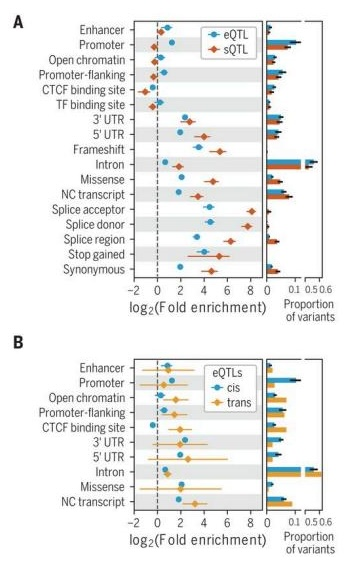

::: {.source-credit}
The GTEx Consortium. Science, 2020.
:::

::: {.notes}
cis-eQTLs are enriched in functional annotations: UTRs, splice sites, TF binding sites. Many trans-eQTLs are mediated through cis-eQTLs: a cis variant changes expression of a regulatory gene, which in turn affects other genes in trans. Panels D-E show cis-mediating genes with multiple trans-eQTLs — these are likely regulatory hubs whose expression levels propagate effects broadly across the transcriptome.
:::

# Fine-Mapping

## Fine-Mapping: The Problem

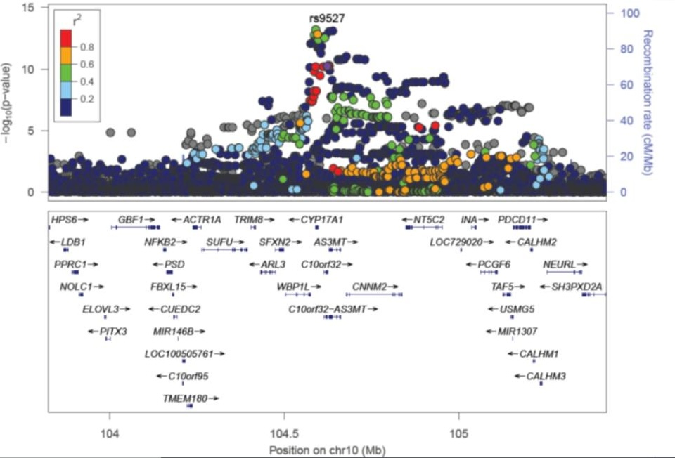

::: {.notes}
A typical GWAS regional plot: many SNPs are statistically associated because they are in LD with the causal variant. The causal variant is not obvious. Fine-mapping methods try to identify the most likely causal variant(s) within such a region. This requires association results for all variants in the locus — either from dense genotyping or imputation.
:::

## Fine-Mapping: The Goal

- **Fine-mapping:** identify the causal variant underlying an observed association
- Many variants in LD tag the true signal — the causal one is not obvious
- Requires results for **all** variants in the locus (imputation or dense genotyping)
- Build **credible sets**: sets of SNPs 95% likely to contain the causal variant
- Assign **Posterior Inclusion Probability (PIP)** to each variant

::: {.notes}
Credible sets are the Bayesian analog of a confidence interval, but for the identity of the causal variant. A 95% credible set is the smallest set of SNPs such that there is 95% posterior probability at least one is causal. PIP is the probability a specific variant is causal. High-PIP variants are strong candidates for functional follow-up or annotation overlap.
:::

## Fine-Mapping: SuSiE Example

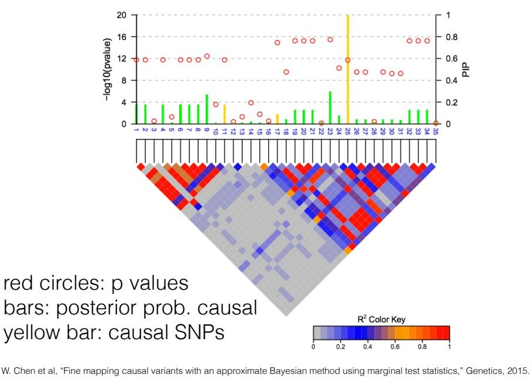

::: {.notes}
SuSiE (Sum of Single Effects) is now the most widely used fine-mapping method. This figure illustrates a challenging case: the strongest marginal association is NOT the causal variant. Despite this, SuSiE converges to two credible sets, each containing a true causal variant. The method handles multiple causal variants per locus and avoids being misled by strong non-causal associations.
:::

## Fine-Mapping: IBSS Algorithm

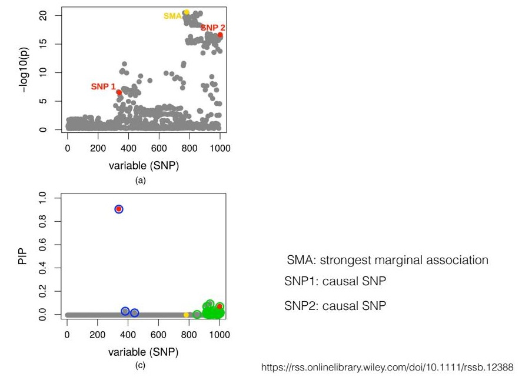

::: {.source-credit}
Wang et al. *A simple new approach to variable selection in regression, with application to genetic fine mapping.* JRSS-B, 2020.
:::

::: {.notes}
The IBSS (Iterative Bayesian Stepwise Selection) algorithm is the engine behind SuSiE. After one iteration it incorrectly includes the strongest marginal association in a credible set. After 10 iterations (at convergence) it has corrected itself: two credible sets each containing a true causal variant, neither containing the SMA. One credible set has just 3 SNPs (purity 0.85); the other has 37 highly correlated variants (purity 0.97) — small individual PIPs but high confidence that one is causal.
:::

## Fine-Mapping Methods

- **CAVIAR** (Hormozdiari et al., Bioinformatics 2015)
- **FINEMAP** (Benner et al., Bioinformatics 2016)
- **fastPAINTOR** (Kichaev et al., Bioinformatics 2016)
- **DAP-G** (Wen et al., AJHG 2016)
- **SuSiE** (Wang et al., JRSS-B 2020) — current standard

::: {.notes}
All methods take summary statistics plus an LD reference panel as input; some also accept individual-level data. SuSiE has become standard due to computational efficiency and the ability to model multiple causal variants per locus. Fine-mapping output can be combined with ENCODE or other functional annotations to further prioritize variants within credible sets.
:::

## Fine-Mapping of cis-eQTLs in GTEx

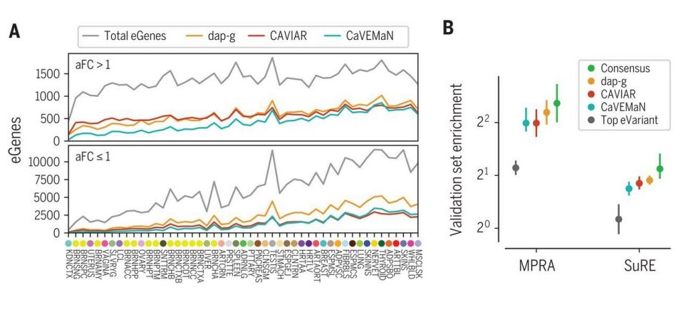

::: {.source-credit}
The GTEx Consortium. Science, 2020.
:::

::: {.notes}
GTEx applied fine-mapping to cis-eQTLs across all tissues. Panel A: the number of eGenes with a high-confidence fine-mapped variant (PIP > 0.5) increases with sample size, but flattens for small-effect eQTLs — harder to fine-map. Panel B: fine-mapped variants are more enriched in validated regulatory elements than the top eVariant alone. Panel C: for CBX8, the credible set overlaps EGR1 binding sites — the variant disrupts the EGR1 motif, directly implicating TF binding as the mechanism.
:::

# ENCODE

## ENCODE: Encyclopedia of DNA Elements

- Pilot phase launched in 2003
- Goal: catalog all **functional elements** in the human genome
  - Elements acting at the protein and RNA level
  - Regulatory elements controlling when and where genes are active
- Characterizes functional elements of the genome and epigenome

::: {.notes}
ENCODE is the large-scale consortium that produced the regulatory annotation data used by stratified LDSC, fine-mapping tools, and colocalization methods. It provides information on open chromatin (DNase-seq, ATAC-seq), TF binding (ChIP-seq), histone modifications, and more — across hundreds of cell types. Crucially, ENCODE provides region-level information, not variant-level: it tells you a position is in a regulatory region, not which allele is functional.
:::

## ENCODE Regulatory Annotations

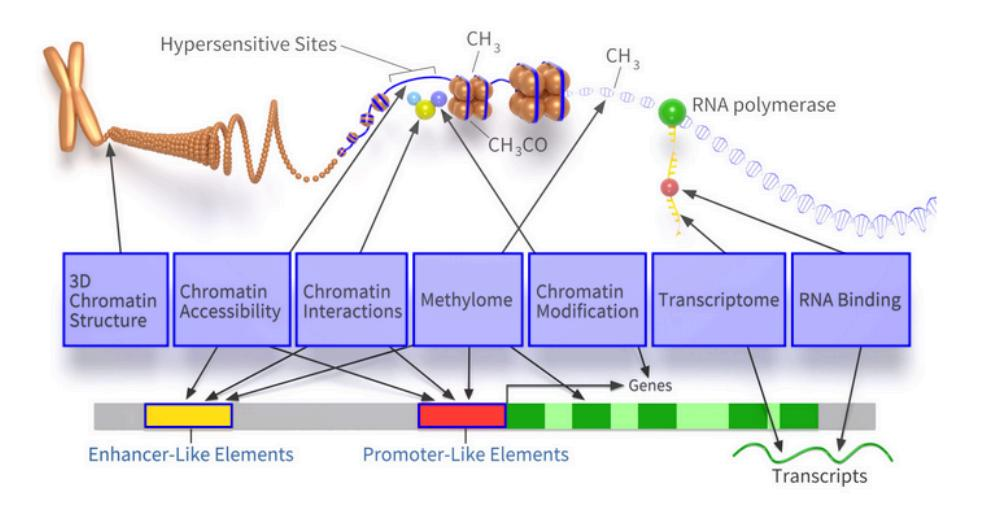

::: {.notes}
ENCODE annotations define regions with evidence for regulatory activity: open chromatin, TF binding sites, promoters, enhancers. These are the categories used in stratified LDSC enrichment analysis. The key limitation: ENCODE tells you the region is regulatory, but not which variant in the region is causal. Fine-mapping narrows the credible set; ENCODE and other functional data help prioritize within it. Together these tools move us from a GWAS p-value to a specific variant in a specific regulatory context.
:::
