## Learning Objectives

- Explain why post-GWAS analysis is necessary to identify causal genes and mechanisms
- Describe how eQTLs and sQTLs connect non-coding variants to complex traits
- Understand the TWAS/PrediXcan framework and its advantages over naive approaches
- Explain what colocalization tests and when it fails
- Define Mendelian Randomization and its three core assumptions
- Interpret MR results and recognize violations of MR assumptions (pleiotropy)

::: {.notes}
This lecture bridges GWAS discovery and biological understanding. Part 1 covers gene-level association methods — TWAS (PrediXcan) and colocalization — that identify which genes underlie GWAS loci. Part 2 introduces Mendelian Randomization for testing causal effects of modifiable exposures on disease. Both halves share the theme: association is not causation, but genetics can help us get closer.
:::

# From GWAS Loci to Genes

## Most GWAS Variants Are Non-Coding

- ~90% of GWAS catalog variants fall outside protein-coding regions
- Non-coding variants cannot be interpreted directly from protein function
- They likely act by **regulating gene expression** — changing how much of a gene is made, or how it's spliced

::: {.takehome}
GWAS finds *where* in the genome; post-GWAS analysis asks *what gene* and *through what mechanism*
:::

::: {.notes}
This is the central motivation for everything in the first half of the lecture. If variants were coding, we could immediately ask "what does this amino acid change do?" Non-coding variants require a detour through gene regulation.
:::

## Which Gene Should We Target for Therapy?

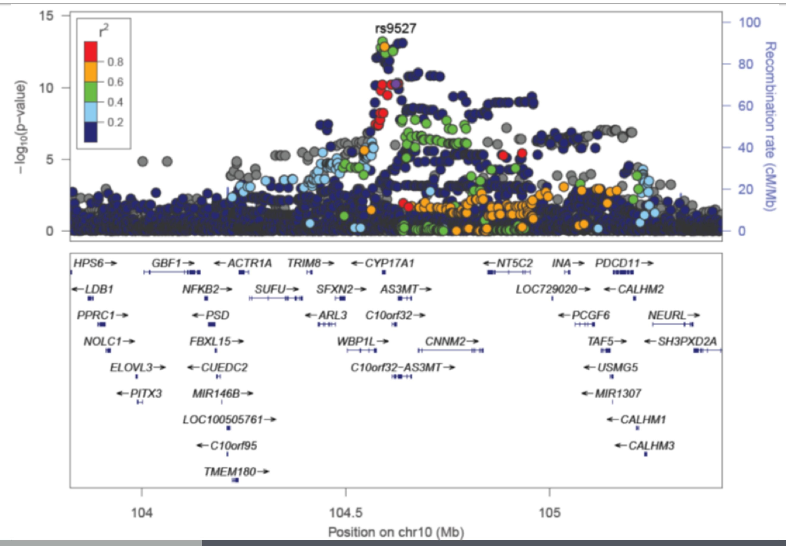

::: {.notes}
A GWAS locus may contain dozens of variants in high LD. Multiple genes may be nearby. Simply picking the nearest gene is unreliable. We need principled methods to connect loci to genes.
:::

## Altered Protein Levels Influence Disease Risk

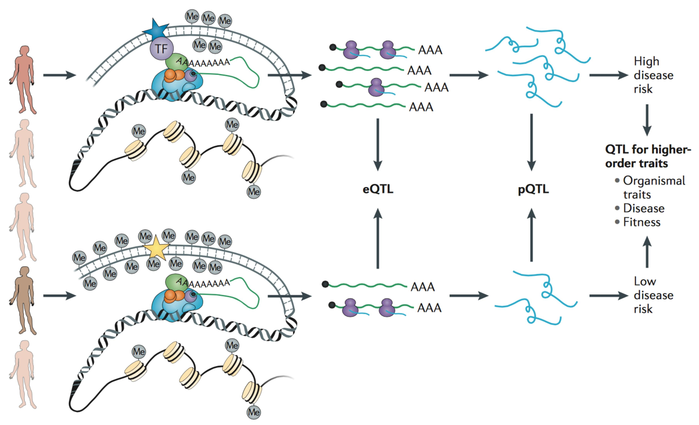

::: {.source-credit}
Albert & Kruglyak (2015). *Nature Reviews Genetics*
:::

::: {.notes}
Regulatory variants alter transcript levels or splicing, which changes protein abundance, which influences phenotype. This causal chain justifies looking at eQTLs as intermediaries between GWAS variants and disease.
:::

## What is Splicing?

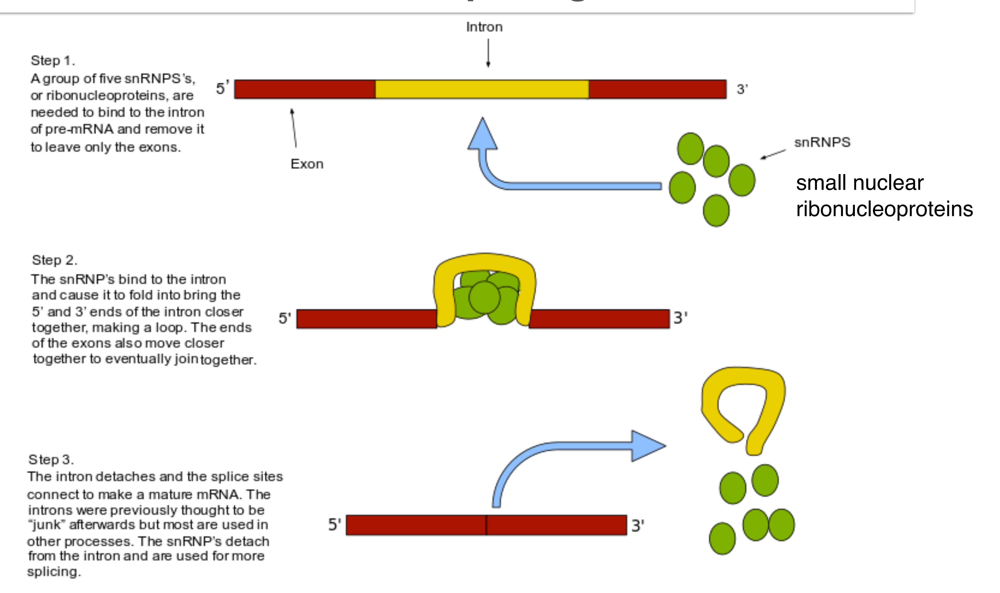{height=75%}

::: {.source-credit}
https://commons.wikimedia.org/w/index.php?title=File:Splicesome.pdf
:::

::: {.notes}
Pre-mRNA is processed into mature mRNA by splicing out introns. Different exon combinations (alternative splicing) produce different protein isoforms. sQTLs are genetic variants that alter splicing ratios.
:::

## Total mRNA and Splicing Affect Complex Traits

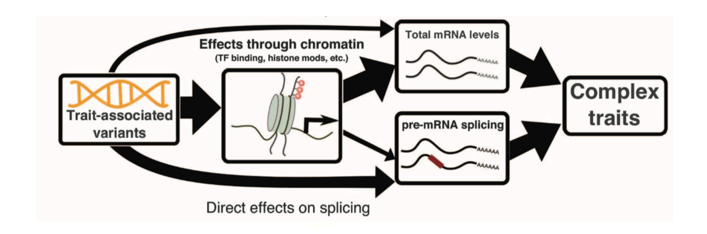

::: {.source-credit}
Li et al. *Science* 2016
:::

::: {.notes}
Both the total level of mRNA (captured by eQTLs) and alternative splicing (captured by sQTLs) have been shown to be primary links between genetic variation and disease. Li et al. 2016 showed RNA splicing may be even more important than total expression.
:::

## Expression Quantitative Trait Loci (eQTLs)

:::: {.columns}
::: {.column width="50%"}
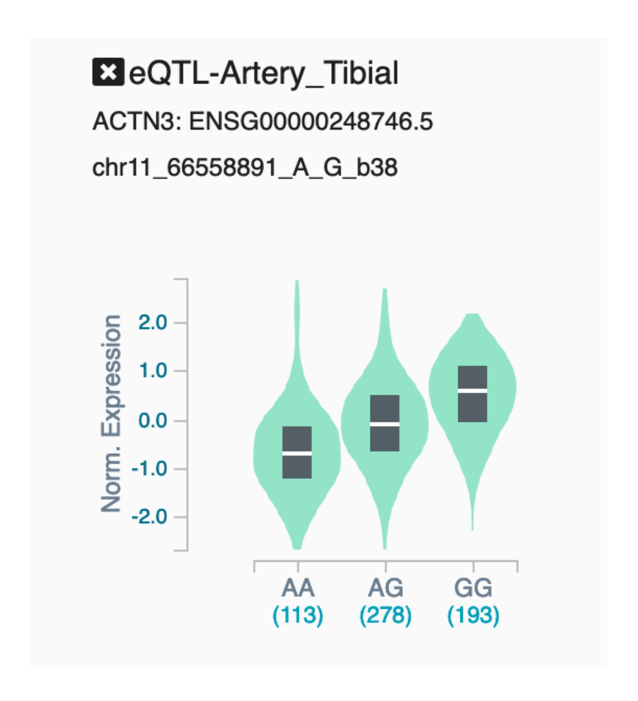

::: {.source-credit}
GTEx Consortium. *Science* 2020; [GTEx portal — ACTN3 locus](https://gtexportal.org/home/locusBrowserPage/ACTN3)
:::
:::
::: {.column width="50%"}
::: {.takehome}
The dose-response relationship between genotype and expression level provides strong evidence that the eQTL is causal for expression changes
:::
:::
::::

::: {.notes}
The GTEx portal shows eQTL results across 49 tissues. A clear three-group violin plot (0, 1, 2 copies of effect allele) showing graded expression changes is compelling evidence of a true eQTL. This dose-response is what we expect from a causal genetic effect.
:::

# How Do We Find Causal Genes?

## Naive Approach: Find the eGene of the Top SNP

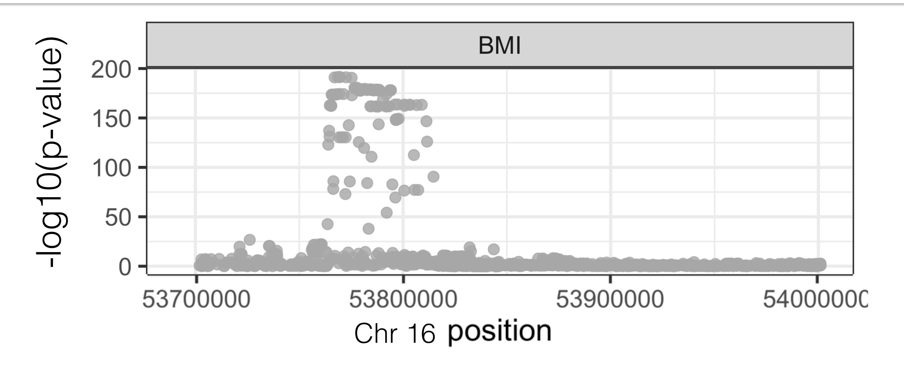

::: {.takehome}
Take top GWAS SNP (e.g., rs1558902 for BMI) → look it up in GTEx → find its eGene
:::

::: {.source-credit}
[GTEx portal — rs1558902](https://gtexportal.org/home/snp/rs1558902)
:::

::: {.notes}
The naive approach is simple and often used informally. It assumes the top GWAS SNP is also the top eQTL SNP and that the nearby eGene is therefore the causal gene. Both assumptions can fail.
:::

## GTEx Shows eQTL and sQTL Evidence

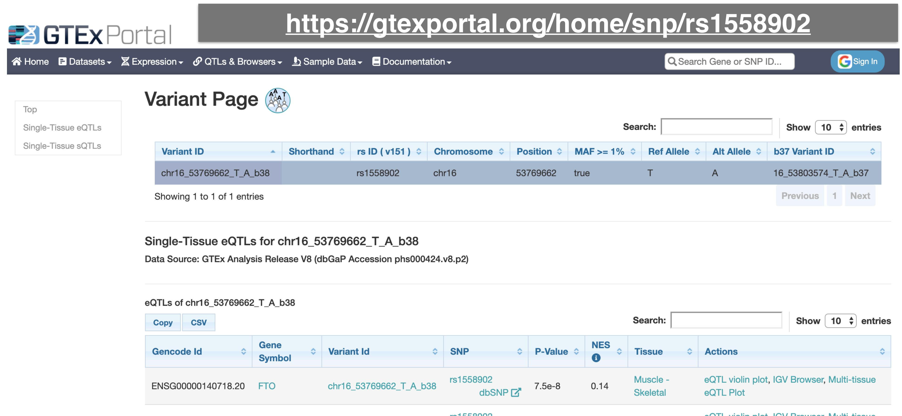

::: {.notes}
The famous FTO locus example: rs1558902 is a top BMI GWAS hit near the FTO gene. But careful eQTL analysis pointed to IRX3 as the regulated gene. This is a textbook example of naive approach failure.
:::

## Naive Approach Can Lead to False Links

:::: {.columns}
::: {.column width="55%"}
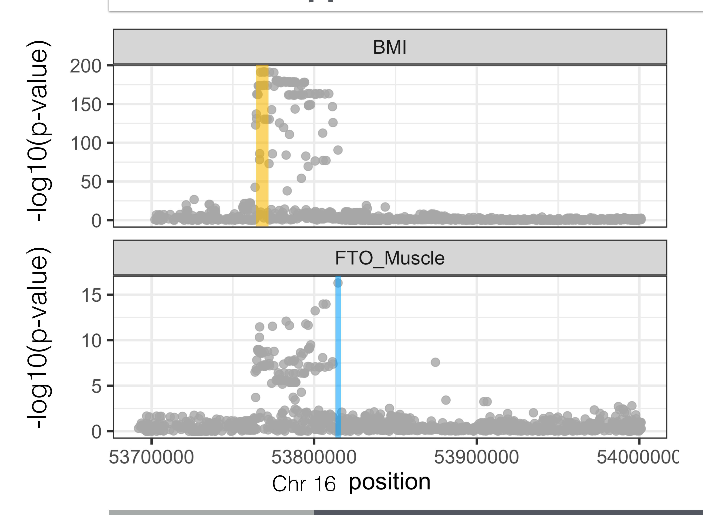
:::
::: {.column width="45%"}
Yellow and brown bars show where posterior inclusion probability is concentrated — often *not* at the GWAS lead SNP

::: {.takehome}
The top GWAS SNP ≠ the causal eQTL variant. LD contamination makes naive gene assignment unreliable.
:::
:::
::::

::: {.notes}
Fine-mapping with SusieR or other Bayesian methods reveals the credible set of causal variants. When the fine-mapped eQTL credible set and the GWAS credible set don't overlap, the gene assignment from the naive approach is wrong.
:::

# TWAS: The Association Approach

## GWAS Discovers Loci but Mechanism Is Unclear

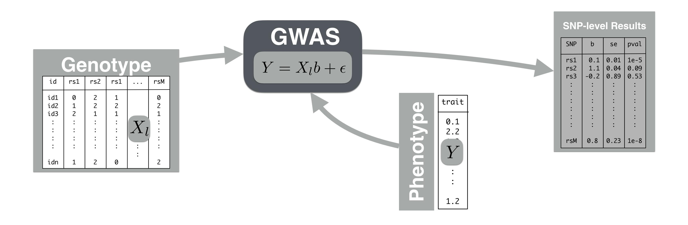

::: {.notes}
A Manhattan plot of a complex trait shows many significant loci — but for each one, we face the same problem: which gene, in which tissue, through what mechanism? TWAS is a systematic approach to answer this at scale.
:::

## Could TWAS Identify Genes?

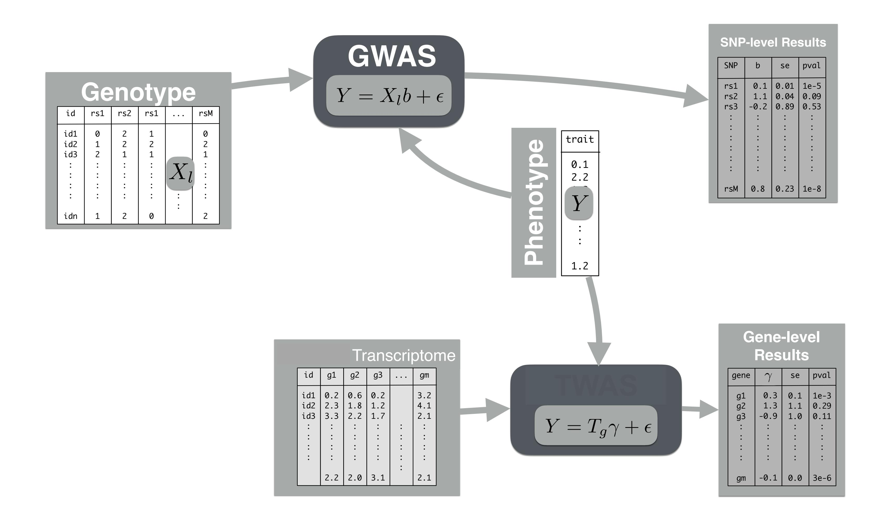

::: {.notes}
The conceptual diagram of TWAS: instead of testing SNP-trait associations, test predicted expression-trait associations. Each gene becomes a unit of analysis.
:::

## Why Not Just Measure Expression Directly?

Three problems with direct expression measurement:

- RNA-seq is expensive — not available in large GWAS cohorts
- Many relevant tissues (brain, pancreas, etc.) are not accessible in living donors
- **Reverse causality:** differentially expressed genes may be *consequences* of disease, not causes

::: {.takehome}
Using genetic predictors of expression removes reverse causation and enables analysis in tissues that cannot be biopsied
:::

::: {.notes}
The solution is elegant: train models that predict expression from genotype using reference datasets (GTEx), then apply those models to GWAS participants. Because genotype precedes both expression and disease, reverse causation is eliminated.
:::

## Use Genetic Predictors of Gene Expression

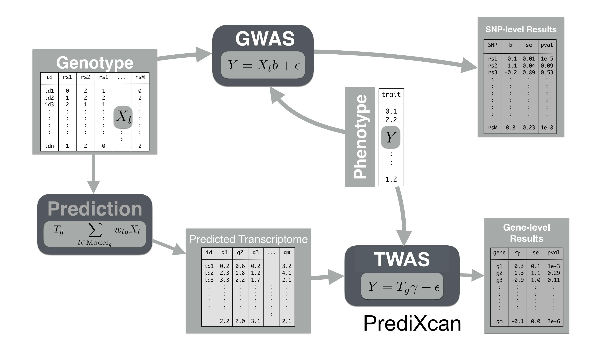

::: {.notes}
The key insight: genotype causes expression, so we can predict expression from genotype. The prediction model is trained in a reference dataset where both genotype and transcriptome data are available (e.g., GTEx).
:::

## We Can Train Gene Expression Predictors Using Reference Data

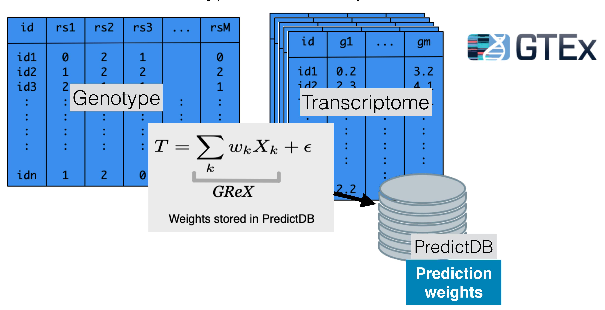

::: {.takehome}
Reference genotype + transcriptome → elastic net models → sparse predictors with good cross-validated performance
:::

::: {.notes}
Elastic net regularization selects a small number of SNPs per gene (sparse predictors). Sparsity is important — denser models like BSLMM include more LD-contaminating SNPs. Enforcing sparsity improves both prediction accuracy and reduces false associations from LD.
:::

## We Can Train Gene Expression Predictors Using Deep Learning Methods

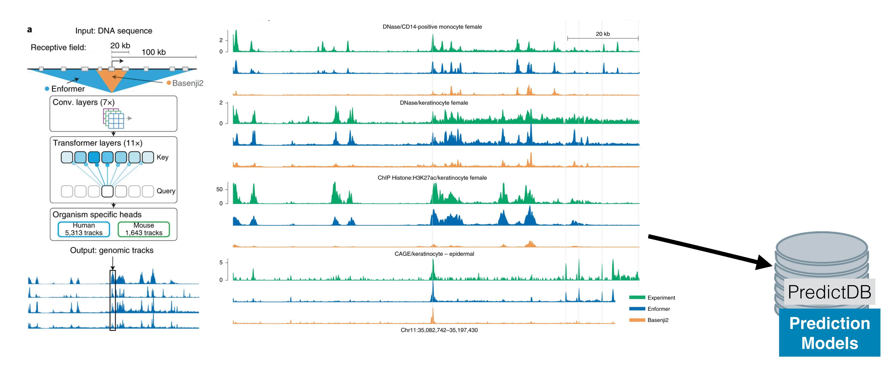

::: {.source-credit}
Avsec et al. *Nature Methods* 2021 (sequence-based prediction)
:::

::: {.notes}
Sequence-based models like Enformer (Avsec et al. 2021) predict gene expression directly from DNA sequence, complementing GTEx-trained elastic net models.
:::

## PrediXcan: TWAS with Genetically Predicted Expression

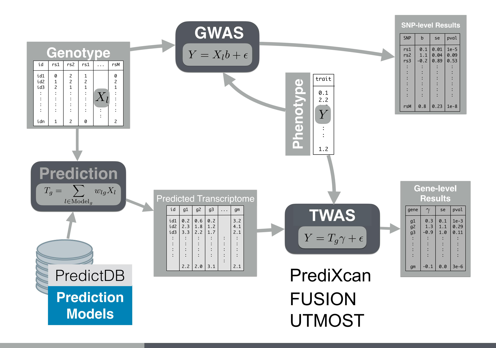

::: {.notes}
PrediXcan (Gamazon et al. 2015) applies the trained expression prediction models to an independent cohort, then correlates predicted expression with the trait of interest. S-PrediXcan (Barbeira et al. 2018) extends this to GWAS summary statistics, enabling analysis without individual-level data.
:::

## Examples of Well-Predicted Genes

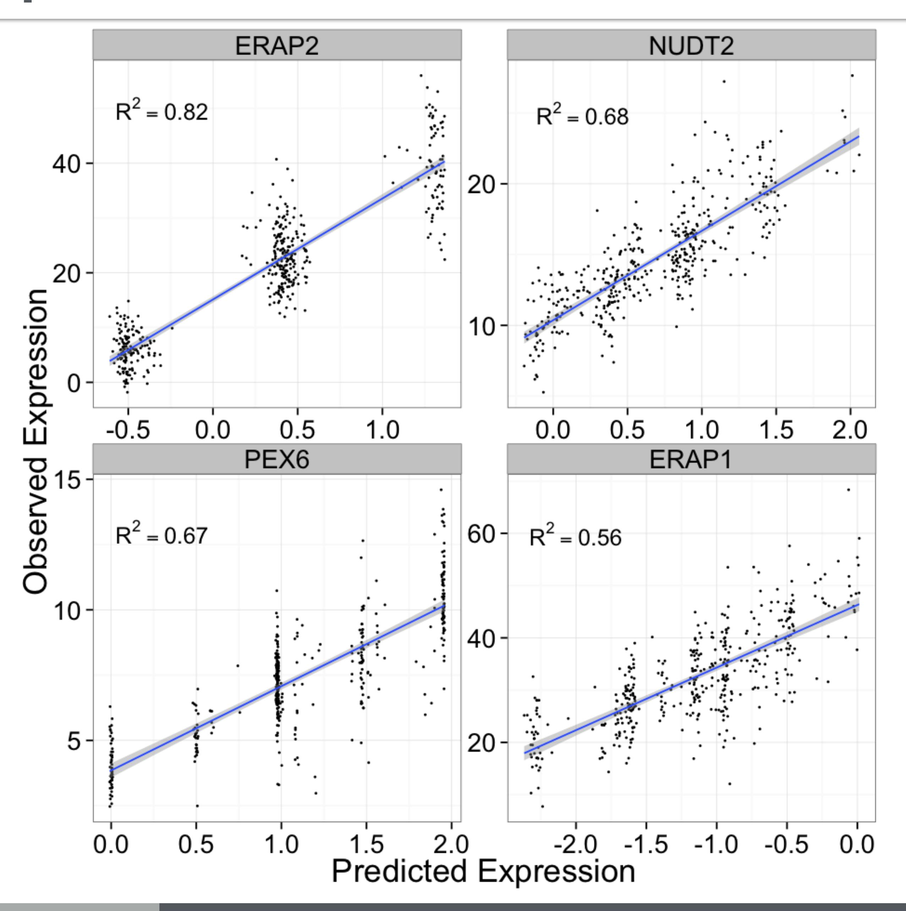

::: {.notes}
Not all genes are equally predictable. Genes with high cis-heritability (variance in expression explained by local genetic variants) are well predicted. Genes with low cis-heritability cannot be reliably predicted and are excluded.
:::

## Prediction Performance Tracks Heritability

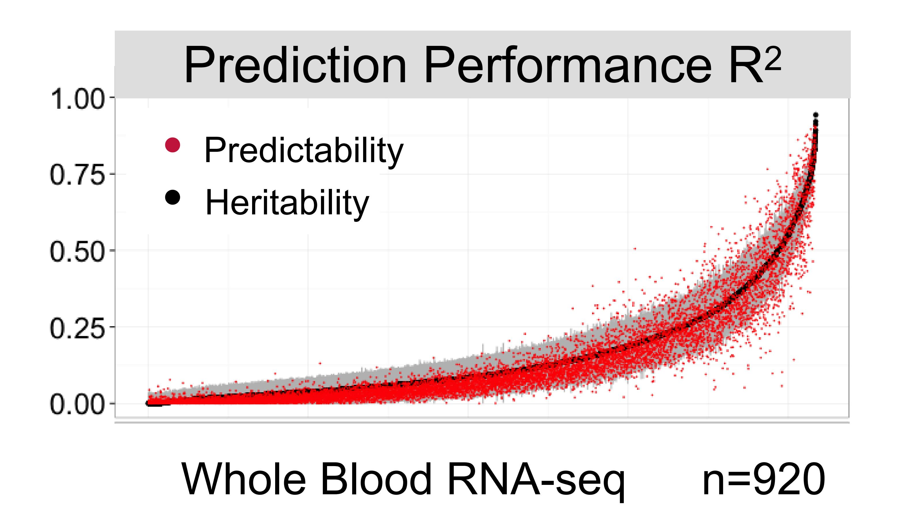

::: {.takehome}
Prediction accuracy (R²) scales with cis-heritability of gene expression — genes with more heritable expression have more reliable predictors
:::

::: {.notes}
This is an important validation: the prediction models are capturing genuine genetic signal, not noise. The correlation between cross-validated R² and heritability is a sanity check that the method is working as intended.
:::

## Advantages of Gene-Level Associations

- **Reduced multiple testing:** ~10⁶ SNPs → ~10⁴ genes
- **Better functional annotation:** gene function is far better characterized than individual SNP effects
- **Cross-species validation:** gene knockdowns in model organisms can confirm predictions
- **Direction of effects:** predicts whether increasing/decreasing gene expression is harmful or protective
- **Drug target prioritization:** genes are actionable; SNPs usually are not

::: {.notes}
These advantages make TWAS a practical complement to GWAS. The reduction in multiple testing is particularly valuable — with ~10,000 genes to test instead of millions of SNPs, the significance threshold is much more achievable, and there are fewer spurious hits to follow up.
:::

## Limitations of Association Methods

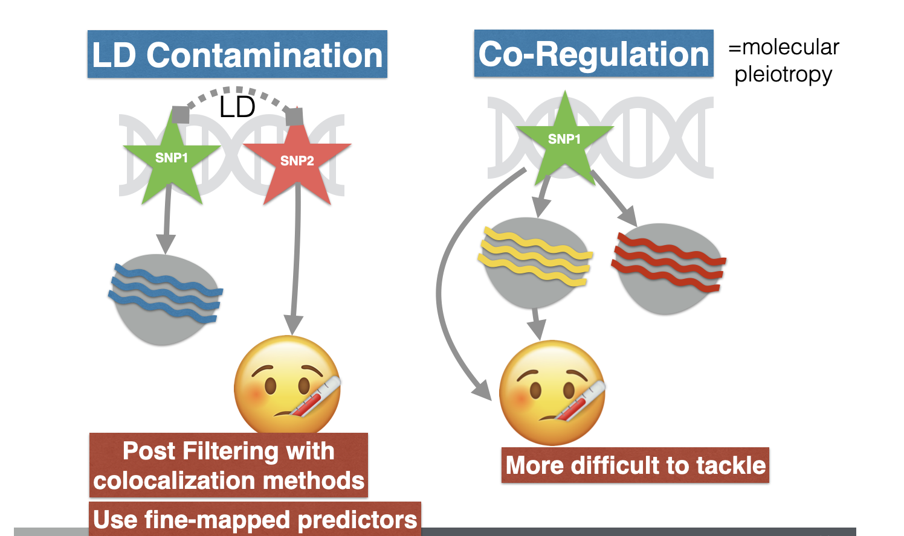

::: {.notes}
The three main limitations of TWAS. LD contamination is the most tractable — addressed by sparse predictors and colocalization. Molecular pleiotropy is harder: a variant that regulates 10 genes will produce 10 TWAS associations, but only one gene may be causal for the trait. Colocalization can help here too.
:::

## Colocalization

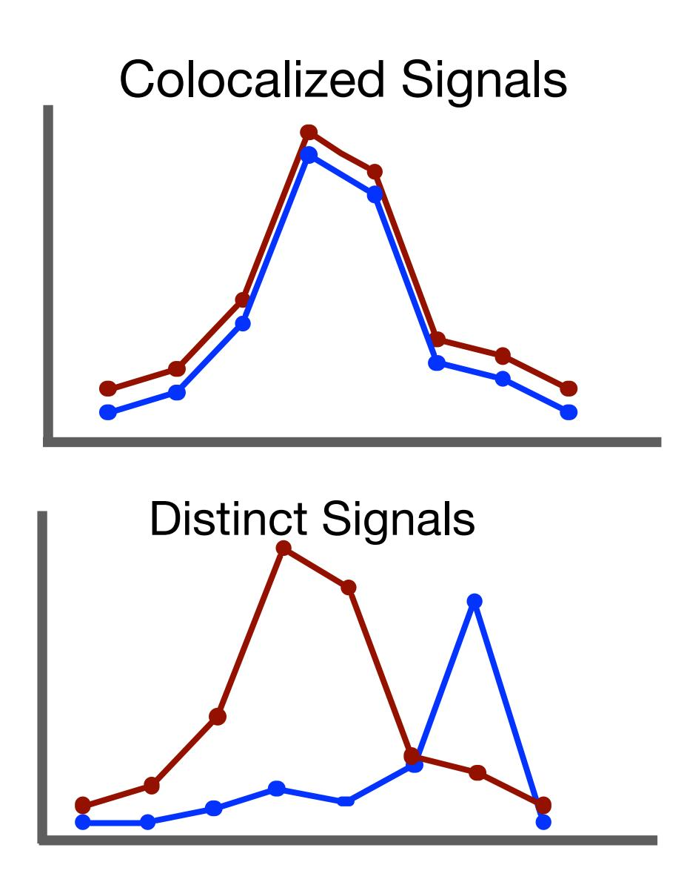

::: {.notes}
Section divider introducing colocalization as a solution to LD contamination and a method to confirm TWAS findings.
:::

## Colocalization: Do GWAS and eQTL Share a Causal Variant?

:::: {.columns}
::: {.column width="60%"}
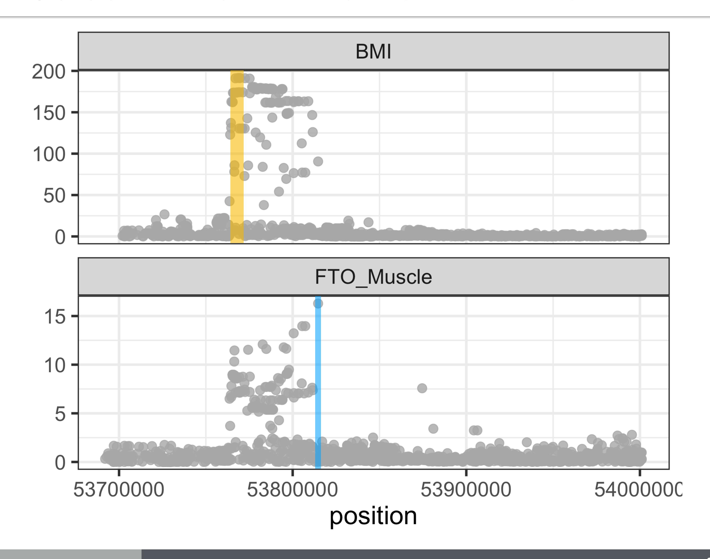
:::
::: {.column width="40%"}
Two signals can be correlated because they share a causal variant (**colocalize**) or because distinct causal variants are in LD (**no colocalization**)

::: {.takehome}
Colocalization asks: are the GWAS and eQTL signals driven by the same variant, or by two different variants that are correlated?
:::
:::
::::

::: {.notes}
The coloc tool (Giambartolomei et al. 2014) computes posterior probabilities for five hypotheses: no association in either trait, association only in trait 1, only in trait 2, both traits with different causal variants, or both traits with the same causal variant. H4 (shared causal variant) is what we want for confident gene assignment.
:::

## Limitations of Colocalization

## Fine-Mapping Is Sensitive to LD Reference

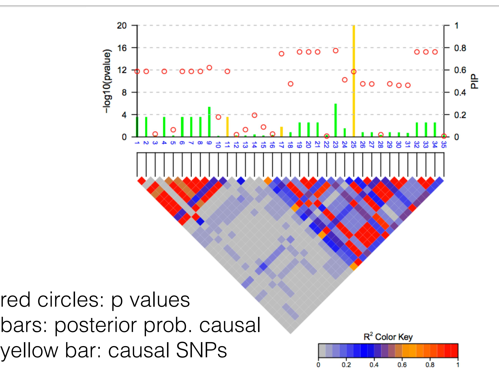

::: {.source-credit}
W. Chen et al. *Genetics* 2015 — Approximate Bayesian fine-mapping
:::

::: {.notes}
Fine-mapping underlies colocalization: both methods require accurate LD to assign posterior probabilities to variants. When the LD reference panel (e.g., 1000 Genomes) doesn't match the GWAS cohort (e.g., UK Biobank), fine-mapping results can be unreliable.
:::

## Even the same trait may not "colocalize"

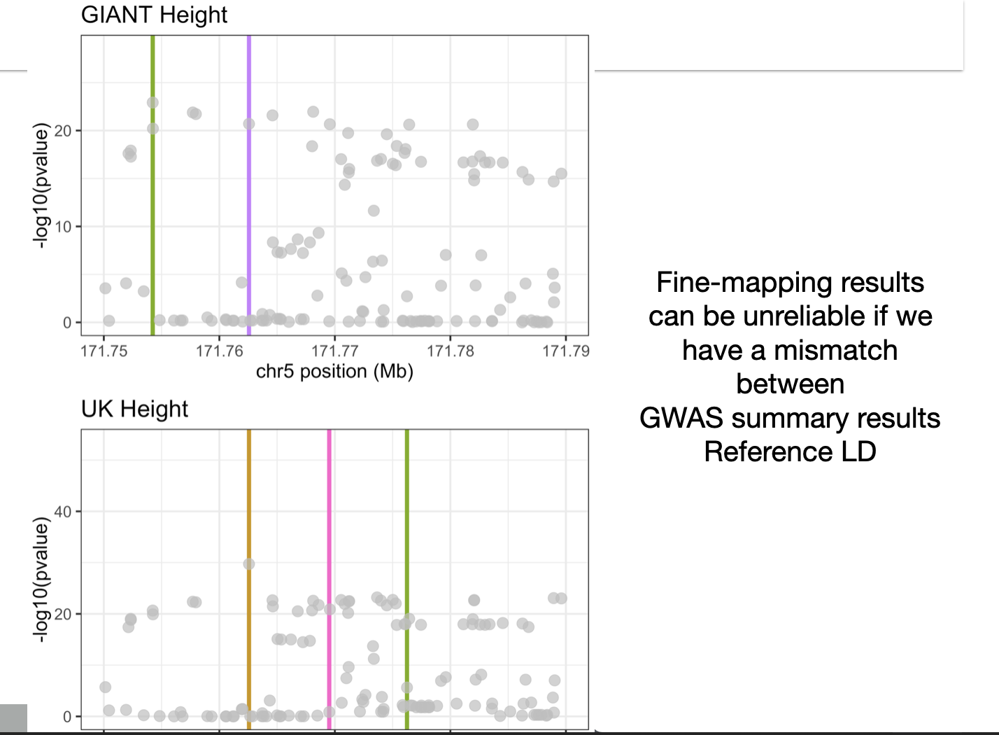

::: {.notes}
This is a sobering result. The same trait (height) measured in two large cohorts should have highly overlapping causal variants. When they don't colocalize, it's an artifact of using an external LD panel. The take-home: colocalization results should not be taken at face value when in-sample LD is not used.
:::

## Colocalization Can Be Too Conservative

- Colocalization can help identify causal genes but is very conservative in practice
- Real colocalized signals are frequently dismissed due to:
  - LD reference mismatch
  - Low prior probability assigned to shared causal variant
  - Insufficient sample size for the eQTL study

::: {.notes}
The field's current recommendation is to treat colocalization as a filter for high-confidence signals rather than as a definitive test. Discarding all non-colocalized TWAS signals would miss many true causal genes.
:::

## Recommendation for Post-GWAS Analysis

1. **Start with TWAS/association** to generate a list of candidate causal genes
   - Use sparse predictors (elastic net > BSLMM)
   - Fine-mapped expression predictors are even better
2. **Apply colocalization** to filter out LD-contaminated associations
3. **Be aware** that colocalization is conservative — real signals may be discarded
4. **Ask** for better LD reference resources
   - Studies should share LD matrices alongside GWAS summary statistics

::: {.takehome}
TWAS generates candidates; colocalization filters them — but neither method is infallible
:::

::: {.notes}
This slide encapsulates the practical workflow for post-GWAS gene discovery. It's a two-step funnel: cast a wide net with TWAS, then apply a conservative filter with colocalization. The key caveat is that the filter may be too aggressive, and the field needs better LD resources to improve it.
:::

## Summary: Dissecting Mechanisms of GWAS Variants

- Most trait-associated variants are non-coding → interpretation requires a mechanistic investigation
- They likely act through regulation of gene expression (eQTLs, sQTLs)
- TWAS with genetically predicted expression identifies putatively causal genes at scale
- Colocalization mitigates LD contamination but can be overly conservative
- Better LD reference panels are urgently needed for the field

::: {.notes}
Brief summary of Part 1 before transitioning to Mendelian Randomization.
:::

# Mendelian Randomization

## Less Technical Introduction

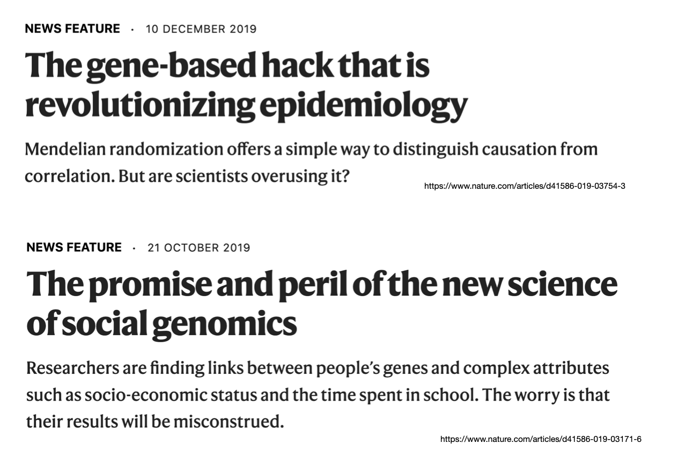

::: {.notes}
These Nature news articles provide accessible introductions to MR for students who want a non-technical starting point before diving into the statistical framework.
:::

## Mendelian Randomization

**A statistical method to assess causal relationships between a modifiable exposure and a disease outcome**

- Can we determine causality with statistical methods?
- MR leverages the fact that genotypes are not generally susceptible to reverse causation or confounding
- Genotypes are assigned at conception — before the exposure or disease develops

::: {.notes}
MR was first proposed by Gray and Wheatley in 1991 and formalized by Davey Smith and Ebrahim in 2003. The core idea: alleles are randomly distributed at meiosis (like randomization in a clinical trial), so they are unlikely to be confounded by lifestyle, socioeconomic status, or other factors.
:::

## Correlation Is Not Causation

Observational associations between an exposure and disease can arise from:

1. **Causation** — exposure genuinely causes disease ✓
2. **Reverse causation** — disease causes the exposure ✗
3. **Confounding** — a third variable causes both ✗

::: {.takehome}
To establish that an exposure *causes* a disease, we need methods that are robust to confounding and reverse causation
:::

::: {.notes}
Classic examples: people who carry umbrellas have higher rates of wet shoes — not because umbrellas cause wet shoes, but because rain confounds both. In medicine: observational studies showed that people with high HDL had fewer heart attacks — but does high HDL *cause* fewer heart attacks?
:::

## Randomized Trial and Mendelian Randomization

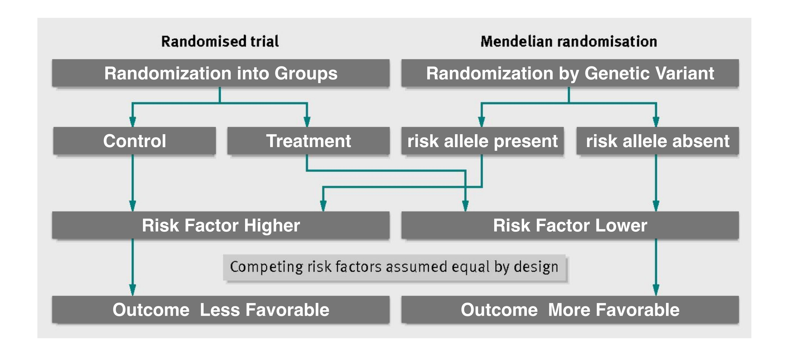

In MR, nature performs the randomization: alleles are assigned at conception, creating "genetic strata" that differ in exposure level but not (ideally) in confounders

::: {.source-credit}
Burgess et al. *BMJ* 2012 — Mendelian randomisation to assess benefit of clinical intervention
:::

::: {.notes}
The analogy to RCTs is powerful: in an RCT, randomization of treatment breaks the link between treatment and confounders. In MR, random inheritance of alleles at meiosis breaks the link between the genetic instrument and confounders. The key difference: MR provides a lifetime "dose" of altered exposure, whereas an RCT tests a specific intervention over a defined period.
:::

## Evidence Hierarchy for Causal Links

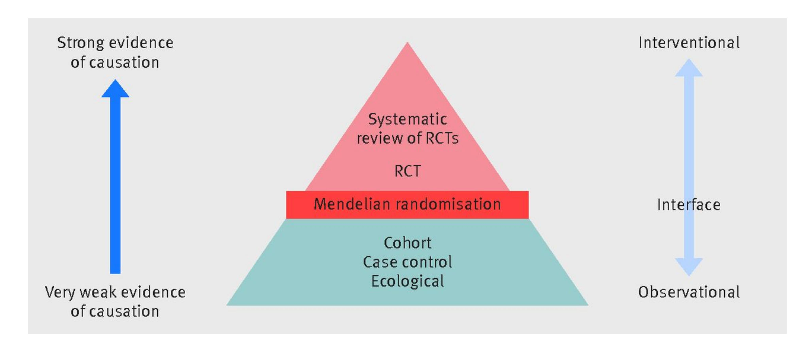

RCT = Randomized Clinical Trial — the gold standard for causal inference in medicine

::: {.source-credit}
Davies, Holmes & Davey Smith. *BMJ* 2018 — Guide to reading MR studies
:::

::: {.notes}
MR sits below RCTs in the evidence hierarchy but above observational studies. It is particularly valuable when RCTs are unethical (e.g., testing whether smoking causes cancer) or impractical (e.g., testing a lifetime exposure like childhood nutrition).
:::

## The MR Question

**Goal:** Test association between a modifiable exposure and disease

Examples of exposures: smoking, HDL cholesterol, BMI, blood pressure, years of education

::: {.notes}
MR is most valuable when the exposure is modifiable — that is, when a positive result has therapeutic implications. Testing whether genetically elevated HDL reduces MI risk is actionable because drugs can raise HDL. Testing whether being taller causes disease is less actionable.
:::

## Why We Need MR: Confounders Mislead

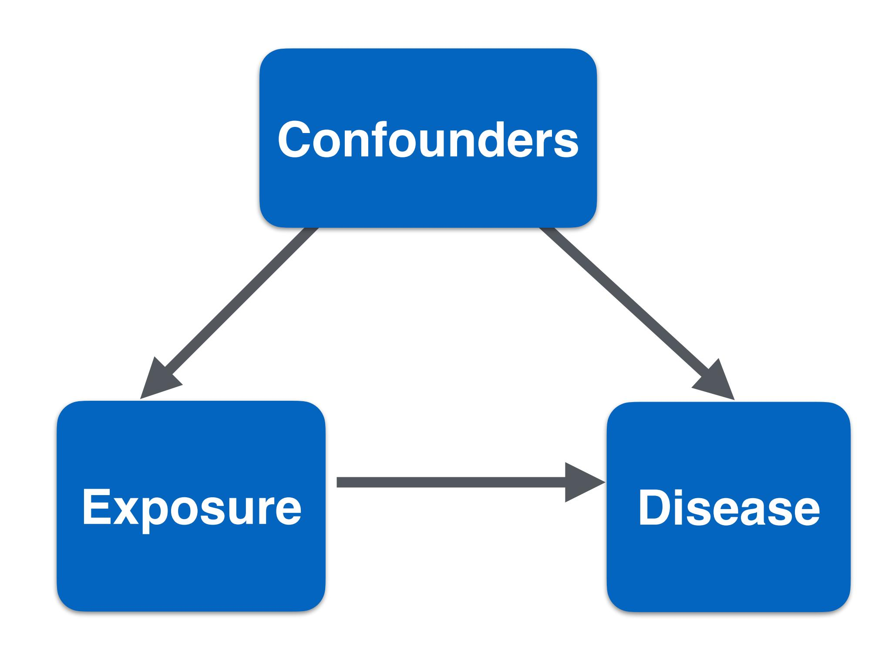

Confounders create spurious associations between exposure and outcome in observational data

::: {.notes}
Socioeconomic status, diet, physical activity, and many other factors confound observational associations between, say, HDL cholesterol and heart attack risk. Genetic instruments for HDL are inherited at conception and are not influenced by these lifestyle factors.
:::

## MR Uses an Instrumental Variable

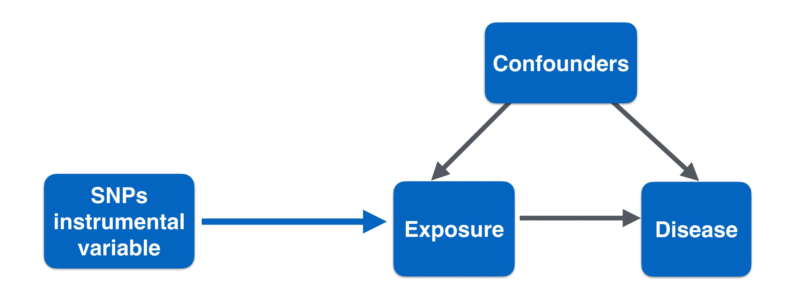

The genetic variant (IV) must be associated with exposure but have no direct path to outcome except through the exposure

::: {.notes}
Instrumental variables (IV) analysis is a classic econometric technique. MR applies it in genetics: find a variant (or set of variants) that (1) strongly predicts the exposure, (2) is not associated with confounders, (3) has no direct effect on the outcome. The ratio of the genetic effect on outcome to the genetic effect on exposure estimates the causal effect of exposure on outcome.
:::

## Three Assumptions of MR

::::: {.columns}
:::: {.column width="60%"}
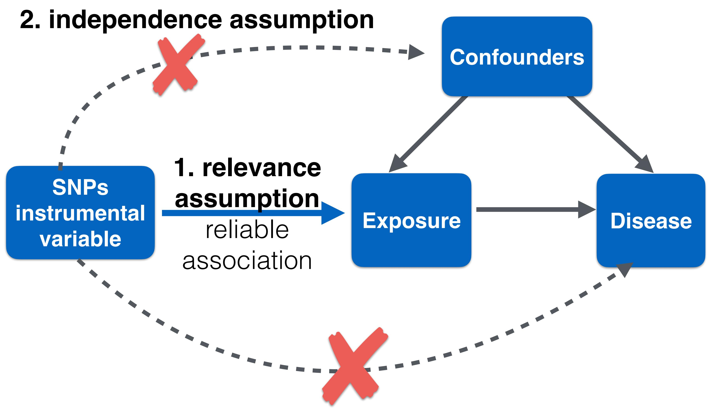
::::
:::: {.column width="40%"}
1. **Relevance:** IV is associated with the exposure
2. **Independence:** IV is not associated with confounders
3. **Exclusion restriction:** IV affects outcome *only* through the exposure — no direct effect

Assumption 3 (exclusion restriction) is the most difficult to verify and is violated by horizontal pleiotropy
::::
:::::

::: {.notes}
Assumption 1 is testable — just check the F-statistic in the first-stage regression (strong instruments: F > 10). Assumption 2 is testable for measured confounders (check if IV predicts BMI, smoking, SES, etc.). Assumption 3 is the hard one — it requires biological knowledge and sensitivity analyses.
:::

## Examples of MR and Assumptions

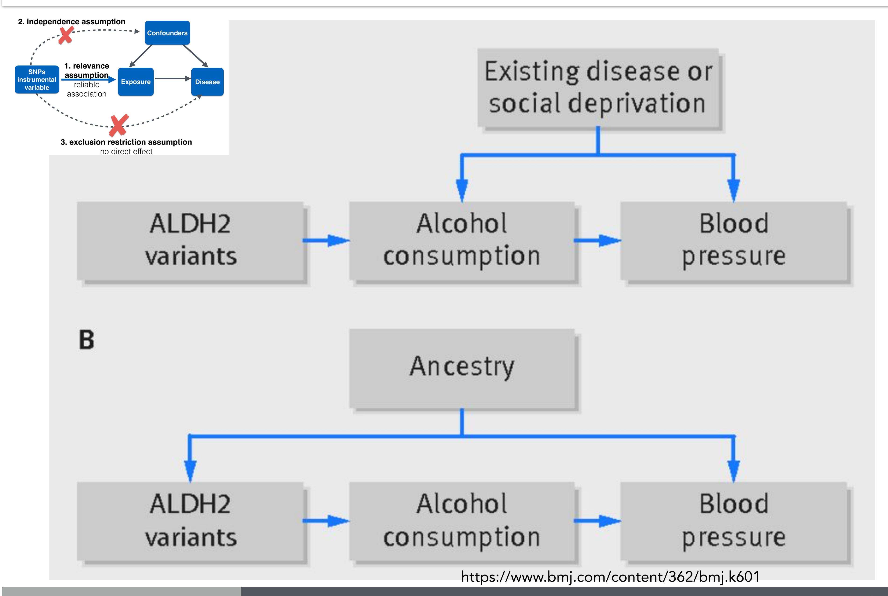

::: {.notes}
Concrete examples help students see when MR works (variant near gene affects exposure and nothing else) vs. when it fails (pleiotropic variant affects multiple traits independently).
:::

## Horizontal vs. Vertical Pleiotropy

::::: {.columns}
:::: {.column width="60%"}
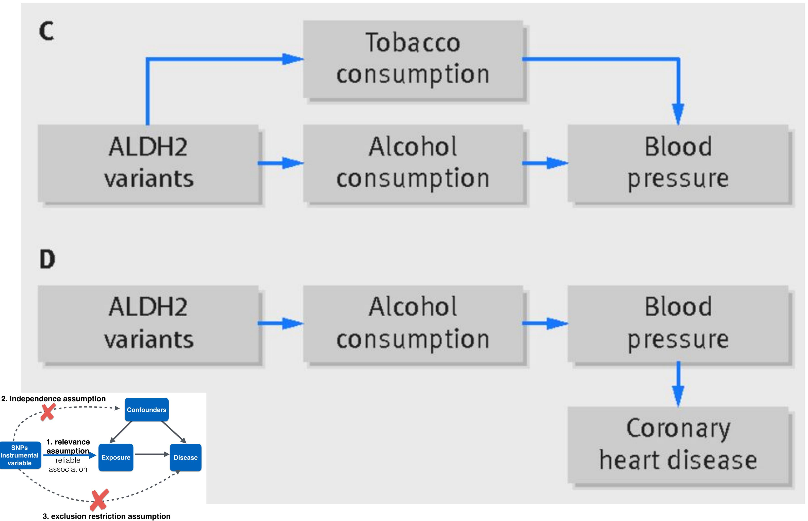
::::
:::: {.column width="40%"}
- **Vertical (mediated) pleiotropy:** IV → Exposure → Outcome — acceptable, this is the MR pathway
- **Horizontal pleiotropy:** IV → Outcome via independent pathway — violates exclusion restriction

Horizontal pleiotropy is the main threat to MR validity; multiple robust MR methods (MR-Egger, weighted median) can detect and partially correct for it
::::
:::::

::: {.notes}
Many genetic variants are pleiotropic in the horizontal sense — a variant near a gene expressed in many tissues will affect multiple traits. Fortunately, when using many instruments, the direction and magnitude of pleiotropic effects can be estimated and corrected for using MR-Egger regression (the intercept tests for directional pleiotropy).
:::

## Case Study: HDL Cholesterol Failed MR Test

::::: {.columns}
:::: {.column width="55%"}
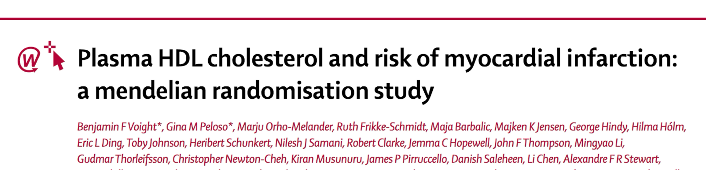

::: {.source-credit}
Voight et al. (2012). *The Lancet* — Plasma HDL and myocardial infarction: a MR study
:::
::::
:::: {.column width="45%"}
Observational studies: high HDL → fewer heart attacks

MR result: no causal effect of genetically elevated HDL on MI risk

The HDL-MI MR result correctly predicted that HDL-raising drugs would fail in clinical trials — a powerful validation of the method
::::
:::::

::: {.notes}
This is the landmark case for MR. Decades of observational evidence supported raising HDL as a therapeutic strategy. Multiple pharma companies developed HDL-raising drugs (niacin, CETP inhibitors). MR said it wouldn't work. The drugs failed. This story is now cited as a major success of MR in drug target validation.
:::

## Single Instrument: Estimating Exposure Effect

::: {style="font-size: 0.8em"}
**Step 1:** Estimate genetic effect on exposure

$$\text{Exposure} = \gamma X + \varepsilon$$

**Step 2:** Estimate genetic effect on outcome

$$Y = \delta X + \varepsilon_d = \beta \gamma X + \varepsilon_2 \implies \delta = \beta \cdot \gamma$$

**Step 3:** Ratio estimate of causal effect

$$\hat{\beta} = \frac{\hat{\delta}}{\hat{\gamma}}$$

**Step 4:** Test statistic

$$Z = \frac{\hat{\beta}}{\text{se}(\hat{\beta})}, \quad Z^2 \sim \chi^2_1, \quad p = 2 \cdot \Phi(-|Z|)$$
:::

::: {.notes}
The Wald ratio estimator is the simplest MR approach. With a single strong instrument, the causal effect estimate is the ratio of the IV-outcome effect to the IV-exposure effect. The standard error accounts for uncertainty in both estimates (Delta method). With summary statistics, γ̂ comes from a GWAS of the exposure and δ̂ from a GWAS of the outcome.
:::

## MR with Multiple Instruments

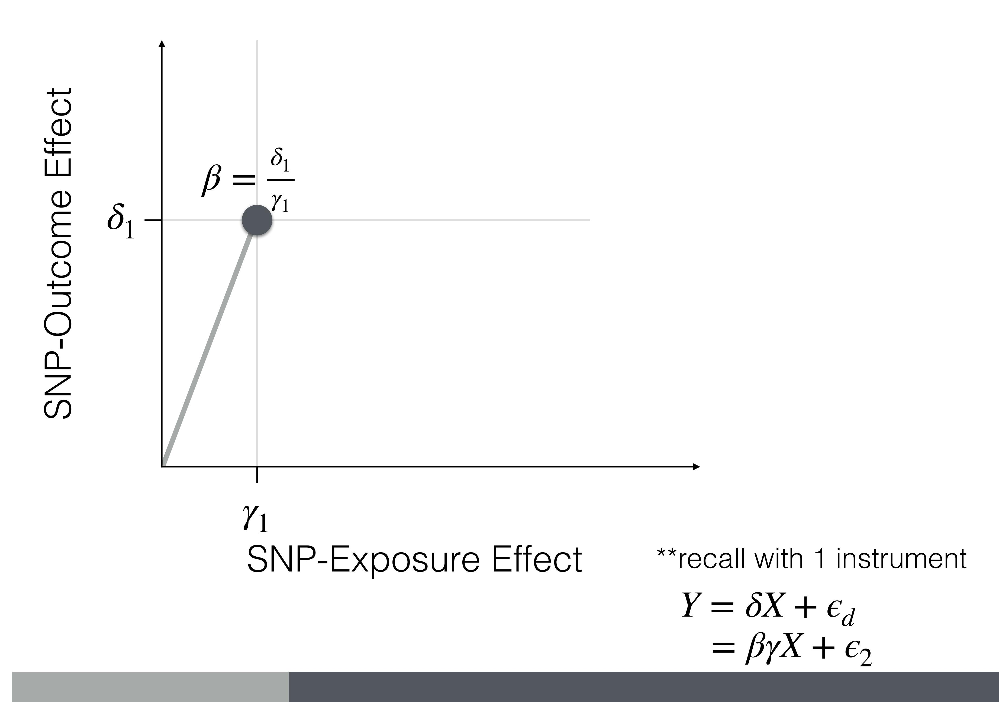

::: {.notes}
Using multiple SNPs as instruments increases statistical power and enables tests of pleiotropy. The slope in an MR-Egger regression estimates the causal effect; the intercept tests whether there is directional pleiotropy (a non-zero intercept indicates that the IV-outcome effects are systematically shifted relative to what would be expected from the causal pathway alone).
:::

## MR with Multiple Instruments: Egger Regression

::::: {.columns}
:::: {.column width="55%"}
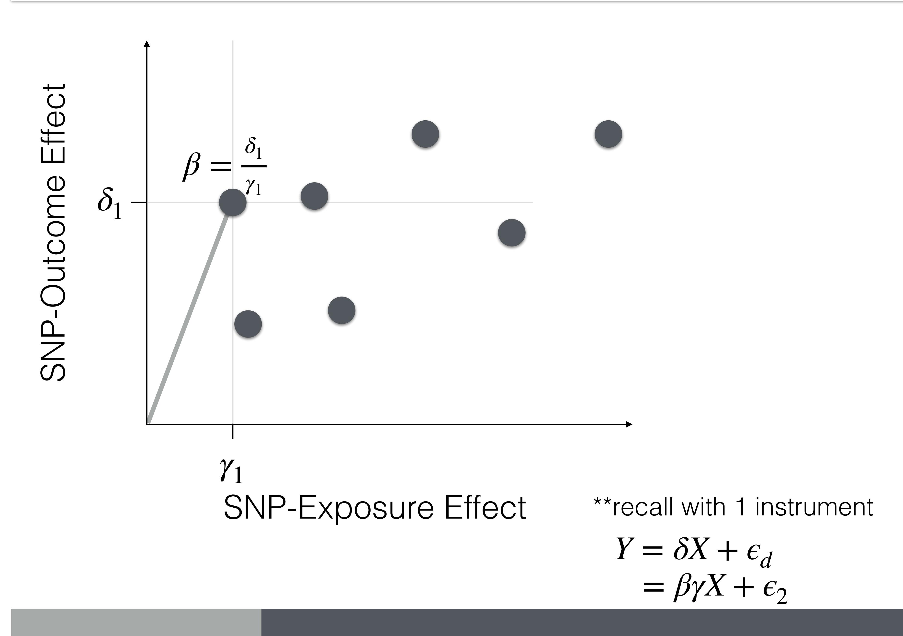
::::
:::: {.column width="45%"}
::: {style="font-size: 0.75em;"}
With multiple instruments, we can use:

- **IVW (Inverse Variance Weighted):** assumes no average horizontal pleiotropy
- **Weighted Median:** consistent if ≥50% of instruments are valid
- **MR-Egger:** allows for directional pleiotropy; intercept tests exclusion restriction
:::
::::
:::::

::: {.notes}
In a funnel plot of MR estimates, if there's no pleiotropy, estimates from different instruments should be centered around the true causal effect. MR-Egger plots IV-outcome vs. IV-exposure effects; the slope = causal estimate, intercept = pleiotropy test.
:::

## MR with Multiple Instruments: Robustness

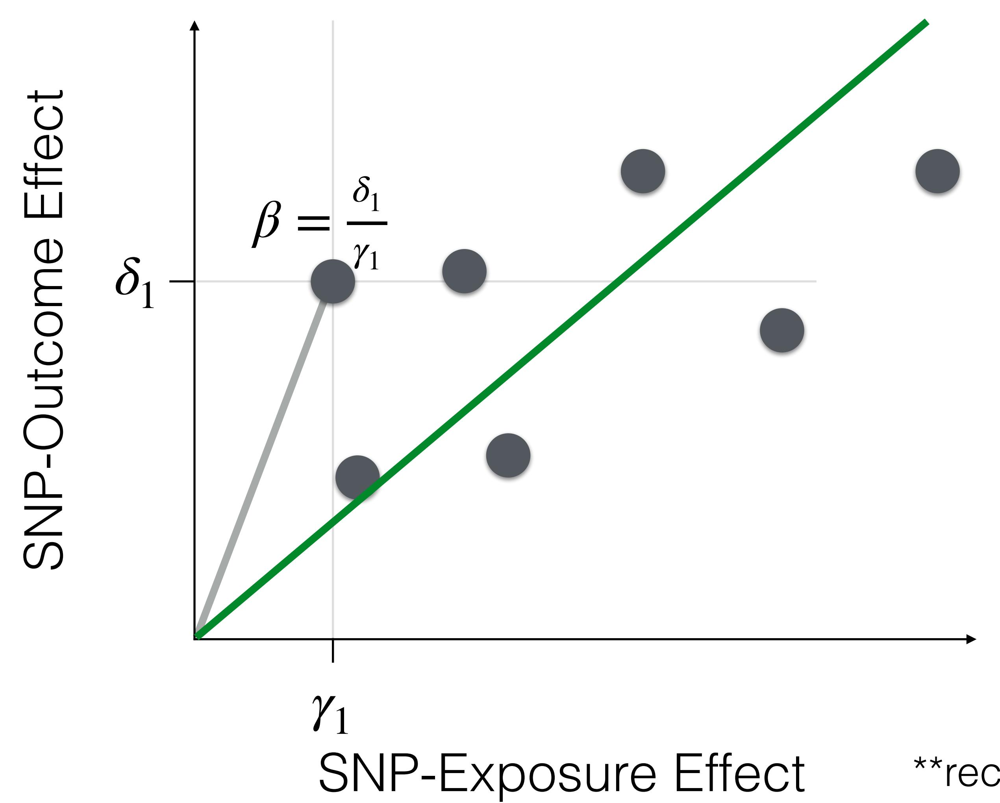

Recall with 1 instrument: $Y = \delta X + \varepsilon_d = \beta \gamma X + \varepsilon_2$

::: {.notes}
When IVW, weighted median, and MR-Egger all give similar effect estimates, the result is robust to violations of individual assumptions. When they disagree, there is likely substantial pleiotropy and results should be interpreted cautiously.
:::

## MR with Multiple Instruments: Robustness

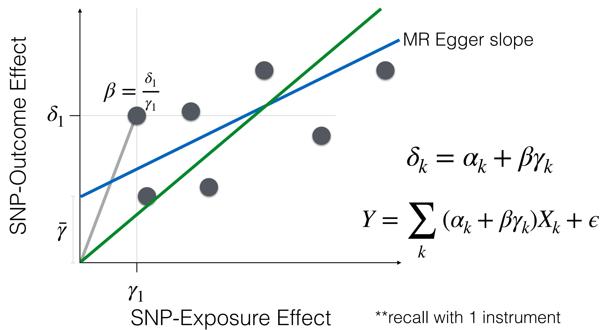

Multiple methods agreeing on the same causal estimate strengthens confidence

::: {.notes}
When IVW, weighted median, and MR-Egger all give similar effect estimates, the result is robust to violations of individual assumptions. When they disagree, there is likely substantial pleiotropy and results should be interpreted cautiously.
:::

## MR-BASE: Web Application for MR

MR-BASE (now IEU Open GWAS) provides:
- Access to thousands of curated GWAS summary statistics
- Automated instrument selection
- Multiple MR methods implemented in R (`TwoSampleMR` package)

::: {.notes}
MR-BASE dramatically lowered the barrier to performing MR analyses. Students can explore causal relationships between hundreds of exposures and outcomes through the web interface or R package, without needing to obtain individual-level data.
:::

## Summary of Mendelian Randomization

- MR provides evidence of **putative causal relations** between modifiable risk factors and disease, using genetic variants as natural experiments
- MR is less susceptible to **confounding and reverse causation** than conventional observational studies
- Like all methods, MR depends on **assumptions** — their plausibility must be assessed for each application
- Results should be interpreted alongside **other sources of evidence** (RCT, biological plausibility, animal models)

::: {.source-credit}
Davies, Holmes & Davey Smith. *BMJ* 2018
:::

::: {.takehome}
MR is a powerful causal inference tool in genetics, but assumptions — especially the exclusion restriction — must be carefully scrutinized
:::

::: {.notes}
The classic summary from Davies et al. MR is best used as one piece of a triangulation strategy: converging evidence from MR, RCTs where available, and mechanistic studies provides the strongest causal inference.
:::

## Sasha Gusev's Tweetorial on Complex Trait Genetics

An accessible and insightful summary thread covering GWAS, fine-mapping, functional annotations, TWAS, and MR:

[twitter.com/sashagusevposts — April 2023](https://twitter.com/sashagusevposts/status/1647421238799736833)

::: {.notes}
Recommended reading: Sasha Gusev's tweetorial provides a big-picture synthesis of how all the methods covered in this course fit together. Good for consolidating understanding after the lecture.
:::

## References

- GTEx Consortium (2020). Atlas of genetic regulatory effects across human tissues. *Science*. DOI: 10.1126/science.aaz1776
- Barbeira et al. (2021). Exploiting GTEx resources to decipher mechanisms at GWAS loci. *Genome Biology*.
- Albert & Kruglyak (2015). Regulatory variation in complex traits. *Nature Reviews Genetics*.
- Li et al. (2016). RNA splicing is a primary link between genetic variation and disease. *Science*.
- Gamazon et al. (2015). A gene-based association method using reference transcriptome data (PrediXcan). *Nature Genetics*.
- Gusev et al. (2016). Integrative approaches for large-scale TWAS. *Nature Genetics*.
- Zhu et al. (2016). Integration of GWAS and eQTL studies predicts complex trait gene targets. *Nature Genetics*.
- Voight et al. (2012). Plasma HDL cholesterol and risk of myocardial infarction: a MR study. *The Lancet*.
- Bowden, Davey Smith & Burgess (2015). MR with invalid instruments: MR-Egger regression. *IJE*.
- Davies, Holmes & Davey Smith (2018). Reading Mendelian randomisation studies. *BMJ*.

::: {.notes}
Full reference list for students who want to explore the primary literature. PrediXcan and MR-Egger are the two core methods papers; GTEx is the primary data resource.
:::
