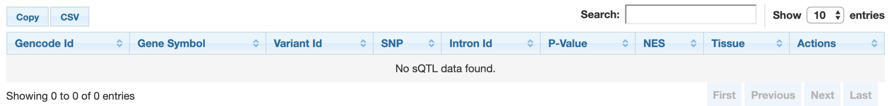
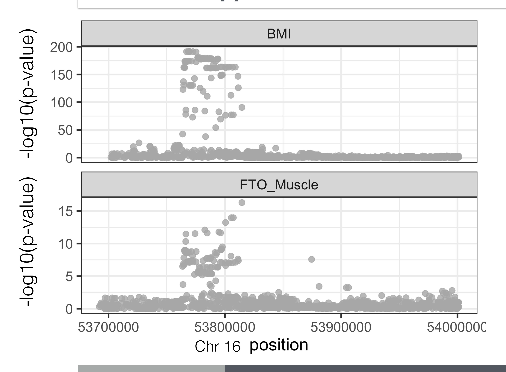
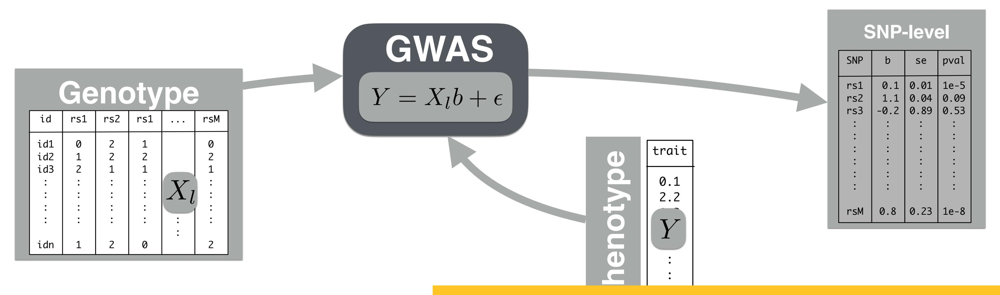
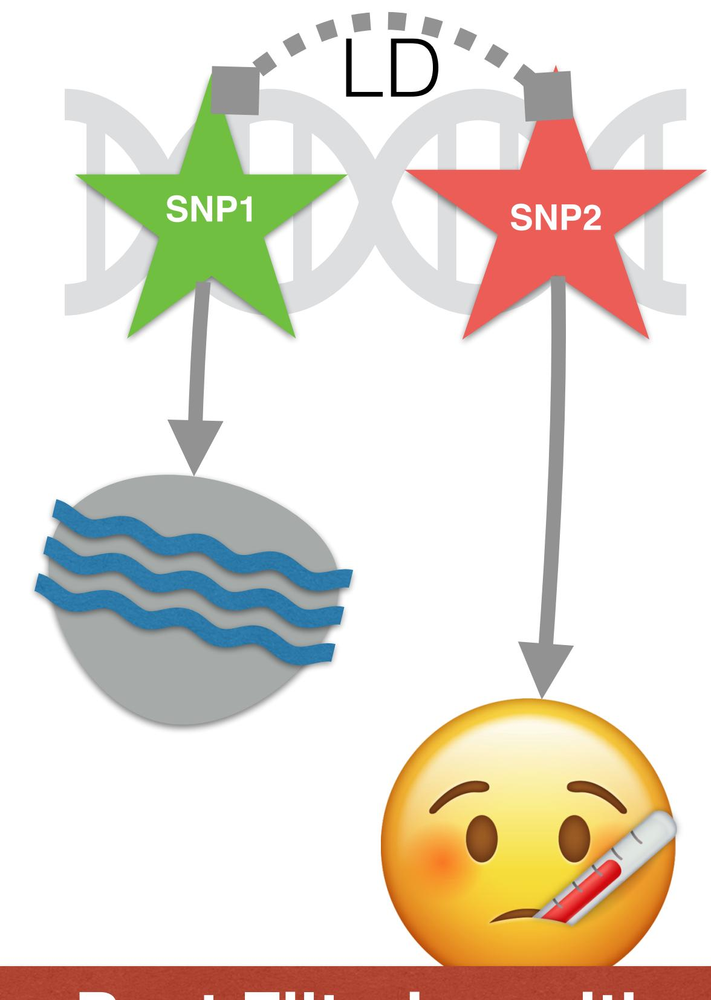
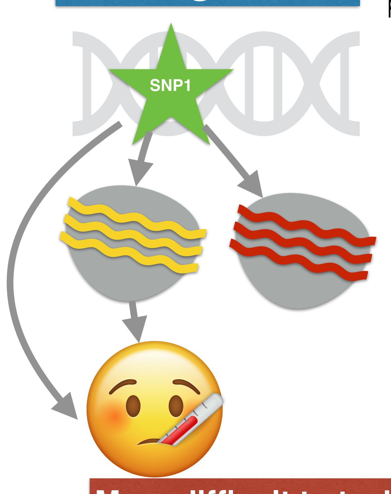
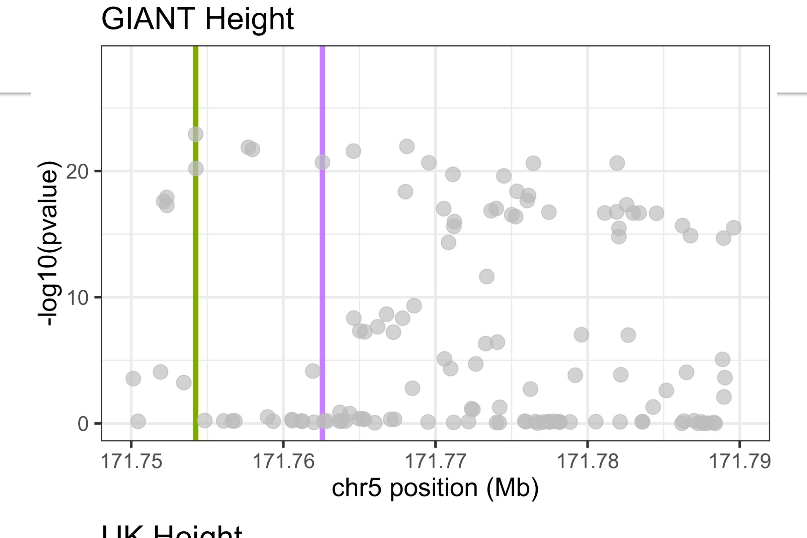
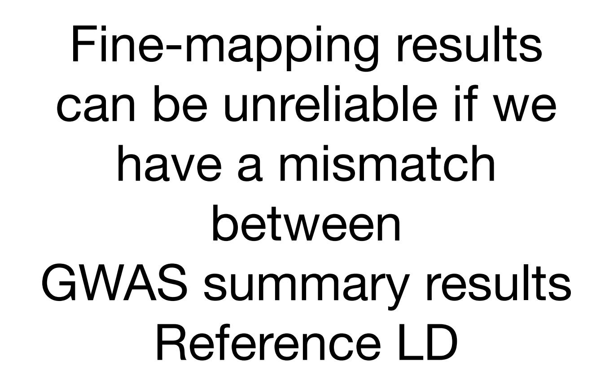
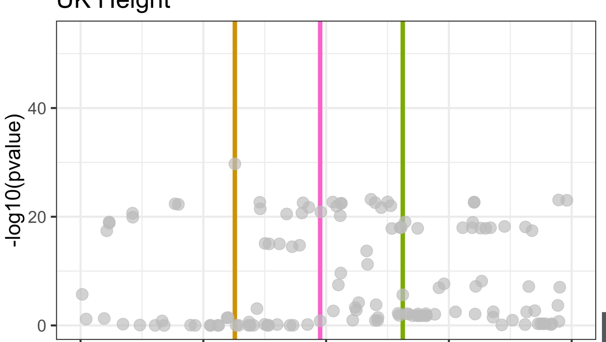

# Gene Level Association Tests and Mendelian Randomization

# Hae Kyung Im, PhD

April 20, 2026

# **Learning Objectives**

- Statistical methods to examine biology of complex diseases from GWAS results
  - TWAS
  - Colocalization
  - Mendelian Randomization

# Most GWAS catalog variants are non-coding

# **Which Gene Should We Target for Therapy?**

# **Altered Protein Levels Influence Disease Risk**

Albert & Kruglyak 2015 NGReviews

# **What is Splicing**

By Original: Iinaba Vector: Masumrezarock100 - https://commons.wikimedia.org/w/index.php?title=File:Splicesome.pdf, CC BY-SA 4.0, https://commons.wikimedia.org/w/index.php?curid=115983282

# **Total mRNA and Splicing Affect Complex Traits**

# **Expression Quantitative Trait Loci**

https://gtexportal.org/home/locusBrowserPage/ACTN3

Dose-response effect provide stronger evidence of causal link between gene expression traits and complex diseases

# How do we find causal genes?

# **Naive Approach: Find the eGene of the top SNP**

Take top SNP rs1558902 and check whether it is an eQTL for some gene

https://gtexportal.org/home/snp/rs1558902

eQTL violin plot, IGV Browser, Multi-tissue chr16\_53769662\_T\_A\_b38 ENSG00000177508.11 IRX3 0.0000083 0.37 **Pancreas** dbSNP 🗹 eQTL Plot Showing 1 to 2 of 2 entries First Previous 1 Next Last

#### Single-Tissue sQTLs for chr16\_53769662\_T\_A\_b38

Data Source: GTEx Analysis Release V8 (dbGaP Accession phs000424.v8.p2)

# **Naive Approach can Lead to False Links**

# **Naive Approach can Lead to False Links**

Yellow and brown bars show where the posterior inclusion probability is concentrated

# **Title Text**

# Association Approach

### **GWAS Discovers Loci but Mechanism Unclear**

### Could TWAS Identify Genes?

# Can TWAS Identify Genes?

- RNA-seq is too expensive
- Many tissues such has brain, pancreas, etc are not accessible
- Reverse causality Problem: differentially expressed genes can be consequence of disease status

# Use Genetic Predictors of Gene Expression

#### **We Can Train Gene ExpressionPredictors Using Reference Data**

#### Reference Genotype and Transcriptome

#### **We Can Train Gene Expression Predictors Using Reference Data**

Avsec, Ž., Agarwal, V., Visentin, D. *et al.* Effective gene expression prediction from sequence by integrating long-range interactions. *Nat Methods* 18, 1196–1203 (2021). https://doi.org/10.1038/s41592-021-01252-x

### PrediXcan: TWAS with Genetically Predicted Expression

# **Examples of Well Predicted Genes in Humans**

# **Prediction Performance Tracks Heritability**

# **Advantages of Gene Level Associations**

- Reduced multiple testing (from 10e6 to 10e4)
- Genes functions are much better annotated
- Validation in other model systems is possible
- Direction of effects can inform on protective or deleterious effects of gene knock down
- Prioritization of drug targets is more straightforward

# Limitations of Current Association Methods

# **Limitations of Association Methods**

# **LD Contamination**

**Post Filtering with colocalization methods More difficult to tackle**

**Use fine-mapped predictors**

=molecular pleiotropy

# Colocalization

### **Colocalization:** Are causal variants = ?

# Limitations of Colocalization

### **Fine-Mapping Example Can Be Sensitive To LD Reference**

W. Chen et al, "Fine mapping causal variants with an approximate Bayesian method using marginal test statistics," Genetics, 2015.

SusieR by Yanyu Liang

# Colocalization can help finding causal genes but can be too conservative

# **Recommendation for Post GWAS Analysis**

- Start with an association method to determine a list of candidate causal genes
  - sparse predictors of gene expression are better (elastic net better than BSLMM, fine-mapping may be even better)
- Use colocalization to filter out LD contamination
- Be aware that colocalization methods are very conservative and real signals may be tossed out
- We need better reference LD
  - studies should share LD in addition to GWAS results

# Mendelian Randomization

# **Less Technical Description of MR**

https://www.nature.com/articles/d41586-019-03754-3

https://www.nature.com/articles/d41586-019-03171-6

# **Mendelian Randomization**

Statistical method to assess causal relationship between exposure and outcome

Can we determine causality with statistical methods?

MR leverages the fact that genotypes are not generally susceptible to reverse causation and confounding

# Correlation is not Causation

# **Randomized Trial & Mendelian Randomization**

Burgess et al, Use of Mendelian randomisation to assess potential benefit of clinical intervention, BMJ 2012

# **Evidence For Causal Link**

RCT: Randomized Clinical Trials

Neil M Davies, Michael V Holmes, George Davey Smith, Reading Mendelian randomisation studies: a guide, glossary, and checklist for clinicians, BMJ 2018

# **Mendelian Randomization Question**

the goal is to test association between a modifiable exposure and disease. Smoking, HDL cholesterol levels, etc.

# **Why We Need Mendelian Randomization?**

Confounders may cause misleading associations

### **Mendelian Randomization Uses Instrumental Variable**

The idea is to use an "instrumental variable" without the confounding/noise

### **Assumptions of Mendelian Randomization**

3. exclusion restriction assumption

no direct effect

# **Examples of MR and Assumptions**

# **Examples: Horizontal and Vertical Pleiotropy**

### **The "Good" Cholesterol Failed Mendelian Randomization Test**

# **Single Instrument Exposure Effect Estimate**

1) find genetic effect on exposure

exposure 
$$= \gamma X + \epsilon$$

2) find genetic effect on disease

$$Y = \delta X + \epsilon_d = \beta \gamma X + \epsilon_2 \qquad \Longrightarrow \quad \delta = \beta \cdot \gamma$$

3) calculate effect of exposure on disease

$$\hat{\beta} = \frac{\hat{\delta}}{\hat{\gamma}}$$

4) calculate standard error se(*β* ̂ )

$$Z = \frac{\hat{\beta}}{\operatorname{se}(\hat{\beta})} \qquad Z^2 \sim \chi_1^2 \qquad p = 2 \cdot \Phi_{\text{normal}}(-|Z|)$$

\*\*recall with 1 instrument

$$Y = \delta X + \epsilon_d$$
$$= \beta \gamma X + \epsilon_2$$

\*\*recall with 1 instrument

$$Y = \delta X + \epsilon_d$$
$$= \beta \gamma X + \epsilon_2$$

# **MR BASE Web Application**

# **Summary of MR**

- Mendelian randomization provides evidence about putative **causal relations** between modifiable risk factors and disease, using genetic variants as natural experiments
- Mendelian randomization is less likely to be affected by confounding or **reverse causation** than conventional observational studies
- Like all analytical approaches, however, Mendelian randomization depends on **assumptions**, and the plausibility of these assumptions must be assessed
- Moreover, the relevance of the results for clinical decisions should be interpreted in light of other sources of evidence

Neil M Davies, Michael V Holmes, George Davey Smith, Reading Mendelian randomisation studies: a guide, glossary, and checklist for clinicians, BMJ 2018

### **Sasha Gusev's Tweetorial Summary of Complex Trait Genetics**

https://twitter.com/sashagusevposts/status/1647421238799736833? s=12&t=gkW0cvfz9Ha95EJbrMVt4Q

# **Title Text**

- The GTEx Consortium. Atlas of genetic regulatory effects across human tissues. Science. 10-Sep-2020 DOI: 10.1126/ science.aaz1776
- Barbeira, Alvaro N., Rodrigo Bonazzola, Eric R. Gamazon, Yanyu Liang, Yoson Park, ..., GTEx GWAS Working Group, ..., and Hae Kyung Im. 2021. "Exploiting the GTEx Resources to Decipher the Mechanisms at GWAS Loci." Genome Biology 22 (1): 49.
- Albert, F. W., & Kruglyak, L. (2015). The role of regulatory variation in complex traits and disease. Nature Reviews Genetics, 16(4), 197–212. http://doi.org/10.1038/nrg3891
- Li, Y. I., van de Geijn, B., Raj, A., Knowles, D. A., Petti, A. A., Golan, D., et al. (2016). RNA splicing is a primary link between genetic variation and disease. Science, 352(6285), 600–604. http://doi.org/10.1126/science.aad9417
- Gamazon, E. R., Wheeler, H. E., Shah, K. P., Mozaffari, S. V., Aquino-Michaels, K., Carroll, R. J., et al. (2015). A genebased association method for mapping traits using reference transcriptome data. Nature Genetics, 47(9), 1091–1098. http://doi.org/10.1038/ng.3367
- Gusev, A., Ko, A., Shi, H., Bhatia, G., Chung, W., Penninx, B. W. J. H., et al. (2016). Integrative approaches for largescale transcriptome-wide association studies. Nature Genetics, 48(3), 245–252. http://doi.org/10.1038/ng.3506
- Zhu, Z., Zhang, F., Hu, H., Bakshi, A., Robinson, M. R., Powell, J. E., et al. (2016). Integration of summary data from GWAS and eQTL studies predicts complex trait gene targets, 1–9. http://doi.org/10.1038/ng.3538
- PhD, B. F. V., PhD, G. M. P., PhD, M. O.-M., DMSc, R. F.-S., PhD, M. B., PhD, M. K. J., et al. (2012). Plasma HDL cholesterol and risk of myocardial infarction: a mendelian randomisation study. The Lancet, 380(9841), 572–580. http:// doi.org/10.1016/S0140-6736(12)60312-2
- Jack Bowden, George Davey Smith, Stephen Burgess, Mendelian randomization with invalid instruments: effect estimation and bias detection through Egger regression, International Journal of Epidemiology, Volume 44, Issue 2, April 2015, Pages 512–525, https://doi.org/10.1093/ije/dyv080